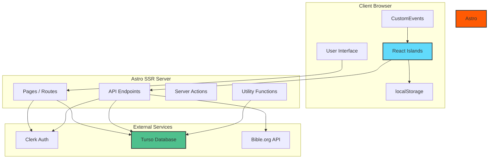
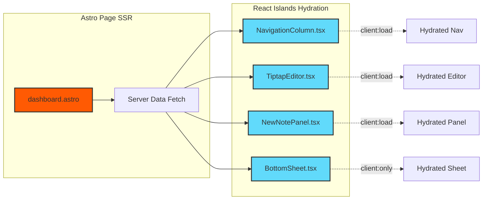
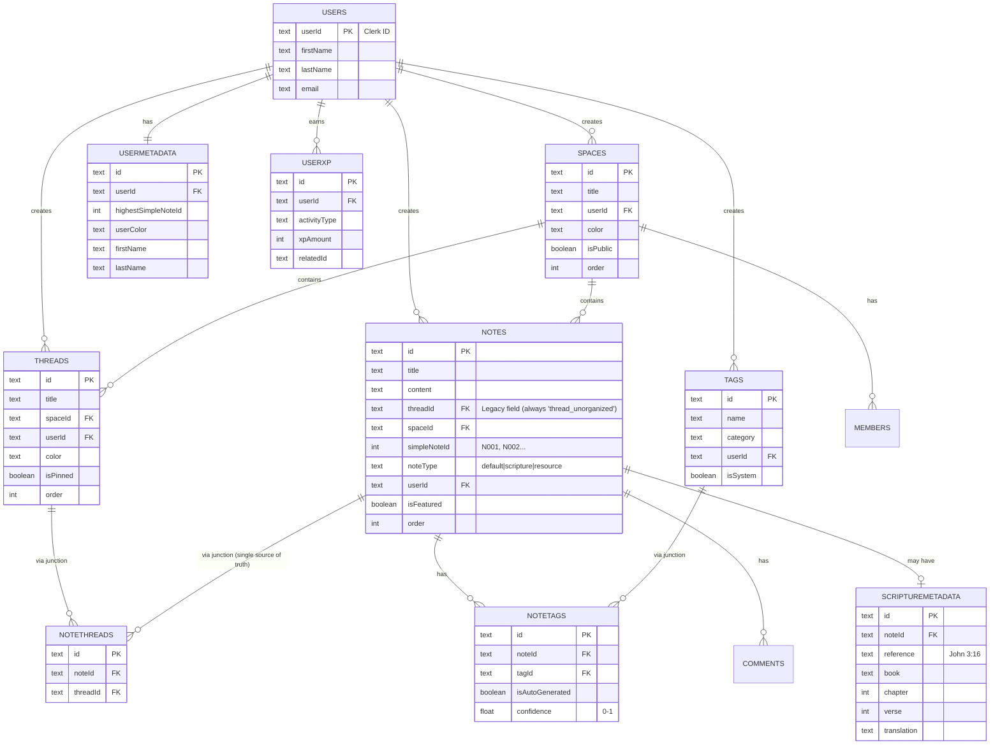
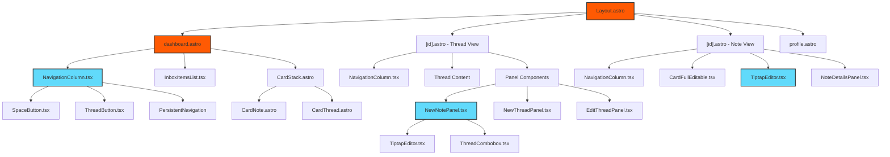
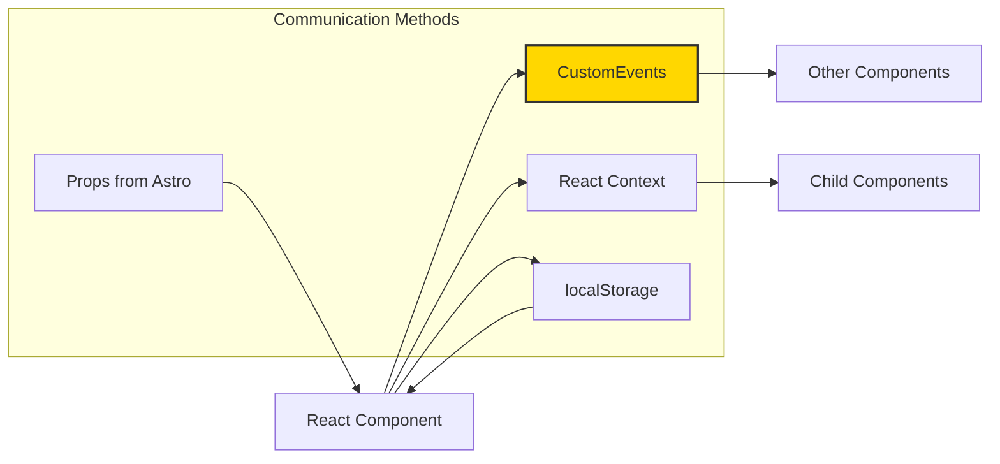
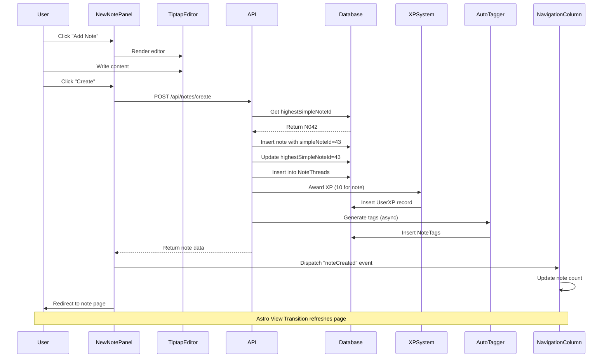
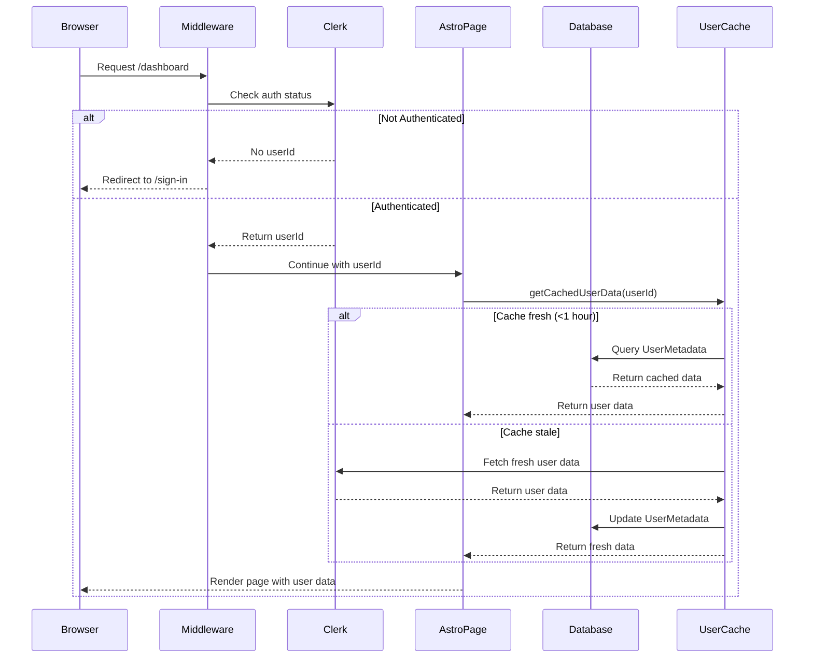
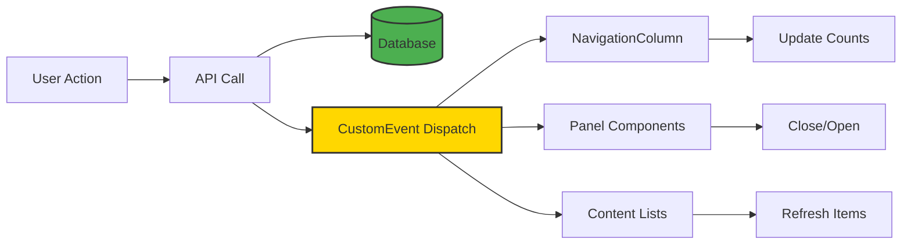

# Harvous

A modern Bible study notes application built with **Astro 5** and **React Islands architecture**. Harvous provides a flexible, hierarchical organization system (Spaces → Threads → Notes) with rich text editing, auto-tagging, XP gamification, and PWA capabilities.

**Current Status**: 🚀 **85% complete for V1** - 3-4 weeks to production release

---

## 🎯 Table of Contents

- [Overview](#overview)
- [Technology Stack](#technology-stack)
- [Architecture](#architecture)
- [Database Schema](#database-schema)
- [Component System](#component-system)
- [API Endpoints](#api-endpoints)
- [Data Flow](#data-flow)
- [Key Features](#key-features)
- [Project Structure](#project-structure)
- [Development](#development)
- [Documentation](#documentation)

---

## Overview

Harvous is designed specifically for Bible study workflows, providing:

- **Flexible Organization**: Hierarchical system with Spaces → Threads → Notes
- **Rich Text Editing**: Modern Tiptap editor with formatting options
- **Auto-Tagging**: Intelligent tagging with 1000+ biblical keywords
- **Scripture Detection**: Automatic detection and parsing of Bible references
- **XP Gamification**: Points for creating content, daily bonuses, activity tracking
- **Multi-Thread Support**: Notes can belong to multiple threads
- **PWA Ready**: Installable on mobile and desktop
- **Real-Time Updates**: Event-driven architecture for instant UI updates

---

## Technology Stack

### Core Framework
```
Astro 5.13.7          - SSR framework with View Transitions
React 19.2.0          - Interactive islands
TypeScript 5.9.2      - Type safety
Tailwind CSS 3.4.17   - Utility-first styling
```

### Database & Auth
```
Astro DB / Turso      - Serverless SQL database
Clerk                 - Authentication and user management
```

### UI & Editing
```
Tiptap                - Modern rich text editor
Radix UI              - Accessible component primitives
Shadcn-style          - Component design system
Font Awesome + Lucide - Icons
```

### Deployment
```
Netlify               - Serverless hosting
Output: SSR           - Server-side rendering
```

---

## Architecture

### High-Level Architecture



### React Islands Pattern

Harvous uses **React Islands architecture** - pages are rendered server-side by Astro, with interactive React components hydrated on demand:



**Benefits:**
- ⚡ Fast initial page load (SSR HTML)
- 🎯 Interactive components only where needed
- 🔄 Best of both worlds: server + client rendering

---

## Database Schema

### Entity Relationship Diagram



### Core Tables

| Table | Purpose | Key Fields |
|-------|---------|------------|
| **Spaces** | Top-level organization containers | title, color, userId, isPublic |
| **Threads** | Collections of related notes | title, spaceId, color, isPinned |
| **Notes** | Individual content items | title, content, threadId (legacy), simpleNoteId, noteType |
| **NoteThreads** | **Single source of truth**: notes ↔ threads (many-to-many) | noteId, threadId |
| **Tags** | Categorization labels | name, category, isSystem |
| **NoteTags** | Many-to-many: notes ↔ tags | noteId, tagId, isAutoGenerated |
| **UserMetadata** | User preferences & cached data | highestSimpleNoteId, userColor, firstName |
| **UserXP** | Gamification tracking | activityType, xpAmount, relatedId |
| **ScriptureMetadata** | Bible reference data | reference, book, chapter, verse |

### Special Patterns

#### 1. Sequential Note IDs
- Each user has a `highestSimpleNoteId` in UserMetadata
- New notes get next sequential ID: N001, N002, N003...
- **Never reused** - deleted IDs are skipped for data integrity

#### 2. Unorganized Thread
- Every user has a `thread_unorganized` thread
- **Unorganized = notes with NO junction table entries**
- Notes automatically become unorganized when all junction entries are removed
- Appears in navigation when it contains notes (same as regular threads)
- Cannot be deleted or edited (no menu options)
- Primary `threadId` field is legacy (always set to `'thread_unorganized'`)

#### 3. Multi-Thread Support (Junction-Table-Only)
- **Single source of truth**: `NoteThreads` junction table
- Notes belong to threads via junction entries only
- Notes can belong to multiple threads (many-to-many)
- Adding note to thread: creates junction entry → automatically removed from unorganized
- Removing note from thread: deletes junction entry → automatically becomes unorganized if last one
- Primary `threadId` field is legacy (always `'thread_unorganized'`, never changes)
- Navigation falls back to most recently updated thread

---

## Component System

### Component Hierarchy



### Component Organization

#### Astro Components (Server-Rendered)
- **Pages**: `dashboard.astro`, `[id].astro`, `profile.astro`
- **Cards**: `CardNote.astro`, `CardThread.astro`, `CardStack.astro`
- **Buttons**: `Button.astro`, `ActionButton.astro`
- **Layout**: `Layout.astro`, `DashboardShell.astro`

#### React Islands (Client-Hydrated)
- **Navigation**: `NavigationColumn.tsx`, `MobileNavigation.tsx`
- **Panels**: `NewNotePanel.tsx`, `NewThreadPanel.tsx`, `NoteDetailsPanel.tsx`
- **Editors**: `TiptapEditor.tsx`
- **UI**: `BottomSheet.tsx`, `ThreadCombobox.tsx`, `SearchInput.tsx`

#### Component Communication



**Communication Patterns:**
1. **Props** - Astro pages → React islands (initial data)
2. **CustomEvents** - Cross-component communication (panel open/close, data updates)
3. **React Context** - Shared state within React component trees
4. **localStorage** - Persistent state across page loads

---

## API Endpoints

### API Organization

```mermaid
graph LR
    subgraph "Notes API"
        NC[/api/notes/create]
        NU[/api/notes/update]
        ND[/api/notes/delete]
        NAT[/api/notes/auto-tags]
        NATH[/api/notes/add-thread]
        NRTH[/api/notes/remove-thread]
    end

    subgraph "Threads API"
        TC[/api/threads/create]
        TU[/api/threads/update]
        TD[/api/threads/delete]
        TL[/api/threads/list]
    end

    subgraph "User API"
        UP[/api/user/get-profile]
        UU[/api/user/update-profile]
        UXP[/api/user/xp]
        UE[/api/user/export]
    end

    subgraph "Scripture API"
        SF[/api/scripture/fetch-verse]
        SD[/api/scripture/detect]
    end

    subgraph "Tags API"
        TGL[/api/tags/list]
        TGC[/api/tags/create]
        NTA[/api/note-tags/assign]
    end

    style NC fill:#4caf50,stroke:#333,stroke-width:2px
    style TC fill:#2196f3,stroke:#333,stroke-width:2px
    style UP fill:#ff9800,stroke:#333,stroke-width:2px
    style SF fill:#9c27b0,stroke:#333,stroke-width:2px
```

### Key Endpoints

| Endpoint | Method | Purpose |
|----------|--------|---------|
| `/api/notes/create` | POST | Create new note, assign simpleNoteId, auto-tag, award XP |
| `/api/notes/update` | POST | Update note content/title |
| `/api/notes/delete` | POST | Delete note and cleanup relationships |
| `/api/notes/[id]/add-thread` | POST | Add note to additional thread (multi-thread) |
| `/api/notes/[id]/remove-thread` | POST | Remove note from thread |
| `/api/threads/create` | POST | Create new thread, award XP |
| `/api/threads/update` | POST | Update thread properties |
| `/api/threads/delete` | POST | Delete thread, move notes to unorganized |
| `/api/user/get-profile` | GET | Get cached user data from UserMetadata |
| `/api/user/update-profile` | POST | Update name, color |
| `/api/user/xp` | GET | Get XP breakdown |
| `/api/scripture/fetch-verse` | POST | Fetch verse from Bible.org API |
| `/api/scripture/detect` | POST | Detect scripture references in text |
| `/api/tags/list` | GET | List all user tags |
| `/api/note-tags/assign` | POST | Assign tag to note |

---

## Data Flow

### Note Creation Flow



### Authentication Flow



### Event-Driven Updates



**Key Events:**
- `noteCreated` → Update navigation counts, refresh lists
- `noteDeleted` → Update counts, remove from view
- `threadCreated` → Add to navigation
- `threadDeleted` → Remove from navigation
- `openNewNotePanel` / `closeNewNotePanel` → Panel visibility
- `noteAddedToThread` / `noteRemovedFromThread` → Thread counts

---

## Key Features

### 1. Hierarchical Organization
- **Spaces** → **Threads** → **Notes**
- 8-color system: paper, blue, yellow, orange, pink, purple, green, mint
- Persistent navigation (last 5 accessed items in localStorage)
- Active state indication

### 2. Sequential Note IDs
- User-friendly: N001, N002, N003...
- Never reused (deleted IDs skipped)
- Tracked via `UserMetadata.highestSimpleNoteId`
- Prevents confusion and maintains data integrity

### 3. Auto-Tagging System
- **1000+ biblical keywords** in 5 categories
- Confidence scoring (0-1)
- Auto-applies tags with >80% confidence
- Deduplication and overlap detection
- Categories: spiritual, biblical, character, place, book

### 4. Scripture Detection
- Detects references: "John 3:16", "Romans 8:28-30"
- Parses book, chapter, verse
- Fetches verse text from Bible.org API (NET translation)
- Creates `ScriptureMetadata` records
- Note type: 'scripture'

### 5. XP Gamification
| Activity | XP | Notes |
|----------|-----|-------|
| Create thread | 10 | One-time per thread |
| Create note | 10 | One-time per note |
| Open note/thread | 1 | Daily cap: 50 XP |
| First note of day | +5 | Bonus XP |

**Features:**
- Duplicate prevention (tracks awarded XP)
- Daily caps to prevent gaming
- Backfill utility for existing content
- Future: levels, achievements, leaderboards

### 6. Multi-Thread Support (Junction-Table-Only)
- **Single source of truth**: `NoteThreads` junction table
- Notes belong to threads via junction entries only (no primary threadId logic)
- Notes can belong to multiple threads (many-to-many)
- **Automatic unorganized**: Notes with no junction entries are automatically unorganized
- Adding note to thread creates junction entry → automatically removed from unorganized
- Removing note from thread deletes junction entry → automatically becomes unorganized if last one
- Navigation falls back to most recently updated thread
- Smart context detection on note open

### 7. Rich Text Editing (Tiptap)
- Bold, italic, underline
- Ordered/unordered lists
- Placeholder support
- Inline editing (click to edit)
- Toolbar with formatting options

### 8. PWA Capabilities
- Service worker (`public/sw.js`)
- Manifest (`public/manifest.json`)
- Installable on mobile/desktop
- Offline capabilities

### 9. Responsive Design
- **Desktop**: 3-column layout (navigation, main, additional)
- **Mobile**: Stacked layout with bottom sheet
- **Breakpoint**: 1160px
- Same React components work on both

### 10. Inbox System
- Reserved for external content (Webflow CMS)
- Archive functionality
- "Add to Harvous" converts to user content
- Clear separation from user-generated content

---

## Project Structure

```
harvous/
├── src/
│   ├── pages/              # Astro pages (routes)
│   │   ├── index.astro     # Landing page
│   │   ├── dashboard.astro # Main dashboard
│   │   ├── [id].astro      # Dynamic thread/note/space view
│   │   ├── profile.astro   # User profile
│   │   └── api/            # API endpoints
│   │       ├── notes/      # Note operations
│   │       ├── threads/    # Thread operations
│   │       ├── user/       # User operations
│   │       └── scripture/  # Scripture operations
│   │
│   ├── components/
│   │   ├── react/          # React island components
│   │   │   ├── TiptapEditor.tsx
│   │   │   ├── NavigationColumn.tsx
│   │   │   ├── NewNotePanel.tsx
│   │   │   ├── NoteDetailsPanel.tsx
│   │   │   └── BottomSheet.tsx
│   │   ├── ui/             # Radix UI components
│   │   └── *.astro         # Astro components
│   │
│   ├── layouts/            # Page layouts
│   │   └── Layout.astro    # Main layout
│   │
│   ├── utils/              # Utility functions
│   │   ├── dashboard-data.ts    # Data fetching
│   │   ├── xp-system.ts         # XP logic
│   │   ├── auto-tag-generator.ts # Auto-tagging
│   │   ├── scripture-detector.ts # Scripture parsing
│   │   └── user-cache.ts        # Clerk data caching
│   │
│   ├── actions/            # Server actions
│   └── styles/             # Global CSS
│
├── db/
│   ├── config.ts           # Database schema
│   └── seed.ts             # Seed data
│
├── public/
│   ├── scripts/            # Client-side JS
│   │   ├── navigation/     # Navigation tracking
│   │   └── pwa-startup.js  # PWA initialization
│   ├── manifest.json       # PWA manifest
│   └── sw.js               # Service worker
│
├── *.md                    # Extensive documentation
├── astro.config.mjs        # Astro configuration
├── tailwind.config.js      # Tailwind configuration
├── package.json            # Dependencies
└── netlify.toml            # Netlify config
```

---

## Development

### Prerequisites
```bash
Node.js 18+
npm or pnpm
```

### Setup

1. **Clone the repository**
   ```bash
   git clone <repository-url>
   cd harvous
   ```

2. **Install dependencies**
   ```bash
   npm install
   ```

3. **Set up environment variables**
   Create `.env` file:
   ```env
   # Clerk Authentication
   PUBLIC_CLERK_PUBLISHABLE_KEY=pk_test_...
   CLERK_SECRET_KEY=sk_test_...
   PUBLIC_CLERK_SIGN_IN_URL=/sign-in
   PUBLIC_CLERK_SIGN_UP_URL=/sign-up

   # Astro DB (Turso)
   ASTRO_DB_REMOTE_URL=libsql://...
   ASTRO_DB_APP_TOKEN=...

   # Bible API (optional)
   BIBLE_API_KEY=...
   ```

4. **Initialize database**
   ```bash
   npm run db:sync     # Sync schema
   npm run db:push     # Push to remote
   ```

5. **Start development server**
   ```bash
   npm run dev
   ```

   Visit `http://localhost:4321`

### Scripts

| Script | Purpose |
|--------|---------|
| `npm run dev` | Start dev server |
| `npm run build` | Build for production |
| `npm run preview` | Preview production build |
| `npm run db:sync` | Sync database schema |
| `npm run db:push` | Push schema to remote |
| `npm run db:check` | Verify database state |
| `npm run predeploy` | Pre-deployment checks |
| `npm run deploy` | Build and deploy |
| `npm run version:bump` | Manually bump version |

### Development Workflow

1. **Create a new feature branch**
   ```bash
   git checkout -b feature/my-feature
   ```

2. **Make changes**
   - Astro pages for routes: `src/pages/*.astro`
   - React components for interactivity: `src/components/react/*.tsx`
   - API endpoints: `src/pages/api/*/*.ts`
   - Utilities: `src/utils/*.ts`

3. **Test locally**
   ```bash
   npm run dev
   ```

4. **Commit with conventional commits**
   ```bash
   git commit -m "feat: add new feature"
   git commit -m "fix: fix bug"
   ```

   Version bumps automatically via git hook:
   - `feat:` → minor bump (0.10.0 → 0.11.0)
   - `fix:` → patch bump (0.10.0 → 0.10.1)
   - `BREAKING CHANGE` → major bump (0.10.0 → 1.0.0)

   **Changelog sync to Webflow CMS** (automatic starting at v1.0.0):
   - After each commit, if version >= 1.0.0, creates a changelog entry in Webflow CMS
   - Extracts version, date, commit message, and category automatically
   - Skips version bump commits automatically
   - Requires `WEBFLOW_API_TOKEN` environment variable

5. **Push and deploy**
   ```bash
   git push origin feature/my-feature
   ```

### Architecture Decisions

#### React Islands Pattern
- **SSR pages** (Astro) for fast initial load
- **React islands** for interactive components
- Hydration on demand with `client:load` or `client:only`

#### Database-First Design
- Source of truth: database
- Fresh queries on every page load
- Cache Clerk data in UserMetadata

#### Event-Driven Communication
- CustomEvents for cross-component updates
- Loosely coupled architecture
- Easy to extend and debug

#### Alpine → React Migration
- Migration 90% complete (Jan 2025)
- Legacy Alpine components removed from codebase
- Remaining Alpine components to be migrated in future iterations
- React Islands pattern established as primary architecture

---

## Documentation

### For Users
- **[USER_GUIDE.md](./USER_GUIDE.md)** - Complete user guide
- **[FEATURES.md](./FEATURES.md)** - Feature overview and examples

### For Developers

#### Architecture & Design
- **[ARCHITECTURE.md](./ARCHITECTURE.md)** - Core functionality, data structures
- **[REACT_ISLANDS_STRATEGY.md](./REACT_ISLANDS_STRATEGY.md)** - React Islands patterns
- **[COLOR_SYSTEM_DOCUMENTATION.md](./COLOR_SYSTEM_DOCUMENTATION.md)** - Color system design

#### Development Plans
- **[V1_ROADMAP.md](./V1_ROADMAP.md)** - V1 release timeline
- **[REFACTORING_PLAN.md](./REFACTORING_PLAN.md)** - Refactoring guidelines
- **[ALPINE_TO_REACT_MIGRATION_PLAN.md](./ALPINE_TO_REACT_MIGRATION_PLAN.md)** - Migration strategy

#### Feature Documentation
- **[XP_SYSTEM.md](./XP_SYSTEM.md)** - XP gamification details
- **[AUTO_TAG_DEBUGGING_GUIDE.md](./AUTO_TAG_DEBUGGING_GUIDE.md)** - Auto-tagging system
- **[CAPTURE_SYSTEM_DESIGN.md](./CAPTURE_SYSTEM_DESIGN.md)** - Capture flow design
- **[NOTE_TYPES_SYSTEM.md](./NOTE_TYPES_SYSTEM.md)** - Note types (default, scripture, resource)

#### Component Documentation
- **[MENU_COMPONENT_DOCUMENTATION.md](./MENU_COMPONENT_DOCUMENTATION.md)** - Menu system
- **[THREAD_COMBOBOX_REDESIGN.md](./THREAD_COMBOBOX_REDESIGN.md)** - Combobox design

#### Issue Tracking & Plans
- **[V1_ISSUES.md](./V1_ISSUES.md)** - Known issues and fixes
- **[CAM_SUMMARY.md](./CAM_SUMMARY.md)** - Project summary for Cam
- **[CAM_PROFILE_PRIORITIES.md](./CAM_PROFILE_PRIORITIES.md)** - Profile refactor priorities
- **[CAM_MOBILE_FIXES.md](./CAM_MOBILE_FIXES.md)** - Mobile fixes scope

#### Lessons Learned
- **[ALPINE_JS_LESSONS.md](./ALPINE_JS_LESSONS.md)** - Alpine.js lessons
- **[NAVIGATION_HISTORY_PERSISTENCE_LESSONS.md](./NAVIGATION_HISTORY_PERSISTENCE_LESSONS.md)** - Navigation persistence
- **[REACT_PORTAL_CLICK_OUTSIDE_LESSONS.md](./REACT_PORTAL_CLICK_OUTSIDE_LESSONS.md)** - Portal patterns

---

## Current Status & Roadmap

### V1 Status: 🚀 85% Complete

✅ **Completed:**
- Core content creation (notes, threads, spaces)
- Rich text editing (Tiptap)
- Auto-tagging system (1000+ keywords)
- XP gamification
- Multi-thread support
- Scripture detection
- Mobile bottom sheet system
- React Islands architecture (90% migrated)
- Architecture simplification (removed _legacy components)

🔄 **In Progress:**
- Profile system refactor (CRITICAL)
- Settings panel fixes
- Mobile toolbar visibility

📋 **Planned for V1:**
- Note types system (default, scripture, resource)
- Selected text → create note feature
- Final testing & polish

### Timeline to V1: 3-4 Weeks

- **Week 2**: Profile system refactor + settings panels (CURRENT)
- **Week 3**: Note types foundation + mobile fixes
- **Week 4**: Testing, polish, deployment

---

## Contributing

Harvous is an open-source project! We welcome contributions from the community.

### How to Contribute

1. **Fork the repository** and clone it locally
2. **Create a branch** for your feature or fix: `git checkout -b feature/your-feature`
3. **Make your changes** and test thoroughly
4. **Commit** using conventional commits: `feat: add new feature` or `fix: resolve bug`
5. **Push** to your fork and open a Pull Request

### Development Setup

See the [Development](#development) section above for setup instructions.

### Questions or Issues?

- Open an issue on GitHub for bugs or feature requests
- Check existing issues before creating a new one
- Be respectful and constructive in all interactions

We appreciate your interest in contributing to Harvous!

---

## License

This project is licensed under a Non-Commercial License - see the [LICENSE](LICENSE) file for details.

**Summary**: Free for personal and non-commercial use. Commercial use requires explicit permission from Testament Made, LLC.

---

## Credits

Built with ❤️ for Bible study enthusiasts

**Technologies:**
- [Astro](https://astro.build) - SSR framework
- [React](https://react.dev) - Interactive components
- [Turso](https://turso.tech) - Serverless database
- [Clerk](https://clerk.com) - Authentication
- [Tiptap](https://tiptap.dev) - Rich text editing
- [Tailwind CSS](https://tailwindcss.com) - Styling
- [Radix UI](https://radix-ui.com) - Component primitives
- [Netlify](https://netlify.com) - Hosting

---

**Version:** 0.92.7
**Last Updated:** January 2025
**Status:** Active Development - 85% to V1 🚀
