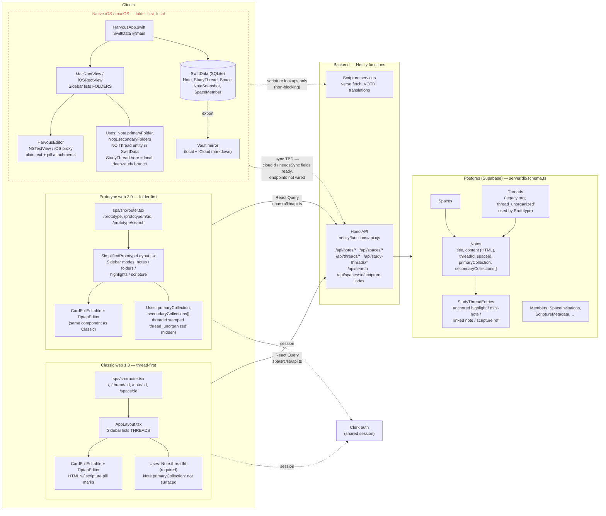

# Harvous architecture at a glance

This diagram consolidates the three client surfaces (Classic web 1.0, Prototype web 2.0, Native iOS/macOS), how they reach data, and — importantly — how each surface treats **threads** (the legacy org grouping) versus **folders** (the new collection system that replaces threads in the 2.0 product). For deeper context see [PROTOTYPE_2_0_ARCHITECTURE.md](./PROTOTYPE_2_0_ARCHITECTURE.md), [native-prototype/NATIVE_2_0_PLATFORM_STRATEGY.md](./native-prototype/NATIVE_2_0_PLATFORM_STRATEGY.md), and [design-parity/PROTOTYPE_NATIVE_MENU_CONTENT_PARITY.md](./design-parity/PROTOTYPE_NATIVE_MENU_CONTENT_PARITY.md).

---

## Combined architecture + data-usage diagram

---

## Legend

| Surface | Primary org concept in UI | DB threads usage | DB collections/folders usage | Highlights stored in |
|---|---|---|---|---|
| **Classic web 1.0** | **Threads** (visible in sidebar/URL) | `Note.threadId` required and surfaced | `primaryCollection` exists on row, not surfaced in UI | Postgres `StudyThreadEntries` |
| **Prototype web 2.0** | **Folders** (collections) | `threadId` stamped `thread_unorganized` server-side, hidden in UI | `primaryCollection` + `secondaryCollections[]` first-class | Postgres `StudyThreadEntries` |
| **Native (iOS / macOS)** | **Folders** (`primaryFolder` + `secondaryFolders`) | **No `Thread` entity in SwiftData at all** | First-class on `Note` model | Local SwiftData `StudyThread` rows — **does not sync to web yet** |

## Terminology gotchas the diagram captures

- **"Thread"** means two different things. In Classic web it's the legacy org grouping (the `Threads` table). In Native, `StudyThread` is a per-note deep-study branch (anchored highlight / mini-note / linked note) — equivalent to web's `StudyThreadEntries`, not to web's `Threads`.
- **Folders ≈ Collections.** Native calls them `primaryFolder` / `secondaryFolders`; web (DB) calls them `primaryCollection` / `secondaryCollections`. Same concept; the SwiftData model uses `@Attribute(originalName: "primaryCollection")` to bridge the names locally.

---

**See also:** [PROTOTYPE_2_0_ARCHITECTURE.md](./PROTOTYPE_2_0_ARCHITECTURE.md) · [native-prototype/NATIVE_2_0_PLATFORM_STRATEGY.md](./native-prototype/NATIVE_2_0_PLATFORM_STRATEGY.md) · [design-parity/PROTOTYPE_NATIVE_MENU_CONTENT_PARITY.md](./design-parity/PROTOTYPE_NATIVE_MENU_CONTENT_PARITY.md)
