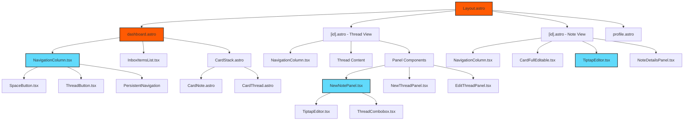
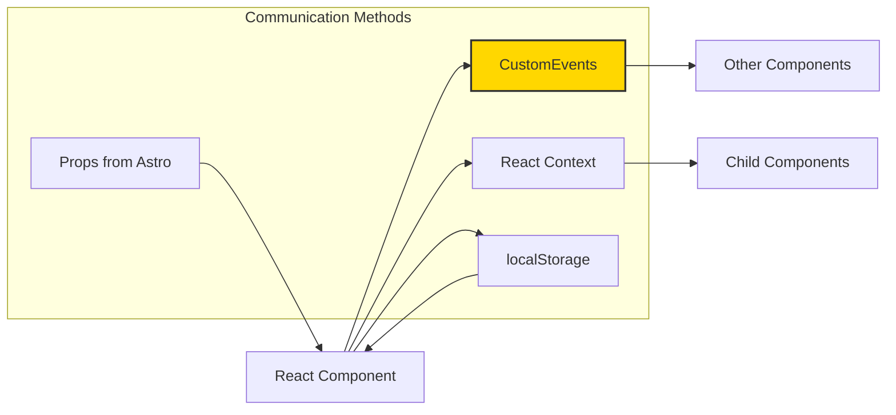

# Component System

Complete documentation of Harvous's component architecture, including component hierarchy, organization, and communication patterns.

## Component Hierarchy



## Component Organization

### Astro Components (Server-Rendered)

**Pages:**
- `dashboard.astro` - Main dashboard view
- `[id].astro` - Dynamic thread/note/space view
- `profile.astro` - User profile page

**Cards:**
- `CardNote.astro` - Note preview cards
- `CardThread.astro` - Thread preview cards
- `CardStack.astro` - Stacked card container
- `CardFeat.astro` - Featured content cards

**Buttons:**
- `Button.astro` - Standard button component
- `ActionButton.astro` - Action-specific button
- `SquareButton.astro` - Square button with context-aware menus

**Layout:**
- `Layout.astro` - Main application layout
- `DashboardShell.astro` - Dashboard shell wrapper

**Other:**
- `SpaceButton.astro` - Space navigation button
- `PersistentNavigation.astro` - Persistent navigation component
- `ContextMoreMenu.astro` - Context-aware menu system

### React Islands (Client-Hydrated)

**Navigation:**
- `NavigationColumn.tsx` - Main navigation column
- `MobileNavigation.tsx` - Mobile navigation component

**Panels:**
- `NewNotePanel.tsx` - Note creation panel
- `NewThreadPanel.tsx` - Thread creation panel
- `NoteDetailsPanel.tsx` - Note details and metadata panel
- `EditThreadPanel.tsx` - Thread editing panel

**Editors:**
- `TiptapEditor.tsx` - Main Tiptap rich text editor

**UI Components:**
- `BottomSheet.tsx` - Mobile bottom sheet component
- `ThreadCombobox.tsx` - Thread selection combobox
- `SearchInput.tsx` - Search input component

**Other:**
- `CardFullEditable.tsx` - Inline editable note card

## Component Communication



### Communication Patterns

1. **Props** - Astro pages → React islands (initial data)
   - Server-rendered data passed as props to React components
   - Enables SSR with client-side interactivity

2. **CustomEvents** - Cross-component communication
   - Panel open/close events
   - Data update notifications
   - Navigation updates

3. **React Context** - Shared state within React component trees
   - Navigation state management
   - User context
   - Theme preferences

4. **localStorage** - Persistent state across page loads
   - Navigation history
   - User preferences
   - Form state persistence

### Key Events

- `noteCreated` → Update navigation counts, refresh lists
- `noteDeleted` → Update counts, remove from view
- `threadCreated` → Add to navigation
- `threadDeleted` → Remove from navigation
- `spaceCreated` → Add to navigation
- `openNewNotePanel` / `closeNewNotePanel` → Panel visibility
- `noteAddedToThread` / `noteRemovedFromThread` → Thread counts

## Rich Text Editor System

### Tiptap Integration

The application uses Tiptap as the primary rich text editor for React components, providing better React integration, TypeScript support, and modern architecture.

#### Core Components

- **`src/components/react/TiptapEditor.tsx`**: Main Tiptap editor component for React Islands
- **`src/components/react/NewNotePanel.tsx`**: Note creation panel with Tiptap integration
- **`src/components/react/CardFullEditable.tsx`**: Inline note editing with Tiptap

#### Technical Implementation

**React Integration:**
- Native React hooks and state management
- TypeScript support with proper typing
- Clean component architecture
- Form submission integration via hidden inputs

**Features:**
- Bold, italic, underline text formatting
- Ordered and unordered lists
- Clean toolbar with Font Awesome icons
- Consistent styling with app theme (Reddit Sans font)
- Mobile and desktop responsive

**Legacy Components:**
- Quill.js components have been archived to `src/components/_legacy/` (see legacy folder README)
- All new development should use Tiptap-based components

#### Editor Features

**Formatting Options:**
- Bold, italic, underline text formatting
- Ordered and unordered lists
- Clean toolbar with essential formatting tools
- Distraction-free editing interface

**User Experience:**
- Click-to-edit functionality for existing notes
- Real-time content updates
- Seamless form submission integration
- Consistent styling with app theme

## Content Processing System

**HTML Stripping Function:**
The system includes a comprehensive HTML stripping function for clean text previews:

```typescript
function stripHtml(html: string): string {
  // Comprehensive HTML tag removal
  // HTML entity decoding
  // Whitespace cleanup
}
```

**Implementation Locations:**
- `src/components/CardNote.astro` - Note preview cards
- `src/components/CardFeat.astro` - Featured content cards
- `src/utils/dashboard-data.ts` - Dashboard data processing
- `src/pages/search.astro` - Search results processing
- `src/pages/[id].astro` - Thread page content processing
- `src/components/NewThreadPanel.astro` - Recent notes and search results

**Benefits:**
- Clean text previews without HTML artifacts
- Consistent content display across all components
- Proper truncation with HTML entity handling
- Better user experience with readable content summaries

## Component Dependencies

### FontAwesome Icons

- **Location**: `@fortawesome/fontawesome-free/svgs/solid/`
- **Usage**: Imported directly in components for optimal performance
- **Common Icons**: `plus.svg`, `xmark.svg`, `ellipsis.svg`, `angle-left.svg`, `layer-group.svg`, `note-sticky.svg`

### CSS Variables

- **Color System**: All colors defined as CSS custom properties
- **Thread Colors**: `--color-blessed-blue`, `--color-graceful-gold`, etc.
- **UI Colors**: `--color-paper`, `--color-stone-grey`, `--color-deep-grey`, etc.
- **Gradients**: `--color-gradient-gray` for button backgrounds

## React Islands Pattern

Harvous uses **React Islands architecture** - pages are rendered server-side by Astro, with interactive React components hydrated on demand:

**Benefits:**
- ⚡ Fast initial page load (SSR HTML)
- 🎯 Interactive components only where needed
- 🔄 Best of both worlds: server + client rendering

**Client Directives:**
- `client:load` - Critical interactive components (navigation, auth, forms in view) - loads immediately
- `client:visible` - Components below the fold - loads when scrolled into view
- `client:idle` - Non-critical features (analytics, widgets) - loads when browser is idle
- `client:only="react"` - Skip SSR if component relies on browser APIs

## Related Documentation

- [ARCHITECTURE.md](./ARCHITECTURE.md) - Overall system architecture
- [REACT_ISLANDS_STRATEGY.md](./REACT_ISLANDS_STRATEGY.md) - React Islands patterns and best practices
- [FONT_AWESOME_REACT_GUIDE.md](./FONT_AWESOME_REACT_GUIDE.md) - FontAwesome integration guide
- [VANILLA_CSS_CLASS_SYSTEM.md](./VANILLA_CSS_CLASS_SYSTEM.md) - CSS class system documentation

