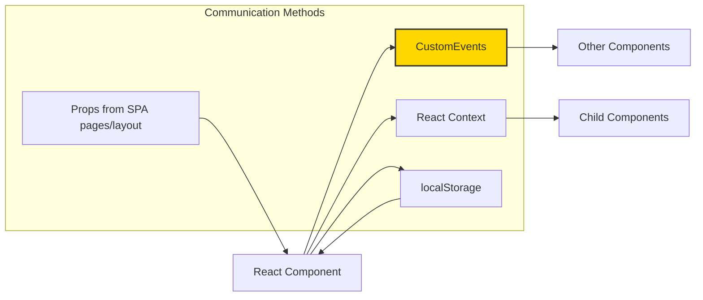

# Component System

Complete documentation of Harvous's component architecture. **Production** is the React SPA in `spa/` using shared components from `src/components/react/`.

## Component Hierarchy

```mermaid
graph TD
    AppLayout[AppLayout.tsx] --> Dashboard[DashboardPage.tsx]
    AppLayout --> ThreadPage[ThreadPage.tsx]
    AppLayout --> NotePage[NotePage.tsx]
    AppLayout --> SpacePage[SpacePage.tsx]
    AppLayout --> Profile[ProfilePage.tsx]

    Dashboard --> Nav[NavigationColumn.tsx]
    Dashboard --> InboxList[InboxItemsList.tsx]
    Dashboard --> CardStack[CardStack - dashboard cards]

    ThreadPage --> Nav2[NavigationColumn.tsx]
    ThreadPage --> ThreadView[Thread content]
    ThreadPage --> Panels[Panel Components]

    NotePage --> Nav3[NavigationColumn.tsx]
    NotePage --> CardFull[CardFullEditable.tsx]
    NotePage --> Editor[TiptapEditor.tsx]
    NotePage --> DetailPanel[NoteDetailsPanel.tsx]

    Panels --> NewNote[NewNotePanel.tsx]
    Panels --> NewThread[NewThreadPanel.tsx]
    Panels --> EditThread[EditThreadPanel.tsx]

    Nav --> ThreadButtons[ThreadButton.tsx]
    Nav --> PersistentNav[PersistentNavigation.tsx]

    NewNote --> Editor2[TiptapEditor.tsx]
    NewNote --> ThreadCombo[ThreadCombobox.tsx]

    style AppLayout fill:#333,stroke:#333,stroke-width:2px
    style Dashboard fill:#333,stroke:#333,stroke-width:2px
    style Nav fill:#61dafb,stroke:#333,stroke-width:2px
    style Editor fill:#61dafb,stroke:#333,stroke-width:2px
    style NewNote fill:#61dafb,stroke:#333,stroke-width:2px
```



## Component Organization

### SPA pages (`spa/src/pages/`)

- `DashboardPage.tsx` - Main dashboard (cards, inbox, navigation)
- `ThreadPage.tsx` - Thread view
- `NotePage.tsx` - Single-note view with editor
- `SpacePage.tsx` - Space view
- `ProfilePage.tsx` - User profile
- Other routes: sign-in, sign-up, join/invite flows, etc.

### Layouts (`spa/src/layouts/`)

- `AppLayout.tsx` - Authenticated app shell (nav + outlet)
- `AuthLayout.tsx` - Sign-in/sign-up layout

### Shared React components (`src/components/react/`)

**Navigation:**
- `navigation/NavigationColumn.tsx` - Main navigation column
- `navigation/PersistentNavigation.tsx` - Persistent nav with space support and confirmation dialogs
- `MobileNavigation.tsx` - Mobile navigation component

**Panels:**
- `NewNotePanel.tsx` - Note creation panel
- `NewThreadPanel.tsx` - Thread creation panel
- `NoteDetailsPanel.tsx` - Note details and metadata panel
- `EditThreadPanel.tsx` - Thread editing panel

**Editors:**
- `TiptapEditor.tsx` - Main Tiptap rich text editor

**UI Components:**
- `BottomSheet.tsx` - Mobile bottom sheet host (panels, custom events). Shell: **Vaul** in `src/components/ui/drawer.tsx` with Harvous overlay / bottom-sheet CSS.
- `ThreadCombobox.tsx` - Thread selection combobox
- `SearchInput.tsx` - Search input component

**Other:**
- `CardFullEditable.tsx` - Inline editable note card

**Credits — motion & toasts:** Drawer and toast UX follow the direction of **[Emil Kowalski](https://emilkowal.ski/)** via **[Vaul](https://vaul.emilkowal.ski/)** (mobile drawer) and **[Sonner](https://sonner.emilkowal.ski/)** (toasts). See [`docs/TECH_STACK.md`](./TECH_STACK.md).

## Component Communication



### Communication Patterns

1. **Props** - SPA pages/layout → React components (initial data and route params)
   - Data from TanStack Query or route params passed into shared components

2. **CustomEvents** - Cross-component communication
   - Panel open/close events
   - Data update notifications
   - Navigation updates

3. **React Context** - Shared state within React component trees
   - Navigation state management
   - User context
   - Theme preferences

4. **localStorage** - Persistent state across page loads
   - Navigation history
   - User preferences
   - Form state persistence

### Key Events

- `noteCreated` → Update navigation counts, refresh lists
- `noteDeleted` → Update counts, remove from view
- `threadCreated` → Add to navigation
- `threadDeleted` → Remove from navigation
- `spaceCreated` → Add to navigation
- `openNewNotePanel` / `closeNewNotePanel` → Panel visibility
- `noteAddedToThread` / `noteRemovedFromThread` → Thread counts

## Rich Text Editor System

### Tiptap Integration

The application uses Tiptap as the primary rich text editor for React components, providing better React integration, TypeScript support, and modern architecture.

#### Core Components

- **`src/components/react/TiptapEditor.tsx`**: Main Tiptap editor component for React Islands
- **`src/components/react/NewNotePanel.tsx`**: Note creation panel with Tiptap integration
- **`src/components/react/CardFullEditable.tsx`**: Inline note editing with Tiptap

#### Technical Implementation

**React Integration:**
- Native React hooks and state management
- TypeScript support with proper typing
- Clean component architecture
- Form submission integration via hidden inputs

**Features:**
- Bold, italic, underline text formatting
- Ordered and unordered lists
- Clean toolbar with Font Awesome icons
- Consistent styling with app theme (Reddit Sans font)
- Mobile and desktop responsive

**Legacy Components:**
- Quill.js components have been archived to `src/components/_legacy/` (see legacy folder README)
- All new development should use Tiptap-based components

#### Editor Features

**Formatting Options:**
- Bold, italic, underline text formatting
- Ordered and unordered lists
- Clean toolbar with essential formatting tools
- Distraction-free editing interface

**User Experience:**
- Click-to-edit functionality for existing notes
- Real-time content updates
- Seamless form submission integration
- Consistent styling with app theme

## Content Processing System

**HTML Stripping Function:**
The system includes a comprehensive HTML stripping function for clean text previews:

```typescript
function stripHtml(html: string): string {
  // Comprehensive HTML tag removal
  // HTML entity decoding
  // Whitespace cleanup
}
```

**Implementation Locations:**
- Dashboard and card components - Note/thread previews and card stacks
- `src/utils/` - Dashboard data processing and shared utilities
- `spa/src/pages/` - Page-level content and find/search
- `src/components/react/NewThreadPanel.tsx` - Recent notes and search results

**Benefits:**
- Clean text previews without HTML artifacts
- Consistent content display across all components
- Proper truncation with HTML entity handling
- Better user experience with readable content summaries

## Component Dependencies

### FontAwesome Icons

- **Location**: `@fortawesome/fontawesome-free/svgs/solid/`
- **Usage**: Imported directly in components for optimal performance
- **Common Icons**: `plus.svg`, `xmark.svg`, `ellipsis.svg`, `angle-left.svg`, `layer-group.svg`, `note-sticky.svg`

### CSS Variables

- **Color System**: All colors defined as CSS custom properties
- **Thread Colors**: `--color-blessed-blue`, `--color-graceful-gold`, etc.
- **UI Colors**: `--color-paper`, `--color-stone-grey`, `--color-deep-grey`, etc.
- **Gradients**: `--color-gradient-gray` for button backgrounds

## Related Documentation

- [ARCHITECTURE.md](./ARCHITECTURE.md) - Overall system architecture
- [REACT_ISLANDS_STRATEGY.md](./REACT_ISLANDS_STRATEGY.md) - Legacy React Islands notes (historical; production is SPA-only)
- [FONT_AWESOME_REACT_GUIDE.md](./FONT_AWESOME_REACT_GUIDE.md) - FontAwesome integration guide
- [VANILLA_CSS_CLASS_SYSTEM.md](./VANILLA_CSS_CLASS_SYSTEM.md) - CSS class system documentation

