# Database Schema

Complete database schema documentation for Harvous, including entity relationships, table definitions, and special patterns.

## Entity Relationship Diagram

```mermaid
erDiagram
    USERS ||--o{ SPACES : creates
    USERS ||--o{ THREADS : creates
    USERS ||--o{ NOTES : creates
    USERS ||--o{ TAGS : creates
    USERS ||--|| USERMETADATA : has
    USERS ||--o{ USERXP : earns
    USERS ||--o{ USERSEASONALXP : earns
    USERS ||--|| USERLIFETIMEXP : has
    USERS ||--o{ WEEKLYSTREAKS : has

    SPACES ||--o{ THREADS : contains
    SPACES ||--o{ NOTES : contains
    SPACES ||--o{ SPACEMEMBERSHIPS : has
    SPACES ||--o{ SPACEINVITES : has
    SPACES ||--o{ MEMBERS : "has (deprecated v1)"
    SPACES ||--o{ SPACEINVITATIONS : "has (deprecated v1)"

    THREADS ||--o{ NOTETHREADS : "via junction"

    NOTES ||--o{ NOTETHREADS : "via junction (single source of truth)"
    NOTES ||--o{ NOTETAGS : has
    NOTES ||--o{ COMMENTS : has
    NOTES ||--o| SCRIPTUREMETADATA : "may have"
    NOTES ||--o| RESOURCEMETADATA : "may have"
    NOTES ||--o{ NOTESCRIPTUREREFERENCES : "references"

    TAGS ||--o{ NOTETAGS : "via junction"

    INBOXITEMS ||--o{ INBOXITEMNOTES : contains
    INBOXITEMS ||--o{ USERINBOXITEMS : "user status"

    USERS {
        text userId PK "Clerk ID"
        text firstName
        text lastName
        text email
    }

    USERMETADATA {
        text id PK
        text userId FK
        int highestSimpleNoteId
        text userColor
        text firstName
        text lastName
        text referralCode
        int referralBonusNotes
        text lockPinSalt
        text lockPinHash
        text churchName
        text currentSeason
        date lastMonthlyVisit
        boolean sharedSpacesAddOn "Shared Spaces paid add-on"
    }

    SPACES {
        text id PK
        text title
        text description
        text userId FK "creator/billing anchor"
        text type "personal|shared|public"
        text orgId "future: Clerk org (church hosting)"
        text color
        text backgroundGradient
        boolean isPublic "deprecated v1"
        boolean isActive
        int order
        text shareToken "deprecated v1"
        date shareTokenCreatedAt "deprecated v1"
    }

    THREADS {
        text id PK
        text title
        text subtitle
        text spaceId FK
        text userId FK
        text color
        boolean isPinned
        int order
        text shareToken
        date shareTokenCreatedAt
    }

    NOTES {
        text id PK
        text title
        text content
        text threadId FK "Legacy (thread_unorganized)"
        text spaceId FK
        int simpleNoteId "N001, N002..."
        text noteType "default|scripture|resource"
        text addedBy "user|harvous"
        text userId FK
        boolean isFeatured
        boolean contentEncrypted
        int order
        text shareToken
        date shareTokenCreatedAt
    }

    NOTETHREADS {
        text id PK
        text noteId FK
        text threadId FK
        date createdAt
    }

    SPACEMEMBERSHIPS {
        text id PK
        text spaceId FK
        text userId FK
        text role "owner|leader|member"
        text invitedBy
        text inviteId FK
        date joinedAt
    }

    SPACEINVITES {
        text id PK
        text spaceId FK
        text token
        text kind "link|email"
        text role "leader|member"
        date expiresAt
        int maxUses
        int useCount
        date revokedAt
    }

    MEMBERS {
        text id PK
        text userId FK
        text spaceId FK
        text role "member|admin|owner"
    }

    SPACEINVITATIONS {
        text id PK
        text spaceId FK
        text inviteToken
        text status "pending|accepted|declined|expired|cancelled"
        text invitedEmail
        text invitedUserId
    }

    TAGS {
        text id PK
        text name
        text category
        text color
        text userId FK
        boolean isSystem
    }

    NOTETAGS {
        text id PK
        text noteId FK
        text tagId FK
        boolean isAutoGenerated
        float confidence "0-1"
    }

    SCRIPTUREMETADATA {
        text id PK
        text noteId FK
        text reference "John 3:16"
        text book
        int chapter
        int verse
        int verseEnd
        text translation
        text originalText
    }

    RESOURCEMETADATA {
        text id PK
        text noteId FK
        text sourceUrl
        text sourceDomain
        text sourceTitle
        text sourceImage
    }

    NOTESCRIPTUREREFERENCES {
        text id PK
        text noteId FK
        text scriptureNoteId FK
    }

    USERXP {
        text id PK
        text userId FK
        text activityType
        int xpAmount
        text relatedId
        text season
    }

    USERSEASONALXP {
        text id PK
        text userId FK
        text season
        int totalXP
        int sessionCount
    }

    USERLIFETIMEXP {
        text id PK
        text userId FK
        int totalXP
        date lastUpdated
    }

    WEEKLYSTREAKS {
        text id PK
        text userId FK
        date weekStart
        int daysWithSessions
        int xpAwarded
    }

    INBOXITEMS {
        text id PK
        text webflowItemId
        text contentType "thread|note"
        text title
        text targetAudience
    }

    INBOXITEMNOTES {
        text id PK
        text inboxItemId FK
        text content
        int order
    }

    USERINBOXITEMS {
        text id PK
        text userId FK
        text inboxItemId FK
        text status "inbox|archived|added"
    }

    MONTHLYANALYTICS {
        text id PK
        text month "YYYY-MM"
        text bookName
        text tagName
        text category "book|tag"
        int count
    }
```

## Core Tables

| Table | Purpose | Key Fields |
|-------|---------|------------|
| **Spaces** | Top-level organization containers | title, description, color, backgroundGradient, userId (creator/billing anchor), type (personal\|shared\|public), orgId (future church hosting), isActive |
| **Threads** | Collections of related notes | title, subtitle, spaceId, color, isPinned, shareToken |
| **Notes** | Individual content items | title, content, threadId (legacy), simpleNoteId, noteType, addedBy, contentEncrypted, shareToken |
| **NoteThreads** | **Single source of truth**: notes ↔ threads (many-to-many) | noteId, threadId |
| **SpaceMemberships** | Shared/public space membership (owner included) | spaceId, userId, role (owner\|leader\|member), invitedBy, inviteId, joinedAt |
| **SpaceInvites** | Expiring invite links to join shared spaces (email `kind` reserved) | spaceId, token, kind, role, expiresAt, maxUses, useCount, revokedAt |
| **Members** | *Deprecated* — frozen v1 shared-space membership, no reads/writes | userId, spaceId, role |
| **SpaceInvitations** | *Deprecated* — frozen v1 invites (link/email), no reads/writes | spaceId, inviteToken, status, invitedEmail, invitedUserId |
| **Tags** | Categorization labels | name, category, color, isSystem |
| **NoteTags** | Many-to-many: notes ↔ tags | noteId, tagId, isAutoGenerated, confidence |
| **UserMetadata** | User preferences & cached data | highestSimpleNoteId, userColor, referralBonusNotes, referralCode, lockPinSalt, lockPinHash, church fields, currentSeason |
| **UserXP** | XP activity log | activityType, xpAmount, relatedId, season |
| **UserSeasonalXP** | Aggregated XP per season | userId, season, totalXP, sessionCount |
| **UserLifetimeXP** | Lifetime XP total | userId, totalXP, lastUpdated |
| **WeeklyStreaks** | Weekly session streaks | userId, weekStart, daysWithSessions, xpAwarded |
| **ScriptureMetadata** | Bible reference data | reference, book, chapter, verse, verseEnd, translation, originalText |
| **ResourceMetadata** | Resource note metadata (URLs, OG) | noteId, sourceUrl, sourceDomain, sourceTitle, sourceImage |
| **NoteScriptureReferences** | Notes referencing scripture notes | noteId, scriptureNoteId |
| **Comments** | Note comments | noteId, userId, content |
| **InboxItems** | Curated content (Webflow sync) | webflowItemId, contentType, title, targetAudience |
| **InboxItemNotes** | Notes within inbox threads | inboxItemId, content, order |
| **UserInboxItems** | User inbox status | userId, inboxItemId, status (inbox/archived/added) |
| **MonthlyAnalytics** | Anonymous book/tag usage | month, bookName, tagName, category, count |

## Special Patterns

### 1. Sequential Note IDs

- Each user has a `highestSimpleNoteId` in UserMetadata
- New notes get next sequential ID: N001, N002, N003...
- **Never reused** - deleted IDs are skipped for data integrity

**Implementation Details:**

The system uses a dual ID approach for notes:
- **Database ID**: Unique timestamp-based ID (e.g., `note_1756318000001`) for internal database operations
- **User-Friendly ID**: Sequential simple ID (e.g., `N001`, `N002`, `N003`) for display and user reference

**Simple Note ID Logic:**
- **Sequential Generation**: Simple note IDs are generated sequentially (1, 2, 3, etc.)
- **No Reuse**: Deleted note IDs are never reused to maintain data integrity
- **Example**: If you have notes N001, N002, N003 and delete N003, the next note will be N004 (not N003)
- **Highest Ever Used**: The system tracks the highest simpleNoteId ever used per user
- **User-Scoped**: Each user has their own sequential numbering starting from N001

**UserMetadata Approach:**
The current implementation uses a UserMetadata table to track the highest simpleNoteId ever used per user. This approach was chosen because the requirement is to **never reuse deleted note IDs**, which requires tracking the highest ID ever assigned, not just the highest currently existing.

**How It Works:**
1. **UserMetadata table** stores `highestSimpleNoteId` for each user
2. **Next ID calculation**: `highestSimpleNoteId + 1` (never reuses deleted IDs)
3. **On note creation**: Updates `highestSimpleNoteId` to the new value
4. **Result**: Deleted note IDs are never reused, maintaining sequential integrity

**Example Flow:**
- Create N001 → highestSimpleNoteId = 1
- Create N002 → highestSimpleNoteId = 2  
- Create N003 → highestSimpleNoteId = 3
- Delete N003 → highestSimpleNoteId = 3 (unchanged)
- Create new note → highestSimpleNoteId = 3 + 1 = 4 → **N004** ✅

**Benefits:**
- **Data Integrity**: Ensures deleted note IDs are never reused
- **User Experience**: Provides predictable sequential numbering
- **Performance**: Avoids querying all notes on every ID generation
- **Reliability**: Tracks the highest ID ever used, regardless of current database state

### 2. My Pile Thread (`thread_unorganized`)

- Every user has a `thread_unorganized` thread (display title **My Pile**)
- In the SPA, this thread is routed at **`/thread/mypile`**; **`/thread/unorganized`** redirects to that path. The database id stays `thread_unorganized`.
- **My Pile = notes with NO junction table entries**
- Notes automatically land in My Pile when all junction entries are removed
- Appears in navigation when it contains notes (same as regular threads)
- Cannot be deleted or edited (no menu options)
- Primary `threadId` field is legacy (always set to `'thread_unorganized'`)

**Thread Deletion Behavior:**

When a thread is deleted, the system preserves all notes by moving them to the "My Pile" thread:
- **Primary Thread Notes**: Notes that have the deleted thread as their primary `threadId` are moved to the "My Pile" thread
- **Many-to-Many Relationships**: Notes that are in the deleted thread via the `NoteThreads` junction table have their relationship removed (but remain in other threads)
- **Note Preservation**: No notes are ever deleted when a thread is deleted - they are always preserved and moved to "My Pile"
- **My Pile thread**: Always exists by default (hidden from dashboard display)
- **Protection**: The My Pile thread itself cannot be deleted to prevent data loss

### 3. Multi-Thread Support (Junction-Table-Only)

- **Single source of truth**: `NoteThreads` junction table
- Notes belong to threads via junction entries only
- Notes can belong to multiple threads (many-to-many)
- Adding note to thread: creates junction entry → automatically removed from My Pile
- Removing note from thread: deletes junction entry → automatically returns to My Pile if last one
- Primary `threadId` field is legacy (always `'thread_unorganized'`, never changes)
- Navigation falls back to most recently updated thread

**Multi-Thread Navigation System:**

When a note belongs to multiple threads, the system uses intelligent defaults to determine which thread context to open the note in:

1. **URL Parameter Override** (`?thread=threadId`) - explicit user choice
2. **Navigation Context Detection** - thread user was viewing when they clicked the note
3. **Most Recent Thread Activity** - fallback to thread with most recent `updatedAt` timestamp
4. **My Pile thread fallback** - final fallback for notes with no valid thread context

*(Note: A `NoteThreadAccess` table for per-note last-accessed-thread tracking was removed; context is determined by URL and navigation state only.)*

## Database Schema & Relationships

The system uses a hybrid approach for note-thread relationships:

- **Primary Relationship**: Each note has a required `threadId` field pointing to its primary thread (used primarily for My Pile fallback)
- **Many-to-Many Support**: `NoteThreads` junction table allows notes to belong to multiple threads
- **My Pile thread**: Special thread with ID `thread_unorganized` serves as default for unassigned notes
- **Thread Deletion Logic**: When a thread is deleted, notes with that thread as primary `threadId` are moved to the My Pile thread
- **Junction Cleanup**: Many-to-many relationships are removed from `NoteThreads` table when threads are deleted
- **Data Integrity**: No notes are ever deleted - they are always preserved and moved to the My Pile thread

## XP System & Gamification

The application includes a comprehensive XP (Experience Points) system to gamify user engagement and encourage content creation:

### XP Tracking Table (`UserXP`)

- **Activity Tracking**: Records all user activities that earn XP
- **Activity Types**: `thread_created`, `note_created`, `note_opened`, `first_note_daily`
- **XP Amounts**: Configurable XP values for different activities
- **Related IDs**: Links XP records to specific notes/threads
- **Metadata**: JSON field for additional data (daily caps, etc.)

### XP Values & Rules

- **Thread Creation**: 10 XP per new thread
- **Note Creation**: 10 XP per new note
- **Note Opening**: 1 XP per note opened (50 XP daily cap to prevent gaming)
- **First Note Daily Bonus**: +5 XP bonus for the first note created each day

### XP System Features

- **Automatic Awarding**: XP is automatically awarded when users create content
- **Daily Caps**: Prevents gaming by limiting note opening XP to 50 per day
- **Backfill System**: Can retroactively calculate XP for existing users
- **Real-time Display**: Profile page shows current XP total
- **Future Expansion**: Designed to support levels, badges, and achievements

## ID Format Examples

- **Notes**: `note_1756318000001`, `note_1756318000003`
- **Threads**: `thread_1756318000000`, `thread_1756318000004`
- **Spaces**: `space_1756318000006`

## Related Documentation

- [ARCHITECTURE.md](./ARCHITECTURE.md) - Overall system architecture
- [API.md](./API.md) - API endpoints for database operations
- [FEATURES.md](./FEATURES.md) - User-facing features that use the database

