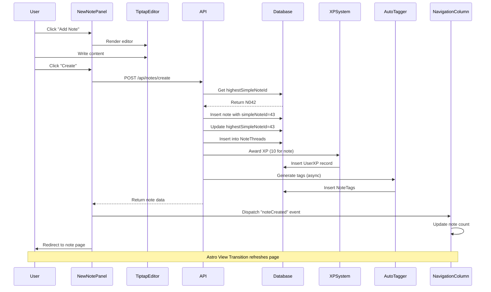
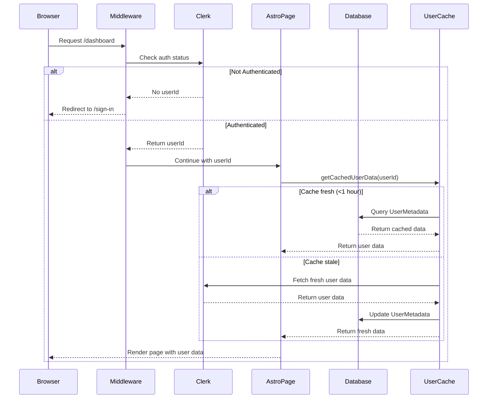
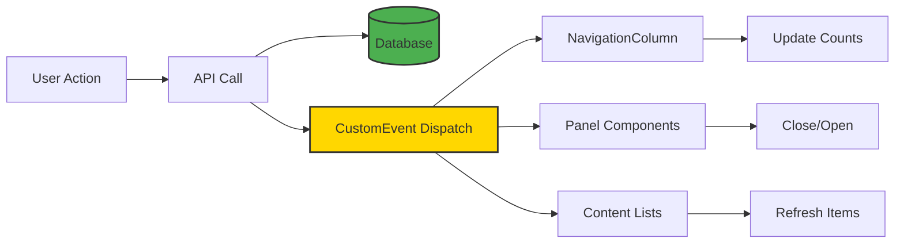
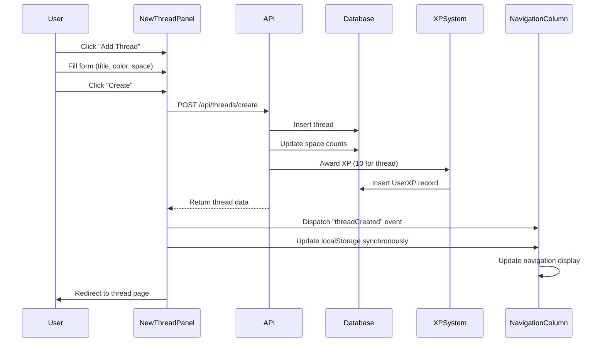
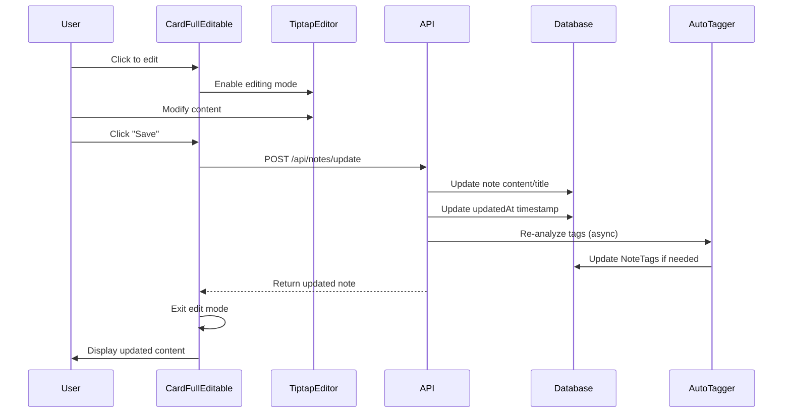
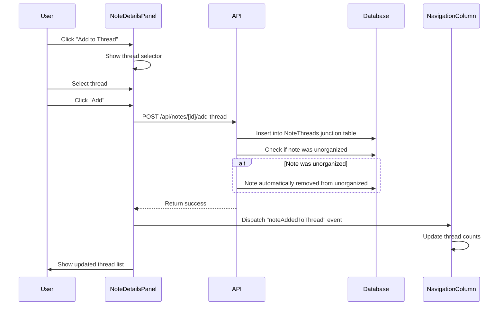
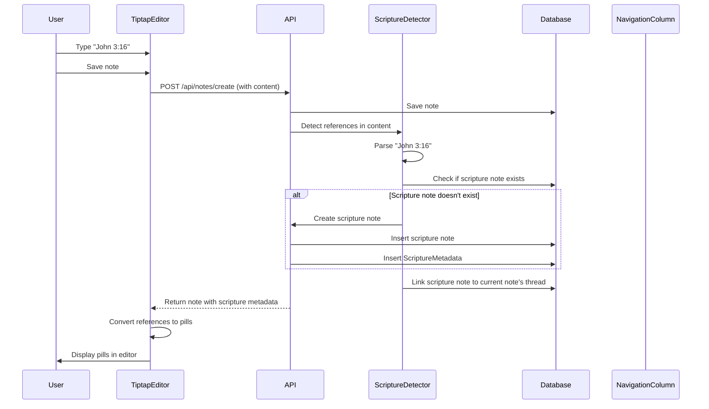
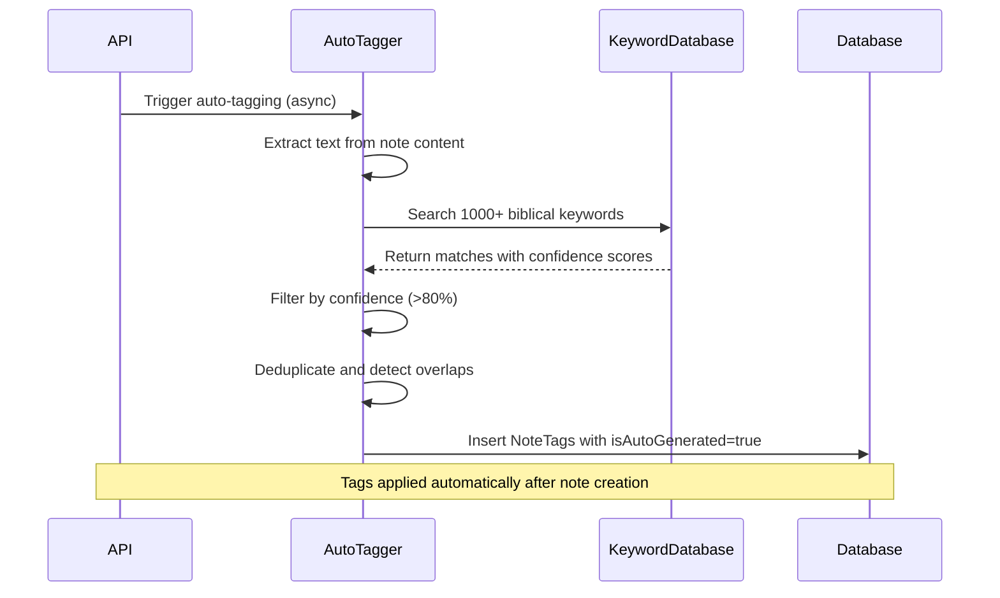
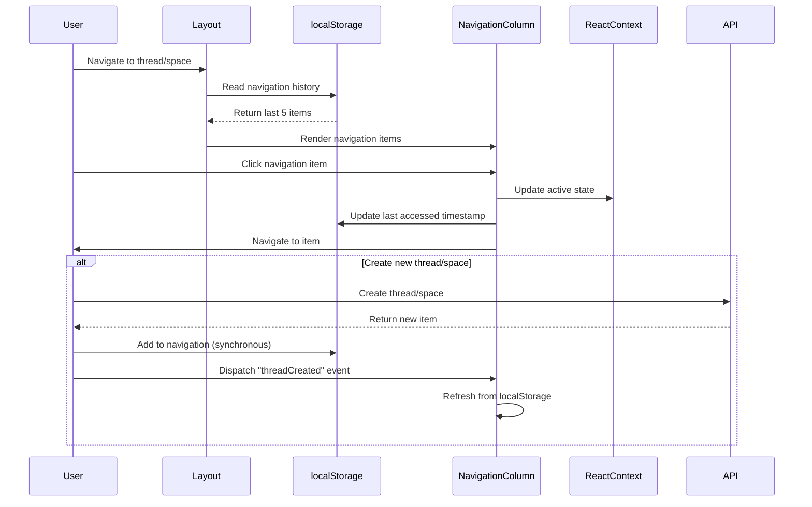
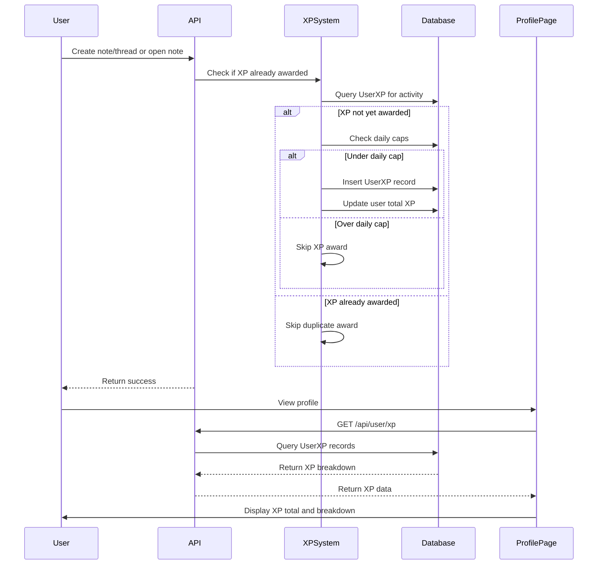

# Data Flow

Complete documentation of data flows in Harvous, including sequence diagrams for key operations and event-driven update patterns.

## Note Creation Flow

## Authentication Flow

## Event-Driven Updates

### Key Events

- `noteCreated` → Update navigation counts, refresh lists
- `noteDeleted` → Update counts, remove from view
- `threadCreated` → Add to navigation
- `threadDeleted` → Remove from navigation
- `spaceCreated` → Add to navigation
- `openNewNotePanel` / `closeNewNotePanel` → Panel visibility
- `noteAddedToThread` / `noteRemovedFromThread` → Thread counts

## Thread Creation Flow

## Note Update Flow

## Multi-Thread Note Management

## Scripture Detection Flow

## Auto-Tagging Flow

## Navigation History Flow

## XP Award Flow

## Related Documentation

- [ARCHITECTURE.md](./ARCHITECTURE.md) - Overall system architecture
- [COMPONENTS.md](./COMPONENTS.md) - Component system details
- [API.md](./API.md) - API endpoint documentation
- [DATABASE.md](./DATABASE.md) - Database schema and relationships

