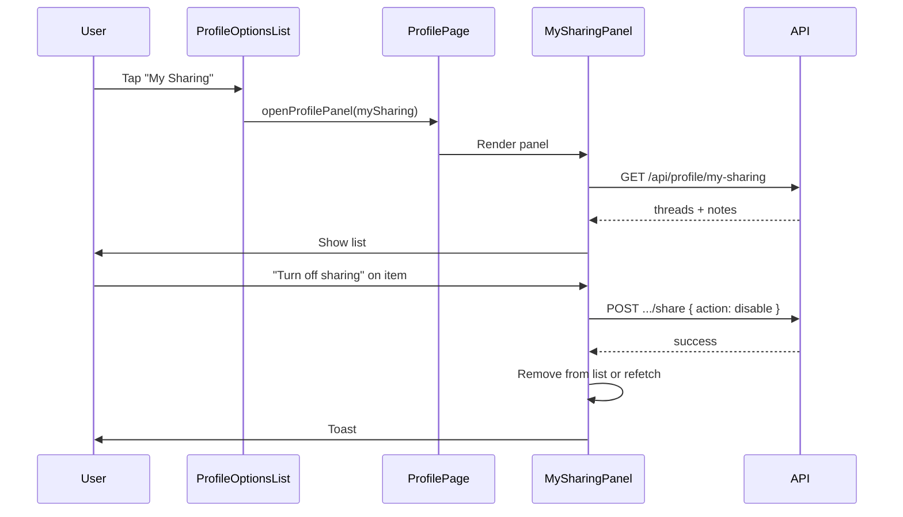

# My Sharing Profile Panel

Add a "My Sharing" option and panel on Profile that lists all threads and default notes the user has made shareable, with one-tap disable sharing. Scripture notes are excluded (always shareable by design).

## Scope

- **Include**: Threads and default notes where the user has turned on sharing (i.e. `shareToken` is set and they own the item).
- **Exclude**: Scripture notes (always shareable; user didn't "make" them shareable) and any `noteType !== 'default'` notes.

## Data model (already in place)

- **Threads**: [db/config.ts](../db/config.ts) — `shareToken` (optional), `userId`, `isPublic`.
- **Notes**: [db/config.ts](../db/config.ts) — `shareToken` (optional), `userId`, `noteType` (`'default' | 'scripture' | 'resource'`).

Disable sharing reuses existing APIs: `POST /api/notes/[noteId]/share` and `POST /api/threads/[threadId]/share` with `body: { action: 'disable' }`.

## Implementation

### 1. API: list "my shared" items

Add **GET** [src/pages/api/profile/my-sharing.ts](../src/pages/api/profile/my-sharing.ts) (new file).

- Auth: require `userId` from `locals.auth()`.
- Query:
  - **Threads**: `userId = currentUser`, `shareToken != null`. Return `id`, `title`, `shareToken` (and optionally `shareTokenCreatedAt`).
  - **Notes**: `userId = currentUser`, `shareToken != null`, `noteType = 'default'`. Return `id`, `title` (or first line of content), `shareToken`.
- Response shape: `{ threads: Array<{ id, title, shareToken }>, notes: Array<{ id, title, shareToken }> }`.

Use `db.select().from(Threads).where(and(eq(Threads.userId, userId), isNotNull(Threads.shareToken)))` and same pattern for Notes with `noteType = 'default'`.

### 2. MySharingPanel component

Add [src/components/react/MySharingPanel.tsx](../src/components/react/MySharingPanel.tsx).

- **Layout**: Same pattern as other profile panels (e.g. [MyDataPanel](../src/components/react/MyDataPanel.tsx)): header with back/close, scrollable list.
- **Data**: On mount, `fetch('/api/profile/my-sharing')`. Show loading and empty states ("You haven't shared any threads or notes yet").
- **List**: Two sections or a single list with type labels: "Threads" and "Notes". Each row: title (truncated), type badge (Thread / Note), and a "Turn off sharing" control (button or toggle).
- **Turn off sharing**: On click, call `POST /api/threads/[threadId]/share` or `POST /api/notes/[noteId]/share` with `{ action: 'disable' }`, then remove that item from local state (or refetch). Toast: "Sharing turned off for [title]."
- **Optional**: Show share link (copy) per row; can be a follow-up.
- **Accessibility**: List semantics, focus management, and clear button labels.

### 3. Wire into Profile

- **[ProfileOptionsList.tsx](../src/components/react/ProfileOptionsList.tsx)**: Add `renderOption('mySharing', 'My Sharing', true)` in the "Profile & Account Settings" block (e.g. after "Refer My Friends" or "My Church"). `requiresOnline: true` so the panel only opens when online.
- **[ProfilePage.tsx](../src/components/react/profile/ProfilePage.tsx)**:
  - Extend `PanelName`: add `'mySharing'`.
  - In `renderPanel()`, add `case 'mySharing': return <MySharingPanel />;`
  - Import `MySharingPanel`.

No changes to [profile.astro](../src/pages/profile.astro) unless you later want to pass an initial list (not required; panel fetch on open is enough).

## Flow (high level)

## Files to add

| File | Purpose |
|------|--------|
| `src/pages/api/profile/my-sharing.ts` | GET: return current user's shared threads and default notes |
| `src/components/react/MySharingPanel.tsx` | Profile panel UI: list + disable sharing |

## Files to edit

| File | Change |
|------|--------|
| [src/components/react/ProfileOptionsList.tsx](../src/components/react/ProfileOptionsList.tsx) | Add "My Sharing" option |
| [src/components/react/profile/ProfilePage.tsx](../src/components/react/profile/ProfilePage.tsx) | Add `mySharing` to `PanelName`, import and render `MySharingPanel` |

## Edge cases

- **Empty list**: Message like "You haven't shared any threads or notes yet" with short explanation (e.g. turn on sharing from a thread or note to see it here).
- **Disable failure**: Show error toast and leave item in list (user can retry).
- **Offline**: "My Sharing" requires online (same as other options that fetch), so option is disabled when offline via existing `ProfileOptionsList` logic.
