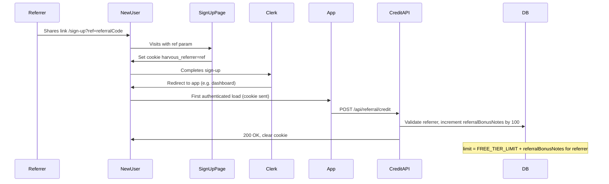

# Referral Bonus: Implementation Guide

**Status:** Implemented  
**Last Updated:** January 2026

This feature is live. See [FEATURES.md](./FEATURES.md#-billing--referrals--implemented) for the user-facing summary.

---

## Overview

Everyone gets **300 free notes** to start. When someone you refer signs up, **you** (the referrer) get **100 more notes** added to your limit—the new person still gets 300 free notes like everyone else. This uses **Option A: raise the limit**—the referrer's effective cap is `300 + (100 × successful referrals)`. Referral links use a short, **autogenerated code** (e.g. `JOHN-X7K2`) instead of your account ID. This fits Harvous's "generosity payback" positioning.

---

## Architecture and Flow

- **Attribution:** New user lands on `/sign-up?ref=<referralCode>` (e.g. `JOHN-X7K2`). Sign-up page sets a cookie `harvous_referrer=<ref>` with TTL 7 days (cookie stores `ref` as-is; no need to resolve before setting).
- **Signup:** New user completes Clerk sign-up and is redirected into the app (e.g. dashboard).
- **Credit:** On first authenticated load, the client calls `POST /api/referral/credit`, which: reads `harvous_referrer`, **resolves ref to userId** (see "Resolving ref to userId"), validates referrer (exists, not self), increments `UserMetadata.referralBonusNotes` for the referrer by 100, then clears the cookie in the response.
- **Limit:** Subscription logic uses `limit = FREE_TIER_LIMIT + referralBonusNotes` so the referrer's cap increases.

No webhook change is required; attribution is cookie + post-signup API so the server credits the referrer when the new user's browser makes the first authenticated request (with cookie).

---

## 1. Database

**Table:** [db/config.ts](../db/config.ts) – `UserMetadata`

**Columns (implemented):**

- `referralBonusNotes` – type `number`, default `0`. Total bonus note allowance earned from referrals (incremented by 100 per successful signup).
- `referralCode` – type `text`, optional, **unique**. Single autogenerated referral code per user (e.g. `JOHN-X7K2`). Existing users have `referralCode` set on first use or backfill.

---

## 2. Referral Code Generation

**File:** [src/utils/referral-code.ts](../src/utils/referral-code.ts)

- `generateReferralCode(firstName: string | null, userId: string): string`
- Prefix from firstName (sanitized, uppercase, first 4–6 chars) or `'USER'`; suffix from deterministic hash of userId (base36).
- Codes are set in [src/utils/user-cache.ts](../src/utils/user-cache.ts) on insert and backfilled on update when null.

---

## 3. Resolving ref to userId

- `resolveRefToUserId(ref: string): Promise<string | null>` in referral-code.ts.
- Accepts referral code (e.g. `JOHN-X7K2`) or legacy Clerk userId; returns referrer's userId or null.

---

## 4. Subscription Logic

**File:** [src/utils/subscription.ts](../src/utils/subscription.ts)

- `getReferralBonusNotes(userId)` – reads from UserMetadata.
- `canCreateNote` / `getSubscriptionInfo` – use `effectiveLimit = FREE_TIER_LIMIT + referralBonusNotes`; limit displayed in UI is dynamic.

---

## 5. Referral Attribution

- **Sign-up:** [src/pages/sign-up.astro](../src/pages/sign-up.astro) sets `harvous_referrer` cookie when `ref` is in URL (7-day TTL).
- **Credit API:** [src/pages/api/referral/credit.ts](../src/pages/api/referral/credit.ts) – POST, auth, read cookie, resolve ref, credit referrer, clear cookie.
- **Client:** ReferralCreditInit (or equivalent) calls credit API once when authenticated and cookie present.

---

## 6. Profile Referral Section / Panel

- **ReferralPanel:** [src/components/react/ReferralPanel.tsx](../src/components/react/ReferralPanel.tsx) – title "Refer My Friends", copyable link, bonus stats, dynamic "before you need unlimited" total.
- **Profile:** ProfileOptionsList, DesktopPanelManager, BottomSheet, ProfilePage, MobileAdditional – all wire `referral` panel/drawer.
- **Data:** GET `/api/referral/status` returns `referralBonusNotes`, `referralCode`, `limit`.

---

## 7. Limit Display (Billing / Upgrade UI)

- [ManageBillingPanel](../src/components/react/ManageBillingPanel.tsx) uses `subscriptionInfo.limit` (effective limit including referral bonus); optional "(including X from referrals)" when bonus > 0.

---

## 8. Optional: Cap on Bonus

- Can cap with `Math.min(referralBonusNotes, MAX_REFERRAL_BONUS)` in subscription.ts and credit API if desired; document in code.

---

## 9. Testing

- Manual: share referral link → sign up new user in incognito → confirm referrer's `referralBonusNotes` +100 and UI shows new cap (e.g. 1,100).

---

## 10. File Reference (Implemented)

| Action | File |
|--------|------|
| Edit | [db/config.ts](../db/config.ts) – `referralBonusNotes`, `referralCode` on UserMetadata |
| Create | [src/utils/referral-code.ts](../src/utils/referral-code.ts) |
| Edit | [src/utils/user-cache.ts](../src/utils/user-cache.ts) |
| Edit | [src/utils/subscription.ts](../src/utils/subscription.ts) |
| Edit | [src/pages/sign-up.astro](../src/pages/sign-up.astro) |
| Create | [src/pages/api/referral/credit.ts](../src/pages/api/referral/credit.ts) |
| Create | [src/pages/api/referral/status.ts](../src/pages/api/referral/status.ts) |
| Create | [src/components/react/ReferralPanel.tsx](../src/components/react/ReferralPanel.tsx) |
| Edit | ProfileOptionsList, DesktopPanelManager, BottomSheet, ProfilePage, MobileAdditional |
| Edit | [ManageBillingPanel](../src/components/react/ManageBillingPanel.tsx) |
| Client | ReferralCreditInit (or layout) calls credit API when cookie present |

---

## Out of Scope (v1)

- **Multiple codes per user / custom codes:** One autogenerated code per user.
- **Analytics:** Referral link clicks; optional future addition.
