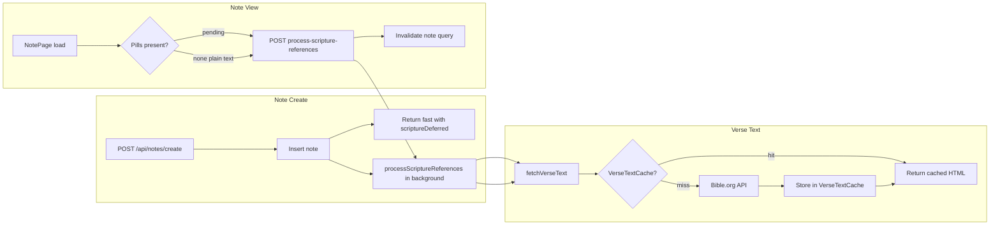

# Scripture Flow

This document describes how scripture detection, verse text, and pill resolution work end-to-end: from note create/update through background processing, caching, and view-time reprocessing.

**See also:** [SCRIPTURE_PILL_IMPLEMENTATION.md](./SCRIPTURE_PILL_IMPLEMENTATION.md) (pills, detection, formatting), [NOTE_TYPES_SYSTEM.md](./NOTE_TYPES_SYSTEM.md) (scripture note type), [SCRIPTURE_DETECTION_IMPROVEMENTS.md](./SCRIPTURE_DETECTION_IMPROVEMENTS.md).

---

## Overview

- **Detection:** Bible references in note content are detected (regex + normalization). References can appear as plain text or as pills (HTML spans with `data-scripture-reference` and optionally `data-note-id`).
- **Scripture notes:** For each *new* reference, the server may create a dedicated scripture note (with verse text, metadata, XP, tags) and link it to the current note via `NoteScriptureReferences`.
- **Verse text:** When creating a new scripture note, verse text is fetched (cache-first, then Bible.org) and stored in the note content and in `VerseTextCache` for future lookups.
- **Pills:** Content is updated with highlighted HTML (pills with real `data-note-id` values). The editor converts these to Tiptap marks for display and navigation.

---

## Note create flow (fast path)

- **Goal:** Create responds in ~1–2 seconds so "Creating..." does not wait on scripture or Bible.org.
- **Behavior:**
  1. `POST /api/notes/create` validates, inserts the note, assigns thread, runs XP and (if applicable) scripture metadata for the note type and resource metadata.
  2. Scripture processing is **not** awaited. The handler kicks off `processScriptureReferences(noteId, userId, threadId, contentToProcess)` in the background (fire-and-forget) and returns immediately with `scriptureDeferred: true` and `scriptureResults: []`.
  3. Client shows a short toast (e.g. "Note created. Scripture links are being added.") and navigates. No caller changes needed beyond handling `scriptureDeferred`.
- **Background:** When the deferred job runs, it does full scripture processing (detection, create/link scripture notes, verse text via cache/API, update note content with pill HTML). If the user opens the note before it finishes, content may still have `data-note-id="pending"` pills until reprocess or next load.

**Code:** [server/routes/notes.ts](server/routes/notes.ts) (create handler: defer call, return with `scriptureDeferred`).

---

## Verse text and cache

- **Purpose:** Avoid repeated Bible.org calls for the same reference; keep background processing and reprocess fast.
- **Flow:**
  1. `fetchVerseText(reference)` normalizes the reference (e.g. "Jn 3:16" → canonical form) and uses it as the cache key.
  2. **Cache read:** Look up `VerseTextCache` by `reference`. If a row exists and `content` is non-empty, return it and skip the API.
  3. **Cache miss:** Call Bible.org (labs.bible.org), format the response as HTML, then insert (or upsert) into `VerseTextCache` and return. API errors are not cached; the function returns `''`.
- **Schema:** `VerseTextCache` has `reference` (PK), `content`, `createdAt`. One row per normalized reference.

**Code:** [server/utils/fetch-verse-text.ts](server/utils/fetch-verse-text.ts), [server/db/schema.ts](server/db/schema.ts) (`VerseTextCache`). Used by [server/utils/process-scripture-references.ts](server/utils/process-scripture-references.ts) and [server/routes/tags-scripture.ts](server/routes/tags-scripture.ts).

---

## Note update flow

- On **PUT /api/notes/update**, the handler still **awaits** `processScriptureReferences` so the response includes `scriptureResults` and (if applicable) `processedContent` for the editor. No deferral here; update is a single save and the client can show which scripture notes were created/linked.
- Same verse-text path: `fetchVerseText` (cache-first) is used when creating new scripture notes during update.

**Code:** [server/routes/notes.ts](server/routes/notes.ts) (update handler).

---

## View flow: reprocess when pills are missing or pending

- When the user opens a note, **NotePage** may trigger scripture processing so pills and scripture notes exist before the user edits.
- **When reprocess runs:**
  - Content has **no** pill markup but **has** plain-text scripture references (e.g. legacy or onboarding notes), or
  - Content has **pending** pills (`data-scripture-reference` with `data-note-id="pending"`, e.g. from a just-created note before the deferred job finished).
- **What happens:** The client calls `POST /api/notes/:id/process-scripture-references` with the current content (and threadId if available). The server runs `processScriptureReferences`, updates the note content in the DB, and returns results. The client then invalidates the note query so the note refetches and shows updated pills.
- **When reprocess is skipped:** Content already has pills with real `data-note-id` values (no pending, no plain-text refs needing pills).

**Code:** [spa/src/pages/NotePage.tsx](spa/src/pages/NotePage.tsx) (effect that checks for no pills or pending pills and calls the process endpoint).

---

## Real-time detection and paste

- **Editor:** The Tiptap editor can show **pending** pills (reference only, no scripture note yet) as the user types or pastes. These use `data-note-id="pending"` until the note is saved and processing runs.
- **Paste on existing note:** When the user pastes content that contains scripture references into an existing note, the editor may call `POST /api/notes/:id/process-scripture-references` with the current HTML and then convert the returned results to pills with real note IDs so the editor state is updated without a full save.

**Code:** [src/components/react/TiptapEditor.tsx](src/components/react/TiptapEditor.tsx) (paste handler, pending pills, call to process-scripture-references).

---

## Standalone process endpoint

- **POST /api/notes/:id/process-scripture-references** runs `processScriptureReferences` for a given note. Used by:
  - NotePage (reprocess on view),
  - TiptapEditor (after paste on existing note),
  - Shared note copy flow (shared.ts, fire-and-forget),
  - User cache / onboarding (user-cache.ts).
- Request body can include `threadId` and `contentOverride`; if omitted, the server reads content from the note row.

**Code:** [server/routes/notes.ts](server/routes/notes.ts) (route), [server/utils/process-scripture-references.ts](server/utils/process-scripture-references.ts) (implementation).

---

## Key files

| Area            | File |
|-----------------|------|
| Create (defer)  | `server/routes/notes.ts` |
| Process refs    | `server/utils/process-scripture-references.ts` |
| Verse text + cache | `server/utils/fetch-verse-text.ts` |
| Cache schema    | `server/db/schema.ts` (`VerseTextCache`) |
| Process endpoint| `server/routes/notes.ts` (`POST /api/notes/:id/process-scripture-references`) |
| Reprocess on view | `spa/src/pages/NotePage.tsx` |
| Pills & paste   | `src/components/react/TiptapEditor.tsx` |
| Client create response | `src/components/react/note-panel/hooks/useNoteSubmission.ts` (`scriptureDeferred`) |
