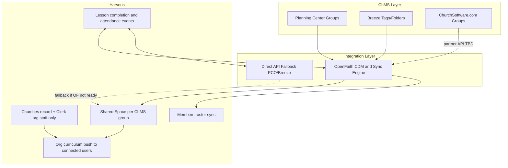
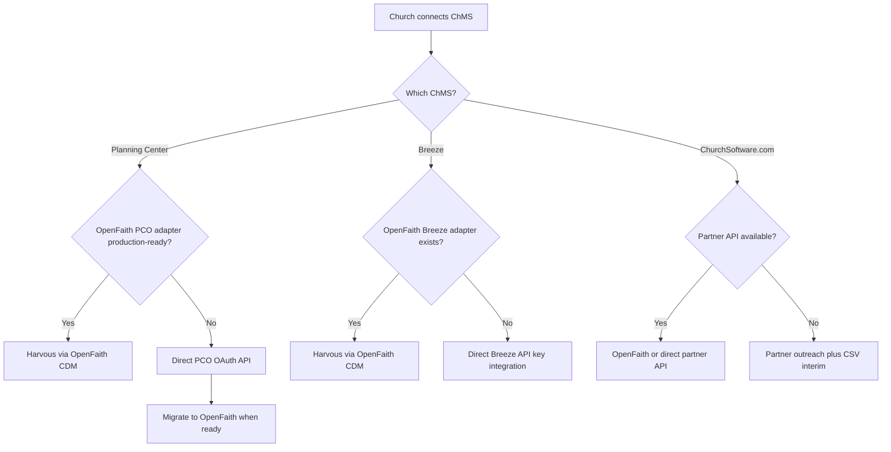
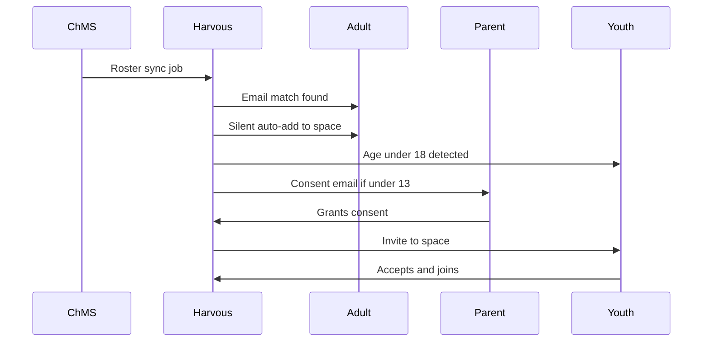
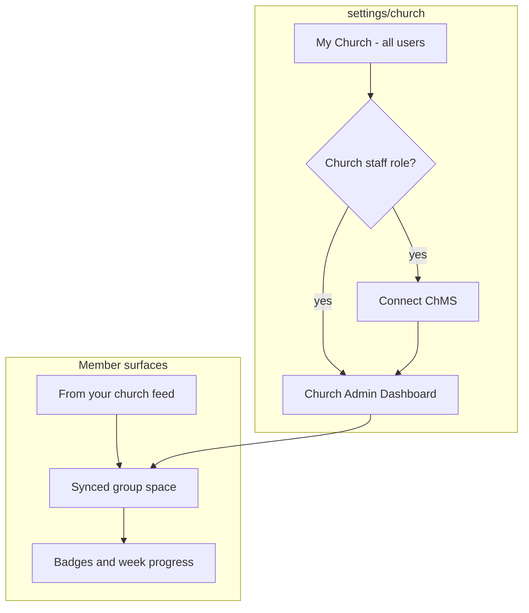

# ChMS Integration Research

**Status:** Research only — no implementation in this phase  
**Last updated:** 2026-07-08  
**Audience:** Future implementation (data-agent, sharing-agent, product)

---

## Related docs

| Doc | Relationship |
|-----|--------------|
| [CHURCH_ORG_AND_CURRICULUM.md](./CHURCH_ORG_AND_CURRICULUM.md) | Layer 2 church org + curriculum push — ChMS is the roster/distribution pipe |
| [RESOURCE_LIBRARY.md](./RESOURCE_LIBRARY.md) | Study-native Resource Library vs PCO Groups Resources; optional later import of PCO resource links |
| [CHURCH_CONNECTION_SYSTEM.md](./CHURCH_CONNECTION_SYSTEM.md) | `connectedChurchId`, matching — ChMS adds auto-provision from group roster |
| [CLERK_ORGANIZATIONS_CHURCHES_CHECKLIST.md](./CLERK_ORGANIZATIONS_CHURCHES_CHECKLIST.md) | Clerk org patterns for church staff (≤20) |
| [SHARED_SPACES_DEV_NOTES.md](../SHARED_SPACES_DEV_NOTES.md) | v1 shared spaces — ChMS groups map to auto-provisioned spaces |
| [FAMILY_ACCOUNTS.md](./FAMILY_ACCOUNTS.md) | Parent linked profiles for youth |
| [MONETIZATION_AND_PRICING.md](./MONETIZATION_AND_PRICING.md) | "Works alongside Planning Center" positioning |
| [easter-2026-shared-space/](../easter-2026-shared-space/) | Closest production pattern for church curriculum today |

---

## 1. Executive summary and positioning

### Vision

Harvous integrates with church management software (ChMS) so churches can run **youth groups, Sunday school, and adult small-group Bible study** on a study layer that complements their existing admin tools. Churches connect their ChMS once from Harvous; group rosters sync into shared spaces; staff publish curriculum; members study with visible progress; attendance and completion flow bidirectionally between Harvous and the ChMS.

### Positioning

**Harvous is not a ChMS replacement.** We complement Planning Center, Breeze, and ChurchSoftware.com on **Bible study memory + curriculum distribution** — not giving, check-in hardware, volunteer scheduling, facilities, or payroll.

**Pitch:** *"Keep Planning Center / Breeze / ChurchSoftware. Harvous is where your people's study lives."*

### Target segment

Mid-size churches (200–2000 active adults). These churches often already pay for a ChMS stack (Planning Center Groups + People is common) and run multiple concurrent education programs (Sunday school, youth, small groups).

### Integration strategy (decided)

| Decision | Choice |
|----------|--------|
| Target platforms | Planning Center, Breeze, ChurchSoftware.com |
| Technical path | **OpenFaith-first** middleware; **direct-API fallback** when OpenFaith adapter is not production-ready |
| Connect entry | Harvous settings (`/settings/church`) — not ChMS-first |
| Harvous role | Complement ChMS study features |

### Explicit non-goals

- Online giving, tithe tracking, donor statements
- Physical check-in kiosks and child security labels
- Volunteer scheduling and worship planning
- Facilities, accounting, payroll
- Replacing Planning Center Groups chat or Church Center as the primary church app

### Architecture overview

**Critical constraint:** Clerk organizations are capped at 20 members and reserved for **church staff only**. ChMS groups may have 30–150+ people. Integration maps **ChMS group membership → Harvous `Members` table + `connectedChurchId`**, never into Clerk org membership. See [CHURCH_CONNECTION_SYSTEM.md](./CHURCH_CONNECTION_SYSTEM.md).

---

## 2. Platform landscape analysis

Each platform is evaluated against the same matrix: auth model, group/roster model, events/attendance, identity fields, rate limits, webhooks, and Harvous fit.

### Comparison matrix

| Dimension | Planning Center | Breeze | ChurchSoftware.com |
|-----------|-----------------|--------|-------------------|
| **Primary segment** | Mid/large; modular stack | Small/mid; single product | All sizes; free core |
| **Auth for integrations** | OAuth 2.0 (multi-church app) or Personal Access Token | Per-church API key (account owner) | No public API |
| **Group model** | Native Groups product (`Group`, `Membership`, `Event`) | Tags + folders (people filtered by tag) | Native groups in platform |
| **Roster API** | `GET /groups/v2/groups/{id}/memberships` | `GET /api/people?tags=…` | TBD (partner) |
| **Attendance API** | `GET /groups/v2/events/{id}/attendances` | `GET /api/events/attendance/list` | TBD (partner) |
| **Identity matching** | People API: emails, households | People API: email fields | TBD |
| **Rate limits** | 100 req / 20 sec per user (dynamic) | 20 req / min per church | Unknown |
| **Webhooks** | Supported (developer account) | Not documented | Unknown |
| **Harvous priority** | **Phase 1 primary** | Phase 1 secondary | Partner outreach + CSV interim |

---

### Planning Center (primary target)

**Docs:** [Getting Started](https://api.planningcenteronline.com/docs/overview/getting-started) · [Authentication](https://api.planningcenteronline.com/docs/overview/authentication) · [Groups API](https://api.planningcenteronline.com/docs/apps/groups/versions/2023-07-10) · [Rate Limiting](https://api.planningcenteronline.com/docs/overview/rate-limiting)

#### Auth

- **OAuth 2.0** for multi-church Harvous app: one OAuth application, many churches authorize via Authorization Code + PKCE.
- Scopes are per product: `people`, `groups`, `calendar`, `check_ins`, `registrations`, etc.
- **Recommended Harvous scopes (v1):** `people` (read), `groups` (read/write for membership and attendance).
- Personal Access Token works for single-church pilots only.
- **OpenID Connect** available on top of OAuth — optional for future SSO; email-match is sufficient for v1.
- Tokens act under the authorizing user's permission level; church admin should connect with Groups admin access.

#### Relevant products

| Product | Harvous use |
|---------|-------------|
| **People** | Email, name, household, age/birthdate (youth detection), campus |
| **Groups** | Group list, memberships (leader/member), events, attendance, RSVPs |
| **Registrations** | Future: sign-up flows for classes (Phase 2+) |
| **Calendar** | Optional: link study schedule to group events |

#### Key endpoints

| Operation | Endpoint | Notes |
|-----------|----------|-------|
| List groups | `GET /groups/v2/groups` | Filter by group type, campus |
| Group memberships | `GET /groups/v2/groups/{group_id}/memberships` | Roles: `leader`, `member`; include `person` |
| Person emails | `GET /people/v2/people/{id}/emails` | Primary match key for Harvous accounts |
| Group events | `GET /groups/v2/groups/{group_id}/events` | Class sessions |
| Event attendance | `GET /groups/v2/events/{event_id}/attendances` | Read attendance |
| Write attendance | `POST/PATCH` on attendance resources | Harvous → PCO progress sync |
| RSVPs | `GET /groups/v2/events/{event_id}/rsvps` | Optional engagement signal |

Membership resource tracks `joined_at` and role. A person has one active membership per group at a time.

#### Rate limits

- Default: **100 requests per 20 seconds** per authenticated user.
- High offset (>30,000): 75 req / 20 sec.
- Limits are dynamic; use response headers (`X-PCO-API-Request-Rate-*`, `Retry-After` on 429).
- Initial roster sync for a 150-person church across 20 groups is feasible with batched requests and `include=person,emails` to reduce round trips.

#### Webhooks

Planning Center supports webhooks from the developer account. Useful events for Harvous:

- Group membership created/destroyed → roster sync
- Group event attendance updated → unlock next lesson in Harvous
- Person updated → refresh identity match

Webhook + polling hybrid recommended: webhooks for incremental updates, nightly full reconcile for drift.

#### Member discovery (optional, not v1 connect path)

PCO Groups support custom links on group pages. A "Open Study in Harvous" deep link can supplement Harvous-first connect, but **connect entry is Harvous settings** per product decision. Church Center app discovery is a nice-to-have, not the primary onboarding path.

---

### Breeze (secondary target)

**Docs:** [Breeze API Reference](https://app.breezechms.com/api) · [Support article](https://support.breezechms.com/hc/en-us/articles/360001324153-API-Advanced-Custom-Development)

#### Auth

- **Single API key per church subdomain** (`https://{subdomain}.breezechms.com/api/...`).
- Account owner obtains key from Manage Account → API Key.
- Not multi-tenant OAuth — each church pastes API key into Harvous connect flow.
- Harvous stores encrypted key per `Churches` record.

#### Group model (mapping challenge)

Breeze does not have Planning Center's native "Groups" product. Small groups and classes are typically modeled as:

- **Tags** on people (e.g. "High School Youth", "Room 204 Sunday School")
- **Folders** organizing tags
- **Events** with attendance records tied to calendars

**Proposed mapping:**

| Breeze concept | Harvous concept |
|----------------|-----------------|
| Tag (designated as "study group") | Shared space |
| People with tag | Space members |
| Event + attendance | Class session / progress sync target |

Church admin selects which tags map to Harvous study spaces during connect setup. Document tag naming conventions in onboarding UI.

#### Key endpoints

| Operation | Endpoint |
|-----------|----------|
| List people | `GET /api/people` (filter by tags) |
| List tags | `GET /api/tags` |
| List folders | `GET /api/folders` |
| List events | `GET /api/events` |
| Attendance | `GET /api/events/attendance/list`, `POST /api/events/attendance` |
| Add/update person | `POST /api/people`, etc. |

#### Rate limits

- **20 requests per minute** per church API key.
- Exceeding causes temporary block; ~3.5 seconds between calls recommended.
- Large roster syncs require careful batching; full sync may take minutes for mid-size churches.
- Breeze support does not assist with API usage post-2020 — Harvous owns integration reliability.

#### Harvous implications

- Slower sync than PCO; background sync UX is especially important.
- Tag-selection UI required (no 1:1 group list like PCO).
- Direct-API fallback path is likely **required for Breeze** even if OpenFaith ships PCO first — evaluate OpenFaith Breeze adapter timeline separately.

---

### ChurchSoftware.com (partner outreach)

**Site:** [churchsoftware.com](https://www.churchsoftware.com/) · [faith.tools profile](https://faith.tools/app/925-churchsoftware)

#### Platform profile

- All-in-one free core ChMS (people, groups, giving, events, check-in, worship planning, mobile app).
- Formerly StoreHouse; active development (Lyt House Studio LLC).
- Migrates data from Planning Center, Breeze, Pushpay, Realm, etc. — knows the competitive landscape.
- **No public developer API or partner program documented** as of this research.

#### Feature overlap with Harvous integration needs

| ChurchSoftware.com feature | Integration relevance |
|---------------------------|----------------------|
| People / families | Roster sync |
| Groups | Space mapping |
| Events / registration | Attendance sync |
| Check-in | Potential attendance source (Phase 3+) |
| Mobile app | Co-marketing / deep link surface |
| Sermon library | Complementary, not competing |

#### Interim paths (until partner API exists)

1. **CSV roster import** — church exports people/groups; Harvous bulk-imports to space membership.
2. **Manual space setup** — same as today's shared-space link flow; no sync.
3. **Partner outreach** — see Section 8.

#### Priority

Behind Planning Center and Breeze for implementation. High strategic value (free ChMS → large addressable market) but blocked on API access.

---

## 3. OpenFaith evaluation

**Project:** [openfaith.app](https://openfaith.app/) · [GitHub: FaithBase-AI/openfaith](https://github.com/FaithBase-AI/openfaith)

### What OpenFaith is

OpenFaith is an open-source **universal church data sync platform** with:

- **Canonical Data Model (CDM)** — standardized schemas for people, groups, teams, events, etc. (Effect Schema / TypeScript)
- **Sync Engine** — bi-directional sync between CDM and external ChMS via code-defined adapters
- **Open specification** — how applications integrate with the ecosystem
- **AI-native tooling** — natural language queries over church data (future; not Harvous v1 dependency)

Tagline: *"Universal translator and central hub for church data."*

### CDM → Harvous mapping (proposed)

| OpenFaith CDM entity | Harvous entity | Sync direction |
|---------------------|----------------|----------------|
| Organization | `Churches` | ChMS → Harvous (on connect) |
| Person | Clerk user / pending invite | ChMS → Harvous |
| Group | `Spaces` (shared) | ChMS ↔ Harvous |
| GroupMembership | `Members` | ChMS → Harvous (roster) |
| Event | Lesson session / attendance anchor | ChMS ↔ Harvous |
| Campus | Campus filter on church dashboard | ChMS → Harvous |
| Custom fields | Progress metadata | Harvous → ChMS |

Exact CDM field names should be verified against OpenFaith schema at implementation time; the project is alpha and schemas may change.

### Adapter status (as of research date)

| ChMS | OpenFaith adapter | Notes |
|------|-------------------|-------|
| Planning Center | In progress | Primary OpenFaith target |
| Church Community Builder (Pushpay) | Roadmap | — |
| Tithely | Roadmap | — |
| Subsplash | Roadmap | — |
| Rock RMS | Roadmap | — |
| Breeze | Not listed | Likely requires Harvous or OpenFaith contribution |
| ChurchSoftware.com | Not listed | Partner-dependent |

### Maturity assessment

| Factor | Assessment |
|--------|------------|
| Stage | **Alpha** — not production-ready for Harvous launch |
| Community | ~78 GitHub stars; small but focused team (FaithBase-AI) |
| Stack | TypeScript, Effect Schema — aligns with Harvous stack |
| License | Open source (MIT or Apache 2.0 TBD) |
| Risk | API instability, adapter gaps, no SLA, Breeze/ChurchSoftware.com uncovered |

### Harvous relationship options

| Option | Pros | Cons |
|--------|------|------|
| **Consume OpenFaith as middleware** | One integration surface; future ChMS "for free" as adapters ship | Dependency on alpha project; latency; ops burden |
| **Contribute Harvous adapter / sponsor development** | Influence CDM; early partnership | Engineering cost; still alpha |
| **Direct API now, migrate later** | Ship Phase 1 on PCO/Breeze without blocking | Two integration paths temporarily; migration work |

**Recommendation:** Evaluate OpenFaith in parallel with **direct Planning Center OAuth for Phase 1 launch**. Use OpenFaith when PCO adapter reaches production stability; do not block church pilots on OpenFaith alpha. Maintain adapter abstraction in Harvous so migration is a config switch, not a rewrite.

### Fallback decision tree

---

## 4. Harvous entity mapping

Research-level mapping (not final schema). Implementation coordinates with data-agent and sharing-agent.

### Core mapping table

| ChMS concept | Harvous concept | Notes |
|--------------|-----------------|-------|
| Organization / church account | `Churches` + Clerk org (staff ≤20) | One Harvous church per ChMS org |
| Campus | `Churches.campusId` or filter metadata | Multi-campus picker in UI |
| Small group / Sunday school / youth group | `Spaces` (`isPublic: true`) | 1:1 ChMS group → Harvous space (v1 default) |
| Group leader | `Members.role = 'leader'` | **New role** — today only `owner`/`member` |
| Group member | `Members.role = 'member'` | Auto-join adults with email match |
| Space owner (church) | Space `userId` = church system user or staff author | See Easter 2026 pattern for curated content |
| ChMS person without Harvous account | `ChmsPendingInvites` queue (future) | Email → invitation flow |
| Church-wide curriculum | `InboxItem` + `connectedChurchId` | [CHURCH_ORG_AND_CURRICULUM.md](./CHURCH_ORG_AND_CURRICULUM.md) |
| Group-specific curriculum | Threads/notes in synced space | Program template layout |
| Group event / class session | External event link on space or progress record | Bidirectional attendance |
| Lesson / week completion | `LessonProgress` entity (future) | Badge/streak source |
| ChMS sync connection | `ChurchIntegrations` (future) | Encrypted tokens, provider, last sync |

### Identity matching strategy

**Primary key:** email address (ChMS person primary email ↔ Clerk user primary email).

| Edge case | Handling |
|-----------|----------|
| No email on ChMS person (common for children) | Parent household link; invite parent; youth account after COPPA consent |
| Email mismatch (personal vs church email) | Manual link UI for leader; secondary email lookup if ChMS provides it |
| Duplicate emails in ChMS | Flag for admin review; do not auto-join |
| Harvous user already in space manually | Idempotent membership; ChMS sync is source of truth for removal |
| User leaves in Harvous but still on ChMS roster | Re-add on next sync unless "ignore re-add" user preference (optional) |
| Family shared email | Prefer household head for adult; child accounts require parent consent flow |

### Sync source of truth

| Data | Source of truth | Notes |
|------|-----------------|-------|
| Group roster membership | **ChMS** | Harvous reflects ChMS; user can leave but gets re-added |
| Lesson content | **Harvous** (authored) or **ChMS** (if imported) | Curriculum publish is Harvous-native |
| Attendance at physical event | **ChMS** | Check-in at church |
| Lesson completion in app | **Harvous** | Sync **to** ChMS as attendance or custom field |
| User personal notes | **Harvous user** | Never overwrite from ChMS |

---

## 5. Feature phases

### Phase 0 — Research and partners (this document)

- Platform matrix, OpenFaith evaluation, entity mapping
- ChurchSoftware.com partner outreach brief
- COPPA / youth privacy requirements
- UX/UI specification
- Gap analysis against current Harvous codebase

### Phase 1 — Connect and roster sync

**Goal:** Church admin connects ChMS; enables study spaces; rosters stay in sync.

| Capability | Detail |
|------------|--------|
| Connect flow | `/settings/church` → Connect Planning Center (OAuth) or Breeze (API key) |
| Group discovery | List ChMS groups/tags → "Enable Study Space" per group |
| Space provisioning | Creates Harvous shared space; stores `externalGroupId` + provider |
| Roster sync | Add/remove `Members`; map leaders; background sync |
| Adult join | Silent auto-join when email matches existing Harvous account |
| Youth join | Invite + parental consent before space access |
| Leave behavior | User can leave; ChMS re-adds on sync unless removed in ChMS |

**Prerequisites:** `Churches`, `ChurchIntegrations`, `connectedChurchId`, `leader` role, invitation email sending.

### Phase 2 — Curriculum push

**Goal:** Church staff publish study content to connected members and group spaces.

| Capability | Detail |
|------------|--------|
| Publish workflow | Draft → preview → publish (immediate or scheduled) |
| Church-wide feed | "From your church" section for org-level curriculum |
| Group content | Program-template layout inside synced spaces |
| Delivery | `InboxItem` / `UserInboxItems` for connected users; space content for group members |
| Reference pattern | [easter-2026-shared-space/](../easter-2026-shared-space/) admin publish flow |

**Prerequisites:** Church org account, staff role gating, curriculum draft state, scheduled publish job.

### Phase 3 — Bidirectional attendance and progress

**Goal:** Physical attendance and in-app study progress stay aligned with ChMS.

| Direction | Behavior |
|-----------|----------|
| **Harvous → ChMS** | Lesson/week completion writes attendance record or custom field on group event |
| **ChMS → Harvous** | Event attendance in ChMS marks week complete; unlocks next module |
| **Conflict resolution** | Physical attendance (ChMS) wins for "present"; Harvous wins for "completed reading/notes" unless church configures merge rule |

Member-visible: badges, week completion, streaks. Optional subtle "Synced to Planning Center" on completion.

**Prerequisites:** `LessonProgress` entity, PCO attendance write access, event ↔ lesson mapping UI.

### Phase 4 — Youth, family, and program templates

| Capability | Detail |
|------------|--------|
| Parent linked profiles | Progress cards on parent dashboard; limited note access |
| COPPA consent | Verifiable parental consent before under-13 account |
| Age-gated defaults | Youth spaces: no public sharing, restricted actions |
| Program templates | Sunday school (weekly series), youth (age-gated), adult small group (standard collab) |
| Multi-campus | Campus picker on church dashboard and member "My Church" |

**Prerequisites:** [FAMILY_ACCOUNTS.md](./FAMILY_ACCOUNTS.md) linked-profile model, age field from ChMS or self-reported with verification.

---

## 6. Persona journeys

### 1. Church admin (staff)

**Maria, Executive Pastor at a 600-member church using Planning Center.**

1. Maria signs up for Harvous Church Study tier and creates a Clerk org (staff only).
2. She opens **Settings → My Church** and sees staff-only **Connect Planning Center**.
3. OAuth flow; Harvous lists her PCO groups filtered by campus.
4. She enables Study Space for "High School Ministry", "Adult Sunday School - Room 12", and "Young Marrieds Group".
5. Each enabled group creates a synced shared space. Rosters populate overnight (background sync).
6. She opens the **Church Admin Dashboard**: three group cards with roster counts and empty progress (week 0).
7. Curriculum team publishes Q3 study via draft → scheduled publish (Monday 6 AM for Sunday school).
8. She monitors dashboard; sync error on one group surfaces a banner with retry.

### 2. Youth pastor (group leader)

**James leads high school ministry; in PCO as group leader, in Harvous as `Members.role = leader`.**

1. James sees "High School Ministry" space appear in his sidebar after Maria enables it.
2. Roster sync adds 42 students; 38 auto-joined (adult leaders), 4 youth pending parent consent.
3. James publishes weekly discussion thread in the youth program template (age-gated defaults applied).
4. Dashboard shows 72% week-1 completion by Wednesday.
5. He nudges inactive members from church dashboard (in-app notice recommended — see Section 10).
6. Week-1 completion syncs to PCO event attendance for Wednesday youth night.

### 3. Sunday school teacher

**Pat teaches Room 12 adult class; not church staff, but PCO group leader.**

1. Pat's class space auto-created when Maria enabled the PCO group.
2. Pat lands in space with Q3 curriculum thread already published (scheduled).
3. Class roster shows 18 members with leader badge on Pat.
4. Pat adds a supplemental note (native compose in shared space) for this week's discussion.
5. Members' highlight annotations appear on the curriculum note (future: shared annotations per [SHARED_SPACES_LAUNCH_STRATEGY.md](./SHARED_SPACES_LAUNCH_STRATEGY.md)).

### 4. Student / youth

**Tyler, 16, on PCO youth group roster, existing Harvous account.**

1. Tyler receives in-app notice: "You've been added to High School Ministry study space."
2. He opens space; sees week-1 curriculum, progress badge at 0%.
3. He completes reading, logs notes, earns week-1 badge.
4. Progress visible to James (leader) and Tyler's linked parent profile.
5. Public sharing disabled by default in youth template.

**Under-13 variant:** Parent receives consent email; must approve before Tyler's sibling Emma accesses the space. Emma gets a simplified youth onboarding.

### 5. Parent

**Lisa, linked to teen Tyler and child Emma (pending consent).**

1. Lisa opens **Settings → My Church → Family** section.
2. Tyler's card: Week 1 complete, 3-day streak, link to space (read-only on Tyler's personal notes).
3. Emma's card: "Awaiting your consent" with CTA to complete COPPA flow.
4. Lisa approves Emma; Emma's progress appears after first session.
5. Lisa does not need to switch accounts — linked profile cards only.

---

## 7. Privacy, security, and compliance

### COPPA (Children's Online Privacy Protection Act)

Harvous must treat users under 13 as a regulated class when youth groups are in scope.

| Requirement | Harvous approach |
|-------------|------------------|
| Verifiable parental consent before collecting personal info from under-13 | Consent flow before youth account activation or space join |
| Minimal data collection | Sync only name, age band, group membership — not full ChMS profile |
| Parent access | Linked profile model: progress/completion visible; personal notes private unless shared |
| No behavioral advertising | Already non-applicable; document as invariant |
| Data deletion | Parent can request child account deletion; removes from roster sync |

**Leader visibility for minors:** Leaders see completion %, attendance, and **content created within the group space context**. They do **not** see the child's personal notes outside that space unless the child shares. This is stricter than [FAMILY_ACCOUNTS.md](./FAMILY_ACCOUNTS.md) default (full parent visibility) — youth ChMS integration should document the narrowed leader view explicitly.

### FERPA-adjacent pastoral norms

Church education is not legally FERPA, but similar care applies:

- Do not expose youth notes or struggles to unrelated congregants.
- Progress metrics for minors aggregate in leader dashboard; avoid public leaderboards that shame.
- Gamification (badges, streaks) should be encouraging, not competitive across minors without church opt-in.

See [faith.tools Unofficial Rules for AI Apps for Christians](https://faith.tools/posts/unofficial-rules-for-ai-apps-for-christians) for pastoral tone in any future AI features touching youth curriculum.

### Data minimization

**Sync from ChMS:**

| Field | Sync? |
|-------|-------|
| Name | Yes |
| Primary email | Yes (adults) |
| Age / birthdate | Yes (youth detection only) |
| Group membership | Yes |
| Campus | Yes |
| Phone | No (v1) |
| Address | No |
| Giving history | **Never** |
| Medical / allergies | **Never** |
| Background check status | **Never** |

### Token and credential storage

- Encrypt ChMS OAuth tokens and API keys at rest (per-church row in `ChurchIntegrations`).
- Isolate by `churchId`; staff cannot read raw tokens in UI.
- Refresh PCO tokens automatically; revoke on disconnect.
- Audit log: connect, disconnect, sync run, roster add/remove, token refresh failure.

### Encrypted notes invariant

`contentEncrypted: true` notes **never** appear in shared spaces, ChMS sync, leader dashboards, or parent linked profiles. Hard security requirement from sharing-agent.

### Audit trail (future table)

| Event | Stored fields |
|-------|---------------|
| `integration.connected` | churchId, provider, userId, timestamp |
| `roster.synced` | churchId, groupId, added, removed, errors |
| `membership.auto_joined` | userId, spaceId, matchedBy: email |
| `consent.granted` | parentUserId, childUserId, timestamp |

---

## 8. ChurchSoftware.com partner outreach brief

Ready-to-adapt outline for future partnership conversation. **Do not send until product and legal review.**

### Subject

Partnership inquiry: Harvous as the Bible study layer for ChurchSoftware.com churches

### Value proposition (for ChurchSoftware.com)

- Your churches already manage people, groups, and events in ChurchSoftware.com.
- Harvous adds **study memory + curriculum distribution** without replacing your platform.
- Free-core churches get a modern Bible study experience; ChurchSoftware.com becomes stickier as the admin hub.
- Co-marketing: "Powered by Harvous" study link in your mobile app group pages.

### Minimum API surface Harvous needs

| Endpoint area | Operations |
|---------------|------------|
| OAuth or API key auth | Per-church connect from Harvous |
| People | Read (list, get by id); optional create for invite flow |
| Groups | List, get, memberships (leader/member) |
| Events | List by group; attendance read/write |
| Webhooks | membership.created, membership.deleted, attendance.updated |

### Auth preference

OAuth 2.0 per church (preferred — matches Planning Center pattern) or API key in church admin settings (acceptable — matches Breeze pattern).

### Interim co-existence

Until API exists:

- CSV export/import for roster
- Manual "Enable Study Space" without sync
- Deep link from ChurchSoftware.com mobile app to Harvous space URL

### Contact paths

- [faith.tools ChurchSoftware listing](https://faith.tools/app/925-churchsoftware)
- Website contact form at [churchsoftware.com](https://www.churchsoftware.com/)
- ARC / Expo network connections (they partner with church planting networks)

### Harvous commitments in partnership

- Complement, not compete on ChMS features
- No solicitation of churches to migrate away from ChurchSoftware.com
- Transparent data use; no selling congregation data
- Youth privacy and COPPA compliance

---

## 9. Gaps in current Harvous (integration blockers)

| Gap | Impact | Owner domain |
|-----|--------|--------------|
| No `Churches` table | Cannot represent church org | data-agent |
| No `connectedChurchId` on UserMetadata | Cannot link users to church | data-agent |
| No `ChurchIntegrations` / token storage | Cannot connect ChMS | data-agent |
| No `leader` role on `Members` | Cannot map ChMS group leaders | sharing-agent |
| Copy-only public import | Curriculum updates don't live-sync | sharing-agent + content-agent |
| 150 people/space cap | Blocks large Sunday school programs | product |
| No `LessonProgress` entity | Attendance/progress sync has no anchor | data-agent |
| Email invitations not sent | Roster match stalls for new users | sharing-agent |
| Clerk org 20-member cap | Must keep congregants out of Clerk org | auth/product |
| No church staff role gate | Cannot show admin dashboard safely | auth + SPA |
| `PrototypeChurchPage` is free-text only | No connect or dashboard UI | SPA |
| No program templates | All groups look identical | content-agent + SPA |
| No parent linked profiles | Youth parent UX blocked | FAMILY_ACCOUNTS |
| No scheduled publish | Cannot do Monday Sunday-school drop | content-agent |
| Achievements/badges system incomplete | Gamification needs [achievements-and-badges-system.md](./achievements-and-badges-system.md) | content-agent |

### What works today (integration anchors)

- Shared spaces v1: link join, owner/member, tier limits — [SHARED_SPACES_DEV_NOTES.md](../SHARED_SPACES_DEV_NOTES.md)
- Public share + import copy for notes/threads
- Easter 2026 curated space publish pattern — [easter-2026-shared-space/](../easter-2026-shared-space/)
- Free-text church on profile (`PrototypeChurchPage`, `MyChurchPanel`)
- Settings admin shortcut pattern (`SettingsAdminShortcut`) for role-gated UI

---

## 10. Open decisions and recommendations

| Decision | Options | Recommendation |
|----------|---------|----------------|
| OpenFaith vs direct PCO for Phase 1 | OpenFaith only / Direct only / Hybrid | **Hybrid:** Direct PCO for Phase 1 pilot; OpenFaith when PCO adapter is stable; abstract integration layer |
| Space ↔ group mapping | 1:1 / one space many groups | **1:1 default** for v1; multi-group curriculum via church-wide feed |
| SSO via PCO OpenID Connect | v1 / later | **Later** — email match sufficient for v1 |
| Integration pricing | Included in Church Study tier / add-on | **Included in Church Study tier** per [MONETIZATION_AND_PRICING.md](./MONETIZATION_AND_PRICING.md) ladder |
| ChurchSoftware.com priority | Wait for API / deprioritize | **Wait for partner API**; CSV interim only; do not block PCO/Breeze |
| Notifications | In-app / email / ChMS-only | See below |

### Notifications recommendation (open UX decision)

| Channel | Use case | Recommendation |
|---------|----------|----------------|
| **In-app activity** | Added to synced space, new curriculum in "From your church", week badge earned | **Yes — primary channel** |
| **Email** | Parental consent, invite for users without Harvous account, sync errors to admin | **Yes — transactional only** |
| **Push (PWA/native)** | Optional later; same events as in-app | Phase 2+ |
| **ChMS-native** | Rely on PCO group messaging for nudges | **Complement, not replace** — Harvous notifies for study-specific events ChMS does not cover |

Avoid duplicate noise: if church sends PCO group email, Harvous does not also email for the same curriculum drop unless user opts in.

**Default:** In-app notices for members; email for consent/invites/admin errors; no marketing email from Harvous for curriculum drops in v1.

---

## 11. UX/UI design specification

Grounded in [HARVOUS_BUILD_CONVENTIONS.md](../design-parity/HARVOUS_BUILD_CONVENTIONS.md) and prototype settings at `/settings/*`.

### Locked UX decisions

| Area | Decision |
|------|----------|
| Connect entry | Harvous `/settings/church` only |
| Member join | Hybrid: auto-join adults; invite + consent for youth |
| Curriculum discovery | Dual: "From your church" + inside group space |
| Leader surface | Church admin dashboard (centralized) |
| Branding | Subtle church name/chip |
| Parent ↔ youth | Linked profiles (no account switching) |
| Programs | Templates + age-gating + campus picker |
| Progress | Member-visible badges, weeks, streaks |
| Leave synced space | Allowed; ChMS re-adds on sync |
| Publish | Draft → publish + scheduled |
| Sync status | Background; errors only in dashboard |

### Settings architecture (`/settings/church`)

Expand [`PrototypeChurchPage.tsx`](../../spa/src/pages/prototype/settings/PrototypeChurchPage.tsx) (today: free-text church name/city/state).

**All users — "My Church" section:**

- Linked church org (when connected) with subtle church chip
- Campus picker (when multi-campus)
- Shortcut to "From your church" curriculum feed
- Linked child profile cards (parents)
- Free-text church fields remain for discovery/matching until org linked

**Staff only — role-gated block (pattern: [`SettingsAdminShortcut.tsx`](../../spa/src/pages/prototype/settings/SettingsAdminShortcut.tsx)):**

- Connect ChMS (Planning Center OAuth / Breeze API key / ChurchSoftware.com when available)
- Church Admin Dashboard link
- Integration health (errors only)
- Disconnect ChMS (with confirmation; spaces become manual)

Staff gate: user is in Clerk org for church **or** has `ChurchStaff` role in Harvous DB — not merely a group leader. Group leaders use leader tools inside their space and read-only dashboard slices (future decision: leader vs admin dashboard tiers).

### Church admin dashboard (staff primary surface)

Route: `/settings/church/dashboard` or tab within church settings.

| UI element | Behavior |
|------------|----------|
| Campus filter | Top bar when ChMS reports multiple campuses |
| Group cards | One per enabled study space: name, roster count, completion %, last activity |
| Enable/disable toggle | Creates or archives synced space |
| Publish CTA | Opens curriculum publish flow (draft/schedule) |
| Sync error banner | Shown only on failure; otherwise silent background sync |
| Aggregate stats | Total active learners, curriculum publish calendar |

Not per-space-only management — centralized first, with drill-down into individual space.

### Member discovery (dual surface)

**Surface A — "From your church"**

- Church-wide curriculum feed (org-level `InboxItem` delivery)
- Visible to users with `connectedChurchId`
- Subtle church chip in header
- Entry from home or settings shortcut

**Surface B — Synced group space**

- Group-specific lessons, discussions, program-template layout
- Visible to space `Members`
- Same church chip; space title from ChMS group name

### Join and roster sync UX

**Edge-case screens to spec:**

| State | UI |
|-------|-----|
| Email mismatch | Leader sees "Unmatched roster" list; manual link or resend invite |
| No Harvous account | Pending invite; email with signup link |
| Wrong group | User leaves; contact leader if re-added incorrectly |
| Consent pending | Youth sees holding screen; parent sees consent CTA |

### Program templates

| Program type | Default template | Age gating | Publish rhythm |
|--------------|------------------|------------|----------------|
| Sunday school | Weekly lesson series thread; numbered weeks | Standard | Scheduled Monday AM |
| Youth group | Discussion-forward; leader prompts | No public share; restricted export | Weekly or per-event |
| Adult small group | Standard shared-space collab ([SHARED_SPACES_LAUNCH_STRATEGY.md](./SHARED_SPACES_LAUNCH_STRATEGY.md)) | None | Leader-driven |
| Church-wide series | "From your church" feed item | None | Church calendar aligned |

Templates set default space layout and note/thread structure — not a separate product surface.

### Progress and gamification

**Member-visible (in group space):**

- Week indicator ("Week 3 of 12")
- Completion badges per week
- Streak counter (days engaged)
- Personal progress bar on curriculum thread

**Leader/parent views:**

- Aggregate completion % on dashboard card
- Linked child profile: same metrics without full note body
- No public cross-member leaderboard for youth by default (church opt-in later)

Ties to [achievements-and-badges-system.md](./achievements-and-badges-system.md) when implemented.

### Parent linked profiles

Differs from full [FAMILY_ACCOUNTS.md](./FAMILY_ACCOUNTS.md) billing family:

- **Linked profile** = parent sees child progress cards triggered by ChMS household or parent consent flow
- Progress/completion only unless child explicitly shares a note
- Parent dashboard section on `/settings/church` or home widget
- No account switching

Full Family Accounts (billing, Family Space) remains complementary for home discipleship outside church programs.

### Curriculum publish workflow

1. **Draft** — staff authors threads/notes in org context; preview as member would see
2. **Schedule** — pick date/time (e.g. Monday 6 AM for Sunday school)
3. **Publish** — pushes to "From your church" and/or selected group spaces
4. **Update** — edited curriculum syncs to spaces (requires live sync — not copy-only import)

### Error and empty states

| State | UX |
|-------|-----|
| Church not connected | Staff see connect CTA; members see normal Harvous (no church features) |
| Sync failure | Dashboard banner with error detail and retry |
| Empty enabled space | Leader sees "Publish first lesson" CTA with template picker |
| No groups enabled | Dashboard empty state pointing to group enablement |
| Consent expired | Youth locked out until parent re-consents |

### Settings IA diagram

---

## Appendix A: Research sources

### External

- [Planning Center API — Getting Started](https://api.planningcenteronline.com/docs/overview/getting-started)
- [Planning Center API — Authentication](https://api.planningcenteronline.com/docs/overview/authentication)
- [Planning Center Groups API](https://api.planningcenteronline.com/docs/apps/groups/versions/2023-07-10)
- [Planning Center Rate Limiting](https://api.planningcenteronline.com/docs/overview/rate-limiting)
- [Breeze API Reference](https://app.breezechms.com/api)
- [ChurchSoftware.com](https://www.churchsoftware.com/)
- [OpenFaith](https://openfaith.app/) / [GitHub](https://github.com/FaithBase-AI/openfaith)
- [faith.tools — Unofficial Rules for AI Apps for Christians](https://faith.tools/posts/unofficial-rules-for-ai-apps-for-christians)

### Internal

- [SHARED_SPACES_DEV_NOTES.md](../SHARED_SPACES_DEV_NOTES.md)
- [easter-2026-shared-space/README.md](../easter-2026-shared-space/README.md)
- [MONETIZATION_AND_PRICING.md](./MONETIZATION_AND_PRICING.md) — Section 7 church tiers, PCO positioning

---

## Appendix B: Document history

| Date | Change |
|------|--------|
| 2026-07-08 | Initial research document from ChMS Integration Research plan |
