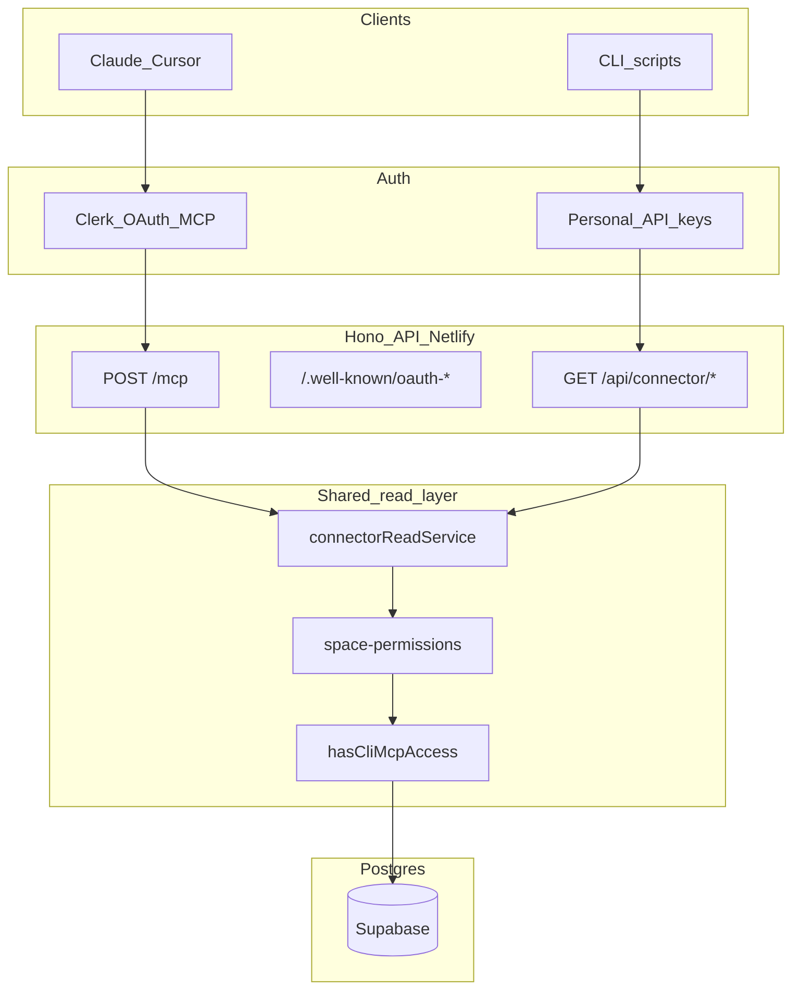

# Harvous Connector — Boundaries

Canonical spec for the **Connector** paid add-on: what it does, what it refuses, and what belongs to
a different product. Complements [MONETIZATION_AND_PRICING.md](./MONETIZATION_AND_PRICING.md) Section 4
(pricing/SKU) and [HARVOUS_SDK_AND_FUTURE_ROADMAP.md](./HARVOUS_SDK_AND_FUTURE_ROADMAP.md) (inbound SDK
vs outbound Connector).

**Status:** Decision doc; **not implemented** in code yet.

---

## Product identity

| Layer | Name |
|---|---|
| In-app SKU | **Connector** |
| Claude Connectors Directory | **Harvous** |
| Docs / npm | **Harvous Connector** (`@harvous/connector` or `@harvous/cli`) |
| Entitlement (internal) | `hasCliMcpAccess` (may alias `hasConnector` later) |
| Positioning | *Reference your Harvous study wherever you already work.* |

**Not Connector:** inbound partner SDK (YouVersion → Harvous), account export, Review AI, Group Sharing
admin/roster APIs.

---

## Guardrails (decided)

### Access and data scope

| Topic | Decision |
|---|---|
| **Shared spaces** | **Member-view parity** — all non-locked notes in spaces you belong to, including other members' notes (same as [SHARED_SPACES_DEV_NOTES.md](../SHARED_SPACES_DEV_NOTES.md) member view). Others' locked notes: **excluded**. |
| **My Home / unorganized notes** | **Search spans all notes you own**; list tools remain **space-scoped** only. |
| **Individual share links** | **Not** in default browse. Optional tool: `get_shared_note(shareToken)` — explicit token required. |
| **Deleted / trashed notes** | **Excluded** — same as normal app views. |
| **Inbox, Remember, Review** | **Not exposed** — no inbox items, recall state, review scheduling, or quiz content. |
| **Resource cards, VOTD, dictionary** | **Notes and threads only** — no resource cards or non-note content types. |
| **Study threads** | **Full study threads in v1** — connections between notes, thread titles, linked note IDs (mirror app). |
| **Member roster** | **No** — no names, emails, or roles of other space members via Connector. |
| **Scripture in responses** | **References only** (book/chapter/verse as stored) — **no** resolved verse text from Bible DB. |
| **Note content shape** | **Full body** on `get_note` (title, content, scripture refs, metadata) — client handles context limits. |

### Locked notes

| Case | Behavior |
|---|---|
| **Your locked note** | Return **metadata only** (id, title, dates, `locked: true`) — **no body**, not `isError`. Include message: unlock in Harvous to read content. |
| **Others' locked notes in shared space** | **Not returned** (same as member view — excluded from queries/lists). |

See [LOCKED_NOTES_ENCRYPTION.md](../LOCKED_NOTES_ENCRYPTION.md).

### Paywall, keys, and audit

| Topic | Decision |
|---|---|
| **Paywall** | **Hard paywall** — `hasCliMcpAccess` required before any MCP/CLI read; no free tier or trial in v1. |
| **API keys** | **1 active key** per subscriber (revoke + re-issue to rotate). |
| **OAuth consent** | **Minimal Clerk** — standard profile scopes; Connector entitlement checked server-side after auth (no custom `connector:read` scope in v1). |
| **Audit** | **Basic** — last-used timestamp per key + optional "recent Connector activity" on account page (not per-note access log). |

### Rate limits and anti-migration

| Topic | Decision |
|---|---|
| **Pagination / scraping** | **Industry-standard:** paginated list/search allowed, max page size **25–50**, daily + burst rate limits (~**1,000/day**, ~**60/min** — finalize before launch), **no export endpoint**. No special anti-crawl beyond caps. |
| **Writes** | **Never** — Connector stays **read-only permanently**. Creates/edits stay in the Harvous app (and deferred inbound SDK for partner writes). |

### Discovery and launch

| Topic | Decision |
|---|---|
| **Claude Directory** | **BYO URL at launch**; list in Connectors Directory once stable. |
| **MCP Apps (interactive UI)** | **Future (v1.5)** — v1 is text/structured tool results only. |

---

## Architecture

| Question | Decision |
|---|---|
| Where does MCP live? | **Same Hono API** as today (`POST /mcp`, not SPA). Netlify function bundles deps per [AGENTS.md](../../AGENTS.md). |
| Where does CLI live? | **Separate npm package**; HTTP to `/api/connector/*`, not embedded in Netlify. |
| Service layer | **New** `connectorReadService` — see [Read service sketch](#read-service-sketch) below. |
| CSRF | Exempt `/mcp`, `/api/connector/*` (Bearer-only), `/.well-known/*` (public). |

---

## MCP implementation principles

Aligned with production MCP guidance (stateless transport, schema-as-validator, OAuth, shared service
layer). Reference: Dotflowy teardown / MCP 2026-07-28 RC direction.

### 1. Stateless — no sessions, ever

- Every `POST /mcp` request is fully self-contained; no `Mcp-Session-Id`, no in-memory session store.
- Matches serverless Netlify deploy ([server/netlify.ts](../../server/netlify.ts)); instances are not sticky.
- Do not use stateful MCP mode from older SDK examples.

### 2. Schema is the validator

- Define each tool's input once (Zod); derive published JSON Schema in `tools/list` and validate
  `tools/call` from the same object (`McpServer.tool(name, schema, handler)`).
- Do not hand-maintain published schemas separately from handlers.

### 3. Two failure classes

| Situation | Response |
|---|---|
| Bad JSON, unknown method, malformed params | JSON-RPC protocol error |
| Business refusal (no access, rate limit, not subscribed, invalid token) | Normal tool result with `isError: true` + readable text |

**Harvous refusals (always `isError`, never HTTP 500):**

- User lacks space membership → *"You don't have access to that space."*
- No Connector subscription → *"Connector subscription required."*
- Rate limit hit → *"Daily limit reached. Resets at …"*
- Invalid / expired share token → *"Share link not found or expired."*

**Not `isError` — normal result with partial data:**

- Your locked note on `get_note` → metadata only + `locked: true` (no body)

### 4. Auth — hybrid

| Surface | Auth | Rationale |
|---|---|---|
| **MCP** (`POST /mcp`) | **Clerk OAuth 2.1** (`@clerk/mcp-tools` patterns) | Claude/Cursor require discovery + OAuth |
| **CLI / scripts** | **Personal API key** (Bearer) | Non-interactive; maps to same `userId` |
| **Both** | Gate on `hasCliMcpAccess` before any read | Paid add-on boundary |

**Do not:** cookie/session auth on `/mcp`; team/shared keys in v1; a second identity system (keys and
OAuth both resolve to Clerk `userId`).

### 5. Agent-native — reuse read path, read-only forever

- Tools call **`connectorReadService`**, not raw Drizzle and not parallel DB logic.
- **No write tools, ever** — [redesign-exploration.md](./redesign-exploration.md) write-MCP ideas are
  superseded by this doc.

---

## Auth and entitlements

### `hasCliMcpAccess`

Gates **all** Connector surfaces before any data read:

1. **MCP** — after Clerk OAuth bearer verification on `POST /mcp`
2. **CLI / REST** — after API key middleware on `/api/connector/*`
3. **Key issuance** — account UI only when flag is true (Stripe/Clerk Connector plan active)

Stored in Clerk `public_metadata` and/or Postgres when Review/Connector entitlements ship; today
**conceptual only** (see [MONETIZATION_AND_PRICING.md](./MONETIZATION_AND_PRICING.md) §6).

### `ConnectorApiKeys` (planned schema)

| Column | Type | Notes |
|---|---|---|
| `id` | text PK | e.g. `connector_key_{uuid}` |
| `userId` | text FK | Clerk user id |
| `keyHash` | text | Hash of secret; never store plaintext after creation |
| `keyPrefix` | text | First 8 chars for display ("…abc123") |
| `createdAt` | timestamp | |
| `lastUsedAt` | timestamp | Updated on successful auth (basic audit) |
| `revokedAt` | timestamp nullable | Set on revoke; null = active |

**Rules:**

- **1 active key** per user (`revokedAt IS NULL` count ≤ 1).
- Issue flow: generate secret once → show to user once → store hash only.
- Rotate: revoke current → issue new.
- Middleware: `Authorization: Bearer hvous_…` → lookup hash → `userId` → `hasCliMcpAccess` → attach auth context.

### OAuth and `.well-known` routes

Host on **Hono API** ([server/app.ts](../../server/app.ts)), not SPA:

| Route | Auth | Purpose |
|---|---|---|
| `POST /mcp` | Clerk OAuth bearer (`mcpAuthClerk` or Hono equivalent) | MCP Streamable HTTP |
| `GET /.well-known/oauth-protected-resource/mcp` | **Public** — no auth middleware | RFC 9728 protected resource metadata |
| `GET /.well-known/oauth-authorization-server` | **Public** | Clerk authorization server metadata |

**Requirements:**

- Discovery routes must be **publicly accessible** — do not wrap in `requireAuth` or CSRF.
- Use **path-suffixed** protected-resource URL (`/mcp`), not root-only — RFC 9728 clients probe the suffixed variant first.
- Exempt `/mcp` and `/.well-known/*` from CSRF ([server/middleware/csrf.ts](../../server/middleware/csrf.ts)).
- `@clerk/mcp-tools` ships Express adapters today; on Hono use `@hono/mcp` + Clerk bearer verification or verify current Clerk MCP docs before shipping.

---

## v1 MCP tool catalog (read-only)

Seven tools — scoped per guardrails above:

| Tool | Parameters | Notes |
|---|---|---|
| `search_notes` | `query` (required), optional `spaceId`, `limit` (max 50), `cursor` | All **owned** notes incl. My Home |
| `get_note` | `noteId` | Full body; metadata-only if your note is locked |
| `list_spaces` | `cursor` | Owned + joined spaces |
| `list_threads_in_space` | `spaceId`, `cursor` | Member-view parity |
| `list_notes_in_space` | `spaceId`, `cursor` | Member-view parity; excludes others' locked notes |
| `list_study_thread_connections` | `noteId` **or** `spaceId` | Study-thread graph |
| `get_shared_note` | `shareToken` (required) | Explicit share-link lookup only |

Optional later: `get_thread` by id if agents need it.

Each tool: Zod schema → handler → `connectorReadService` → `requireSpaceAccess` where applicable.

---

## Does / does not matrix

### Connector DOES (v1)

| Capability | Shape |
|---|---|
| Get note by ID | Full body; your locked notes → metadata only |
| Search notes | Query + pagination; owned notes incl. My Home |
| List threads / notes in space | Paginated; member-view parity; max page 25–50 |
| Study thread connections | Full graph in v1 |
| Get note by share token | Explicit token only |
| List spaces | Owned + joined |
| MCP transport | Stateless Streamable HTTP at `/mcp`; OAuth |
| CLI | npm binary → `/api/connector/*`; API key |
| Rate limits | Per-user counter on account page |
| OAuth discovery | Public `.well-known` routes |

### Connector DOES NOT

| Excluded | Where instead |
|---|---|
| Create / edit / delete notes | Harvous app; inbound SDK (partners) |
| Bulk export / dump corpus | `GET /api/user/export` (session auth) |
| Review / AI quiz | Review SKU (`hasReview`) |
| Inbound partner writes | Deferred Harvous SDK |
| Team / shared API keys | Individual add-on only |
| Locked note plaintext | Metadata only (yours); hidden (others') |
| Inbox, recall, Review state | App / Review only |
| Resolved scripture text | Bible reader apps |
| Member roster / PII | Group Sharing UI |
| Resource cards, VOTD, dictionary | Out of scope |
| MCP Apps (interactive UI) | v1.5 |
| Stateful MCP sessions | Never |
| Roots, Sampling, deprecated MCP features | Skip |

### Query-shaped rule (retention boundary)

Every read requires **at least one scoping parameter** — never "give me everything."

| Allowed | Not allowed |
|---|---|
| `get_note(id)` | `list_all_notes()` |
| `search_notes(q, limit, cursor)` | `export_account()` |
| `list_notes_in_space(spaceId, cursor)` with max page size | Unbounded page size |
| `get_shared_note(shareToken)` | Browsing or listing by share token |

---

## Read service sketch

New module: `server/connector/connector-read-service.ts` (or `server/utils/connector-read-service.ts`).
Both MCP tools and `GET /api/connector/*` call these functions — **no duplicate query logic**.

| Service function | Mirrors | Key dependencies |
|---|---|---|
| `searchNotesForConnector(userId, query, opts)` | [server/routes/search.ts](../../server/routes/search.ts) | `MIN_SEARCH_QUERY_LENGTH`; owned notes only; optional `spaceId`; exclude deleted; scripture refs in content, not resolved text |
| `getNoteForConnector(userId, noteId)` | Note details paths in [server/routes/notes.ts](../../server/routes/notes.ts) | Owner OR member-view access via space; locked: metadata-only if yours, 404/hidden if others'; `contentEncrypted` check |
| `listSpacesForConnector(userId, cursor)` | [server/routes/spaces.ts](../../server/routes/spaces.ts), dashboard helpers | Owned + member spaces; no roster |
| `listThreadsInSpaceForConnector(userId, spaceId, cursor)` | Space thread queries in [server/utils/dashboard-data.ts](../../server/utils/dashboard-data.ts) | [requireSpaceAccess](../../server/utils/space-permissions.ts); member vs owner paths |
| `listNotesInSpaceForConnector(userId, spaceId, cursor)` | `getNotesForSpaceForMember` / owner equivalents in dashboard-data | Exclude `contentEncrypted: true` for non-owner notes; member-view parity |
| `listStudyThreadConnectionsForConnector(userId, opts)` | [server/routes/study-threads.ts](../../server/routes/study-threads.ts), [server/utils/study-thread-cluster-naming.ts](../../server/utils/study-thread-cluster-naming.ts) | Scope by `noteId` or `spaceId`; respect same visibility as note reads |
| `getSharedNoteForConnector(userId, shareToken)` | [server/routes/shared.ts](../../server/routes/shared.ts) share-token resolution | Explicit token; readable if token valid (may not require space membership) |

**Every function:** filter by authenticated `userId`; call `requireSpaceAccess` where space-scoped; check
`hasCliMcpAccess` at route/MCP handler layer before invoking service.

---

## Future phases

| Phase | Adds |
|---|---|
| **v1** | Read tools + CLI + OAuth + 1 API key |
| **v1.5** | MCP Apps (interactive Connector in Claude) + Connectors Directory listing; still read-only |
| **Inbound SDK** | Partner apps → Harvous; separate OAuth app registry — **not** Connector |

---

## Implementation checklist

- [ ] `/mcp` + `/.well-known/*` on Hono API, not SPA
- [ ] Stateless MCP only
- [ ] Clerk OAuth gates MCP; API keys gate CLI; both check `hasCliMcpAccess`
- [ ] Zod schema = published contract = validator
- [ ] Tools call `connectorReadService`, not raw Drizzle
- [ ] Every tool scopes to authenticated `userId`
- [ ] Business refusals → `isError: true`; protocol errors → JSON-RPC codes
- [ ] No write tools, no bulk export, no locked-note plaintext
- [ ] `.well-known` routes public and path-suffixed (`/mcp`)

---

## Related docs

- [MONETIZATION_AND_PRICING.md](./MONETIZATION_AND_PRICING.md) — Connector SKU and pricing
- [HARVOUS_SDK_AND_FUTURE_ROADMAP.md](./HARVOUS_SDK_AND_FUTURE_ROADMAP.md) — inbound SDK vs outbound Connector
- [SHARED_SPACES_DEV_NOTES.md](../SHARED_SPACES_DEV_NOTES.md) — member-view visibility rules
- [LOCKED_NOTES_ENCRYPTION.md](../LOCKED_NOTES_ENCRYPTION.md) — locked note behavior
- [ADDED_BY_FIELD_DESIGN.md](../ADDED_BY_FIELD_DESIGN.md) — future inbound MCP attribution (not Connector reads)
