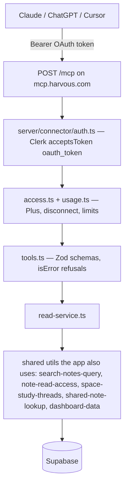

# Harvous Connector — Boundaries

Canonical spec for the **Connector**, part of Harvous Plus: what it does, what it refuses, and what
belongs to a different product. Complements [MONETIZATION_AND_PRICING.md](./MONETIZATION_AND_PRICING.md)
Section 4 and [HARVOUS_SDK_AND_FUTURE_ROADMAP.md](./HARVOUS_SDK_AND_FUTURE_ROADMAP.md) (inbound SDK vs
outbound Connector).

**Status (October 2026):** **v1 built** in `server/connector/` — MCP + Clerk OAuth, the seven read
tools below, limits, and Settings › Claude & ChatGPT. Shipped **withheld** (`WITHHELD_FEATURES`)
behind a preview allowlist (`CONNECTOR_PREVIEW_USER_IDS`). Personal API keys, `/api/connector/*`
REST and the CLI are **deferred** until someone asks. Folded into Plus rather than sold as the
$5/mo add-on this doc originally assumed; where the text below says "subscription", read "Plus".

### Going live — what is not code

1. Clerk (dev and live): OAuth applications → Settings → Client onboarding → turn on **Publish CIMD
   support** with admission "Any compatible CIMD client" (Client ID Metadata Documents: the app's
   client id is a URL Clerk reads, replacing `/register`), and DCR too for older clients. Done
   2026-10-01; both instances then advertised `client_id_metadata_document_supported: true`.
2. DNS `mcp.harvous.com` CNAME → `harvous.fly.dev` (grey cloud), then `fly certs add mcp.harvous.com`.
3. Fly secrets: `CLERK_PUBLISHABLE_KEY` (the server previously read only the secret key),
   `CONNECTOR_RESOURCE_URL=https://mcp.harvous.com/mcp`, `CONNECTOR_PREVIEW_USER_IDS`.
4. `npm run connector:schema:apply -- --production` (two additive tables), before the deploy.
5. `npm run entitlement:backfill -- connector --from review` (dry run, then `--apply`) so admin-granted
   Plus holds the key too; billing subscribers also self-heal on first use.
6. Archive the two never-sold Connector products in Polar; unset `POLAR_CONNECTOR_PRODUCT_*`.
7. Launch = delete `'connector'` from `WITHHELD_FEATURES` (a `feat:` commit).

---

## Product identity

| Layer | Name |
|---|---|
| In-app page | **Claude & ChatGPT** (Settings) |
| Internal name | **Connector** (`server/connector/`) |
| Claude Connectors Directory | **Harvous** |
| URL | `https://mcp.harvous.com/mcp` |
| Entitlement | feature key `connector`, granted by Plus (`hasConnectorAccess`, server/connector/access.ts) |
| Positioning | *Use your study in Claude, ChatGPT, and other AI apps.* |

**Not Connector:** inbound partner SDK (YouVersion → Harvous), account export, Review AI, Group Sharing
admin/roster APIs.

---

## Guardrails (decided)

### Access and data scope

| Topic | Decision |
|---|---|
| **Shared spaces** | **Member-view parity** — all non-locked notes in spaces you belong to, including other members' notes (same as [SHARED_SPACES_DEV_NOTES.md](../SHARED_SPACES_DEV_NOTES.md) member view). Others' locked notes: **excluded**. |
| **My Home / unorganized notes** | **Search spans all notes you own**; list tools remain **space-scoped** only. |
| **Individual share links** | **Not** in default browse. Optional tool: `get_shared_note(shareToken)` — explicit token required. |
| **Deleted / trashed notes** | **Excluded** — same as normal app views. |
| **Inbox, Remember, Review** | **Not exposed** — no inbox items, recall state, review scheduling, or quiz content. |
| **Resource cards, VOTD, dictionary** | **Notes and threads only** — no resource cards or non-note content types. |
| **Study threads** | **Full study threads in v1** — connections between notes, thread titles, linked note IDs (mirror app). |
| **Member roster** | **No** — no names, emails, or roles of other space members via Connector. |
| **Scripture in responses** | **References only** (book/chapter/verse as stored) — **no** resolved verse text from Bible DB. |
| **Note content shape** | **Full body** on `get_note` (title, content, scripture refs, metadata) — client handles context limits. |

### Locked notes

| Case | Behavior |
|---|---|
| **Your locked note** | Return **metadata only** (id, title, dates, `locked: true`) — **no body**, not `isError`. Include message: unlock in Harvous to read content. |
| **Others' locked notes in shared space** | **Not returned** (same as member view — excluded from queries/lists). |

See [LOCKED_NOTES_ENCRYPTION.md](../LOCKED_NOTES_ENCRYPTION.md).

### Paywall, keys, and audit

| Topic | Decision |
|---|---|
| **Paywall** | **Plus** — `connector` required before any read. `initialize`/`tools/list` succeed for anyone signed in, so a non-subscriber sees the upgrade message inside their assistant as an `isError` tool result. |
| **API keys** | **Deferred** (v1 is OAuth only). When built: 1 active key per person. |
| **OAuth consent** | **Minimal Clerk** — standard profile scopes; entitlement checked server-side after auth (no custom `connector:read` scope). |
| **Audit** | **Basic** — `ConnectorClients` (each app's name, first/last use, Harvous-side Disconnect) and `ConnectorUsageDays` (calls per day). No per-note access log. |

### Rate limits and anti-migration

| Topic | Decision |
|---|---|
| **Pagination / scraping** | Paginated list/search, max page **25** (50 for `list_spaces`), cursors stop at offset **1,000**; **1,000 tool calls/day**, **60/min**; **no export endpoint**. Numbers live in `server/connector/config.ts`. |
| **Writes** | **Never** — Connector stays **read-only permanently**. Creates/edits stay in the Harvous app (and deferred inbound SDK for partner writes). |

### Discovery and launch

| Topic | Decision |
|---|---|
| **Claude Directory** | **BYO URL at launch**; list in Connectors Directory once stable. |
| **MCP Apps (interactive UI)** | **Future (v1.5)** — v1 is text/structured tool results only. |

---

## Architecture (as built)

```mermaid
flowchart TB
  Clients[Claude / ChatGPT / Cursor] -->|Bearer OAuth token| MCP["POST /mcp on mcp.harvous.com"]
  MCP --> Auth[server/connector/auth.ts — Clerk acceptsToken oauth_token]
  Auth --> Gate[access.ts + usage.ts — Plus, disconnect, limits]
  Gate --> Tools[tools.ts — Zod schemas, isError refusals]
  Tools --> Read[read-service.ts]
  Read --> Shared[shared utils the app also uses: search-notes-query, note-read-access, space-study-threads, shared-note-lookup, dashboard-data]
  Shared --> DB[(Supabase)]
```

| Question | Decision |
|---|---|
| Where does MCP live? | **Same Hono API on Fly**, mounted **outside `/api/*`** (`server/connector/mcp-route.ts`), so `clerkAuth`, CSRF and the default cache header never run on it. |
| Which host? | **`mcp.harvous.com`**, DNS straight to Fly. The Cloudflare Worker fronts only `app.harvous.com` and forwards only `/api/*`; MCP needs root `/.well-known/` paths, gains nothing from the Worker, and would inherit its 20s timeout and a billed invocation per call. |
| Session isolation | `clerkAuth` refuses OAuth tokens (machine-token shape check + `client_id` claim), so a Connector token can never act as a full session on `/api/*`; the Connector refuses session tokens. |
| Service layer | `connectorReadService` (`server/connector/read-service.ts`) — reuses the app's own queries, several of them extracted from routes for exactly this. |
| CLI | Deferred. |

---

## MCP implementation principles

Aligned with production MCP guidance (stateless transport, schema-as-validator, OAuth, shared service
layer). Reference: Dotflowy teardown / MCP 2026-07-28 RC direction.

### 1. Stateless — no sessions, ever

- Every `POST /mcp` request is fully self-contained; no `Mcp-Session-Id`, no in-memory session store.
- A fresh `McpServer` + transport per request (`sessionIdGenerator: undefined`), JSON responses
  (`enableJsonResponse: true`) — every tool is a short read, and SSE through `@hono/node-server`
  has known HTTP/2 problems (modelcontextprotocol/typescript-sdk#1619).
- Do not use stateful MCP mode from older SDK examples.

### 2. Schema is the validator

- Define each tool's input once (Zod); derive published JSON Schema in `tools/list` and validate
  `tools/call` from the same object (`McpServer.tool(name, schema, handler)`).
- Do not hand-maintain published schemas separately from handlers.

### 3. Two failure classes

| Situation | Response |
|---|---|
| Bad JSON, unknown method, malformed params | JSON-RPC protocol error |
| Business refusal (no access, rate limit, not subscribed, invalid token) | Normal tool result with `isError: true` + readable text |

**Harvous refusals (always `isError`, never HTTP 500):**

- User lacks space membership → *"You don't have access to that space."*
- No Connector subscription → *"Connector subscription required."*
- Rate limit hit → *"Daily limit reached. Resets at …"*
- Invalid / expired share token → *"Share link not found or expired."*

**Not `isError` — normal result with partial data:**

- Your locked note on `get_note` → metadata only + `locked: true` (no body)

### 4. Auth — hybrid

| Surface | Auth | Rationale |
|---|---|---|
| **MCP** (`POST /mcp`) | **Clerk OAuth 2.1** — `authenticateRequest(req, { acceptsToken: 'oauth_token' })`, audience checked when the token names one | Claude/ChatGPT/Cursor require discovery + OAuth |
| **CLI / scripts** | Deferred — personal API key when built | Non-interactive; maps to same `userId` |
| **Both** | Gate on `connector` before any read | Plus boundary |

**Do not:** cookie/session auth on `/mcp`; team/shared keys in v1; a second identity system (keys and
OAuth both resolve to Clerk `userId`).

### 5. Agent-native — reuse read path, read-only forever

- Tools call **`connectorReadService`**, not raw Drizzle and not parallel DB logic.
- **No write tools, ever** — [redesign-exploration.md](./redesign-exploration.md) write-MCP ideas are
  superseded by this doc.

---

## Auth and entitlements

### Access: the `connector` feature key

Granted by Plus. `hasConnectorAccess(userId)` (server/connector/access.ts) is
`hasFeatureWithReconcile(…, 'connector')` once launched; while withheld, only accounts in
`CONNECTOR_PREVIEW_USER_IDS` that also hold the key. Checked lazily on the first `tools/call` of a
request, never on `initialize` / `tools/list`.

### Disconnect

Clerk exposes no API to list or revoke a user's OAuth grants, so **Disconnect** in Settings is
Harvous's own per-app block (`ConnectorClients.revokedAt`): the app keeps its token and every tool
call returns a readable `isError` telling the person where to allow it again. Not a 401 — that would
send clients into a re-auth loop.

### OAuth and `.well-known` routes

Host on **Hono API** ([server/app.ts](../../server/app.ts)), not SPA:

| Route | Auth | Purpose |
|---|---|---|
| `POST /mcp` | Clerk OAuth bearer | MCP Streamable HTTP (stateless, JSON) |
| `GET`/`DELETE /mcp` | — | 405 (no sessions, no standalone stream) |
| `GET /.well-known/oauth-protected-resource/mcp` | **Public** — no auth middleware | RFC 9728 protected resource metadata |
| `GET /.well-known/oauth-authorization-server` | **Public** | Clerk authorization server metadata |

**Requirements:**

- Discovery routes must be **publicly accessible** — do not wrap in `requireAuth` or CSRF.
- Use **path-suffixed** protected-resource URL (`/mcp`), not root-only — RFC 9728 clients probe the suffixed variant first.
- Mounted outside `/api/*`, so CSRF never runs on it — no exemption list needed.
- `@clerk/mcp-tools` was not used: its helpers are a few lines (reimplemented in
  `server/connector/oauth-metadata.ts`) and the published verifier predates audience binding.

---

## MCP tool catalog (read-only)

Eight tools — scoped per guardrails above:

| Tool | Parameters | Notes |
|---|---|---|
| `search_notes` | `query` (required), optional `spaceId`, `limit` (max 50), `cursor` | All **owned** notes incl. My Home |
| `get_note` | `noteId` | Full body; metadata-only if your note is locked |
| `list_spaces` | `cursor` | Owned + joined spaces |
| `list_threads_in_space` | `spaceId`, `cursor` | Member-view parity |
| `list_notes_in_space` | `spaceId`, `cursor` | Member-view parity; excludes others' locked notes |
| `list_study_thread_connections` | `noteId` **or** `spaceId` | Study-thread graph |
| `get_shared_note` | `shareToken` (required) | Explicit share-link lookup only |
| `find_by_passage` | `passage` (required), `limit`, `cursor` | Added in v1.1. Your notes citing an overlapping passage (`findNotesCitingReference`, the query behind `/api/notes/by-reference`), plus your Bible-reader highlights on it. **Highlights carry the reference, translation and your own words only** — never `scripturePassageExcerpt`, `sourceSnippet` or `anchorQuote`, which can hold Bible text. Owner-only. |

Optional later: `get_thread` by id if agents need it.

### Prompts (v1.1)

Four ready-made prompts appear in the assistant's "+" menu (`server/connector/prompts.ts`):
`study_passage`, `prepare_for_group`, `recent_study`, `trace_theme`. They are only text — no Plus
check, no call against the daily limit; the tools they lead to stay gated. Every prompt carries one
stance: start from what the person wrote and quote it, say whose words are whose, don't present the
assistant's reading as theirs, say so when notes are thin rather than filling the gap, and point back
to the passage. Copy reviewed with `/theologian-agent` (Oct 2026); re-review if it changes.

Each tool: Zod schema → `beforeCall` (disconnect, access, per-minute + daily limits) →
`connectorReadService` → `requireSpaceAccess` where applicable. All annotated `readOnlyHint: true`.
`server/connector/__tests__/tools-contract.test.ts` fails if a tool appears without it, if the module
imports a side-effect writer, or if it reads Bible verse text.

---

## Does / does not matrix

### Connector DOES (v1)

| Capability | Shape |
|---|---|
| Get note by ID | Full body; your locked notes → metadata only |
| Search notes | Query + pagination; owned notes incl. My Home |
| List threads / notes in space | Paginated; member-view parity; max page 25–50 |
| Study thread connections | Full graph in v1 |
| Get note by share token | Explicit token only |
| List spaces | Owned + joined |
| MCP transport | Stateless Streamable HTTP at `/mcp`; OAuth |
| CLI | Deferred |
| Rate limits | Per-user counter on account page |
| OAuth discovery | Public `.well-known` routes |

### Connector DOES NOT

| Excluded | Where instead |
|---|---|
| Create / edit / delete notes | Harvous app; inbound SDK (partners) |
| Bulk export / dump corpus | `GET /api/user/export` (session auth) |
| Review / AI quiz | Review SKU (`hasReview`) |
| Inbound partner writes | Deferred Harvous SDK |
| Team / shared API keys | Individual add-on only |
| Locked note plaintext | Metadata only (yours); hidden (others') |
| Inbox, recall, Review state | App / Review only |
| Resolved scripture text | Bible reader apps |
| Member roster / PII | Group Sharing UI |
| Resource cards, VOTD, dictionary | Out of scope |
| MCP Apps (interactive UI) | v1.5 |
| Stateful MCP sessions | Never |
| Roots, Sampling, deprecated MCP features | Skip |

### Query-shaped rule (retention boundary)

Every read requires **at least one scoping parameter** — never "give me everything."

| Allowed | Not allowed |
|---|---|
| `get_note(id)` | `list_all_notes()` |
| `search_notes(q, limit, cursor)` | `export_account()` |
| `list_notes_in_space(spaceId, cursor)` with max page size | Unbounded page size |
| `get_shared_note(shareToken)` | Browsing or listing by share token |

---

## Read service sketch

Built as `server/connector/read-service.ts`.
Both MCP tools and `GET /api/connector/*` call these functions — **no duplicate query logic**.

| Service function | Mirrors | Key dependencies |
|---|---|---|
| `searchNotesForConnector(userId, query, opts)` | [server/routes/search.ts](../../server/routes/search.ts) | `MIN_SEARCH_QUERY_LENGTH`; owned notes only; optional `spaceId`; exclude deleted; scripture refs in content, not resolved text |
| `getNoteForConnector(userId, noteId)` | Note details paths in [server/routes/notes.ts](../../server/routes/notes.ts) | Owner OR member-view access via space; locked: metadata-only if yours, 404/hidden if others'; `contentEncrypted` check |
| `listSpacesForConnector(userId, cursor)` | [server/routes/spaces.ts](../../server/routes/spaces.ts), dashboard helpers | Owned + member spaces; no roster |
| `listThreadsInSpaceForConnector(userId, spaceId, cursor)` | Space thread queries in [server/utils/dashboard-data.ts](../../server/utils/dashboard-data.ts) | [requireSpaceAccess](../../server/utils/space-access.ts); member vs owner paths |
| `listNotesInSpaceForConnector(userId, spaceId, cursor)` | `getNotesForSpaceForMember` / owner equivalents in dashboard-data | Exclude `contentEncrypted: true` for non-owner notes; member-view parity |
| `listStudyThreadConnectionsForConnector(userId, opts)` | [server/routes/study-threads.ts](../../server/routes/study-threads.ts), [server/utils/study-thread-cluster-naming.ts](../../server/utils/study-thread-cluster-naming.ts) | Scope by `noteId` or `spaceId`; respect same visibility as note reads |
| `getSharedNoteForConnector(userId, shareToken)` | [server/routes/shared.ts](../../server/routes/shared.ts) share-token resolution | Explicit token; readable if token valid (may not require space membership) |

**Every function:** filter by authenticated `userId`; call `requireSpaceAccess` where space-scoped; check
`connector` access in `beforeCall` (server/connector/mcp-route.ts) before invoking service.

---

## Future phases

| Phase | Adds |
|---|---|
| **v1** | Read tools + OAuth + Settings page (built, withheld) |
| **v1.1** | `find_by_passage` + prompts (built) |
| **Next** | `search`/`fetch` aliases for ChatGPT deep research; a recent-study tool; search across shared spaces; API keys + CLI if asked for |
| **v1.5** | MCP Apps (interactive Connector in Claude) + Connectors Directory listing; still read-only |
| **Inbound SDK** | Partner apps → Harvous; separate OAuth app registry — **not** Connector |

---

## Implementation checklist

- [x] `/mcp` + `/.well-known/*` on the Hono API, outside `/api/*`
- [x] Stateless MCP only
- [x] Clerk OAuth gates MCP and checks `connector` (API keys deferred)
- [x] Zod schema = published contract = validator
- [x] Tools call `connectorReadService`, not raw Drizzle
- [x] Every tool scopes to authenticated `userId`
- [x] Business refusals → `isError: true`; protocol errors → JSON-RPC codes
- [x] No write tools, no bulk export, no locked-note plaintext
- [x] `.well-known` routes public and path-suffixed (`/mcp`)
- [x] Clerk CIMD on (dev + live)
- [ ] DNS, Fly secrets, schema, backfill (see *Going live*)
- [ ] Dogfood in production, then remove `connector` from `WITHHELD_FEATURES`

---

## Related docs

- [MONETIZATION_AND_PRICING.md](./MONETIZATION_AND_PRICING.md) — Connector SKU and pricing
- [HARVOUS_SDK_AND_FUTURE_ROADMAP.md](./HARVOUS_SDK_AND_FUTURE_ROADMAP.md) — inbound SDK vs outbound Connector
- [SHARED_SPACES_DEV_NOTES.md](../SHARED_SPACES_DEV_NOTES.md) — member-view visibility rules
- [LOCKED_NOTES_ENCRYPTION.md](../LOCKED_NOTES_ENCRYPTION.md) — locked note behavior
- [ADDED_BY_FIELD_DESIGN.md](../ADDED_BY_FIELD_DESIGN.md) — future inbound MCP attribution (not Connector reads)
