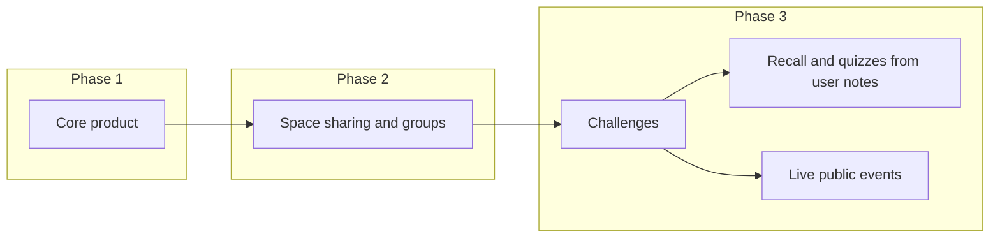

# Harvous SDK and Future Roadmap

This document captures the **SDK vision** for Harvous (and why it is deferred) and the **planned core product roadmap** (space sharing, groups, learning features). It is intended to keep future work aligned with product direction and anti-patterns.

---

## 1. Purpose and audience

This doc records:

- **Harvous SDK:** The idea of an SDK that would let other faith-based apps send content into Harvous (e.g. YouVersion highlight → scripture note), why it is inspired by the OpenAI Apps SDK approach, how it differs from share sheet/MCP, and why the team is focusing on core product first and deferring the SDK.
- **Future core features:** Space sharing and groups, then learning (recall/quizzes from notes, challenges as curated study guide + Duolingo-style quiz, live public events), with a clear sequence and principles so Harvous stays "my one place for Bible study notes" and does not become a dumping ground or feel fragmented.

Audience: product, engineering, and future contributors deciding what to build next.

---

## 2. Harvous SDK: idea and why

### Inspiration

The vision is inspired by **OpenAI's Apps SDK** approach (connect your data, trigger actions, interactive UI inside ChatGPT) rather than "just" MCP or generic connectors. The goal is a **user-friendly, productized** integration story: other apps can send content into Harvous with clear attribution, consent, and optional "open back in [App]" so Harvous feels like the hub that ties faith apps together.

### Mission

**"Keep your Bible app, just add Harvous."** Harvous is the **notes layer** for people who already have a Bible app they love. It is the place to store and organize study data and to understand and use it (e.g. learning features, challenges).

### Problem

Faith-based apps rarely talk to each other. Users end up with notes and highlights scattered across multiple apps. An SDK could let **other apps send content into Harvous** in a structured way (e.g. YouVersion highlight → scripture note in Harvous) so that:

- Developers of other apps do not have to build a full notes experience; they can offer "Save to Harvous" or "Sync highlights to Harvous."
- Users centralize their study in Harvous and effectively build their **own study Bible** from multiple sources.

### What a Harvous SDK could provide

- **Connect your data:** Other apps → Harvous with structured payloads (e.g. scripture note with reference, translation, text; resource note with URL and metadata). Not just "create note with title and body."
- **Trigger actions:** e.g. "Save to Harvous," "Open in Harvous" deep links, optional "Create thread for this plan."
- **Interactive UI in Harvous:** "From [App]" cards, "Open back in [App]" links, optional app registry so Harvous can show attribution and deep link back.

### Contrast with other approaches

| Approach | What it does | Tradeoff |
|----------|--------------|----------|
| **Share sheet + browser extension** (e.g. MyMind) | User shares from any app or page into Harvous. Maximizes "save from anywhere." | Risk of **generic dump**: URL, title, snippet. No structured "from [App]" unless parsed. Good for breadth; not the primary bet if the goal is to avoid making Harvous a dumping ground. |
| **MCP / API only** | Expose "create note," "create thread," etc. Enables structured integration. | No standard UX; each partner builds their own button, auth, errors. **SDK = same capabilities plus product layer** (auth, app registry, optional "Save to Harvous" component, deep links). |
| **Harvous SDK** (deferred) | API + OAuth + app registry + optional UI components + "from [App]" / "open back in [App]." | Consistent UX and attribution when partners do integrate; deferred until core product and learning are strong. |

### Current decision

- **Focus on core product first:** Spaces, space sharing, groups, then learning (challenges, recall/quizzes, live events). See [Future core features (planned)](#3-future-core-features-planned) below.
- **Prefer intentional, typed integrations:** e.g. YouVersion highlight → **scripture note** in Harvous (structured, not generic "save link"). If/when the SDK or partner integrations are built, they should create the **right note types** (scripture, resource, etc.) with clear attribution.
- **SDK is deferred** until core and learning feel right. The **data model** should already support (or be extended for) source attribution and "open back in [App]" (e.g. `Notes.addedBy`, `ResourceMetadata`, `ScriptureMetadata`) so that when SDK or partners are added, the experience is coherent.

---

## 3. Future core features (planned)

**North star:** "My one place for all my Bible study notes." Opening Harvous and seeing everything in one place should feel right. Avoid: dumping ground, infrastructure feel, locked-in feel, fragmented experience.

### 3.1 Space sharing and groups

- **Shared spaces** and **group collaboration** (e.g. church small groups, Bible study groups). Multiple people contribute threads and notes within a shared space.
- **Existing design:** [SHARING_AND_GROUPS_INFRASTRUCTURE.md](./SHARING_AND_GROUPS_INFRASTRUCTURE.md) and [../ARCHITECTURE.md](../ARCHITECTURE.md) (Shared Spaces, Members table, "Coming Soon" in UI).
- Delivered as part of **core product** before layering learning features.

### 3.2 Learning features

Two distinct products (see [MONETIZATION_AND_PRICING.md](./MONETIZATION_AND_PRICING.md)):

- **Review (personal, paid):** AI quiz sessions from the user's own notes — "quiz me on my study."
  Customer-facing name for the Learn pillar. Always individual; grounded runtime AI in
  [SCRIPTURE_AI_GROUNDING_PHASE_5.md](./SCRIPTURE_AI_GROUNDING_PHASE_5.md).
- **Compete / Challenges (communal):** Harvous creates a **thread with notes** as the **study guide**
  for a seasonal challenge. Timed, Duolingo-style quiz from **curated** content — not from the user's
  notes. Current season free track; **Season Pass** for full guide. Primary learning *bet* for
  engagement; separate from personal Review.
- **Live public events:** More real-time, participatory experiences — e.g. live challenge, group quiz,
  or public event so people can participate together.

### 3.3 Sequence

- **Phase 1:** Core product (spaces, threads, notes, "one place" experience).
- **Phase 2:** Space sharing and groups.
- **Phase 3:** Learning: challenges (curated thread + study guide + Duolingo-style quiz), then optional recall/quizzes from user notes; live public events as part of the challenge/event experience.

---

## 4. Anti-patterns and principles

- **Not a dumping ground:** Prefer structured, typed integrations (e.g. YouVersion highlight → scripture note) over generic "save from anywhere" as the hero. If share sheet/extension exists, treat it as secondary and design so saves have attribution and structure.
- **Not infrastructure:** Optimize for end-user experience ("open and see everything," challenges, groups) over developer-facing SDK until core and learning are strong.
- **Not locked in:** Multiple sources and "open back in [App]" where applicable; Harvous as the layer, not the only app.
- **Not fragmented:** One mental model ("my study Bible"), one place to open, with clear structure and attribution.

---

## 5. Related documentation

- [../ARCHITECTURE.md](../ARCHITECTURE.md) — Core app architecture, spaces, threads, notes, content classification.
- [./README.md](./README.md) — Future features overview and implementation priority.
- [./SHARING_AND_GROUPS_INFRASTRUCTURE.md](./SHARING_AND_GROUPS_INFRASTRUCTURE.md) — What exists vs. what's missing for sharing and groups; schema additions.
- [../../db/config.ts](../../db/config.ts) — Database schema: note types, `ScriptureMetadata`, `ResourceMetadata`, `Notes.addedBy`, etc., for attribution and future SDK/partner integrations.
