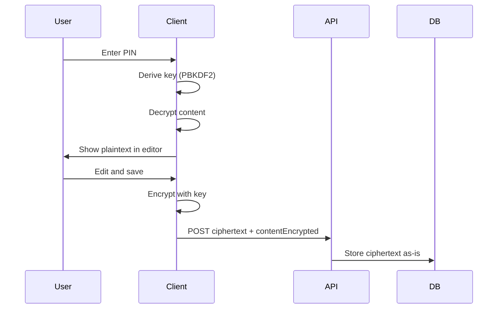

# Locked Notes with Encryption

**Status:** Future Feature  
**Last Updated:** January 2026

---

## Overview

Lock individual notes with a 4-digit PIN so that content is encrypted on the client and only you (and God) can read it. This gives an extra guard against accidental sharing, screen sharing, or someone with device or server access. Use cases include prayer notes, confessions, and “things only God knows.” Implementation order: **encryption first** (client-side crypto and API contract), then PIN lock UI.

---

## 1. Rationale and Competitor Context

**Why:** Sensitive spiritual content deserves a clear boundary; parity with [Apple Notes](https://www.harvous.com/compare) and Evernote on [harvous.com/compare](https://www.harvous.com/compare); differentiation vs Notion and most Bible apps that do not offer user-controlled note encryption.

**Lessons from competitors:**

- **Apple Notes:** Per-note lock with device passcode or custom Notes password; “forgot password = no recovery.” Sets the bar for notes apps.
- **Evernote:** Encrypt selected text with passphrase; AES + PBKDF2; passphrase never stored; app passcode on mobile.
- **Hallow:** Markets encryption of “journal entries and reflections” so only the user has access—same trust promise for prayer/reflection content.
- **Universal:** All state clearly that locked/encrypted content cannot be recovered if the user forgets the password.

---

## 2. Threat Model

**Protected against:** Accidental sharing or screen share; someone with temporary device access; DB leak or server compromise (server never sees plaintext for locked notes).

**Not protected against:** Device compromise while the note is unlocked; user forgets PIN (no recovery unless an optional recovery path is added later).

---

## 3. Architecture

**Principle:** Client-only encryption. The server and DB only ever see ciphertext for locked notes. The key is derived from the PIN and never sent or stored.



---

## 4. Cryptography

- **Algorithms:** AES-GCM (256-bit) for encryption; PBKDF2-SHA256 for key derivation (e.g. 100,000–310,000 iterations; OWASP 2025 suggests 310,000+).
- **Key:** Derived from PIN + per-note salt; key exists only in memory; never persisted or sent to the server.
- **Stored format:** Per note: salt (e.g. 16 bytes), IV (e.g. 12 bytes for GCM), ciphertext; encode as a single blob (e.g. base64) or separate columns. When encrypted, store in the existing `content` column with a `contentEncrypted` flag so the server treats it as opaque.
- **Reference:** Web Crypto API (SubtleCrypto). Align with [OFFLINE_MODE_IMPLEMENTATION.md](OFFLINE_MODE_IMPLEMENTATION.md) (client-side encryption, keys not in IndexedDB).

---

## 5. Database

**Table:** [db/config.ts](../../db/config.ts) – `Notes`

**New column:**

- `contentEncrypted` – type `boolean`, default `false`. When true, `content` holds ciphertext (and optionally salt/IV in the blob or in separate columns).

Example addition to `Notes` columns:

```ts
contentEncrypted: column.boolean({ default: false }),
```

**Migration:** After adding the column, run:

```bash
npm run db:push
```

Run `npm run db:check` before commit if your project uses it. Existing notes remain plaintext (`contentEncrypted = false`).

---

## 6. API Contract

- **Writes (create, update, update-content):** Accept optional `contentEncrypted`. When true, treat `content` as opaque ciphertext; store as-is; no server decryption.
- **Reads:** Return `content` as-is (ciphertext for locked notes). Client decrypts after PIN; server never decrypts.
- **Rule:** Any endpoint that reads or searches `Notes.content` must, for rows with `contentEncrypted === true`, either omit content from search/previews or return ciphertext and let the client show “Locked.”

**Key endpoints:**

- [src/pages/api/notes/create.ts](../../src/pages/api/notes/create.ts)
- [src/pages/api/notes/update.ts](../../src/pages/api/notes/update.ts)
- [src/pages/api/notes/[id]/update-content.ts](../../src/pages/api/notes/[id]/update-content.ts)
- [src/pages/api/notes/[id]/details.ts](../../src/pages/api/notes/[id]/details.ts)
- [src/utils/dashboard-data.ts](../../src/utils/dashboard-data.ts)
- [src/pages/api/notes/recent.ts](../../src/pages/api/notes/recent.ts)
- [src/pages/api/search.ts](../../src/pages/api/search.ts)
- [src/pages/find.astro](../../src/pages/find.astro)
- Scripture detection, auto-tags, suggest-threads; export/import; shared/og.

---

## 7. Feature Impact

| Feature | Behavior for locked notes |
|--------|----------------------------|
| Search (find, api/search) | Exclude from full-text search or search title only. |
| Scripture detection | Skip server-side; optional client-side after decrypt. |
| Auto-tags | Skip when content not available (encrypted). |
| Suggest threads | Skip or title-only. |
| Previews (cards, lists) | Show “Locked” or placeholder; no plaintext preview. |
| Export / Import | Client decrypts for export; client encrypts on import. |
| Sharing | Locked notes not shareable, or shared view shows “This note is locked.” |
| Sync / Offline | Ciphertext syncs; decrypt only on client with PIN. |

---

## 8. Client Crypto Layer (Planned)

- **Location:** New module e.g. [src/utils/note-encryption.ts](../../src/utils/note-encryption.ts) or [src/lib/note-crypto.ts](../../src/lib/note-crypto.ts).
- **Exports:** `deriveKey(pin, salt)`, `encrypt(plaintext, key)`, `decrypt(ciphertext, iv, salt, pin)`, plus blob encode/decode. Web Crypto only; no key storage.

---

## 9. Capacitor / Mobile

- **Web Crypto:** Requires a secure context (HTTPS or equivalent). In Capacitor, `capacitor://` or `file://` may not provide it; Web Crypto availability must be verified on real iOS/Android builds.
- **If unavailable:** Use a native crypto plugin (PBKDF2 + AES-GCM) so the same security model holds on native; one design, two code paths (web vs native).
- **Key storage:** For “PIN only” flow, the key stays in memory (Capacitor security guide–compliant). If “stay unlocked for N minutes” is added later, use Keychain/Keystore via a secure-storage plugin (e.g. @aparajita/capacitor-secure-storage), not IndexedDB/localStorage.
- **Future:** Optional biometrics (Face ID / Touch ID) for unlock when running in Capacitor.
- **Auth in native apps:** For JWT-based API auth in Capacitor, see [CAPACITOR_IMPLEMENTATION_GUIDE.md](../CAPACITOR_IMPLEMENTATION_GUIDE.md).
- **Reference:** [CAPACITOR_SETUP_GUIDE.md](CAPACITOR_SETUP_GUIDE.md) security checklist; [OFFLINE_MODE_IMPLEMENTATION.md](OFFLINE_MODE_IMPLEMENTATION.md) encryption notes.

---

## 10. Recovery Policy

- **Default:** Forgot PIN = no recovery. State this clearly in-product and in help (same as Apple Notes, Evernote, OneNote).
- **Optional later:** Recovery key or account-level recovery path; document as future consideration with security tradeoff.

---

## 11. Implementation Phases (Suggested)

1. **Phase 1:** New branch; add `contentEncrypted` to schema; migrate.
2. **Phase 2:** Client crypto module (derive, encrypt, decrypt); unit tests.
3. **Phase 3:** API contract (create/update/update-content accept ciphertext; details/recent/dashboard return or omit content for encrypted notes).
4. **Phase 4:** Minimal UI (set PIN, unlock with PIN, lock again; list placeholders show “Locked”).
5. **Phase 5:** Search exclude, scripture/auto-tags/suggest-threads behavior, export/import, sharing policy.

**Rough effort:** MVP 3–5 days; full scope 1–2 weeks (solo dev familiar with codebase).

---

## 12. Key Files to Touch (Summary)

- **Schema:** [db/config.ts](../../db/config.ts).
- **APIs:** create, update, update-content, details, recent; [src/utils/dashboard-data.ts](../../src/utils/dashboard-data.ts); [src/pages/api/search.ts](../../src/pages/api/search.ts); [src/pages/find.astro](../../src/pages/find.astro); scripture, auto-tags, suggest-threads; export/import; shared/og.
- **UI:** Note page, Tiptap create/edit flow; [src/components/CardNote.astro](../../src/components/CardNote.astro), list components (e.g. ThreadNotesList, SpaceContentList, OrganizedContentList) for “Locked” placeholder.
- **New:** Crypto util module; PIN entry / lock-unlock components.

---

## 13. Future: AI and API/MCP

When a note is locked, **nothing can read it**—no server, no AI, no API, no MCP. Content is only readable after the user unlocks (and optionally authorizes that use). Locked note content is therefore only available to AI and to external apps (API/MCP) when the user has unlocked the note and explicitly authorized that use. The server never sees plaintext for locked notes, so server-side AI and server-side API/MCP cannot read or index locked content.

**AI (resurface, quizzes):**

- Server-side AI cannot read locked note content (only ciphertext in DB).
- To support “AI looks at your notes” for resurfacing or quizzes: the client decrypts after the user unlocks, then sends plaintext only for that request to an AI API; or the user explicitly opts in (e.g. “Include this note in AI context”). Locked notes stay encrypted at rest; AI sees them only when the user has just unlocked and asked something about them.

**API and MCP (connect notes to other apps):**

- Server-side API/MCP that reads from the backend gets plaintext for non-locked notes; for locked notes, either omit content and return `contentEncrypted: true` or return ciphertext (not usable by the other app).
- To support “connect your notes to other apps” for locked notes: use a client-side or user-authorized flow—e.g. the client has decrypted content in memory after unlock, and exposes it only for that session or for an explicit “Share with [App]” / “Include in API export” action.

| Future feature | Works with encryption? | Condition |
|----------------|------------------------|------------|
| AI resurface / quizzes | Yes | Only when user has unlocked (and optionally opted in); client sends plaintext for that request or runs AI in client. |
| API / MCP connect notes to other apps | Partially | Unlocked notes: full. Locked notes: only if client-side or user explicitly authorizes decrypted content for that session/request. |
