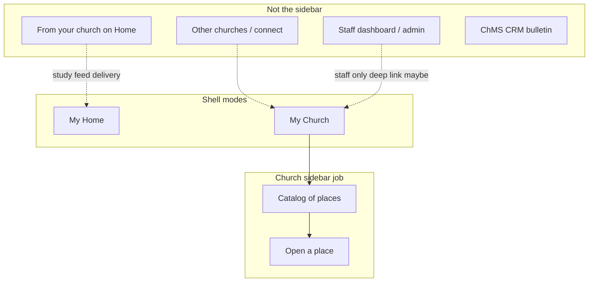

# My Church sidebar — catalog scope

Product north star for the My Church shell mode (prototype hub:
`spa/src/pages/prototype/PrototypeSidebarChurchHubView.tsx`).

Related locks: [CHURCH_CONNECTION_SYSTEM.md](./CHURCH_CONNECTION_SYSTEM.md)
(multi-church + home), [CHURCH_ORG_AND_CURRICULUM.md](./CHURCH_ORG_AND_CURRICULUM.md)
(Shared Spaces vs ministry channels).

## North star

My Church is **not a church dashboard**. It’s the shell mode for **your home
church’s study catalog** — places you go to learn or collaborate, parallel to
how My Home is your personal desk.

**Rule of thumb:** if it isn’t a *place to go study or collaborate*, or a
*staff door into creating/managing those places*, it probably doesn’t belong
here.

## Layer 1 — Permanent core (pilot catalog — shipped shape)

1. **Church identity header** — name, location; later a soft “Home church” cue when multi-church exists
2. **Shared spaces list** — collaborative church groups (same visual language as personal shared spaces)
3. **Ministry channels list** — staff-published feeds; cadence / “quiet lately” already fits
4. **Staff create** (shared space + ministry channel) — empty-state buttons + lane actions when populated
5. **Open-to-place** — row tap enters that space (hub stays a catalog, not a nested dashboard)

Fully empty hub: one empty state only (no redundant empty lanes). Staff may see
both create buttons under that empty state.

## Layer 2 — High-value additions (still catalog, not ChMS)

| Idea | Who | Status | Why it fits |
|---|---|---|---|
| Unseen / new on a channel or space | Both | **Built** (nav `newNoteCount` badge + dot) | Same job as personal shared-space badges |
| Latest study teaser under a channel | Both | **Built** (`lastCurriculumAt` + cadence meta) | One line bridges catalog → study without becoming Home |
| Staff-only footer: Church tools | Staff | Later (if needed) | Quiet link — not the hub itself; Settings covers this today |
| Empty state explaining both lanes | Both | **Built** | Teach Groups vs Resources before content exists |
| Soft “Home church” cue | Both | Later (multi-church) | Redundant while home = sole connected church |
| Pinned or “this series” channel | Both | Later — unblocked by design | Sermon/series companions without a bulletin. Waited on series being a row rather than a repeated string; that is now decided as `ChurchSeries` ([CHURCH_SPACE_PLANS_AND_SERVICE_TIMES.md](./CHURCH_SPACE_PLANS_AND_SERVICE_TIMES.md) §9), so a channel can point at one. |
| Followed vs not-yet-followed channels | Congregant | Later | If opted tracks win over auto-follow-all |
| Pending connect / “your church is on Harvous” | Congregant | Connect era | Banner when HMC matches but membership isn’t accepted |
| Per-space teaching plans + service times | Staff author; congregants see a card per ministry they joined | **Designed, not built** — [CHURCH_SPACE_PLANS_AND_SERVICE_TIMES.md](./CHURCH_SPACE_PLANS_AND_SERVICE_TIMES.md) | A ministry channel or church Shared Space may carry its own plan (Youth meets Wednesdays), plus church-level timezone and default meeting time. The church card is unchanged; each joined ministry with a plan gets **its own** card showing **one** next gathering — never a list. The anti-goal below is amended accordingly (the line becomes *services per card*, not *cards*), landing with its Phase 3, not before. |
| Teaching plan (collapsed) | **Staff only** | **Built** (v2.19.0; read `sermon_tools` / write `manage_teaching_plan` from v2.21.0) | A staff door into planning what the church teaches — the same “administration, not the daily job” shape as the roster. **Congregants get no plan lane here**; they get one card on Home. |

## Layer 3 — Useful later; easy to put in the wrong place

Prefer **Home**, **Settings**, or a **staff surface** unless one-line and optional:

- **“From your church” feed** — Home only (home church study feed)
- **A congregant-facing calendar** — still an anti-goal, and the v2.19.0 build honours it. The
  staff Teaching plan lives in the hub (Layer 2 above); a congregant sees exactly **one**
  service — the next one — as a "This Sunday" card on Home. No schedule, no "coming up" list,
  no series page. If a congregant calendar is ever proposed again, this is the line it crosses.
  **`ChurchSeries` does not move this line.** A series page is a *staff* surface inside the
  teaching plan; the congregant still gets one card and one next gathering. A series row makes
  material attachable at series grain — it does not make the schedule visible.
- **Teaching-team prep / quarterly curriculum** — inside a channel or shared space once opened
- **Switch home church / other churches** — Settings (picker B deferred)
- **Aggregate engagement / analytics** — church dashboard, staff-only
- **Migrate personal → church shared space** — create/migrate flow, not a permanent hub section
- **People / roster / invites for a space** — that space’s people sheet, not the church catalog

## Anti-goals

- Announcements, bulletin, giving, check-ins, scheduling, facilities
- CRM / ChMS people database
- Other churches’ content (non-home)
- Calling channels “Shared Spaces”
- Implying congregants “join the org” (Clerk)
- Turning the hub into full church admin

## Congregant vs staff — one catalog, two overlays

Same two lanes; different chrome only:

- **Congregant:** browse + open; badges for new (later); no create; empty without staff CTAs
- **Staff:** same catalog + create; optional cadence health; optional quiet “Church tools” entry

## Suggested “done enough” shapes

1. **Pilot catalog (now)** — header + two lanes + staff create
2. **Receive-ready catalog** — unseen badges + optional latest-study line on channels
3. **Connect-era catalog** — pending-connect banner; still no bulletin
4. **Staff ops door** — one footer link to dashboard; hub stays catalog

## Open product questions

- Should Home “From your church” ever duplicate into the sidebar, or stay Home-only forever?
- Channels: auto-follow all vs opted ministry tracks (changes whether the sidebar needs follow sections)
- Empty hub: congregant waiting room vs staff launchpad first (pilot blends both — fine until connect ships)
