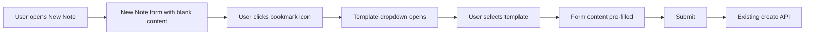

# Note Templates

**Status:** Partially Implemented  
**Last Updated:** February 2026

---

## Overview

Note templates let users create notes from pre-filled title and content. The feature supports built-in study method templates (e.g. SOAP, Inductive Study), user-created templates (e.g. sermon outlines, custom study formats), and—when shared spaces ship—templates that can be linked to a space so everyone in a group can use them. Creating a note from a template uses the same New Note panel and create API; the only difference is the initial title and content.

---

## Current State

### What's Implemented

- **Built-in templates data:** Static template definitions in [`src/data/note-templates.ts`](../../src/data/note-templates.ts) with 6 study method templates (SOAP, Inductive Study, Bible Nerd Method, Topical Study, Chapter Summary, Comparative Study). Each template has: `id`, `name`, `description`, `estimatedMinutes`, `level`, `titleTemplate`, `content` (HTML for Tiptap), and `noteType`. Helper functions: `getBuiltInTemplates()`, `getTemplateById()`.
- **TemplateSelector dropdown:** [`TemplateSelector.tsx`](../../src/components/react/note-panel/TemplateSelector.tsx) renders a portal-based dropdown showing "Blank Note" plus all built-in templates. Includes selection state, keyboard navigation (Escape to close), click-outside-to-close, and analytics tracking (`note_template_selected`, `note_template_blank_selected`).
- **NoteTemplateHeader component:** [`NoteTemplateHeader.tsx`](../../src/components/react/note-panel/NoteTemplateHeader.tsx) is a CardStack-style header that displays the selected template name with a caret. Intended for use as a trigger to open the dropdown.
- **Form state:** `selectedTemplateId` and `setSelectedTemplateId` in [`useNewNoteForm`](../../src/components/react/note-panel/hooks/useNewNoteForm.ts) and [`NewNotePanelContext`](../../src/components/react/contexts/NewNotePanelContext.tsx) track the currently selected template.

### What's Not Yet Wired Up

- **Template switcher trigger:** The bookmark icon in [`DefaultNoteForm.tsx`](../../src/components/react/note-panel/DefaultNoteForm.tsx) (lines 94–98) is intended to be the template switcher trigger. Currently it's a static SVG with a tooltip "Note type switching disabled until designs are ready." This icon should open the `TemplateSelector` dropdown and represent the "Blank Note" default state.
- **Content pre-fill:** When a template is selected, the form `content` should be set to the template's HTML. This wiring is not yet complete—`setSelectedTemplateId` is called but the content isn't populated from the template.
- **TemplateSelector integration:** In [`NewNotePanel.tsx`](../../src/components/react/NewNotePanel.tsx), `TemplateSelector` is rendered but missing `isOpen`, `onClose`, and `anchorRect` props needed to function as a dropdown. It needs a trigger (the bookmark icon) and state to control open/close.

### What's Still Future Work

- **User-created templates:** No `NoteTemplates` database table, no API endpoints, no "Save as template" UI.
- **Shared space templates:** No `TemplateSpaces` table, no space linking for templates.

---

## Pre-defined Study Method Templates

✅ **Implemented** in [`src/data/note-templates.ts`](../../src/data/note-templates.ts).

The built-in set aligns with the **top study methods** (e.g. a "Guide" list). The current implementation includes six templates; the list can be extended to include Biographical, Word Study, Theological, and any other top methods as needed:

| Method | Description | Time | Level |
|--------|-------------|------|-------|
| **SOAP** | Scripture, Observation, Application, Prayer | 15–20 min | Beginner |
| **Inductive Study** | Observation → Interpretation → Application | 45–90 min | Intermediate |
| **Bible Nerd Method** | Faith’s 5-step process: context, translations, dictionaries, commentaries | 60–120 min | Intermediate–Advanced |
| **Topical Study** | Study themes across the whole Bible | 20–60 min | Beginner–Intermediate |
| **Chapter Summary** | Quick summaries for reading retention | 10–15 min | Beginner |
| **Comparative Study** | Side-by-side analysis of translations, parallel passages, authors | 20–60 min | Intermediate |

Each template has: `id`, `name`, `description`, `estimatedMinutes`, `level`, `titleTemplate`, `content` (Tiptap-compatible HTML), and `noteType`.

---

## User-Created Templates

⏳ **Future work** — Not yet implemented.

Users can save a note (or the current new-note form) as a template and reuse it later.

- **Data model:** New table `NoteTemplates` (or `Templates`): `id`, `userId`, `name`, `title`, `content`, `createdAt`; optional `spaceId` (null = personal only) or a junction table (e.g. `TemplateSpaces`) if one template can be "in" multiple spaces.
- **Save as template:** From note detail panel or from the new-note form before first save: user clicks "Save as template," enters a name, and optionally "Make available in this space"; backend creates a `NoteTemplates` row (and optionally links it to the current space).
- **New from template:** Same New Note panel; user picks a template (built-in or user/space); form is pre-filled with that template’s `title` and `content`; submit uses the existing `POST /api/notes/create`. No new "create from template" API—only initial state.

---

## Shared Spaces

⏳ **Future work** — Depends on shared spaces implementation.

When shared spaces are implemented (see [ARCHITECTURE.md](../ARCHITECTURE.md), [SHARING_SYSTEM_DESIGN.md](SHARING_SYSTEM_DESIGN.md)):

- Templates linked to a space (via `NoteTemplates.spaceId` or a `TemplateSpaces` junction) are shown to all members when they create a note in that space.
- "Bring template to group" means linking a user template to that shared space so the group can reuse it.
- Optional: only space admins can add/remove space templates (permission detail to define when implementing).

---

## How It Could Be Implemented

### Pre-defined templates

✅ **Done** — [`src/data/note-templates.ts`](../../src/data/note-templates.ts)

- **Location:** `src/data/note-templates.ts` (single file with all templates).
- **Shape:** `NoteTemplate` interface with: `id`, `name`, `description`, `estimatedMinutes`, `level`, `titleTemplate`, `content` (HTML for Tiptap), and `noteType`. `BUILT_IN_TEMPLATES` array holds all 6 templates.
- **Usage:** `getBuiltInTemplates()` returns all templates; `getTemplateById(id)` looks up a specific template. Used by `TemplateSelector` to populate the dropdown.

### User templates (schema and API)

⏳ **Future work**

- **Schema (db/config.ts):** Add `NoteTemplates` with columns above; optionally add `TemplateSpaces` (e.g. `templateId`, `spaceId`) if a template can be in multiple spaces.
- **APIs:**
  - `GET /api/note-templates/list` — Returns built-in templates (from static config) plus the current user’s templates plus templates for the current space (when `spaceId` is provided). Used to populate the template picker.
  - `POST /api/note-templates/create` — Body: `name`, `title`, `content`; optional `spaceId` or `spaceIds[]` to link to space(s). Creates a `NoteTemplates` row.
  - Optional: `DELETE /api/note-templates/[id]`, `PATCH /api/note-templates/[id]` for edit; `POST .../add-to-space`, `POST .../remove-from-space` if using a junction.

### Create-from-template flow

🔧 **Partially implemented** — Components exist but not fully wired up.

**What exists:**
- `TemplateSelector` dropdown component in [`TemplateSelector.tsx`](../../src/components/react/note-panel/TemplateSelector.tsx)
- `NoteTemplateHeader` trigger component in [`NoteTemplateHeader.tsx`](../../src/components/react/note-panel/NoteTemplateHeader.tsx)
- Form state: `selectedTemplateId` / `setSelectedTemplateId` in context and hooks
- Bookmark icon in [`DefaultNoteForm.tsx`](../../src/components/react/note-panel/DefaultNoteForm.tsx) (currently disabled)

**What's needed to complete:**
- Wire the bookmark icon to open `TemplateSelector` dropdown (add `onClick`, `isOpen` state, `anchorRect`)
- Populate form `content` when a template is selected (call `getTemplateById(selectedTemplateId)` and set content)
- Pass required props (`isOpen`, `onClose`, `anchorRect`) to `TemplateSelector` in `NewNotePanel.tsx`

### Save as template

⏳ **Future work** — Depends on user templates.

- From note detail panel ("⋯" menu) or from new-note form: "Save as template" → modal for template name + optional "Make available in this space" (when in a space) → call `POST /api/note-templates/create`.

### Content format

✅ **Done** — Built-in templates use Tiptap-compatible HTML.

- Note `content` in the database is whatever Tiptap persists (see [TiptapEditor](../../src/components/react/TiptapEditor.tsx)). Template `content` uses the same format (HTML) so it can be set as the initial value in the editor without conversion. Built-in templates are authored as HTML (e.g. `<h2>📖 Scripture</h2>`) in [`src/data/note-templates.ts`](../../src/data/note-templates.ts).

### File checklist

| File | Status | Notes |
|------|--------|-------|
| `src/data/note-templates.ts` | ✅ Done | Built-in templates data, `NoteTemplate` interface, helper functions |
| `src/components/react/note-panel/TemplateSelector.tsx` | ✅ Done | Dropdown component for template selection |
| `src/components/react/note-panel/NoteTemplateHeader.tsx` | ✅ Done | Header trigger component |
| `src/components/react/note-panel/DefaultNoteForm.tsx` | 🔧 Partial | Bookmark icon exists but not wired to dropdown |
| `src/components/react/NewNotePanel.tsx` | 🔧 Partial | `TemplateSelector` imported but missing props |
| `src/components/react/contexts/NewNotePanelContext.tsx` | ✅ Done | `selectedTemplateId` state |
| `db/config.ts` | ⏳ Future | `NoteTemplates` table for user templates |
| `src/pages/api/note-templates/list.ts` | ⏳ Future | GET endpoint (built-in + user + space) |
| `src/pages/api/note-templates/create.ts` | ⏳ Future | POST endpoint for user templates |
| Note details panel | ⏳ Future | "Save as template" action |

---

## Design Considerations

Decisions and suggestions based on the current UI.

### Where does "Blank vs From template" live?

**Decision:** Option B (inline) — implemented as a bookmark icon in the title row of `DefaultNoteForm`.

- **Current implementation:** A bookmark icon sits next to the title input. Clicking it opens the `TemplateSelector` dropdown. The default state (blank note) is represented by the bookmark icon. When a template is selected, the same icon serves as the trigger to switch templates.
- **Rationale:** Keeps the form compact and allows quick template switching without a separate step. The icon is subtle and doesn't crowd the UI—users who don't care about templates can ignore it.

### Template picker UX

✅ **Implemented** — `TemplateSelector` dropdown.

- **List structure:** "Blank Note" option at top, followed by built-in templates. Styled with `space-switcher-dropdown__item` classes for consistency with other dropdowns. Check icon shows for selected template.
- **Future:** "My templates" and "Space templates" sections when user templates are implemented.
- **Metadata on items:** Currently shows template name only. Future: could add estimated time and level badges.

### "Save as template" placement

⏳ **Future work**

- **Options:** Note details panel "⋯" menu ([NoteDetailsPanel](../../src/components/react/NoteDetailsPanel.tsx)); or context menu on note card; or both. Modal: template name + optional "Make available in this space" (when in a space). Align with existing "Share," "Add to thread," etc. in the same panel.

### Mobile / bottom sheet

⏳ **Not yet tested**

- **Current approach:** Same inline icon trigger works on mobile. Dropdown positioning may need adjustment for bottom sheet context.
- **Constraint:** [BottomSheet](../../src/components/react/BottomSheet.tsx) hosts the same New Note panel with limited height.
- **Suggestion:** The inline dropdown approach should work well since it's just a single icon. If cramped, consider moving dropdown to sheet-relative positioning.

### Consistency with current UI

✅ **Implemented**

- **Components and styles:** `TemplateSelector` uses `space-switcher-dropdown__*` classes for visual consistency with other dropdowns. Portal-based rendering to `document.body` for proper z-index handling.
- **Accessibility:** Escape key closes dropdown; click-outside-to-close; keyboard navigation (needs testing).

### Design decisions made

- ✅ **Placement:** Inline icon in title row (Option B)
- ✅ **Icon:** Bookmark icon represents blank note / template trigger
- ⏳ **Mobile:** TBD — likely same inline approach
- ⏳ **"New from template" menu entry:** Not planned; lives only inside "Add note"

---

## Flow Diagram

---

## Related Documentation

- [ARCHITECTURE.md](../ARCHITECTURE.md) — Data structures, spaces, threads, notes.
- [SHARING_SYSTEM_DESIGN.md](SHARING_SYSTEM_DESIGN.md) — Shared threads and spaces.
- [NOTE_TYPES_DESIGN_PENDING.md](../NOTE_TYPES_DESIGN_PENDING.md) — Note types (default, scripture, resource) and form layout.
