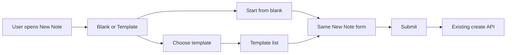

# Note Templates

**Status:** Future Feature  
**Last Updated:** January 2026

---

## Overview

Note templates let users create notes from pre-filled title and content. The feature supports built-in study method templates (e.g. SOAP, Inductive Study), user-created templates (e.g. sermon outlines, custom study formats), and—when shared spaces ship—templates that can be linked to a space so everyone in a group can use them. Creating a note from a template uses the same New Note panel and create API; the only difference is the initial title and content.

---

## Current State

- **Notes:** Schema in [db/config.ts](../db/config.ts): `Notes` table with `title`, `content`, `noteType`, `threadId`, `spaceId`, `userId`, etc. Content is whatever Tiptap persists (HTML or JSON).
- **Create flow:** [NewNotePanel.tsx](../../src/components/react/NewNotePanel.tsx) plus [useNewNoteForm](../../src/components/react/note-panel/hooks/), [DefaultNoteForm](../../src/components/react/note-panel/DefaultNoteForm.tsx), and [TiptapEditor](../../src/components/react/TiptapEditor.tsx). Form state is title, content, noteType, thread, space, etc.; submit calls the existing note create API.
- **Entry points:** `openNewNotePanel` and `openNewResourcePanel` (the latter sets `newNoteType` in localStorage). Desktop: panel in [DesktopPanelManager](../../src/components/react/DesktopPanelManager.tsx); mobile: [BottomSheet](../../src/components/react/BottomSheet.tsx) with the same New Note panel.
- **No template concept today:** There is no template picker, no "Save as template," and no `NoteTemplates` table or static template data.

---

## Pre-defined Study Method Templates

The built-in set can align with the **top study methods** (e.g. a "Guide" list): SOAP, Comparative, Biographical, Word Study, Theological, Inductive, Topical, Chapter Summary, Bible Nerd. Using these as the source for pre-defined templates gives users familiar, trusted study structures out of the box. The template picker can mirror a hierarchical presentation (e.g. a "Guide" header with methods listed beneath, with clear separation and selection state).

Below is an initial set of six (no database; stored as static app data). The list can be extended to include Biographical, Word Study, Theological, and any other top methods as needed:

| Method | Description | Time | Level |
|--------|-------------|------|-------|
| **SOAP** | Scripture, Observation, Application, Prayer | 15–20 min | Beginner |
| **Inductive Study** | Observation → Interpretation → Application | 45–90 min | Intermediate |
| **Bible Nerd Method** | Faith’s 5-step process: context, translations, dictionaries, commentaries | 60–120 min | Intermediate–Advanced |
| **Topical Study** | Study themes across the whole Bible | 20–60 min | Beginner–Intermediate |
| **Chapter Summary** | Quick summaries for reading retention | 10–15 min | Beginner |
| **Comparative Study** | Side-by-side analysis of translations, parallel passages, authors | 20–60 min | Intermediate |

Each template has: `id`, `name`, `description`, `estimatedMinutes`, `level`, optional `titleTemplate`, and `content` (Tiptap-compatible string). "Create from template" pre-fills the existing new-note form with that title and content; the user then submits via the same create API.

---

## User-Created Templates

Users can save a note (or the current new-note form) as a template and reuse it later.

- **Data model:** New table `NoteTemplates` (or `Templates`): `id`, `userId`, `name`, `title`, `content`, `createdAt`; optional `spaceId` (null = personal only) or a junction table (e.g. `TemplateSpaces`) if one template can be "in" multiple spaces.
- **Save as template:** From note detail panel or from the new-note form before first save: user clicks "Save as template," enters a name, and optionally "Make available in this space"; backend creates a `NoteTemplates` row (and optionally links it to the current space).
- **New from template:** Same New Note panel; user picks a template (built-in or user/space); form is pre-filled with that template’s `title` and `content`; submit uses the existing `POST /api/notes/create`. No new "create from template" API—only initial state.

---

## Shared Spaces

When shared spaces are implemented (see [ARCHITECTURE.md](../ARCHITECTURE.md), [SHARING_SYSTEM_DESIGN.md](SHARING_SYSTEM_DESIGN.md)):

- Templates linked to a space (via `NoteTemplates.spaceId` or a `TemplateSpaces` junction) are shown to all members when they create a note in that space.
- "Bring template to group" means linking a user template to that shared space so the group can reuse it.
- Optional: only space admins can add/remove space templates (permission detail to define when implementing).

---

## How It Could Be Implemented

### Pre-defined templates

- **Location:** `src/data/note-templates/` (or `src/data/study-methods/`).
- **Shape:** One file per method (e.g. `soap.ts`, `inductive.ts`) exporting an object with: `id`, `name`, `description`, `estimatedMinutes`, `level`, optional `titleTemplate`, and `content` (same format as note `content` for Tiptap).
- **Usage:** A small util (e.g. `getBuiltInTemplates()`) imports and returns the list. The template picker in the new-note flow calls it and, on selection, sets initial `title` and `content` in the form state.

### User templates (schema and API)

- **Schema (db/config.ts):** Add `NoteTemplates` with columns above; optionally add `TemplateSpaces` (e.g. `templateId`, `spaceId`) if a template can be in multiple spaces.
- **APIs:**
  - `GET /api/note-templates/list` — Returns built-in templates (from static config) plus the current user’s templates plus templates for the current space (when `spaceId` is provided). Used to populate the template picker.
  - `POST /api/note-templates/create` — Body: `name`, `title`, `content`; optional `spaceId` or `spaceIds[]` to link to space(s). Creates a `NoteTemplates` row.
  - Optional: `DELETE /api/note-templates/[id]`, `PATCH /api/note-templates/[id]` for edit; `POST .../add-to-space`, `POST .../remove-from-space` if using a junction.

### Create-from-template flow

- **Entry:** Same as today (e.g. "Add note" opens New Note panel). Add a step or control: "Start from blank" vs "Choose a template." If template chosen, show template list (built-in / My templates / Space templates), then pre-fill the form and show the same New Note form (thread selector, space selector, title, content, footer).
- **Pre-fill:** When user picks a template, set `title` and `content` in the same state that `useNewNoteForm` / `DefaultNoteForm` use; no new form component. Submit uses existing `POST /api/notes/create`.
- **Files to touch:** [NewNotePanel.tsx](../../src/components/react/NewNotePanel.tsx) (template picker step or inline control, initial state from template); optional `NoteTemplatePicker.tsx`; form hooks already accept initial title/content.

### Save as template

- From note detail panel ("⋯" menu) or from new-note form: "Save as template" → modal for template name + optional "Make available in this space" (when in a space) → call `POST /api/note-templates/create`.

### Content format

- Note `content` in the database is whatever Tiptap persists (see [TiptapEditor](../../src/components/react/TiptapEditor.tsx)). Template `content` must use the same format so it can be set as the initial value in the editor without conversion. Built-in templates should be authored once as HTML/JSON (e.g. headings for SOAP sections) and shipped in the static config.

### File checklist (when implementing)

- `src/data/note-templates/` — static template definitions (or one index file that imports per-method files).
- `src/utils/note-templates.ts` (or similar) — `getBuiltInTemplates()` and any shared types.
- `db/config.ts` — `NoteTemplates` (and optionally `TemplateSpaces`).
- `src/pages/api/note-templates/list.ts` — GET list (built-in + user + space).
- `src/pages/api/note-templates/create.ts` — POST create.
- Optional: delete, update, add-to-space, remove-from-space endpoints.
- [NewNotePanel.tsx](../../src/components/react/NewNotePanel.tsx) — template picker and pre-fill; optional [NoteTemplatePicker.tsx](../../src/components/react/NoteTemplatePicker.tsx).
- Note details panel (and optionally new-note form) — "Save as template" action and modal.

---

## Design Considerations

Decisions and suggestions based on the current UI.

### Where does "Blank vs From template" live?

- **Option A – First step:** Before the form, show "Start from blank" vs "Choose a template." If template chosen, show template list (built-in / My templates / Space templates), then show the same New Note form pre-filled. Fits the current panel flow as one extra "screen" before the thread combobox and form. Similar to how `initialNoteType` can open directly into the resource flow.
- **Option B – Inline in form:** Add a "Template" control (dropdown or link) above or beside the thread selector ([ThreadCombobox](../../src/components/react/ThreadCombobox.tsx), [SpaceSelector](../../src/components/react/note-panel/SpaceSelector.tsx)). Choosing a template pre-fills title/content without leaving the form. Reuses existing combobox/selector patterns.
- **Suggestion:** Option A for clarity and to avoid crowding the top of the form; document Option B as an alternative for power users who want everything on one screen.

### Template picker UX

- **List structure:** Sections: "Study methods" (built-in), "My templates," "Space templates" (when in a shared space). The built-in section can follow a "Guide" style: a bold header (e.g. "Guide") with study methods listed beneath, horizontal separators between items, and clear selection/hover state (e.g. light gray highlight). Reuse list/card patterns from the thread list and [ThreadCombobox](../../src/components/react/ThreadCombobox.tsx) (search, optional "Create template").
- **Metadata on items:** Show estimated time and level (e.g. "15–20 min · Beginner") as small badges so users can scan; keep row height consistent with current thread/space buttons (e.g. ~64px where applicable per [SpaceSelector](../../src/components/react/note-panel/SpaceSelector.tsx)).
- **Empty states:** First-time users see only built-in; after creating templates, show "My templates" section. If no space templates, hide that section or show "No space templates yet."

### "Save as template" placement

- **Options:** Note details panel "⋯" menu ([NoteDetailsPanel](../../src/components/react/NoteDetailsPanel.tsx)); or context menu on note card; or both. Modal: template name + optional "Make available in this space" (when in a space). Align with existing "Share," "Add to thread," etc. in the same panel.

### Mobile / bottom sheet

- **Constraint:** [BottomSheet](../../src/components/react/BottomSheet.tsx) hosts the same New Note panel with limited height. Template list and form in one sheet can feel cramped.
- **Suggestion:** Two-step flow on mobile: step 1 = "Blank" or "From template" with a scrollable template list; step 2 = same form (with "Back" to change template). Alternatively, collapse template choice into a single dropdown at the top (like the thread selector) to keep one screen. Document the tradeoff: two-step = clearer; one screen = fewer taps.

### Consistency with current UI

- **Components and styles:** Use existing panel semantics ([NewNotePanel](../../src/components/react/NewNotePanel.tsx) layout, `panel__footer--buttons`, [NoteFormFooter](../../src/components/react/note-panel/NoteFormFooter.tsx)); reuse [ThreadCombobox](../../src/components/react/ThreadCombobox.tsx)-style dropdown for template selector if inline; use [SquareButton](../../src/components/react/SquareButton.tsx) and primary actions where appropriate. See [ANIMATION_GUIDELINES.md](../ANIMATION_GUIDELINES.md) for any template-picker transitions.
- **Accessibility:** Keyboard navigation for the template list; focus management when moving from template picker to form (and back); ensure "Start from blank" and "Back" are clearly labeled and focusable.

### Design decisions to make before implementation

- Final placement of "Blank vs From template" (first step vs inline).
- Mobile: two-step vs single-screen template choice.
- Whether "New from template" gets a separate menu entry (like "Add resource") or lives only inside "Add note."

---

## Flow Diagram

---

## Related Documentation

- [ARCHITECTURE.md](../ARCHITECTURE.md) — Data structures, spaces, threads, notes.
- [SHARING_SYSTEM_DESIGN.md](SHARING_SYSTEM_DESIGN.md) — Shared threads and spaces.
- [NOTE_TYPES_DESIGN_PENDING.md](../NOTE_TYPES_DESIGN_PENDING.md) — Note types (default, scripture, resource) and form layout.
