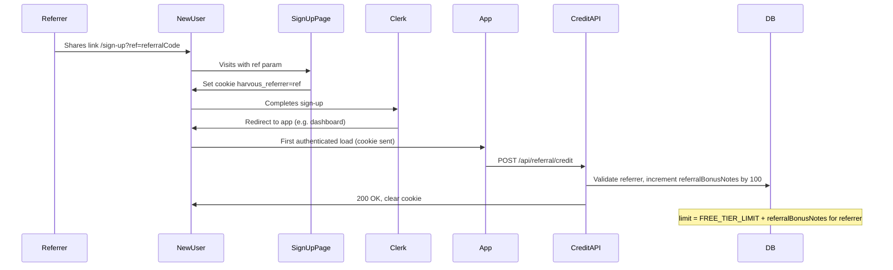

# Referral Bonus: Implementation Guide

**Status:** Future Feature  
**Last Updated:** January 2026

---

## Overview

Everyone gets **1,000 free notes** to start. When someone you refer signs up, **you** (the referrer) get **100 more notes** added to your limit—the new person still gets 1,000 free notes like everyone else. This uses **Option A: raise the limit**—the referrer’s effective cap is `1,000 + (100 × successful referrals)`. Referral links use a short, **autogenerated code** (e.g. `JOHN-X7K2`) instead of your account ID. This fits Harvous’s “generosity payback” positioning.

---

## Architecture and Flow



- **Attribution:** New user lands on `/sign-up?ref=<referralCode>` (e.g. `JOHN-X7K2`). Sign-up page sets a cookie `harvous_referrer=<ref>` with TTL 7 days (cookie stores `ref` as-is; no need to resolve before setting).
- **Signup:** New user completes Clerk sign-up and is redirected into the app (e.g. dashboard).
- **Credit:** On first authenticated load, the client calls `POST /api/referral/credit`, which: reads `harvous_referrer`, **resolves ref to userId** (see “Resolving ref to userId”), validates referrer (exists, not self), increments `UserMetadata.referralBonusNotes` for the referrer by 100, then clears the cookie in the response.
- **Limit:** Subscription logic uses `limit = FREE_TIER_LIMIT + referralBonusNotes` so the referrer’s cap increases.

No webhook change is required; attribution is cookie + post-signup API so the server credits the referrer when the new user’s browser makes the first authenticated request (with cookie).

---

## 1. Database

**Table:** [db/config.ts](../../db/config.ts) – `UserMetadata`

**New columns:**

- `referralBonusNotes` – type `number`, default `0`. Total bonus note allowance earned from referrals (incremented by 100 per successful signup).
- `referralCode` – type `text`, optional, **unique**. Single autogenerated referral code per user (e.g. `JOHN-X7K2`). Existing users have `referralCode: null` until generated (see “Referral code generation”).

Example addition to `UserMetadata` columns:

```ts
referralBonusNotes: column.number({ default: 0 }),
referralCode: column.text({ optional: true, unique: true }),
```

**Migration:** After adding the columns, run:

```bash
npm run db:push
```

Run `npm run db:check` before commit if your project uses it.

---

## 2. Referral Code Generation

Referral links use a short code (e.g. `JOHN-X7K2`) instead of the Clerk user ID. Codes are **autogenerated** from the user’s **first name** plus a **unique suffix**.

**Format:** `PREFIX-SUFFIX`

- **PREFIX:** From `firstName`. Sanitize: strip non-alphanumeric, take first 4–6 characters, uppercase. If no first name or empty after sanitize, use fallback (e.g. `USER`).
- **SUFFIX:** Unique part. Use a **deterministic** derivation from `userId` (e.g. first 4–5 characters of a base36-encoded hash of `userId`). Same user always gets the same code; no DB uniqueness check needed at generation time; collision risk is negligible with 5+ chars.

**Constraints:** `referralCode` column is unique in DB. Max length ~12–14 chars (prefix + hyphen + suffix). URL-safe: alphanumeric plus hyphen only.

**Location:** New file [src/utils/referral-code.ts](../../src/utils/referral-code.ts)

**Function:** `generateReferralCode(firstName: string | null, userId: string): string`

- Compute prefix: `firstName.replace(/\W/g, '').toUpperCase().slice(0, 6)` or `'USER'` if empty.
- Compute suffix: e.g. hash `userId` (crypto or stable hash), take first 5 chars in base36.
- Return `prefix + '-' + suffix`.

**When to generate (eager):** In [src/utils/user-cache.ts](../../src/utils/user-cache.ts), inside `fetchAndCacheUserData`:

- **New user:** When doing `db.insert(UserMetadata).values({...})`, add `referralCode: generateReferralCode(firstName, userId)`.
- **Existing user (backfill):** When doing `db.update(UserMetadata).set({...})`, if `existingMetadata.referralCode` is null, set `referralCode: generateReferralCode(firstName, userId)` in the update. The next time their cache is refreshed (or they load a page that uses user-cache), they get a code.

**Lazy alternative:** Generate on first use (e.g. when they open ReferralPanel or when an API first needs their code)—“ensure referral code” on first panel open or first GET referral/status.

---

## 3. Resolving ref to userId

The `ref` query param (and the value stored in the cookie) can be either:

1. A **referral code** (e.g. `JOHN-X7K2`), or
2. A **Clerk user ID** (e.g. `user_2abc...`) for backward compatibility if you ever shipped with userId.

**Resolver (server-side):** `resolveRefToUserId(ref: string): Promise<string | null>`

- If `ref` is empty or invalid, return null.
- If `ref` looks like a Clerk userId (e.g. starts with `user_`), optionally validate that this user exists in `UserMetadata`, then return `ref`.
- Otherwise treat `ref` as a referral code: query `UserMetadata` where `referralCode === ref`, get `userId`; if found return it, else return null.

**Where to use:** Sign-up page stores `ref` as-is in the cookie (no resolve before setting). **Credit API:** when reading the cookie, call `resolveRefToUserId(ref)`; if null, don’t credit; if resolved, validate referrer exists and is not current user, then credit. Place `resolveRefToUserId` in [src/utils/referral-code.ts](../../src/utils/referral-code.ts) or a small referral util.

---

## 4. Subscription Logic

**File:** [src/utils/subscription.ts](../../src/utils/subscription.ts)

**Changes:**

1. **Helper to read `referralBonusNotes`:** Add a function (or extend existing metadata fetch) to read `referralBonusNotes` for a user from `UserMetadata`. Example:

   ```ts
   export async function getReferralBonusNotes(userId: string): Promise<number> {
     const row = await db
       .select({ referralBonusNotes: UserMetadata.referralBonusNotes })
       .from(UserMetadata)
       .where(eq(UserMetadata.userId, userId))
       .get();
     return row?.referralBonusNotes ?? 0;
   }
   ```

2. **`canCreateNote`:** After the unlimited check, compute `effectiveLimit = FREE_TIER_LIMIT + referralBonusNotes`. Allow if `noteCount < effectiveLimit`. On reject, return `limit: effectiveLimit` and the same `upgradeUrl` behavior.

3. **`getSubscriptionInfo`:** Return `limit: hasUnlimited ? null : FREE_TIER_LIMIT + referralBonusNotes` so the UI shows the correct cap. Optionally expose `referralBonusNotes` in the return type so the UI can show “X from referrals.”

**No change** to [src/pages/api/notes/create.ts](../../src/pages/api/notes/create.ts) beyond it already using `canCreateNote`; it will respect the new limit once `subscription.ts` is updated.

---

## 5. Referral Attribution

### 5.1 Sign-up page

**File:** [src/pages/sign-up.astro](../../src/pages/sign-up.astro)

- Read `ref` from `Astro.url.searchParams` (`ref` is the referral code or legacy Clerk userId from the link, e.g. `JOHN-X7K2`).
- If `ref` is present and non-empty, set a cookie `harvous_referrer=<ref>` with `path=/`, `max-age=604800` (7 days), `SameSite=Lax`. Store `ref` as-is; no need to resolve to userId before setting the cookie.
- Prefer setting this **server-side** in the Astro page (e.g. set a `Set-Cookie` response header in the page so the cookie is set before any client JS). If you set it via client script, ensure it runs on first paint so it’s set before redirects.

Example (server-side in frontmatter or middleware): set the cookie when rendering the sign-up page when `ref` is in the URL. Astro can set cookies via `Astro.cookies.set('harvous_referrer', ref, { path: '/', maxAge: 60 * 60 * 24 * 7, sameSite: 'lax' })` in the page’s server code.

### 5.2 Credit API

**New route:** `src/pages/api/referral/credit.ts` (POST)

- Require auth (e.g. `Astro.locals.auth()`; redirect or 401 if no user).
- Read `harvous_referrer` from request cookies.
- **Resolve ref to userId:** Call `resolveRefToUserId(ref)` (see “Resolving ref to userId”). If null, don’t credit and clear the cookie.
- Validate: referrer userId exists in DB (e.g. has a `UserMetadata` row) and is not the current user.
- Increment `UserMetadata.referralBonusNotes` by 100 for the referrer.
- Clear `harvous_referrer` cookie in the response (e.g. set cookie with `max-age=0`).
- Return 200 with optional JSON, e.g. `{ credited: true }`.

**Idempotency:** Calling multiple times with the same cookie could double-credit. For v1, either: (a) call the credit API only once on first load and clear the cookie immediately, or (b) add a simple guard (e.g. store “last credited new user id” and skip if the current user was already credited for this referrer).

### 5.3 Calling the credit API

From the client, call the credit API once after the user is authenticated (e.g. on dashboard or app layout mount). Only call when the cookie is present (e.g. `document.cookie` includes `harvous_referrer`) to avoid unnecessary requests. Document where this lives (e.g. [src/layouts/Layout.astro](../../src/layouts/Layout.astro) or the dashboard page component that runs when logged in).

---

## 6. Profile Referral Section / Panel

### 6.1 New panel component

**New file:** `src/components/react/ReferralPanel.tsx` (or `InvitePanel.tsx`)

**Content:**

- Title: e.g. “Refer Friends” or “Invite Friends”.
- Short copy: e.g. “When friends sign up with your link, you get 100 more notes. They get 1,000 free notes like everyone else.”
- Copyable referral link: `https://app.harvous.com/sign-up?ref=<user's referralCode>` (use the current user’s `referralCode`, not userId; for production, use env or config for base URL, e.g. `import.meta.env.SITE` or similar).
- **Ensure referralCode exists before showing the link:** If `referralCode` is null (e.g. old user not yet backfilled), either show a “Generate link” button that triggers ensure-referral-code (lazy), or ensure the code is generated when the panel loads (e.g. call an API that ensures code and returns it).
- Optional: “You’ve earned X bonus notes from Y successful referrals” (X = `referralBonusNotes`, Y = X/100).
- Close button / back behavior consistent with other profile panels (e.g. same pattern as [ManageBillingPanel.tsx](../../src/components/react/ManageBillingPanel.tsx)).

**Design patterns (share link):** Use the same UI and interaction patterns as the **note share link** in [NoteSharePanel.tsx](../../src/components/react/NoteSharePanel.tsx) so the referral link feels consistent with the rest of the app:

- **Link container:** A wrapper (e.g. `referral-panel__link-container` or reuse a shared class) containing a read-only input showing the full URL and a copy button. On input click, select the text (e.g. `target.select()`).
- **Copy button:** Use [ButtonSmall](../../src/components/react/ButtonSmall.tsx) with label “Copy” that switches to “Copied” after a successful copy; disable while loading. Copy via `navigator.clipboard.writeText(referralUrl)`.
- **Feedback:** On successful copy, set local “copied” state, dispatch a toast (e.g. `CustomEvent('toast', { detail: { message: 'Link copied to clipboard', type: 'success' } })`), and reset “copied” after ~2 seconds (e.g. `setTimeout(() => setCopied(false), 2000)`). On copy failure, show an error toast.
- **Panel structure:** Same layout as NoteSharePanel where applicable—`panel`, `panel__header`, `panel__title`, `panel__body`, `panel__content`—and support `inBottomSheet` for mobile so the panel works in the bottom sheet like other profile panels.

### 6.2 Wire into Profile

- **[src/components/react/ProfileOptionsList.tsx](../../src/components/react/ProfileOptionsList.tsx):** Add `renderOption('referral', 'Refer Friends', true)` (requires online so link and stats load).
- **[src/components/react/DesktopPanelManager.tsx](../../src/components/react/DesktopPanelManager.tsx):** Extend `PanelType` with `'referral'`; add handler for `openProfilePanel` → `OPEN_REFERRAL` (or equivalent); add state branch and render `<ReferralPanel ... />` when `activePanel === 'referral'`.
- **[src/components/react/BottomSheet.tsx](../../src/components/react/BottomSheet.tsx):** Add `'referral'` to drawer types and title map; handle `openProfilePanel` for `referral`; render `ReferralPanel` when `drawerType === 'referral'`.
- **[src/components/react/profile/ProfilePage.tsx](../../src/components/react/profile/ProfilePage.tsx):** Add `'referral'` to `PanelName` and the switch/case that renders panel content.
- **[src/components/react/MobileAdditional.tsx](../../src/components/react/MobileAdditional.tsx):** Map `panelName === 'referral'` to the same drawer type used in BottomSheet so mobile opens the referral panel in the sheet.

### 6.3 Data for “bonus notes from referrals”

ReferralPanel needs `referralBonusNotes`, `referralCode` (and optionally note limit) for the current user. Either:

- Fetch via a small API (e.g. GET `/api/referral/status`) that returns `{ referralBonusNotes, referralCode, limit }`, or
- Pass from parent if the profile page already loads user metadata.

Ensure `UserMetadata.referralBonusNotes` and `UserMetadata.referralCode` are exposed to the client for this panel (subscription info already flows through existing patterns where needed).

---

## 7. Limit Display (Billing / Upgrade UI)

**Files:**

- [src/components/react/ManageBillingPanel.tsx](../../src/components/react/ManageBillingPanel.tsx)
- [src/components/react/UpgradePageContent.tsx](../../src/components/react/UpgradePageContent.tsx)
- Any other place that shows “X of 1,000 notes” (e.g. [NoteFormFooter.tsx](../../src/components/react/note-panel/NoteFormFooter.tsx))

**Change:** These already use `getSubscriptionInfo()` (or equivalent). Once `getSubscriptionInfo` returns `limit: FREE_TIER_LIMIT + referralBonusNotes`, the UI will show the correct cap. Ensure no UI hardcodes `1,000`; use `subscriptionInfo.limit` everywhere. Optionally show “Including X from referrals” when `referralBonusNotes > 0`.

---

## 8. Optional: Cap on Bonus

To avoid unbounded growth, you can cap total bonus (e.g. `Math.min(referralBonusNotes, 500)` or cap at 5 successful referrals). Implement in:

- **subscription.ts:** When computing `effectiveLimit`, use `FREE_TIER_LIMIT + Math.min(referralBonusNotes, MAX_REFERRAL_BONUS)`.
- **Credit API:** When incrementing, use `Math.min(current + 100, cap)` or refuse to add if already at cap.

Document the chosen cap in code and in this doc.

---

## 9. Testing

**Manual:**

1. Create a referral link with `ref=<referralCode>` (e.g. copy from ReferralPanel, or use a real code from your DB like `JOHN-X7K2`).
2. Open the link in an incognito (or clean) browser.
3. Sign up a new user and complete redirect into the app.
4. Confirm the referrer’s `UserMetadata.referralBonusNotes` increased by 100 (e.g. via DB or admin).
5. Confirm the referrer’s limit in the UI (e.g. Profile or My Subscription) shows the new cap (1,000 + 100).

**Optional:**

- Verify cookie is set on the sign-up page when `ref` is in the URL.
- Verify credit API returns 200 and clears the cookie.
- If idempotency is implemented, verify a second call with the same user does not double-credit.

---

## 10. File Checklist

| Action | File |
|--------|------|
| Edit | [db/config.ts](../../db/config.ts) – add `referralBonusNotes` and `referralCode` to `UserMetadata` |
| Create | [src/utils/referral-code.ts](../../src/utils/referral-code.ts) – `generateReferralCode(firstName, userId)`, `resolveRefToUserId(ref)` |
| Edit | [src/utils/user-cache.ts](../../src/utils/user-cache.ts) – set `referralCode` on insert and on update when null (in `fetchAndCacheUserData`) |
| Edit | [src/utils/subscription.ts](../../src/utils/subscription.ts) – helper, `canCreateNote`, `getSubscriptionInfo` |
| Edit | [src/pages/sign-up.astro](../../src/pages/sign-up.astro) – set `harvous_referrer` cookie when `ref` present (store ref as-is) |
| Create | `src/pages/api/referral/credit.ts` – POST, auth, read cookie, **resolve ref to userId**, credit referrer, clear cookie |
| Edit | Layout or dashboard – call credit API once when authenticated and cookie present |
| Create | `src/components/react/ReferralPanel.tsx` – title, copy, copyable link with **referralCode**, optional stats, ensure code exists, close; use same design patterns as [NoteSharePanel.tsx](../../src/components/react/NoteSharePanel.tsx) (link container, ButtonSmall Copy, toast, panel structure) |
| Edit | [src/components/react/ProfileOptionsList.tsx](../../src/components/react/ProfileOptionsList.tsx) – add Refer Friends option |
| Edit | [src/components/react/DesktopPanelManager.tsx](../../src/components/react/DesktopPanelManager.tsx) – `referral` panel type and render |
| Edit | [src/components/react/BottomSheet.tsx](../../src/components/react/BottomSheet.tsx) – `referral` drawer type and render |
| Edit | [src/components/react/profile/ProfilePage.tsx](../../src/components/react/profile/ProfilePage.tsx) – `referral` in PanelName and switch |
| Edit | [src/components/react/MobileAdditional.tsx](../../src/components/react/MobileAdditional.tsx) – map `referral` to drawer |
| Edit | [src/components/react/ManageBillingPanel.tsx](../../src/components/react/ManageBillingPanel.tsx) – use dynamic limit, optional “from referrals” |
| Edit | [src/components/react/UpgradePageContent.tsx](../../src/components/react/UpgradePageContent.tsx) – use dynamic limit |
| Optional | GET `/api/referral/status` – if ReferralPanel fetches its own stats (return `referralBonusNotes`, `referralCode`, `limit`) |

No webhook file changes required.

---

## Out of Scope (v1)

- **Multiple codes per user / custom codes:** One autogenerated code per user; no user-chosen or multiple codes in v1.
- **Analytics:** Referral link clicks, etc.; optional future addition.
- **Deep link from email:** Same link as the copyable link; no extra doc section unless email templates are added later.
