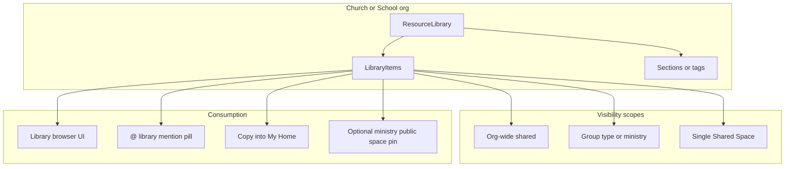

# Resource Library

**Status:** v0 building (personal libraries, links only). Church surfaces still design-only.  
**Written:** July 2026 · **Revised:** August 2026 (personal library lane, list view, dock chip)  
**Audience:** Product, sharing-agent, content-agent, editor-agent, data-agent, marketing-agent

Harvous’s competitive answer to [Planning Center Groups Resources](https://help.planningcenter.com/en/138457-add-resources.html): a study-native **Resource Library** for churches (later schools) where curriculum assets are browsable, shareable, and **`@` mentionable** inside notes—not only downloadable from a group Resources tab.

**August 2026 revision.** The original doc was org-only. It now carries a **personal library** lane on the same tables (`ownerKind: 'user'`), and names the three consumption surfaces that make a library feel native rather than filed away: a **Resources sidebar list mode**, a **collapsed-only study dock chip**, and the **`@` Library mention**. The personal lane ships first (v0) because it needs no org, no roles, and no storage bucket — and it proves the interaction grammar before a church depends on it.

---

## Related docs

| Doc | Relationship |
|-----|--------------|
| [PASTOR_FEATURES_ROADMAP.md](./PASTOR_FEATURES_ROADMAP.md) | Planning Center split; church ladder; ministry channels |
| [CHURCH_ORG_AND_CURRICULUM.md](./CHURCH_ORG_AND_CURRICULUM.md) | Org accounts + curriculum distribution to connected members |
| [CHURCH_CONNECTION_SYSTEM.md](./CHURCH_CONNECTION_SYSTEM.md) | `connectedChurchId` / connect flow |
| [CHMS_INTEGRATION_RESEARCH.md](./CHMS_INTEGRATION_RESEARCH.md) | Roster sync; complement ChMS; optional later PCO resource import |
| [MENTION_PILLS.md](./MENTION_PILLS.md) | Shipped `@` mentions for notes/folders/threads; library extends kinds |
| [NOTE_TEMPLATES.md](./NOTE_TEMPLATES.md) | Starters that library items can point at or wrap |
| [TIPTAP_UPGRADE_AND_RICH_MEDIA.md](./TIPTAP_UPGRADE_AND_RICH_MEDIA.md) | Future embeds/PDFs in the editor |
| [MONETIZATION_AND_PRICING.md](./MONETIZATION_AND_PRICING.md) | Church SKUs; “works alongside Planning Center” |
| [SHARED_SPACES_DEV_NOTES.md](../SHARED_SPACES_DEV_NOTES.md) | Cross-space visibility rules mentions must honor |

---

## 1. Problem and opportunity

### What churches do today in Planning Center

PCO Groups lets leaders and admins share **files and links** with a group (or as **shared resources** across a group type): meeting guides, short videos, curriculum PDFs, book recommendations. Access can be leaders-only or all members. Members get notified in Church Center and open/download from a Resources tab. Files max out at 50MB; larger media is an external URL (Drive, YouTube, Vimeo, etc.).

That solves **distribution**. It does not solve **study memory**:

- Resources sit beside chat/events, not inside the notes people write while studying.
- There is no durable way to *reference* a shared guide from a personal reflection (“see Week 3 handout”).
- Passage history, Recall, and copy-lineage never see those assets.
- When someone leaves the group or the file moves, the citation in a note (if any) is just a dead URL.

### The Harvous wedge

**Keep Planning Center for people, groups, events, and attendance. Harvous is where study resources become referenceable knowledge—not a second file cabinet.**

A Resource Library lets churches (and later schools) put the same class of assets into Harvous so members can:

1. **Browse** a library scoped to their space, ministry, or connected church.
2. **Follow / pin** items into a study feed or space Resources surface.
3. **Copy** a starter or pack into My Home (existing copy-lineage).
4. **`@` mention** a library item inline in a note—same interaction grammar as note/folder/thread mentions.

Curriculum channels (`type='public'` + `orgId` ministry spaces) remain the **broadcast / feed** lane. The Resource Library is the **catalog and reference** lane. They compose: staff can pin library items into a ministry channel or attach them to a sermon-week starter without duplicating the asset.

---

## 2. Naming collision (locked)

Today, `Notes.noteType = 'resource'` plus `ResourceMetadata` means a **personal link/bookmark note** (OG title, `sourceUrl`, image)—see `server/routes/resource.ts` and `NewResourcePanel`. That product language stays.

| Term | Meaning |
|------|---------|
| **Resource note** (existing) | A note type: bookmark/link with `ResourceMetadata` |
| **Resource Library** (this doc) | Org- or space-scoped catalog product |
| **Library item** | One entry in a library (file, link, note pointer, pack, template) |

Product copy and schema sketches for this feature use **Library / LibraryItem**. Existing resource notes remain a content type that can *appear as* or *be linked from* a library item—they are not renamed.

---

## 3. Personas and jobs

| Persona | Jobs |
|---------|------|
| **Church admin / education pastor** | Maintain an org-wide library; share items across group types / ministries; control leaders-only vs member access; retire outdated curriculum |
| **Group / class leader** | Add space-local items for this quarter’s study; pin the week’s PDF; point members at a YouTube teaching without leaving Harvous |
| **Congregant / group member** | Find this week’s handout; open it while writing notes; `@` the guide so next year’s self (and Recall) still knows what they meant |
| **Connected church member** (not in every small group) | See church-shared library items in “From your church” / library home without joining every space |
| **School teacher** (later) | Same jobs as group leader under a school org; class-scoped libraries |
| **Student** (later) | Browse class materials; mention readings in personal notes |

---

## 4. Product thesis

**Harvous Resource Library** is the study-native place organizations put curriculum assets—PDFs, links, videos, guides, starter notes—so people can browse, follow, copy, and `@` mention them inside personal and group study.

### Competitive frame

| Planning Center Resources | Harvous Resource Library |
|---------------------------|--------------------------|
| File/link dump per group or group-type “shared resources” | Org- or space-scoped library with sections/tags |
| Notify in Church Center; open/download | Live inside study: preview, scripture-linked, `@` mention pills |
| Leaders-only vs all-members access | Role + space membership + church-connected scopes |
| Max ~50MB upload; large media via external URL | Same pragmatic model initially (upload small + link large) |
| No memory graph | Mentions + copy-lineage feed Recall / passage history |
| Separate from co-authored study notes | Same app as Shared Spaces, scripture pills, and threads |

### Architectural stance



**Ownership:** A library belongs to exactly one owner, and `ownerKind` says what kind of owner that is — `'user'` for a personal library, `'church'` for an org one (`'school'` later). Same tables, same item shape, same consumption surfaces; only the permission check differs. A personal library is owner-only. A church library scopes items down to Shared Spaces or ministry channels: group leaders add space-local items, admins manage org-shared ones (mirrors PCO group vs shared resources). Canonical masters stay org/author-owned; members **reference or copy**—no co-edit of library masters by default.

Sharing the table across both lanes is deliberate. The personal library is not a lesser feature to be folded in later — it is the same primitive with a one-row owner, and it lets the interaction surfaces (list mode, dock chip, mention) ship and settle before any church's curriculum depends on them. When a church library arrives, a member's Resources list becomes a union of *mine* and *my church's*, not a second list.

**Relation to ministry broadcast:** Ministry education channels remain `Spaces.type='public'` + `orgId` for feed-style curriculum. Library is the durable catalog those channels (and Shared Spaces) draw from. Do not collapse library into “just another public space”—browsing, pinning, access levels, and `@` referenceability are first-class.

---

## 5. Product surfaces

Surfaces 5.1–5.3 are the **v0 consumption grammar** and work for a personal library with no org attached. Surfaces 5.4–5.7 are the church layer that reuses them.

### 5.1 Resources sidebar list mode (v0)

A sixth entry in the sidebar list-view menu beside Notes / Folders / Highlights / Scripture / Threads. This is where a library stops being a settings screen and becomes a place you *live* — the same switcher you use to scan passages now scans resources.

- Rows show title, source site name, and domain; the OG image is the row thumbnail where present.
- Add flow: paste a URL → fetch OG metadata → confirm → item saved. No note is created (this is the distinction from the existing bookmark **resource note**, §2).
- The list is **viewer-personal** in v0, including while a shared space is open. Church-scoped items joining this list is v0.1.
- Empty state teaches the concept: a resource is a link (later a file) you want to reach for while studying.

Distinct from the Scripture and Highlights list modes, which are *derived indexes* over note content. Resources is a **user-managed catalog** — the first list mode where rows are created deliberately rather than harvested. Worth watching in design review: the menu shouldn't imply Resources is another automatic index.

### 5.2 Study dock — `resource` chips, collapsed-only (v0)

Resources become a fourth study dock kind alongside scripture, highlight, and reference — **but with no expanded view**. A resource entry is a chip and only ever a chip.

**Why collapsed-only.** The other three dock kinds expand because they hold content Harvous can render and reason about: verse text, a quoted highlight, a dictionary entry. A resource is a pointer to something living *outside* the app. Rendering a cramped iframe or a scraped preview inside a dock card would be a worse version of the destination, and it would imply an editing/annotation surface that does not exist. The chip's job is to keep the resource *within reach* while writing — the thing PCO's Resources tab cannot do — and then get out of the way.

Behavior:

- Opening a resource from the Resources list (or a `@` Library pill) adds a chip to the dock and makes it active.
- The chip shows the title and domain. Tapping it opens the destination in a new tab (`noopener`); the chip stays docked.
- No chevron, no expand affordance, no body. `expanded` is a structural invariant of `false` for this kind — enforced on create, on select, and on deserialize, so a hand-edited localStorage payload can't produce a half-rendered card.
- Chips take part in ordering, reordering, and dismissal like any other entry.

**Native exploration (not scoped).** iOS could justify a richer treatment than web, along the lines of how X.com opens links: the source chip pinned at the bottom over the app, with a full in-app browser instance above it, swipe-dismissible back to the note. That keeps the reader inside the study session instead of context-switching to Safari. Worth prototyping after web v0; it does not change the web decision, and it does not change the data shape.

### 5.3 `@` mention picker — Library tab

- When the note’s space (or the author’s connected church) grants library access, the mention picker adds a **Library** kind tab alongside Notes / Folders / Threads.
- Inserting a mention creates a pill that navigates to the library item detail (preview / open file / open linked note).
- Label frozen at insert time (same as other mention pills); id keeps the link working if the title changes.
- **v0 scope gate:** the Library tab appears in **personal notes only**. A personal library item cannot resolve for anyone but its owner, so offering it while authoring in a shared space would mint pills that are dead for every other member. The tab returns for shared spaces when church-scoped items land (v0.1).

### 5.4 Org Library home

- Staff surface under church admin / education settings (and a lighter browse for connected members).
- Sections or tags (e.g. Adult Ed, Students, Sermon Series, Leader Guides).
- Search by title, description, scripture passage, tag.
- Create/edit library items; set scope and access; pin featured items.

### 5.5 Space Resources tab

- On a Shared Space (and optionally on a ministry channel): list of library items **in scope for this space**, plus space-local items.
- Pin ordering (leader can unpin org-shared pins for their space—same UX idea as PCO).
- Empty state: “Add a link or PDF for this group’s study.”

### 5.6 “From your church” / study feed pins

- Org-scoped items marked for connected congregants can surface in the existing church curriculum / inbox patterns (see CHURCH_ORG_AND_CURRICULUM)—as library cards, not only as duplicated notes.
- Optional: attach library items to sermon-calendar weeks (PASTOR_FEATURES_ROADMAP item 7).

### 5.7 Item detail

- Title, description, access badge, scripture anchors (optional), open/download/copy actions.
- For Harvous note/thread pointers: open in-app; for files: download or in-browser preview where safe; for external URLs: open with clear external affordance.

---

## 6. Library item types

| Kind | Description | Phase |
|------|-------------|----|
| **`link`** | External URL (Drive, YouTube, publisher page, etc.) | **v0** |
| **`file`** | Uploaded document under a 50MB cap (PDF, doc/ppt, image, audio; no video) | **v0** |
| **`note_ref`** | Pointer to a Harvous note (often `noteType: 'resource'` or a curriculum note) | v0.1 |
| **`thread_ref`** | Pointer to a Harvous thread used as a curriculum pack | v0.1 |
| **`template_ref`** | Pointer to a `NoteTemplates` starter (org- or space-scoped) | v1 |
| **`pack`** | Lightweight bundle: ordered list of other library item ids + optional passage set | v2 |

`file` was pulled forward into v0 (August 2026): a personal library without attachments turned out to be half a library — the handout PDF is the founding use case. Files live in a dedicated **private** `library-files` bucket (50MB, PCO-analogous; MIME allowlist covers documents, images, audio — video stays a link) and are opened via short-lived signed URLs minted after the same owner check as every other read. The storage key never reaches the client.

`note_ref` / `thread_ref` moved out of v0 with the personal-first re-phasing: in a *personal* library they largely duplicate the note and thread mentions that already ship. They earn their place when a church points members at curriculum it authored, which is v0.1.

Optional metadata on all kinds: description, cover image, pinned, leaders-only, scripture references (for passage-aware search and future Recall hooks).

---

## 7. Permissions

| Actor | Can |
|-------|-----|
| **Org admin / education role** | CRUD org-shared items; set group-type / ministry scopes; delete any item |
| **Group / space leader** | CRUD items scoped to their Shared Space; pin/unpin; cannot create org-wide shared items |
| **Space member** | Browse member-visible items in scope; open; copy; `@` mention |
| **Connected congregant** (not space member) | Browse org-wide / ministry items marked for connected users; `@` in personal notes when picker includes connected-church library |
| **Leaders-only items** | Visible only to `owner` / `leader` (and org staff); never offered in member mention pickers |

Access axes (orthogonal):

1. **Audience:** `leaders` \| `members` (PCO parity).
2. **Scope:** `org` \| `ministry` / group-type \| `space`.
3. **Church connection:** whether connected non-members can see the item.

Server enforces all three on list, open, and mention-picker search. Clients never trust UI alone.

---

## 8. Data model sketch

First-class library tables, so library items are not forced to be notes (notes remain optional targets via `note_ref`). `ResourceLibraries` + `LibraryItems` land in v0; the scope/pin/section tables wait for the church lane.

```text
ResourceLibraries                      -- v0
  id                 -- lib_<uuid>
  ownerKind          -- 'user' | 'church' | 'school' (future)
  ownerId            -- Clerk userId, Churches.id, or future Schools.id
  title
  createdAt, updatedAt
  unique(ownerKind, ownerId)           -- one library per owner

LibrarySections      -- deferred; tags alone may suffice
  id, libraryId, name, sortOrder

LibraryItems                           -- v0
  id                 -- libi_<uuid>
  libraryId
  kind               -- 'link' | 'file' | 'note_ref' | 'thread_ref' | 'template_ref' | 'pack'
  title
  description
  access             -- 'leaders' | 'members'
  pinnedDefault      -- bool; spaces may override pin locally
  sourceUrl          -- for kind=link (and external file hosts)
  fileStorageKey     -- for kind=file (Supabase storage; separate from note-attachments)
  fileMime, fileBytes
  targetNoteId       -- for note_ref
  targetThreadId     -- for thread_ref
  targetTemplateId   -- for template_ref
  packItemIds        -- jsonb ordered ids for kind=pack
  scriptureRefs      -- jsonb optional passage list
  createdByUserId
  createdAt, updatedAt, archivedAt

LibraryItemScopes                      -- v0.1 (church lane)
  id
  libraryItemId
  scopeKind          -- 'org' | 'ministry' | 'space'
  spaceId            -- when scopeKind=space
  ministryKey        -- when scopeKind=ministry (string or FK to future ministry/group-type)
  unique(libraryItemId, scopeKind, spaceId, ministryKey)

LibraryItemSpacePins                   -- v0.1; per-space pin override
  spaceId, libraryItemId, pinned, sortOrder
```

**Creating the tables.** `npm run library:schema` prints the DDL; `npm run library:schema:apply` runs it (`server/scripts/add-resource-library-schema.ts`, additive and idempotent, one transaction). Deliberately not `db:push`: that diffs the whole schema and will offer to drop tables belonging to other in-flight branches on a shared database. A test asserts the migration's columns match `schema.ts` exactly, so the two can't drift silently. File items additionally need the private bucket in `supabase/storage-library-files.sql`.

**Lazy library creation.** No library row exists until the owner saves their first item. `GET /api/library` returns `{ library: null, items: [] }` before that, so an account that never touches the feature carries no row. Create-item upserts the library, and the unique index on `(ownerKind, ownerId)` is what makes concurrent first-saves safe: catch the unique violation, re-read, continue.

**Why `access` ships dormant.** The `access` column (`'leaders' | 'members'`) is written from v0 with a constant default even though nothing reads it — personal libraries have no audience to split. It exists so the church lane doesn't need a backfill on a table that already holds user data.

**Relationships to existing rails:**

- `noteType: 'resource'` notes can be targets of `note_ref` or created when a user “saves a copy” of a link item into My Home.
- `NoteTemplates` remain the starter engine; library `template_ref` is discovery + mention, not a second template system.
- Ministry `Spaces` (`type='public'`, `orgId`) can **pin** library items without owning a second copy.
- Attachments for library files should use a dedicated storage prefix/bucket policy (not `note-attachments` HTML embeds), with virus/size limits analogous to PCO’s ~50MB starting point.

---

## 9. Mentions and graph

### Shape

Extend shipped mention pills ([MENTION_PILLS.md](./MENTION_PILLS.md)):

- New kind: `library` (or `libraryItem`) on the same TipTap **mark** shape as note/thread/folder.
- Pill attrs: `data-mention-kind="library"`, `data-mention-id` (library item id), optional `data-mention-space-id` / library id for resolve context.
- Type icon: distinct from note/folder/thread (design-agent to pick from existing icon set).
- Tap: open library item detail (or deep-link to file/URL with confirmation for external).

### Picker source

- **v0:** personal note → the author’s own library only. Space notes get no Library tab at all (§5.3).
- Space note → items in scope for that space + org items visible to the member.
- Personal note → user’s connected-church library (member-visible) + any libraries from spaces they belong to (search union, no reverse leak of private group-only items into unrelated contexts).
- Leaders-only items omitted unless the user is a leader/staff.

### Failure mode

A library pill resolves its target at click time through the same server permission check as the list. If the viewer can’t see the item — revoked, archived, or never theirs — the click fails closed with the existing “not available” treatment. The pill never carries content, only an id and a frozen label, so a stale pill leaks a title the author typed and nothing more.

### Graph (deferred, same as other mentions)

- v1 of library mentions: display + navigation only.
- Later: extract `NoteConnections` with `kind: 'mention'` / subtype library so backlinks and Recall can resurface “notes that cited Week 3 guide.”
- **Copy-across-spaces degrade** must land before library mentions participate in copy-notes in production (same blocker as content mentions today): if the target is not visible to the destination audience, degrade to plain title text (or a non-navigating span).
- The library kind **inherits** that open blocker rather than adding a new one — `copy-notes` copies mention spans verbatim for all kinds. Exposure in v0 is bounded (insertion is personal-notes-only, and click-time resolve fails closed), and the fix is one shared degrade pass across all four kinds, not a library-specific patch. Tracked in [MENTION_PILLS.md](./MENTION_PILLS.md).

---

## 10. Planning Center / ChMS relationship

Harvous does **not** replace Planning Center Groups, People, Services, Giving, or Church Center as the primary church app.

| Lane | Planning Center | Harvous |
|------|-----------------|---------|
| Groups / roster / events / attendance | Groups + People | Shared Spaces + optional ChMS roster sync |
| File/link dump for groups | Groups Resources / Shared resources | **Resource Library** (this doc) |
| Study memory, notes, scripture, Recall | — | Core product |
| Curriculum feed to connected members | Church Center notifications | Ministry channels + connect + library pins |

**Optional later integrations** (see [CHMS_INTEGRATION_RESEARCH.md](./CHMS_INTEGRATION_RESEARCH.md)):

- Import PCO resource **links** (and metadata) into Harvous library items for a group-mapped space—deep file sync is out of scope initially.
- After connect: “Resources for this group also live in Harvous” messaging for leaders who want study-native references.

Pitch remains: *Keep Planning Center. Harvous is where your people’s study—and the resources they study with—live together.*

---

## 11. Schools phase (later)

Same library primitive; different `ownerKind` (`school`) and org rails.

| Concern | Notes |
|---------|--------|
| **Org model** | Future Schools table / Clerk org for staff (same ≤20 staff pattern as churches unless product revisits) |
| **Scopes** | Class / course / grade ↔ Shared Spaces or dedicated scopes |
| **Privacy** | FERPA-minded defaults: class-scoped items not org-wide by default; youth/COPPA constraints align with CHMS youth section |
| **Mentions** | Same `@` library kind; picker respects class membership |
| **Marketing** | After church library proves the interaction; do not block church v0/v1 on school schema |

---

## 12. Phased roadmap

Re-phased August 2026. The original v0 was space-local and needed Shared Spaces roles before anything was visible; the personal lane gets the same three surfaces in front of every user with no org, no roles, and no storage bucket.

| Phase | Ship | Depends on |
|-------|------|------------|
| **v0** | Personal library, `link` + `file` items, on the three consumption surfaces: Resources list mode, collapsed-only dock chip, `@` Library mention in personal notes. Files: private bucket + signed URLs, 50MB cap | Nothing new — mention pills v1 and the dock carousel already ship |
| **v0.1** | Church-owned libraries (`ownerKind='church'`); `manage_library` capability; scopes + per-space pins; Space Resources tab; `note_ref` / `thread_ref`; connected-member browse | Church org + connect ([CHURCH_ORG_AND_CURRICULUM.md](./CHURCH_ORG_AND_CURRICULUM.md)) |
| **v1** | In-app file preview rules; sections/tags; per-org storage quotas | Storage pricing decision |
| **v2** | Scripture anchors on items; `pack` kind; `NoteConnections` graph extraction so Recall can resurface cited resources | Copy-notes degrade fix |
| **v3** | School orgs; optional PCO/ChMS resource-link import; sermon-calendar attach | Schools decision; ChMS connect |

Marketing ladder alignment: individual → personal library (v0); Group Leader → space Resources (v0.1); Church org → org Library (v0.1+); schools after church product-market fit.

---

## 13. Non-goals

- Full digital asset management (DAM), version trees, approval workflows, brand kits.
- First-party video hosting / streaming CDN (use YouTube/Vimeo/external links).
- Replacing Church Center messaging, events, or attendance.
- Co-editing library master PDFs inside Harvous.
- Skeleton loaders for library UI (use existing loading/empty patterns).
- Renaming or removing existing `noteType: 'resource'` bookmark notes.
- Replacing ministry broadcast spaces with the library alone.

---

## 14. Locked product decisions

**July 2026**

1. **Library is a first-class catalog**, not only “pins inside a public space.”
2. **Product language:** Library / Library item — not overloaded onto `noteType: 'resource'`.
3. **Ownership:** Org-owned library with scope-down to space/ministry; space-local items for leaders.
4. **Consumption:** Browse + copy + `@` mention; masters not co-edited by members.
5. **Files:** Pragmatic size cap + external URLs for large media (PCO-like), dedicated storage path.
6. **PCO stance:** Complement Groups Resources; compete on study-native referenceability, not on being a better Church Center file tab.
7. **Schools:** Same primitive later; church phases first.

**August 2026**

8. **Personal libraries are the same primitive**, distinguished by `ownerKind: 'user'` on shared tables — not a separate feature, and not a rename of bookmark resource notes (§2 still holds).
9. **Personal-first phasing:** the three consumption surfaces ship against a personal library before any church depends on them.
10. **Dock chips are collapsed-only.** A resource is a pointer to something outside Harvous; the dock keeps it in reach, it does not try to render it (§5.2).
11. **`@` Library mentions are personal-notes-only in v0** — a personal item can't resolve for other members of a shared space.

---

## 15. Open questions

- **Billing:** Does org Library attach to Church Study / Study Plus SKUs only, or is a space-local v0 included in Group Leader / Shared Spaces add-on? (Default assumption: v0 with Group Leader; org-wide + storage with Church Study+.)
- **Storage limits / pricing:** Per-org GB caps vs per-item size only; whether files are a paid add-on.
- **Ministry key:** String tag vs first-class ministry / group-type entity when ChMS sync lands.
- **Preview:** Which MIME types get in-app preview vs download-only on web and native (v1, when files land).
- **Notifications:** Whether adding a member-visible item should notify space members (PCO does); prefer reuse of existing inbox/event patterns rather than a new channel.
- **Native:** Library browse + mention rendering parity timeline with web, and whether the X.com-style pinned-source + in-app-browser treatment (§5.2) is worth building there.
- **Personal library limits:** Whether a free account caps item count, and whether that cap is the natural upsell point for the personal lane.

**Resolved:**

- ~~**Implementation shape:** first-class `LibraryItems` rows vs “library = tagged notes in a hidden org space.”~~ → First-class rows, as this doc preferred: permissions, file metadata, and stable mention ids all want their own table.
- ~~**Billing:** does the library attach to church SKUs only?~~ → The personal lane (v0) is part of the base product; org libraries attach to church SKUs. Storage pricing stays open until files land.

---

## 16. Summary

- **Vision:** Churches (then schools) get a Resource Library that wins against PCO Groups Resources by making assets **referenceable in study**—browse, pin, copy, and `@` mention.
- **Split:** Shared Spaces ↔ PCO Groups; **Resource Library (+ ministry channels)** ↔ PCO Resources.
- **Same primitive, two owners:** `ownerKind: 'user'` for a personal library, `'church'` for an org one — one set of tables and one set of surfaces.
- **Three surfaces make it study-native:** a Resources list mode, a collapsed-only dock chip, and the `@` Library mention. These are what PCO's Resources tab cannot do.
- **Build on:** Church org/connect, Shared Spaces roles, mention pills, copy-lineage, note templates, existing resource *notes* as one item kind.
- **Ship order:** Personal links + three surfaces → church libraries + Space Resources tab → files → graph/packs → schools / ChMS import.
- **Do not:** Become a ChMS, a DAM, or a rename of bookmark resource notes.
