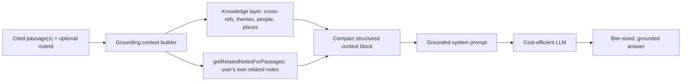

# Scripture AI Grounding (Phase 5)

The phase where the deterministic Scripture Knowledge Layer (Phases 0-4) becomes the
**grounding substrate** for Harvous's first user-facing AI features. The model reads real
cross-references, real themes, and the user's own related notes instead of recalling facts -
cheaper, more accurate, and far less prone to fabricating Scripture.

**Status:** Decision doc. Not started. Phases 0-4 of [SCRIPTURE_KNOWLEDGE_LAYER.md](./SCRIPTURE_KNOWLEDGE_LAYER.md)
are complete (data, connection layer, passage-aware tagging, Remember surfaces, suggested threads).
This doc exists because Phase 5 introduces (a) the first runtime AI call path in Harvous and (b) a
paid feature - both of which need product and architecture decisions before any code is written.

**Guiding principle:** AI is optional polish on a deterministic core, never the core itself. Every
Phase 5 feature must degrade to something useful (or absent) when the AI is unavailable, rate-limited,
or the user is out of credits.

---

## 1. Where this fits

Phase 5 is the last bullet of the knowledge-layer roadmap: *"Ground AI features. Feed the layer into
Give-Me-More-Context and Learn/Challenges as retrieval context."* It maps onto the **Learn** pillar of
[HARVOUS_NORTH_STAR.md](./HARVOUS_NORTH_STAR.md) ("this is where AI earns its keep - generating
meaningful questions from your actual notes, not generic trivia") and powers the
[GIVE_ME_MORE_CONTEXT.md](./GIVE_ME_MORE_CONTEXT.md) panel.

Two named consumers:
- **Give Me More Context (GMMC)** - an on-demand AI context panel for any passage the user engages with.
- **Learn / quizzes + challenges** - active review generated from the user's own saved content.

Both read from one shared grounding layer (Section 3) and share one billing model (Section 7).

---

## 2. Why ground at all

Today nothing in Harvous calls an LLM at runtime - Claude is used only in **offline authoring
scripts** (`server/scripts/author-subjects.ts`, `npm run bible:generate`). Phase 5 adds the first
live request path, so we get to set the pattern.

Most AI Bible tools ask the model to recall cross-references and connections from training data. That
is the expensive, hallucination-prone path. Harvous already has the facts as indexed rows:

- `ScriptureCrossReferences` (TSK, 341k edges) - real cross-references for a verse.
- `ScriptureTopicVerses` / `ScriptureTopics` (OpenBible, 6.7k topics) - real themes.
- `ScriptureEntityRefs` + `BiblePeople` / `BiblePlaces` - real people and places.
- `getRelatedNotesForPassages(userId, passages)` ([server/utils/scripture-knowledge.ts](./SCRIPTURE_KNOWLEDGE_LAYER.md)) - **the user's own notes** that connect via shared passage, cross-reference, or theme.

Feeding these into the prompt means the model **explains and connects** rather than **recalls**. That
is cheaper (smaller, cheaper models suffice), more accurate (the cross-references are real), and safer
(less room to invent a verse).

---

## 3. Shared AI-grounding architecture

A single server-side **grounding context builder** that every AI consumer reuses. This is the central
new primitive of Phase 5.

**Input:** one or more passages (`VerseKey[]`), an optional `noteId`, and the user's translation
preference.

**Process:**
- `getKnowledgeForReference(book, chapter, verse)` for a single passage, or `getKnowledgeForPassages(passages)` for a set - cross-references, themes, people, places.
- `getRelatedNotesForPassages(userId, passages)` - the user's own connected notes (titles + why they connect), so the model can answer "how does this connect to my notes?" from real data.
- Bounded: cap cross-references/themes/related notes to a token budget; the knowledge layer already exposes limit options (`crossRefLimit`, `themeLimit`, `limit`).

**Output:** a compact, structured context block (not prose) injected into the system prompt - e.g. a
small JSON/markdown block listing the passage, its top cross-references, top themes, named entities,
and the user's related note titles.

**Why a shared builder:** GMMC and Learn need the same facts. One builder means one place to tune the
token budget, one cache, one set of guardrails, and consistent grounding across features.

**New runtime concerns (first user-facing AI):**
- Server-side only (Hono API). The web prototype and native both call the grounded endpoints over HTTP, so the intelligence ships once with no Swift port (same pattern as Phase 4's suggest-threads).
- API key handling: `ANTHROPIC_API_KEY` already exists for offline scripts; runtime use needs the same env wiring on Netlify functions.
- Bundling: the API is a single bundled function (`node_bundler = "none"`), so any AI SDK must bundle cleanly (see AGENTS.md production API contract).

**Faith guardrails (non-negotiable, per AGENTS.md "Faith and AI"):**
- Never fabricate or misrepresent Scripture; ground every cross-reference/connection in real rows.
- Clearly identify AI output as AI, not a human or pastoral authority.
- Do not replace human relationships or spiritual practices.
- Route any reusable passage-summary style copy through theological review (`/theologian-agent`).
- Defer high-doctrinal-risk output (e.g. authoritative interpretation) - favor background, language, and connection over verdicts.

---

## 4. Consumer A - Give Me More Context

See [GIVE_ME_MORE_CONTEXT.md](./GIVE_ME_MORE_CONTEXT.md) for the full UX vision. Phase 5 supplies its
engine.

- **Entry points:** scripture note view, Verse of the Day, any selected/highlighted passage.
- **UX:** a bottom sheet showing transparent processing steps ("Checking cross-references...", "How
  does this connect to my notes?"). With grounding, those steps read **real data** from Section 3
  rather than asking the model to recall it.
- **Bite-sized:** 2-3 framing questions (historical/cultural, original language, cross-references,
  theological angle, connection to my notes) - each surfaces one focused chunk, not a wall of text.
- **"I'm Feeling Lucky":** skip the questions; the model picks the single most interesting grounded bit.
- **Model:** cost-efficient (e.g. a Claude Haiku-class model) to keep per-request cost low at scale;
  validate biblical/historical accuracy before shipping.

The "how does this connect to my notes?" path is the differentiator only Harvous can do well, because
`getRelatedNotesForPassages` already knows the answer deterministically.

---

## 5. Consumer B - Learn / quizzes + challenges

The North Star Learn pillar. Two distinct shapes (per
[HARVOUS_SDK_AND_FUTURE_ROADMAP.md](./HARVOUS_SDK_AND_FUTURE_ROADMAP.md) section 3.2):

- **Recall / quizzes from the user's own content:** "You wrote about grace 8 times - let's test you."
  Fill-in-the-blank, recall prompts, and **connection challenges** ("which passage connects to Romans
  8:28?") where the correct answer comes from real cross-reference/related-note data, so distractors and
  answers are grounded, not invented.
- **Curated challenge study guides:** Harvous authors a thread + study guide for a seasonal challenge;
  the quiz is built from that curated guide, **not** the user's notes. AI assists authoring/scaffolding,
  but content is reviewed (lower runtime cost, higher editorial control).

Grounding makes user-content quizzes safe: the model generates questions *about* facts we supply, rather
than asserting facts itself.

---

## 6. Cost and abuse control

- **Cost drivers:** model choice (Haiku-class default), prompt size (bounded grounding block), and
  request volume. Grounding keeps prompts small and predictable.
- **Cache the grounded context:** the knowledge layer is deterministic and shared across users; a
  passage's cross-references/themes never change. Cache the built context block by passage key so
  repeated GMMC taps on the same verse don't re-query.
- **Rate limiting:** reuse the existing `rateLimit` middleware on the new AI endpoints.
- **Token budgeting:** hard caps on grounding items and max output tokens per request.
- **Model tiering:** default to the cheap model; reserve any larger model for explicitly premium paths
  if ever needed.

---

## 7. Monetization (decision-ready)

AI features are the natural **paid** boundary - they have real marginal cost, unlike the deterministic
Remember surfaces. Build on the infrastructure that already exists rather than inventing a new pricing
system:

- `UserMetadata.tier` - `'free' | 'unlimited'` (DB source of truth).
- `getTierForAuth(auth)` / `getTierForUserId(userId)` ([server/utils/tier-limits.ts](../../server/utils/tier-limits.ts)) - tier resolution with the Clerk -> Stripe transition fallback.
- `setTierForUserId` (Stripe webhook / admin grant), `UpgradePage.tsx`, and the pricing FAQ already exist.

Recommended defaults for each open decision (all changeable; see Section 8 checklist):

| Decision | Options | Recommendation |
|---|---|---|
| Paid boundary | Hard paywall / freemium taste / monthly free credits | **Monthly free AI credits** (e.g. 3-5/month) then premium for effectively-unlimited, matching the GMMC doc's "1-3 uses/month before paywall" idea. Let free users feel the magic first. |
| Metering unit | Per-request, per-feature credits, or one shared pool | **One shared "AI credits" pool** spanning GMMC + quizzes - simplest mental model, one counter. |
| Enforcement point | Inline checks vs a gate helper | A **`canUseAiFeature(auth)` helper** analogous to `canCreateSharedSpace`, returning `{ allowed, remaining, reason }`, called by every AI endpoint. |
| Usage tracking | New `UserMetadata` column vs a usage table | **Schema decision (flagged):** start with a monthly counter on `UserMetadata` (e.g. `aiCreditsUsedThisPeriod` + `aiCreditsPeriodStart`); move to a usage table only if per-event auditing/analytics is needed. |
| Tier shape | Keep free/unlimited vs add an AI tier | **Fold AI into the existing `unlimited` tier** initially (one upgrade, more value); split out an AI tier only if cost data demands it. |
| Period reset | Calendar month vs rolling 30 days | **Calendar month**, reset via the stored period-start. |

This keeps the paywall consistent with the current two-tier model and reuses `UpgradePage` for the
upgrade path.

---

## 8. Open decisions checklist

Actionable list - each has a recommended default above; revisit before building.

- [ ] Paid boundary -> monthly free credits then premium (default 3-5/month free).
- [ ] Credit unit -> single shared AI-credits pool across GMMC + Learn.
- [ ] Free credit count and premium allowance (soft cap vs truly unlimited).
- [ ] Usage tracking storage -> `UserMetadata` counter columns vs usage table.
- [ ] Gate helper shape -> `canUseAiFeature(auth)` returning remaining + reason.
- [ ] Tier shape -> fold into `unlimited` vs new AI tier.
- [ ] Period reset -> calendar month.
- [ ] Default model + accuracy eval bar before launch.
- [ ] Grounding token budget (cross-refs / themes / related notes caps).
- [ ] Context cache strategy + invalidation (per passage key).
- [ ] Which entry points ship first (GMMC scripture note view vs VOTD vs editor selection).
- [ ] Theological review process for any reusable AI copy.

---

## 9. Phased rollout

1. **Grounding builder + one GMMC endpoint.** Ship the shared context builder and a single grounded
   GMMC request (e.g. "I'm Feeling Lucky" on a scripture note). Validate biblical accuracy internally
   before exposing.
2. **GMMC full panel.** Framing questions, processing-step UI, more entry points.
3. **Billing.** Wire `canUseAiFeature` + credits + `UpgradePage` once the feature proves valuable.
4. **Learn / quizzes.** Reuse the same builder for grounded recall and connection challenges.
5. **Curated challenges.** AI-assisted authoring with editorial review.

Each step is independently valuable and degrades gracefully if AI is off.

---

## Related Docs

- [SCRIPTURE_KNOWLEDGE_LAYER.md](./SCRIPTURE_KNOWLEDGE_LAYER.md) - the deterministic Phases 0-4 substrate this grounds on.
- [GIVE_ME_MORE_CONTEXT.md](./GIVE_ME_MORE_CONTEXT.md) - Consumer A UX vision.
- [HARVOUS_NORTH_STAR.md](./HARVOUS_NORTH_STAR.md) - the Learn pillar this serves.
- [HARVOUS_SDK_AND_FUTURE_ROADMAP.md](./HARVOUS_SDK_AND_FUTURE_ROADMAP.md) - Learn features (challenges, recall/quizzes) sequencing.
- [../../server/utils/tier-limits.ts](../../server/utils/tier-limits.ts) and [../../server/utils/subscription.ts](../../server/utils/subscription.ts) - existing tier/billing infrastructure to extend.
