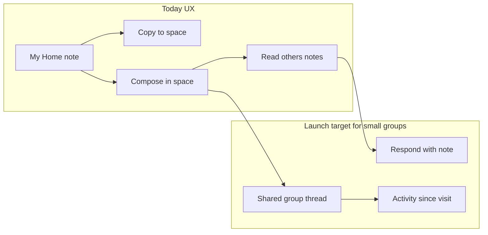
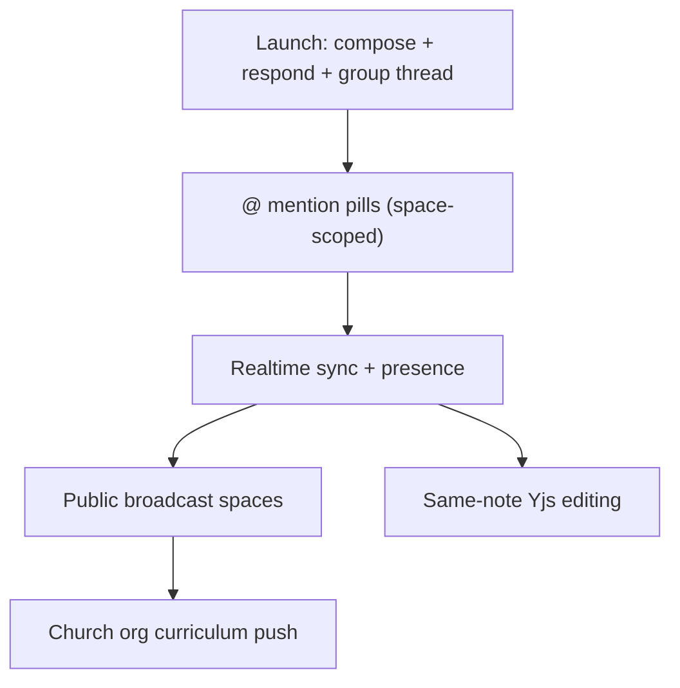

# Shared Spaces — pre-launch strategy

**Status:** Product planning (July 2026). Applies to the July 2026 clean-break Shared Spaces foundation on `feat/shared-spaces-foundation` — not the retired Feb 2026 v1 model. Canonical implementation details: [SHARED_SPACES_DEV_NOTES.md](../SHARED_SPACES_DEV_NOTES.md) (updated on the foundation branch). Collaboration vision: [COLLABORATIVE_SHARED_SPACES.md](./COLLABORATIVE_SHARED_SPACES.md). Pricing: [MONETIZATION_AND_PRICING.md](./MONETIZATION_AND_PRICING.md).

**Launch posture (decided):** Hold paid Shared Spaces until **1–2 small-group differentiators** ship on top of the foundation. Primary audience: **small co-study groups** (life group, study group, friends).

---

## Where you are today

The foundation branch is **architecturally launch-ready** but **product-positioning is not**.

**Already built (strong foundation):**

- Paid add-on gate (0 owned free → 10 owned with add-on; join always free; 30 people/space)
- Create shared space, invite links, join preview/redeem, people/settings hub
- **Native compose in shared space** (not just copy-in) — any member authors notes directly
- Merged notes list with author chips; foreign notes read-only for other members
- Dedicated shared-space dashboard (`spa/src/pages/prototype/PrototypeSidebarSharedSpaceView.tsx`)
- Copy-in from personal notes (`POST /api/spaces/:spaceId/copy-notes`)

**Why it still *feels* like "copy to shared space":**

- Copy is the most visible cross-space action (`PrototypeNoteMoreMenu` → "Copy to shared space…")
- Other members' notes are **read-only** — no way to respond in-context
- Study threads / scripture index are **author-scoped** inside a shared space (each person sees their own clusters, not a shared thread)
- Freshness is **45s poll**, not live presence
- No notifications when someone adds content

---

## Recommended launch posture

Ship paid Shared Spaces only after the product answers *"How do we study Philippians together this semester?"* — not *"How do I duplicate a note into a folder?"*

---

## Tier 1 — Ship before paid launch (pick 2)

Highest-leverage features for small groups **without** full collaborative editing (Yjs/Hocuspocus).

### 1. Respond from a shared note (recommended #1)

**Problem:** Reading another member's note is passive. The read-only banner blocks any social loop.

**Shape:**

- On foreign shared notes: **"Respond with a note"** (and optionally keep text selection → new note)
- Creates a **new note in the same shared space** with existing `linkedFromNoteId` + quoted excerpt block
- Reuses [SELECTED_TEXT_NOTE_CREATION.md](../SELECTED_TEXT_NOTE_CREATION.md) + `PrototypeNoteActionBar` connection trail
- Author chip on the response; connection visible in inspector

**Why first:** Async conversation layer for life groups — **Scenario 1** in [COLLABORATIVE_SHARED_SPACES.md](./COLLABORATIVE_SHARED_SPACES.md) — without co-editing one doc.

**Scope guard:** Space-scoped only; no @-mentions yet (cross-space rules pre-decided in foundation dev notes; see mention-pills design on the foundation branch).

---

### 2. Space-native group study thread (recommended #2)

**Problem:** Threads today don't feel *shared* — each member's study threads stay author-scoped per dev notes.

**Shape:**

- From shared-space dashboard or sidebar: **"Start a group study"** → thread created with `spaceId` set
- All members can attach notes to **the same thread** (unioned thread view in shared space)
- Dashboard spotlight card surfaces the active group thread + recent contributors

**Why second:** Answers **Scenario 2** — "we're studying Philippians together for 8 weeks" — the clearest small-group mental model.

**Backend touch:** Extend shared-space queries to union thread membership by `spaceId` (called out as fast-follow in dev notes). Start with notes-on-thread in shared space before full scripture-index union.

---

### Honorable mention (if you only want one "social" + one "infra")

| Option | Small-group value | Effort |
|--------|-------------------|--------|
| **Activity since last visit** (`useSharedSpaceVisit`) | "3 new notes since Tuesday" — pulls people back | Low |
| **Lightweight notifications** (email digest / in-app) | Closes the async loop when not in app | Medium |
| **Enable Supabase Realtime** for shared spaces | Faster sync; optional "recently active" without cursors | Medium (infra exists, disabled) |

**Recommendation:** Prefer **Respond + Group thread** over Realtime for launch — Realtime alone doesn't change the *story*; it only makes polling faster.

---

## Tier 2 — Operational must-haves (parallel, not optional)

These don't differentiate UX but **will break trust** if skipped at paid launch:

| Item | Why | Reference |
|------|-----|-----------|
| **Clerk Billing + webhook → `sharedSpacesAddOn`** | JWT fallback + manual DB grant isn't production billing | Dev notes § Entitlement |
| **Rebase `main` + safe `db:push`** | Avoid dropping unrelated schema | Dev notes § Before merging |
| **Update help/docs** | `help/using-spaces.md` still describes retired v1 Private/Shared toggle | Stale vs add-on model |
| **Launch comms for clean break** | v1 shared spaces become personal; old links 410 | Dev notes § Clean break |
| **Release notes + `/addon` copy** | Lead with *study together*, not *copy* | `UpgradePageContent.tsx` |
| **E2E on new invite model** | Legacy join specs may not match `SpaceInvites` | Add join + respond flow smoke test |
| **Mobile toolbar space orb** | Space switcher in unified toolbar when sidebar is drawer | `NativeToolbar.tsx` |

---

## Tier 3 — Post-launch vision (sequenced)

For small groups → church scale:

| Horizon | Feature | Small-group fit |
|---------|---------|-----------------|
| **Next 90 days** | @ mention pills, highlight reactions, person-mentions | Richer linking without co-edit |
| **Medium** | Realtime + "who's studying" | Live small-group feel |
| **Medium** | Group Leader SKU, leader role activation | Host pays, members free |
| **Long** | Public spaces (broadcast + copy-out) | Church content, not co-study |
| **Long** | Yjs collaborative editing | Same doc editing — highest cost, lowest need for async Bible study |

**Product principle to keep:** *"Run the group on Harvous. Everyone brings their own Review."* ([MONETIZATION_AND_PRICING.md](./MONETIZATION_AND_PRICING.md)) — shared space is the **room**, not a Google Doc.

See also: [REALTIME_SUPABASE_PLAN.md](./REALTIME_SUPABASE_PLAN.md), [CHURCH_ORG_AND_CURRICULUM.md](./CHURCH_ORG_AND_CURRICULUM.md), [SPACE_MODES_PRODUCT.md](./SPACE_MODES_PRODUCT.md).

---

## Messaging shift for launch

**Avoid leading with:**

- "Copy notes to a shared space"
- "Collaborative editing" (not shipped; sets wrong expectation)

**Lead with:**

- "Your group studies in one place — each person writes their own notes"
- "See what others added, respond to their insights, follow a shared study thread"
- "Invite with a link; joining is always free"

Copy-in stays as a **power feature** ("Bring something from My Home into the group"), not the headline.

---

## Suggested implementation order

1. **Respond from shared note** — UI on read-only foreign notes + compose in active shared space
2. **Space-native group thread** — create + unioned thread view on dashboard
3. **Activity since visit polish** — cheap win on existing visit tracking
4. **Billing webhook + Clerk setup** — in parallel with UX work
5. **Docs, release notes, e2e, merge prep**
6. **Paid launch**

Estimated scope for items 1–2: one focused branch each (~editor-agent + content-agent + data-agent), not a rewrite of the foundation.

---

## What NOT to block launch on

Explicit non-goals already documented — safe to defer:

- Email invites, leader role UI, ownership transfer
- Full sidebar generalization (folders/threads/scripture union everywhere)
- Public spaces, church org
- Same-note collaborative editing
- Legacy table drops

These are the "more cool possibilities" lane — valuable, but not required for a credible small-group v1.

---

## Related docs

- [SHARED_SPACES_DEV_NOTES.md](../SHARED_SPACES_DEV_NOTES.md) — current behavior and data model
- [COLLABORATIVE_SHARED_SPACES.md](./COLLABORATIVE_SHARED_SPACES.md) — two collaboration scenarios (personal→group, group-native)
- [SPACE_MODES_PRODUCT.md](./SPACE_MODES_PRODUCT.md) — limits matrix and mode language
- [REALTIME_SUPABASE_PLAN.md](./REALTIME_SUPABASE_PLAN.md) — presence and co-edit roadmap
- [HARVOUS_SDK_AND_FUTURE_ROADMAP.md](./HARVOUS_SDK_AND_FUTURE_ROADMAP.md) — SDK deferred; spaces before integrations
