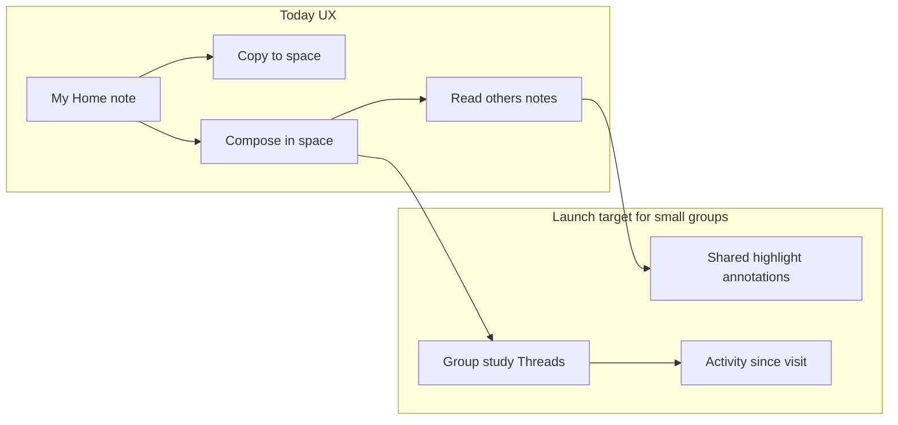
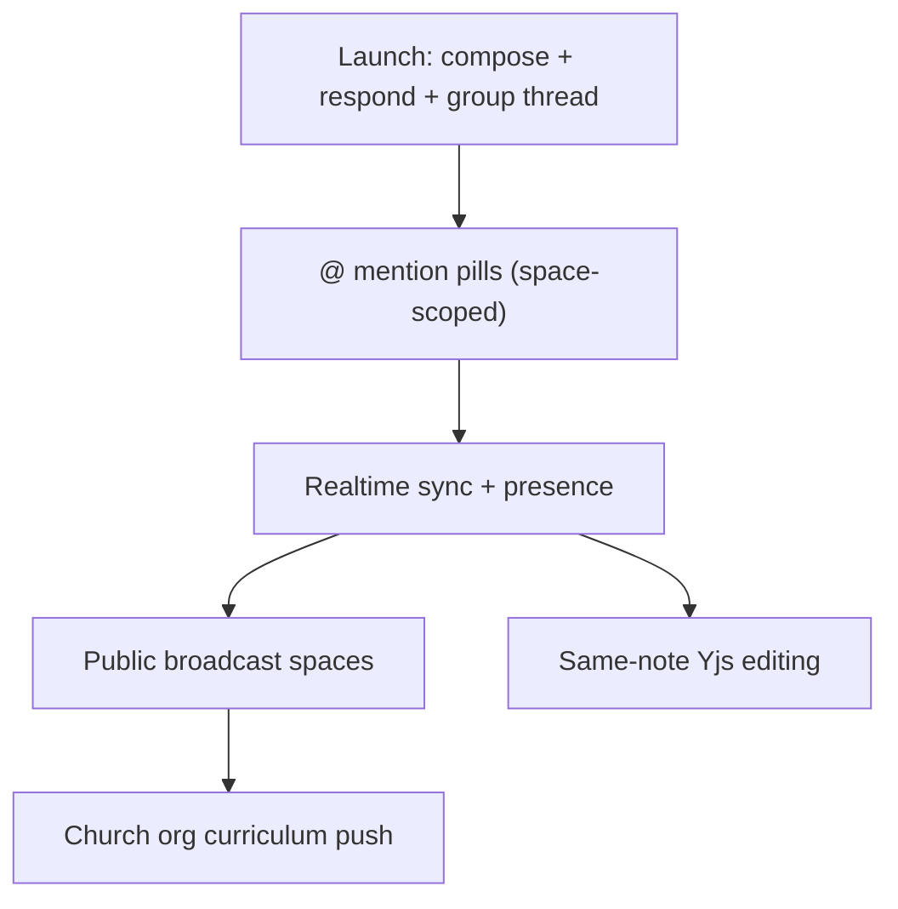

# Shared Spaces — pre-launch strategy

**Status:** Product planning (July 2026). Applies to the July 2026 clean-break Shared Spaces foundation on `feat/shared-spaces-foundation` — not the retired Feb 2026 v1 model. Canonical implementation details: [SHARED_SPACES_DEV_NOTES.md](../SHARED_SPACES_DEV_NOTES.md) (updated on the foundation branch). Collaboration vision: [COLLABORATIVE_SHARED_SPACES.md](./COLLABORATIVE_SHARED_SPACES.md). Pricing: [MONETIZATION_AND_PRICING.md](./MONETIZATION_AND_PRICING.md).

**Launch posture (decided):** Hold paid Shared Spaces until **1–2 small-group differentiators** ship on top of the foundation. Primary audience: **small co-study groups** (life group, study group, friends).

---

## Where you are today

The foundation branch is **architecturally launch-ready** but **product-positioning is not**.

**Already built (strong foundation):**

- Paid add-on gate (0 owned free → 10 owned with add-on; join always free; 30 people/space)
- Create shared space, invite links, join preview/redeem, people/settings hub
- **Native compose in shared space** (not just copy-in) — any member authors notes directly
- Merged notes list with author chips; foreign notes read-only for other members
- Dedicated shared-space dashboard (`spa/src/pages/prototype/PrototypeSidebarSharedSpaceView.tsx`)
- Copy-in from personal notes (`POST /api/spaces/:spaceId/copy-notes`)

**Why it still *feels* like "copy to shared space":**

- Copy is the most visible cross-space action (`PrototypeNoteMoreMenu` → "Copy to shared space…")
- Other members' notes are **read-only** — no way to respond in-context
- Study threads / scripture index are **author-scoped** inside a shared space (each person sees their own clusters, not a shared thread)
- Freshness is **45s poll**, not live presence
- No notifications when someone adds content

---

## Recommended launch posture

Ship paid Shared Spaces only after the product answers *"How do we study Philippians together this semester?"* — not *"How do I duplicate a note into a folder?"*

---

## Tier 1 — UX spec (locked)

**Principle:** Reuse existing Harvous structures — **highlight dock + `StudyThreadEntries`** for cross-member commentary; **`Threads` + `NoteThreads`** for group study — not new parallel systems.

---

### 1. Shared highlight annotations (replaces generic "respond with a note")

**Mental model:** You don't edit Sarah's note. You **highlight a passage on her note and leave an annotation** — the same muscle memory as personal study (accent + mini-note in the highlight dock). The difference: annotations are **visible to everyone in the space** as an overlay on her read-only note.

**User flow:**

1. Open Sarah's note in a shared space (view only — her body stays untouched).
2. Select text → existing **highlight dock** opens (accent picker + mini-note field).
3. Save → creates a **`StudyThreadEntry`** anchored to Sarah's `parentNoteId`, with **`userId` = you** (not Sarah).
4. Everyone viewing that note sees **all members' highlights inline** (multiple people can annotate the same paragraph).
5. Tap a highlight → dock shows annotation + **author** (name/chip).

**Why this over "new linked note":** Matches how users already think in Harvous (highlight → annotate). Keeps commentary **in context on the passage** instead of forcing a separate note hop. Stronger for Bible study: the conversation stays on the text.

**Permissions (decided):**

- **Sarah (note author)** can remove others' annotations on **her** note.
- **Space owner** can moderate annotations anywhere in the space.
- Annotators edit/delete **their own** annotations.

**Technical shape (foundation branch):** Extend `StudyThreadEntries` + highlight APIs for `parentNoteId` owned by another member when both notes share a `spaceId` and viewer has membership. Render overlay from entries where `parentNoteId` = focus note; do **not** write marks into Sarah's TipTap document.

**UI:**

- Reuse highlight dock — no new popover pattern for Tier 1.
- Replace passive **"View only"** banner with affordance that selection/highlight is enabled for annotation (e.g. "Sarah's note · Highlight to respond").
- Optional later: **"Expand to full note"** from dock (`linkedNoteId`) — not Tier 1 unless needed.

**Out of scope Tier 1:** @-mentions, email when someone annotates your note, co-editing Sarah's body.

---

### 2. Group study threads (reuse `Threads` + `NoteThreads`)

**Mental model:** A **group study** is a normal **Thread** with `spaceId` set to the shared space — the container where members **add their own notes together** over a season (Scenario 2 in [COLLABORATIVE_SHARED_SPACES.md](./COLLABORATIVE_SHARED_SPACES.md)). Not a new table or space-level entity.

**User flow:**

1. **Start group study** on shared-space dashboard → create `Thread` (title, optional passage/subtitle) in this `spaceId`. **Any member** can start one.
2. **Pin one thread** on dashboard as **current study** spotlight (most recent / owner-pinned).
3. **New note** in shared space → optional **"Add to study thread"** picker (threads in this space; default none).
4. Notes linked via existing **`NoteThreads`** junction; merged list shows author chips.

**Why reuse Threads:** Same core structure users already have in My Home; shared space only changes **visibility** (union notes from all members on that thread) and **creation context** (`spaceId`).

**Backend touch:** Union thread list + note membership queries for shared `spaceId` (called out as fast-follow in dev notes). Tier 1 minimum: create thread in space, attach notes via picker, dashboard spotlight for pinned/current thread.

**Deferred Tier 1:** Full sidebar Threads list mode union; scripture-index union across members.

---

### 3. Activity (honorable mentions — in Tier 1)

| Item | Spec |
|------|------|
| **Dashboard unseen** | Polish existing visit tracking: "4 new since your visit" + who ("Sarah added 2 notes") |
| **Space switcher dot** | Subtle indicator when any joined space has unseen activity |
| **Email / push** | **Deferred** post-launch |

**Deferred Tier 1:** Dedicated activity sheet; "Mike annotated your note" feed item; Supabase Realtime (polling stays acceptable).

---

## Tier 1 — implementation order

1. **Shared highlight annotations** — foreign-note selection, cross-user `StudyThreadEntry`, overlay render, moderation
2. **Group study threads** — dashboard create + pin spotlight, compose thread picker, shared-space thread/note union queries
3. **Activity polish** — dashboard unseen copy + switcher dot
4. **Billing webhook + Clerk setup** (parallel)
5. **Docs, release notes, e2e, merge prep**
6. **Paid launch**

Agents: `/editor-agent` (read-only note selection + dock), `/content-agent` (dashboard, thread picker), `/data-agent` (API + union queries).

---

## Tier 1 — previously considered (superseded)

Generic "respond with a note" (linked note + quote) — replaced by shared highlight annotations

Earlier draft: banner CTA → new note with `linkedFromNoteId` + optional quote block. **Superseded** by overlay annotation model (decided July 2026) — stronger fit with highlight/annotation UX.

---

## Honorable mention — not Tier 1

| Option | Notes |
|--------|--------|
| **Supabase Realtime** | Faster sync; doesn't change launch story |
| **Email digest** | Deferred |
| **Full activity sheet** | After annotation + threads prove the loop |

## Tier 2 — Operational must-haves (parallel, not optional)

These don't differentiate UX but **will break trust** if skipped at paid launch:

| Item | Why | Reference |
|------|-----|-----------|
| **Clerk Billing + webhook → `sharedSpacesAddOn`** | JWT fallback + manual DB grant isn't production billing | Dev notes § Entitlement |
| **Rebase `main` + safe `db:push`** | Avoid dropping unrelated schema | Dev notes § Before merging |
| **Update help/docs** | `help/using-spaces.md` still describes retired v1 Private/Shared toggle | Stale vs add-on model |
| **Launch comms for clean break** | v1 shared spaces become personal; old links 410 | Dev notes § Clean break |
| **Release notes + `/addon` copy** | Lead with *study together*, not *copy* | `UpgradePageContent.tsx` |
| **E2E on new invite model** | Legacy join specs may not match `SpaceInvites` | Add join + respond flow smoke test |
| **Mobile toolbar space orb** | Space switcher in unified toolbar when sidebar is drawer | `NativeToolbar.tsx` |

---

## Tier 3 — Post-launch vision (sequenced)

For small groups → church scale:

| Horizon | Feature | Small-group fit |
|---------|---------|-----------------|
| **Next 90 days** | @ mention pills, highlight reactions, person-mentions | Richer linking without co-edit |
| **Medium** | Realtime + "who's studying" | Live small-group feel |
| **Medium** | Group Leader SKU, leader role activation | Host pays, members free |
| **Long** | Public spaces (broadcast + copy-out) | Church content, not co-study |
| **Long** | Yjs collaborative editing | Same doc editing — highest cost, lowest need for async Bible study |

**Product principle to keep:** *"Run the group on Harvous. Everyone brings their own Review."* ([MONETIZATION_AND_PRICING.md](./MONETIZATION_AND_PRICING.md)) — shared space is the **room**, not a Google Doc.

See also: [REALTIME_SUPABASE_PLAN.md](./REALTIME_SUPABASE_PLAN.md), [CHURCH_ORG_AND_CURRICULUM.md](./CHURCH_ORG_AND_CURRICULUM.md), [SPACE_MODES_PRODUCT.md](./SPACE_MODES_PRODUCT.md).

---

## Messaging shift for launch

**Avoid leading with:**

- "Copy notes to a shared space"
- "Collaborative editing" (not shipped; sets wrong expectation)

**Lead with:**

- "Your group studies in one place — each person writes their own notes"
- "See what others added, **highlight their notes to respond**, follow a group study thread"
- "Invite with a link; joining is always free"

Copy-in stays as a **power feature** ("Bring something from My Home into the group"), not the headline.

---

## Suggested implementation order

See **Tier 1 — implementation order** above.

## What NOT to block launch on

Explicit non-goals already documented — safe to defer:

- Email invites, leader role UI, ownership transfer
- Full sidebar generalization (folders/threads/scripture union everywhere)
- Public spaces, church org
- Same-note collaborative editing
- Legacy table drops

These are the "more cool possibilities" lane — valuable, but not required for a credible small-group v1.

---

## Related docs

- [SHARED_SPACES_DEV_NOTES.md](../SHARED_SPACES_DEV_NOTES.md) — current behavior and data model
- [COLLABORATIVE_SHARED_SPACES.md](./COLLABORATIVE_SHARED_SPACES.md) — two collaboration scenarios (personal→group, group-native)
- [SPACE_MODES_PRODUCT.md](./SPACE_MODES_PRODUCT.md) — limits matrix and mode language
- [REALTIME_SUPABASE_PLAN.md](./REALTIME_SUPABASE_PLAN.md) — presence and co-edit roadmap
- [HARVOUS_SDK_AND_FUTURE_ROADMAP.md](./HARVOUS_SDK_AND_FUTURE_ROADMAP.md) — SDK deferred; spaces before integrations
