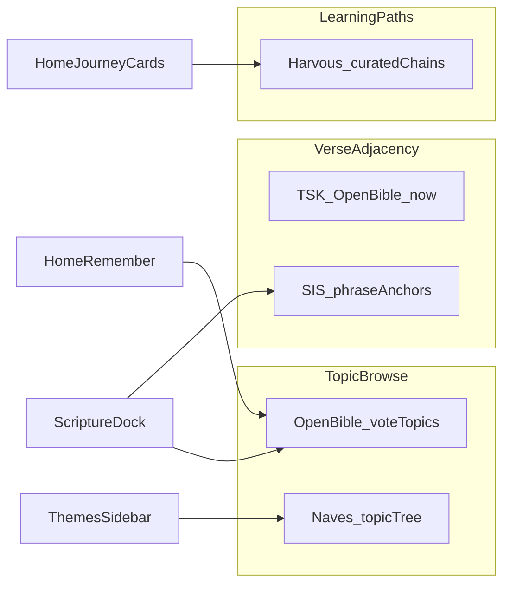
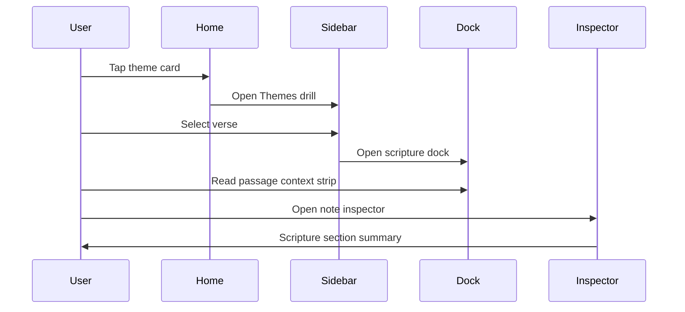

# Study Surfaces & Knowledge UX

Where the scripture knowledge layer, Easton's dictionary, and future depth sources (ISBE, GMMC,
Review) should appear in Harvous — docks, Home, sidebar list views, right panel, and cross-surface
flows. A brainstorm and exploration doc, not an implementation spec.

**Status:** Vision / exploration. Phases 0–4 of the knowledge layer are shipped server-side;
most of that data is **not yet visible in study docks**. Prototype Home surfaces three connection
card types; the inspector and sidebar lack theme browse. ISBE is not in the codebase.

**Guiding principle:** Deterministic graph first (indexed joins on `(book, chapter, verse)`),
optional depth second (ISBE expand, GMMC), runtime AI third (Review). Same hierarchy as
[SCRIPTURE_KNOWLEDGE_LAYER.md](./SCRIPTURE_KNOWLEDGE_LAYER.md).

---

## Why this doc exists

Harvous has invested in two parallel substrates:

1. **Lexicon** — Easton's Bible Dictionary for word-level lookup while writing (reference dock,
   inline dotted hints).
2. **Passage graph** — OpenBible topics, TSK cross-references, STEPBible people/places, plus
   curated chapter subjects — for connections between notes and passages.

The **data pipeline is largely done**; the **UX gap** is that users still experience scripture
study as "read passage text" and "look up a word," without seeing themes, cross-refs, or library-wide
connections at the moment of curiosity. This doc maps content layers to surfaces and prioritizes
what to build next.

---

## Three content layers

| Layer | Question | Data source | Primary UX today |
|---|---|---|---|
| **Lexicon** | What does this *word* mean? | Easton's (`server/data/dictionaries/`) | Reference dock, inline dotted hints |
| **Lexicon depth** | Tell me more about this *headword* | ISBE (public domain, not shipped) | *Proposed: Expand in reference dock* |
| **Passage graph** | What is this *verse* connected to? | OpenBible topics, TSK, people/places, chapter-subjects | Backend + 3 prototype Home cards |

### How they differ (don't conflate)

- **Easton's** answers headword lookups: "Who is Aaron?" — triggered by a **token in prose**.
- **ISBE expand** is the same lookup moment with **essay depth** — still headword-centric.
- **Topical / passage graph** answers passage semantics: "What themes touch Romans 8:28?" and
  "What else in my library shares them?" — triggered by **cited verses**, not arbitrary words.

Scraping third-party Q&A sites (e.g. GotQuestions) is out of scope — licensing, editorial skew,
and unstructured prose that doesn't join on verse keys. Stick to PD/CC-BY sources already in the
pipeline.

```mermaid
flowchart TB
  subgraph lexicon [LexiconLayer]
    Eastons[EastonsDictionary]
    ISBE[ISBEExpand]
  end
  subgraph graph [PassageGraphLayer]
    Topics[OpenBibleTopics]
    CrossRefs[TSKCrossRefs]
    Entities[PeoplePlaces]
    Subjects[ChapterSubjects]
  end
  subgraph surfaces [UISurfaces]
    Docks[StudyDocks]
    Home[PrototypeHome]
    Sidebar[SidebarListViews]
    RightPanel[InspectorAndThreadPanel]
  end
  Eastons --> Docks
  ISBE --> Docks
  Topics --> Docks
  Topics --> Home
  CrossRefs --> Docks
  CrossRefs --> Home
  Entities --> Docks
  Subjects --> Home
  graph --> Sidebar
  graph --> RightPanel
```

---

## Candidate datasets (think through before importing)

Three external sources complement — but do not replace — what Harvous already ships (TSK cross-refs,
OpenBible topics, chapter-subjects). Each answers a **different interaction mode** on the passage
graph. None are in the codebase yet.

### Three interaction modes

Harvous today is mostly **adjacency**: verse ↔ verse, verse ↔ theme, note ↔ note. These candidates
split the graph into adjacency (refined), browse (topic tree), and paths (ordered journeys).



| Source | Mode | vs what you have | License (confirm before import) |
|---|---|---|---|
| [Scripture Interpreting Scripture](https://crossreferences.org/project/) ([GitHub](https://github.com/CrossReferences-org/bible-cross-references)) | **Phrase-aware cross-refs** | Same TSK foundation; adds anchor phrases per translation + curation | CC BY 4.0 (verify repo README) |
| **Nave's Topical Bible** (~1897) | **Topic browse tree** | OpenBible = verse-level votes; Nave's = ~20k topic/subtopic entry points | Public domain |
| **Thompson Chain** (concept) | **Ordered learning paths** | Nothing like sequenced theme journeys today | Modern edition **copyrighted** — do not scrape/import |

### 1. Scripture Interpreting Scripture (SIS) — highest priority candidate

**Why it matters:** Shipped TSK edges (`ScriptureCrossReferences`) join on `(book, chapter, verse)` only.
When a user reads NASB/ESV/CSB in the scripture dock, raw TSK does not show **which phrase** in the
verse a link attaches to. SIS restructures TSK with phrase-level anchors mapped to modern translations
and ongoing curation (weak links removed; conservative edits vs verbatim TSK).

**Best surfaces:**

- Scripture dock **Cross-references** section (P0) — inline phrase → target ref in passage HTML
- Home cross-ref card and cross-ref pair dock — show phrase context on both sides
- Thread suggestion / connection reasons — richer "why linked" copy

**Strategy — complement, don't replace:**

- Keep existing TSK rows for DB joins, scoring (`votes`), and `getKnowledgeForReference()`.
- Add SIS as a **display layer** (and optional curation overlay) keyed on verse + translation + anchor phrase.
- Pilot one Harvous translation first; SIS mapping is furthest along for KJV/BSB — plan mapping work or
  upstream contribution for NASB, ESV, CSB, etc.

**Think through:**

- Translation coverage vs `BibleVerses` / user profile preference
- Storage shape: separate `cross-ref-anchors.json` vs columns on existing cross-ref table
- Whether SIS curation diverges enough from OpenBible TSK to warrant dual sources long-term
- Attribution line in dock footer alongside existing OpenBible credit

### 2. Nave's Topical — strong fit for Themes browse

**Why it matters:** OpenBible excels at **"what themes touch this verse?"** (vote weights, good for
auto-tag corroboration with thresholds). Nave's excels at **"I want to study covenant / exile / holiness"**
— a large alphabetical topic tree built for browse, not per-verse ranking.

**Best surfaces:**

- Sidebar **Themes list mode** (P1) — primary browse index
- Home theme card → collection drill
- Topical study template entry ([NOTE_TEMPLATES.md](./NOTE_TEMPLATES.md))

**Strategy — use both:**

| Job | Source |
|---|---|
| Passage dock theme chips, auto-tag corroboration | OpenBible (`minRelevance` thresholds) |
| Sidebar browse, Home labels, "study X" entry points | Nave's topic tree (PD) |
| Cleaner Home card copy | `chapter-subjects.json` or mapped Nave labels |

**Think through:**

- Import from a **clean PD source** (e.g. CrossWire/SWORD), not commercial scrapes
- Map Nave topic slugs ↔ OpenBible topic ids where they overlap (avoid duplicate chips)
- Filter browse tree to topics that appear in the **user's library** (passage join), same as planned Themes mode
- Nave's scholarship is early-1900s — fine for navigation; not for doctrinal prose without review

### 3. Thompson Chain — concept yes, import probably no

**Why it's interesting:** Thompson Chain is **sequenced curriculum** (theme A → B → C), not flat
verse adjacency or topic lookup. That matches **discipleship journeys**, Compete / Season Pass
curated guides, and Home "thematic journey" cards — none of which raw TSK or OpenBible provide.

**Best surfaces (if built):**

- Home journey card — step through a themed path across passages
- Group/church curriculum ([CHURCH_ORG_AND_CURRICULUM.md](./CHURCH_ORG_AND_CURRICULUM.md))
- Review session scoped to a chain

**Strategy — author Harvous chains, don't import Thompson:**

- Modern Thompson Chain-Reference is **copyrighted/trademarked** (Zondervan). Some 1934 PD material
  exists but is not the modern product users expect.
- Ship curated paths as `server/data/scripture-knowledge/chains.json`: ordered nodes (topic ids,
  passage keys, optional note prompts) with `/theologian-agent` review.
- Reuse `TopicRelations` / promoted `conceptOverlaps` pairs as chain edges where possible.

**Think through:**

- Chains as **editorial product** (Season Pass, church org) vs automatic graph derivation
- UI: new dock type vs sidebar drill vs dedicated journey pane
- How user notes attach to chain steps ("you've written on step 2 of 5")

### What not to do

- **Scrape** BibleGateway, YouTube, or GotQuestions into the canonical layer — link out if ever.
- **Replace** OpenBible topics with Nave's for verse-level scoring — different jobs.
- **Replace** TSK verse keys with SIS-only data — keep joins on Harvous `(book, chapter, verse)`.
- **Import** modern Thompson Chain without explicit license.

### Dataset decision checklist

Before adding any row to [ATTRIBUTION.md](../server/data/scripture-knowledge/ATTRIBUTION.md):

1. License confirmed (PD, CC-BY, or CC-BY-SA — note SA implications for shipped JSON)
2. Verse references normalize through existing OSIS/canonical pipeline (`scripture-osis.ts`, `bible-chapters.json`)
3. Clear **primary surface** (dock vs sidebar vs Home) so data doesn't become orphaned backend-only
4. Complement or replace decision documented — avoid two sources doing the same job without a merge rule
5. Native parity impact assessed (dock payload size, offline bundle for native)

---

## Current state audit

### Study docks

See [STUDY_DOCK_CAROUSEL.md](../STUDY_DOCK_CAROUSEL.md) and
[PROTOTYPE_NATIVE_MENU_CONTENT_PARITY.md](../design-parity/PROTOTYPE_NATIVE_MENU_CONTENT_PARITY.md)
§8. **Note:** `STUDY_DOCK_CAROUSEL.md` still says reference docks are outside the carousel; web
now renders `ReferenceDockWeb` inside `StudyDockCarouselWeb` — update that doc as a follow-up.

| Dock | Key files | Shown today | Not shown yet |
|---|---|---|---|
| **Scripture pill** | `ScripturePillChromeWeb.tsx`, `ActiveScripturePillDock.swift` | Passage HTML, ref picker, Easton hints in passage (prototype/native), saved passage paints | Themes, TSK cross-refs, people/places chips, compare-in-dock (web) |
| **Reference** | `ReferenceDockWeb.tsx`, `PendingReferenceDock.swift` | Easton body, see-also chips (≤8), save/accent chrome | ISBE expand, topical bridge, user's verses mentioning entity |
| **Highlight** | `HighlightDockWeb.tsx`, `ActiveHighlightDock.swift` | Mini-note, Respond chips | Passage context strip; web routes reference out instead of inline Easton (native embeds `EastonsEntryView`) |

**Carousel behavior (web + native):** per-note stack, max 8 entries, horizontal row with one
expanded active card, drag reorder, inactive cards skip heavy loads (`interactionActive={false}`).
Runs on prototype note routes and native `NoteEditorView`; classic production `/note/*` does not
mount the carousel today.

### Prototype Home

`PrototypeSidebarHomeView.tsx` + `prototype-home-trends.ts`.

**Behavioral cards:** Continue, revisit, highlight spotlight, thread spotlight, tidy up, VOTD.

**Knowledge-layer cards (Phase 3 Remember):**

| Card | Derivation | Min notes | Click today |
|---|---|---|---|
| A theme connecting your notes | `deriveSubjectConnections` + `chapter-subjects.json` | 3 | Opens **first note only** |
| A cross-reference in your notes | `deriveCrossRefConnections` + space scripture-connections API | 2 | Opens **first note only** |
| A passage you keep returning to | `derivePassageConnections` | 2 | Opens scripture index drill-down |

**Gaps:** connection cards don't open collections; liturgical season chip is stubbed (`onClick`
no-op); OpenBible verse-level themes and people/places not on Home; all three knowledge cards
hidden until full note pagination completes.

### Sidebar list modes

`SidebarListMode`: `notes | folders | highlights | scripture | threads` (`proto-shell-context.tsx`).

| Mode | Drill | Knowledge gap |
|---|---|---|
| Scripture | book → passage → citing notes | No theme/cross-ref preview at passage level |
| Highlights | kind filters (notes, connected, scripture, references) | No theme-based grouping |
| Threads | thread → connected notes | Edge "why" not shown in list |
| *(none)* | — | No Themes/Topics browse; dictionary list mode removed (Easton's editor-only) |

### Right panel

`PrototypeInspectorPane.tsx`: Info, Tags, Connected Notes, Folders — **no Scripture section**
(passages cited, themes, cross-refs for this note).

`PrototypeStudyThreadPanel.tsx`: connected-note graph — **no connection reason** on edges (data
exists in thread-suggestion ranking).

---

## Dock brainstorm

Organized by affordance → data → entry point → parity note.

### Scripture pill dock — Passage context strip

**Placement:** collapsible sections below passage HTML, lazy-loaded when carousel card is active
and expanded.

| Section | Content | Data | Tap action |
|---|---|---|---|
| **Themes** | Top 3–5 labels | `getKnowledgeForReference()` with `minRelevance` threshold | Open theme drill (sidebar) or in-dock verse list |
| **Cross-references** | Top TSK edges by votes; phrase context when SIS mapped | `ScriptureCrossReferences` (+ future SIS anchor layer) | Open second scripture dock card or jump ref picker |
| **People & places** | Entity chips | `ScriptureEntityRefs` + `BiblePeople` / `BiblePlaces` | Person → reference dock; place → Easton or geo later |
| **Your notes** | Compact list + reason | `getRelatedNotesForPassages` | Navigate to note; show "shared theme / cross-ref / same passage" |

**Implementation hints:** reuse `server/utils/scripture-knowledge.ts`; client caching pattern in
`passage-knowledge-cache.ts`. Respect theme thresholds from `passage-aware-tags.ts` — UI should
not surface weak/incidental OpenBible edges.

**Native parity:** compare-in-dock already exists on native (`ScriptureDockCompareViews`); web
uses separate `ScriptureComparePanel` for classic app — decide whether compare belongs in dock
or stays split.

### Reference dock — Lexicon + depth + bridge

| Affordance | Behavior |
|---|---|
| **Easton's (default)** | Unchanged — short entry, see-also chips, PD footer |
| **Expand → ISBE** | Button below Easton body; lazy-fetch PD article via headword map; separate attribution; **never** add ISBE to inline suggestion index |
| **See also (extended)** | Keep Easton chips; optional "Related themes" when headword maps to entity with verse edges |
| **Verses mentioning [headword]** | For person/place: user's cited passages containing that entity |

**ISBE rationale:** same user intent as Easton's ("tell me about this word"), different depth.
Progressive disclosure keeps the ~4k-entry slug index fast for inline hints while ISBE (~9k
articles, long prose) loads on demand.

### Highlight dock — Context for the excerpt

For `scriptureLink` and `reference` study-thread kinds:

- One-line passage ref + "Open passage" (partial native parity)
- Condensed "Themes at this verse" chip row (same data as scripture strip)
- **Web parity gap:** native embeds full Easton in `ActiveHighlightDock` for reference threads;
  web opens separate `ReferenceDockWeb` — align so reference highlights can Expand ISBE in-place

### Speculative new dock types (carousel entries?)

Mark as brainstorm only — evaluate after P0/P1 surfaces ship.

| Dock type | Opens from | Shows |
|---|---|---|
| **Theme dock** | Home card, scripture strip theme chip | Topic label, ranked verses, user's notes on those verses |
| **Cross-ref pair dock** | Home cross-ref card, TSK chip | Two passages side-by-side (lighter than full compare panel) |
| **Review dock** | Note/passage "Practice" affordance | Phase 5 quiz session — see [SCRIPTURE_AI_GROUNDING_PHASE_5.md](./SCRIPTURE_AI_GROUNDING_PHASE_5.md) |

---

## Home brainstorm

Extend the **Remember** pillar ([HARVOUS_NORTH_STAR.md](./HARVOUS_NORTH_STAR.md)) without
duplicating full dock chrome on Home.

**Ranking principle:** Home shows **one best connection per type**; sidebar list modes handle
**browse depth**.

| Idea | Behavior | Data |
|---|---|---|
| **Theme card → collection** | Tap opens sidebar theme drill (all notes sharing subject), not first note only | `deriveSubjectConnections` + filter intent in `proto-shell-context.tsx` |
| **Cross-ref card → pair view** | Tap opens cross-ref pair dock or scripture drill for both passages | `deriveCrossRefConnections` + TSK edges |
| **People/places cards** | "You've written about David in 4 notes" / "Notes mentioning Jerusalem" | New `deriveEntityConnections` over `ScriptureEntityRefs` + user passages |
| **Topical thread suggestion** | Chip: "Start a thread on Faith" from dominant theme across recent notes | `POST /api/notes/suggest-threads` + OpenBible topics |
| **Liturgical season recall** | Wire stub chip to filter notes by season tags or date heuristics | Season metadata + user tags |
| **VOTD + context** | VOTD card expands to mini passage strip (one theme + one cross-ref) without opening a note | VOTD + `getKnowledgeForReference` |

### Chapter-subjects vs OpenBible at Home

Today Home themes use **chapter-subjects.json** (curated labels per book/chapter) — cleaner UX,
chapter granularity. OpenBible is **verse-level** with vote weights — better for dock strip and
auto-tag corroboration, noisier for Home cards without thresholds.

**Open question:** verse-level OpenBible on Home vs keep chapter-subjects for cards and OpenBible
for dock/inspector only. See § Guardrails.

---

## Sidebar list view brainstorm

### New list mode: Themes (or Topics)

Three-level drill mirroring scripture index:

```
Themes (ranked by note reach in library)
  → Theme detail (label + top canonical verses)
    → Notes citing those verses (or sharing subject)
```

**Data:** aggregate user's `ScriptureMetadata` × `ScriptureTopicVerses`, filter to topics with
≥2 notes; label cleanup via `subject-vocabulary.ts`; fallback display labels from
`chapter-subjects.json` where verse-level topics are too granular. **Browse index:** consider
Nave's topic tree (PD) for alphabetical drill; OpenBible for verse-level chips in dock.

**Keyboard / menu:** add to `ListViewMenu` and cycle order in `SimplifiedPrototypeLayout.tsx`.

### Extend Scripture drill

At passage level (before note list), add preview row:

`Themes (n) · Cross-refs (n) · People (n)` — tap expands inline or opens dock section.

### Extend Highlights filters

When navigated from a connection card, optional filter: highlights whose anchor passage shares a
theme with the source note.

### Dictionary list mode (optional revival)

Browse Easton slug index A–Z; tap opens reference dock — distinct from inline suggestions.
Lower priority than Themes mode; useful for exploratory study without writing.

---

## Right panel brainstorm

### Inspector — new Scripture section

When note has `ScriptureMetadata`, add section below Tags:

| Row | Content |
|---|---|
| Passages cited | Compact scripture pills (read-only) |
| Themes | Top 2–3 per passage (chips) |
| Cross-ref | Single best outlink — tap opens passage in dock |
| Actions | "See all connections" → study thread panel or dedicated connections sub-panel |

Keeps inspector as **note-centric summary**; docks remain **passage-centric depth**.

### Study thread panel — connection reasons

On each connected-note edge, show **why** linked:

- Shared theme: `"Faith"` (from `sharedThemes`)
- Cross-reference: `"Romans 8:28 ↔ Genesis 50:20"`
- Same passage / keyword overlap

Data already computed in `thread-suggestion-ranking.ts` and `getRelatedNotesForNote` — surface
in UI only.

---

## Cross-surface user flows

Narrative paths tying surfaces together for design review.

### 1. Word while writing

```
Type "Aaron" → dotted hint → tap → Reference dock (Easton's)
  → Expand ISBE → Save reference highlight
  → Highlight appears in sidebar Highlights list (References filter)
```

### 2. Verse while reading

```
Tap scripture pill → dock shows passage
  → Themes chip "Priesthood" → sidebar Themes drill
  → Open related note → Inspector Scripture section shows shared theme
```

### 3. Return visit (Remember)

```
Home: "A cross-reference in your notes" card
  → Cross-ref pair view (two passages)
  → Add both notes to study thread
  → Thread panel shows cross-ref reason on edges
```

### 4. Topical study session

```
Home theme card → Themes list mode
  → Pick "New Birth" → see top verses + your notes
  → Tap John 3:16 → scripture dock → write new note
  → Auto-tag corroborates "New Birth" from passage (existing Phase 2 behavior)
```



---

## Data and API implications

Lightweight inventory — not a schema spec. Mirror proven patterns (Easton's static JSON +
`server/routes/dictionary.ts`).

| Need | Proposed shape |
|---|---|
| ISBE entries | `server/data/dictionaries/isbe.json` + slug index; `GET /api/dictionary/isbe/:slug` |
| Easton ↔ ISBE map | `server/data/dictionaries/eastons-isbe-map.json` (offline-authored) |
| Passage knowledge for note | `GET /api/notes/:id/passage-knowledge` — bounded themes, cross-refs, entities, related notes |
| Space theme index | `GET /api/spaces/:id/theme-index` — themes present in user's library with note counts |
| Entity connections | Extend space scripture-connections or parallel `entity-connections` builder |
| SIS phrase anchors | `server/data/scripture-knowledge/cross-ref-anchors.json` (per translation); optional `GET /api/scripture/cross-refs/:ref?translation=` |
| Nave's topics | `server/data/scripture-knowledge/naves-topics.json` + verse edges; mirror Easton import pattern |
| Curated chains | `server/data/scripture-knowledge/chains.json` — ordered topic/passage steps (Harvous-authored) |

**Attribution:** CC-BY footer for OpenBible topics wherever shown (`ATTRIBUTION.md`). Easton's
and ISBE: public domain footers (existing pattern in `ReferenceDockWeb`).

**Caching:** static dictionary data — `Cache-Control: public, max-age=604800, immutable` (same as
Easton's). Passage knowledge per-user — shorter TTL or React Query staleTime aligned with note
mutations + Realtime invalidation.

---

## Prioritization matrix

Ranked by user value × builds on existing data × parity cost.

| Priority | Surface | Item |
|---|---|---|
| **P0** | Scripture dock | Passage context strip (themes + cross-refs + your notes) |
| **P0** | Reference dock | ISBE Expand (lazy, mapped headwords) |
| **P0+** | Scripture dock | SIS phrase-aware cross-ref display (pilot one translation) |
| **P1** | Home | Theme/cross-ref cards open collections, not single note |
| **P1** | Sidebar | Themes list mode (browse) — Nave's tree + library filter |
| **P1** | Inspector | Scripture section on note |
| **P2** | Reference dock | Verses mentioning entity |
| **P2** | Home | People/places connection cards |
| **P2** | Highlight dock | Web parity: inline Easton + expand |
| **P2** | Scripture drill | Theme/cross-ref preview counts at passage level |
| **P2** | Data | Nave's PD import for browse index |
| **P3** | New dock types | Theme dock, cross-ref pair dock |
| **P3** | Home / Compete | Harvous-authored thematic chains (Thompson-like, not imported) |
| **P3** | GMMC | Overlaps ISBE + passage strip — [GIVE_ME_MORE_CONTEXT.md](./GIVE_ME_MORE_CONTEXT.md) |
| **P3** | Review | Phase 5 quiz dock / panel — [SCRIPTURE_AI_GROUNDING_PHASE_5.md](./SCRIPTURE_AI_GROUNDING_PHASE_5.md) |

### Suggested implementation phases (UX-only)

**Phase A — Surface existing graph in docks (P0)**  
Passage context strip + API for bounded `getKnowledgeForPassages` per note/passage. No new datasets.

**Phase A+ — Phrase-aware cross-refs (P0+)**  
Pilot SIS import for one translation; phrase anchors in scripture dock cross-ref section. TSK rows
remain source of truth for joins.

**Phase B — Lexicon depth (P0)**  
ISBE import script + expand affordance in reference dock. Headword map maintained offline.

**Phase C — Remember depth (P1)**  
Home cards → collections; Themes sidebar mode (OpenBible filter + Nave's browse); inspector Scripture section.

**Phase D — Parity + polish (P2)**  
Highlight dock Easton inline on web; entity connection cards; scripture drill previews; Nave's browse data.

**Phase E — Speculative (P3)**  
New dock types, Harvous-authored chains, GMMC, Review — product decisions gate these.

---

## Guardrails

Aligned with [SCRIPTURE_KNOWLEDGE_LAYER.md](./SCRIPTURE_KNOWLEDGE_LAYER.md) and faith-product norms.

| Risk | Mitigation |
|---|---|
| **Theme noise** | Reuse `MIN_THEME_CORROBORATION_RELEVANCE` (50) from `passage-aware-tags.ts` in UI; cap chip counts; never auto-apply themes as tags from dock |
| **Doctrinal skew** | ISBE is older scholarship — route sensitive summaries through `/theologian-agent` if shown in-product; prefer facts (verse lists, cross-refs) over prose |
| **Copyright** | PD/CC-BY only; no scraping GotQuestions or similar; ship `ATTRIBUTION.md` in UI footers |
| **Performance** | Lazy-load dock sections; inactive carousel cards skip fetches; bound limits (`themeLimit`, `crossRefLimit`) |
| **Native parity** | Track web vs native dock stack differences (saved reference: web `kind: 'reference'` vs native highlight + `entryKind == .reference`) — see parity doc §8 |

### Open product questions

1. **Theme drill location:** sidebar list mode vs right panel vs in-dock only?
2. **Home theme labels:** chapter-subjects (curated) vs OpenBible verse-level (comprehensive)?
3. **Carousel rollout:** prototype-only until stable, or ship to production `/note/*`?
4. **Compare translations:** bring native compare-in-dock to web, or keep `ScriptureComparePanel`?
5. **Dictionary list mode:** worth reviving, or Easton's inline + expand is enough?
6. **SIS vs raw TSK:** display-only overlay vs merge into `ScriptureCrossReferences`?
7. **Nave's vs OpenBible at browse:** Nave's primary for sidebar, OpenBible for dock chips only?
8. **Thematic chains:** editorial Season Pass content vs auto-generated from topic graph?

---

## Relationship to other features

| Feature | Overlap with this doc |
|---|---|
| [SCRIPTURE_NOTES_FUTURE_IMPROVEMENTS.md](./SCRIPTURE_NOTES_FUTURE_IMPROVEMENTS.md) | "Collected verses" / Bible reader view overlaps Themes browse — coordinate so passage index and theme index share drill patterns |
| [GIVE_ME_MORE_CONTEXT.md](./GIVE_ME_MORE_CONTEXT.md) | GMMC is AI prose on demand; passage strip + ISBE expand cover deterministic depth first |
| [SCRIPTURE_AI_GROUNDING_PHASE_5.md](./SCRIPTURE_AI_GROUNDING_PHASE_5.md) | Review consumes same grounding builder as dock strip; dock "Practice" could launch Review session |
| [NOTE_TEMPLATES.md](./NOTE_TEMPLATES.md) | Topical study template — Themes sidebar + theme dock could be entry point for template flow |

---

## Related docs

- [SCRIPTURE_KNOWLEDGE_LAYER.md](./SCRIPTURE_KNOWLEDGE_LAYER.md) — data layer, phases 0–5
- [SCRIPTURE_AI_GROUNDING_PHASE_5.md](./SCRIPTURE_AI_GROUNDING_PHASE_5.md) — Review / AI grounding
- [GIVE_ME_MORE_CONTEXT.md](./GIVE_ME_MORE_CONTEXT.md) — deferred AI context panel
- [HARVOUS_NORTH_STAR.md](./HARVOUS_NORTH_STAR.md) — Remember / Learn pillars
- [STUDY_DOCK_CAROUSEL.md](../STUDY_DOCK_CAROUSEL.md) — carousel behavior (needs reference-in-carousel update)
- [PROTOTYPE_NATIVE_MENU_CONTENT_PARITY.md](../design-parity/PROTOTYPE_NATIVE_MENU_CONTENT_PARITY.md) — dock parity checklist
- [HARVOUS_BUILD_CONVENTIONS.md](../design-parity/HARVOUS_BUILD_CONVENTIONS.md) — study dock tokens and geometry

---

## Follow-ups (out of scope for this doc)

- Update `STUDY_DOCK_CAROUSEL.md` — reference docks in carousel on web; production route coverage
- ISBE import script and headword map authoring
- SIS pilot import + translation mapping plan ([crossreferences.org](https://crossreferences.org/project/))
- Nave's PD import from clean source (e.g. CrossWire/SWORD)
- Implement P0 surfaces per prioritization matrix above
