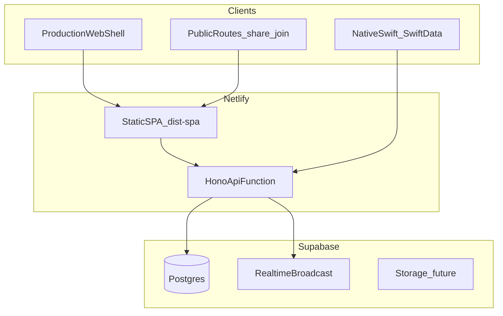

# Tech Stack Scaling Assessment

**Status:** Reference / living doc  
**Last Updated:** June 2026  
**Audience:** Founders and engineers evaluating stack changes

This document captures a strategic assessment of Harvous's current technology stack: whether it fits the product today, where scaling pressure will appear, which alternatives were considered, and recommended evolution paths. For the canonical list of technologies and versions, see [TECH_STACK.md](../TECH_STACK.md).

---

## Executive summary

**Verdict:** Harvous's stack is appropriate and well-aligned with a rich-text Bible study notes product scaling toward collaboration, learning, and native-first usage. The choices that matter most going forward are **deployment topology** (serverless to always-on for realtime and background jobs) and **sync architecture** (web, native, and Postgres as source of truth) — not replacing React, Hono, or Supabase.

The biggest risks are not "wrong framework picks." They are:

1. **Multi-client sync** — Swift native and web share one API but are not fully connected yet.
2. **Hosting shape** — a single Netlify serverless function works today but will tighten as WebSockets, background jobs, and cold-start sensitivity grow.

**Classic SPA retirement (June 2026):** The authenticated Classic 1.0 shell (`AppLayout`, `/thread/*`, dashboard hierarchy) has been removed. Production web is the prototype shell only, plus public routes (share, join, invite) and auth. Legacy Classic URLs redirect to prototype routes.

None of these require a wholesale stack rewrite. They are architecture and execution problems with incremental solutions.

---

## Current stack snapshot

| Layer | Choice | Key locations |
|-------|--------|---------------|
| Frontend | React 19 SPA, Vite, TanStack Router/Query, vanilla CSS | [`spa/src/`](../spa/src/), [`spa/src/router.tsx`](../spa/src/router.tsx) |
| API | Hono bundled as single Netlify function | [`server/`](../server/), [`netlify/functions/api.cjs`](../netlify/functions/api.cjs) |
| Database | Supabase Postgres + Drizzle ORM | [`server/db/schema.ts`](../server/db/schema.ts) |
| Auth | Clerk | SPA + Hono middleware |
| Editor | TipTap (ProseMirror) | [`src/components/react/TiptapEditor.tsx`](../src/components/react/TiptapEditor.tsx) |
| Native | Swift/SwiftUI + SwiftData (primary client) | [`native/Harvous/`](../native/Harvous/) |
| Realtime | Supabase Broadcast (partial); more planned | [`server/utils/realtime.ts`](../server/utils/realtime.ts), [REALTIME_SUPABASE_PLAN.md](./REALTIME_SUPABASE_PLAN.md) |
| Sync | Hono sync routes (web + native) | [`server/routes/sync.ts`](../server/routes/sync.ts) |

**Note on Capacitor:** Capacitor packages remain in `package.json` and older docs ([CAPACITOR_STRATEGIC_ANALYSIS.md](./CAPACITOR_STRATEGIC_ANALYSIS.md)) describe a web-wrapper path. **Current product direction is Swift native as primary** and the web prototype as complementary — see [NATIVE_2_0_PLATFORM_STRATEGY.md](../native-prototype/NATIVE_2_0_PLATFORM_STRATEGY.md). Capacitor docs are historical context, not the active strategy.

### System diagram (today)

On dedicated prototype hosts (`localhost`, `new.harvous.com`, `app.harvous.com`), routes live at `/` rather than `/prototype`. Legacy Classic URLs (`/thread/*`, `/note/*`, etc.) redirect to prototype routes. See [`src/lib/prototype-path.ts`](../src/lib/prototype-path.ts).

---

## Why this stack fits Harvous

### React SPA + TipTap

Harvous is a long-lived client application centered on a rich text editor. TipTap/ProseMirror expects a persistent DOM and client-side state — not server-rendered pages that hydrate on every navigation. TanStack Router and Query fit note-centric navigation, caching, and the invalidation model building toward Supabase Realtime.

SSR frameworks (Next.js, Remix) would add complexity without solving Harvous's core problems. Marketing lives on Webflow; the authenticated app is a SPA. The Astro-to-SPA migration is complete ([CLEAR_SPLIT_MIGRATION.md](../CLEAR_SPLIT_MIGRATION.md)).

### Hono + Drizzle

Hono is lightweight and portable. The API can move from a Netlify function to an always-on Node service (Fly, Railway, Render) without a rewrite. Drizzle keeps schema and queries in TypeScript with a clean Postgres adapter — the Turso-to-Supabase migration only swapped the driver ([WHY_SUPABASE.md](../WHY_SUPABASE.md)).

### Supabase Postgres

The move from Turso/SQLite to Supabase Postgres was deliberate and well justified:

| Capability | Why Postgres/Supabase |
|------------|----------------------|
| Full-text search | GIN indexes, stemming, relevance ranking (`server/routes/search.ts`) |
| Shared spaces / groups | Relational model, permissions, complex joins |
| Realtime | Broadcast, Presence, future Postgres Changes |
| Media in notes | Supabase Storage path for images, PDFs, link previews |
| Learning / analytics | Window functions, jsonb, materialized views |

### Clerk

Clerk fits a consumer app with billing, subscription management, and planned Organizations for churches. It is deeply integrated in checkout flows and JWT feature flags. Native Clerk integration is still open — see [NATIVE_2_0_PLATFORM_STRATEGY.md](../native-prototype/NATIVE_2_0_PLATFORM_STRATEGY.md) section 4 (Auth strategy options).

### Swift native over Capacitor

Product intent: **native (macOS + iOS) is the primary client**; the web shell is complementary for non-Apple devices. Swift/SwiftUI delivers the editor UX, offline story, and platform integration Capacitor cannot match without still building a sync engine on top. Postgres remains the long-term source of truth after deliberate cloud sync migration.

---

## Alignment with product vision

North star: [HARVOUS_NORTH_STAR.md](./HARVOUS_NORTH_STAR.md) — "Keep your Bible app. Just add Harvous."

| Future capability | Stack fit | Authoritative doc |
|-------------------|-----------|-------------------|
| Shared spaces v1 | Strong — Postgres + permissions + API | [WHATS_LEFT.md](./WHATS_LEFT.md) |
| Native-first + web | Strong architecture; sync parity gap remains | [PROTOTYPE_2_0_ARCHITECTURE.md](../PROTOTYPE_2_0_ARCHITECTURE.md) |
| Space sharing and groups (Phase 2) | Strong | [HARVOUS_SDK_AND_FUTURE_ROADMAP.md](./HARVOUS_SDK_AND_FUTURE_ROADMAP.md) |
| Learning / AI quizzes (Phase 3) | Strong — Hono orchestration + Postgres sessions | Same roadmap doc; [SCRIPTURE_AI_GROUNDING_PHASE_5.md](./SCRIPTURE_AI_GROUNDING_PHASE_5.md) |
| Real-time collaboration | Phases 1–2 fit Supabase; Phase 3 needs WebSocket service | [REALTIME_SUPABASE_PLAN.md](./REALTIME_SUPABASE_PLAN.md) |
| SDK / partner integrations | Deferred; API-ready when core is strong | [HARVOUS_SDK_AND_FUTURE_ROADMAP.md](./HARVOUS_SDK_AND_FUTURE_ROADMAP.md) |
| Church orgs / curriculum | Strong — Clerk Orgs + DB tier fields | [CHURCH_ORG_AND_CURRICULUM.md](./CHURCH_ORG_AND_CURRICULUM.md) |

Roadmap sequence (core → sharing → learning) matches what the stack supports. The SDK is correctly deferred until core product and learning feel right.

---

## Where scaling pressure will show

These are honest bottlenecks with **evolution paths**, not reasons to switch stacks.

### 1. Single Netlify serverless function

**Today:** All `/api/*` requests hit one bundled Hono function (`netlify/functions/api.cjs`). See bundling constraints in [CLEAR_SPLIT_MERGE_DELTA.md](../CLEAR_SPLIT_MERGE_DELTA.md) — dependencies must be bundled; no `node_modules` at runtime.

**Fine for now.** Gets tighter when adding:

- WebSocket collaboration (Hocuspocus for TipTap/Yjs)
- Background jobs (AI quiz generation, bulk imports, webhooks at scale)
- Long-running requests
- Cold-start sensitivity on mobile/native bootstrap

**Evolution path:** Keep Hono; change deployment:

- Long-running Node on Fly, Railway, or Render
- Split: static SPA on Netlify + API on an always-on service
- Edge for read-heavy routes only (optional, later)

This is an ops/deployment upgrade, not a framework swap.

### 2. Cross-client sync

**Today:** Web and native share one API and Postgres, but full parity is not complete:

- Web study threads use server-issued string IDs; native sync uses `HarvousSyncService` with ongoing ID mapping work
- Optimistic update and conflict conventions are uneven on web ([ARCHITECTURE_READINESS_AUDIT.md](../design-parity/ARCHITECTURE_READINESS_AUDIT.md) item W8)

**Evolution path:**

- Harden `/api/sync/*` bootstrap, push, and changes for native
- Server-issued IDs for all study thread entries; no merge without mapping table
- Optional add-ons when sync becomes the bottleneck: PowerSync, Electric SQL, or custom LWW sync **on top of** existing Postgres — not replacements

See also [native/docs/future/NATIVE_WEB_DATA_MODEL_GAP.md](../../native/docs/future/NATIVE_WEB_DATA_MODEL_GAP.md).

### 3. Collaborative editing (Phase 3)

Phase 1 (cross-device invalidation) and Phase 2 (live shared spaces, presence) fit Supabase Realtime well.

Phase 3 (multi-cursor collaborative editing) requires **Hocuspocus + Yjs** — a separate WebSocket service with Supabase Postgres as persistence. This is true regardless of frontend framework. Plan hosting for it before committing to Phase 3. Details in [REALTIME_SUPABASE_PLAN.md](./REALTIME_SUPABASE_PLAN.md).

---

## Alternatives considered

| Alternative | Verdict | When it might make sense |
|-------------|---------|--------------------------|
| **Next.js / Remix** | No for core app | Unified marketing + app SSR in one repo — Harvous uses Webflow + SPA |
| **Firebase / Amplify** | No | Greenfield mobile-first with weak relational needs; fights Drizzle investment and shared-space permissions |
| **Capacitor as primary mobile** | No for current vision | Pivot to web-first with good-enough native UX and faster mobile ship |
| **Supabase Auth instead of Clerk** | Revisit later | Native auth + RLS-first Realtime/Storage pain exceeds Clerk's value |
| **Neon / PlanetScale instead of Supabase** | Marginal | Postgres is Postgres; you'd lose bundled Realtime/Storage unless reassembled |
| **GraphQL (Hasura, Pothos)** | No | REST/Hono + React Query is simpler for current team and clients |
| **Tauri instead of Swift (desktop)** | Unlikely | Already deep in SwiftUI parity with web prototype |
| **PowerSync / Electric SQL** | Evaluate when sync blocks | Add-on on existing Postgres for offline-first native — not a replacement |

No alternative stack magically fixes cross-client sync or collaborative editing. Those are product engineering problems with incremental solutions on the current foundation.

---

## Recommended priorities (evolution, not rewrite)

Ordered by leverage against the product vision:

1. **Ship native cloud sync parity** — bootstrap/push via `/api/sync/*`, server-issued IDs for study threads end-to-end. Unlocks "native-first" as real, not aspirational.
2. **Plan API hosting for WebSockets** — before Phase 3 collab; keep Hono, change where it runs.
3. **Standardize optimistic updates and conflict UX on web** — before leaning on Realtime for shared spaces ([ARCHITECTURE_READINESS_AUDIT.md](../design-parity/ARCHITECTURE_READINESS_AUDIT.md) W8).
4. **Revisit Clerk vs Supabase Auth** — only when native sign-in and RLS policies become blocking, not preemptively.

Each item is an evolution path. None requires abandoning React, Hono, Drizzle, or Supabase.

---

## Related documentation

- [TECH_STACK.md](../TECH_STACK.md) — Canonical technology list and versions
- [WHY_SUPABASE.md](../WHY_SUPABASE.md) — Turso to Supabase migration rationale
- [PROTOTYPE_2_0_ARCHITECTURE.md](../PROTOTYPE_2_0_ARCHITECTURE.md) — Production web shell vs native
- [CLASSIC_TO_2_0_MIGRATION.md](../CLASSIC_TO_2_0_MIGRATION.md) — Migration runbook (complete)
- [NATIVE_2_0_PLATFORM_STRATEGY.md](../native-prototype/NATIVE_2_0_PLATFORM_STRATEGY.md) — Native-first migration and auth options
- [REALTIME_SUPABASE_PLAN.md](./REALTIME_SUPABASE_PLAN.md) — Realtime phases and Hocuspocus
- [HARVOUS_SDK_AND_FUTURE_ROADMAP.md](./HARVOUS_SDK_AND_FUTURE_ROADMAP.md) — Product roadmap and SDK deferral
- [ARCHITECTURE_READINESS_AUDIT.md](../design-parity/ARCHITECTURE_READINESS_AUDIT.md) — Seams and debt before roadmap features land
- [CLEAR_SPLIT_MERGE_DELTA.md](../CLEAR_SPLIT_MERGE_DELTA.md) — API bundling and Netlify function constraints

---

## Decision log

Record stack decisions here as they are made.

| Date | Decision | Rationale |
|------|----------|-----------|
| 2026-06 | Keep React + Hono + Supabase + Clerk | Stack fits product shape; evolution paths address scaling without rewrite. See this doc. |
| 2026-06 | Retire Classic SPA | Prototype is production web; zero Classic users; old threads are primary locked folders. |
