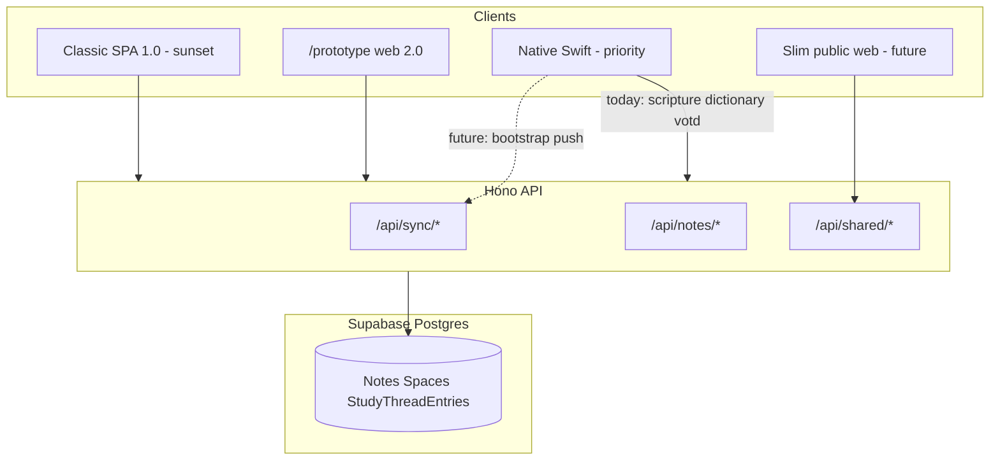
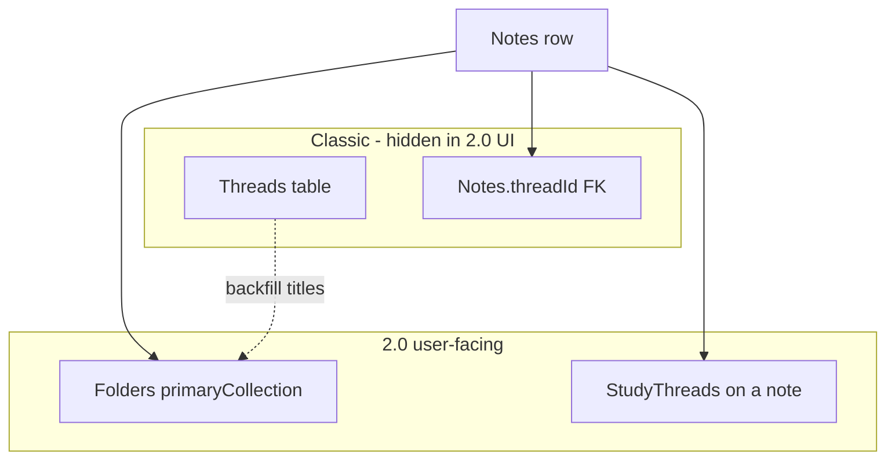
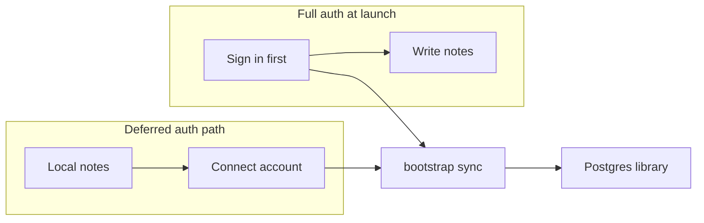
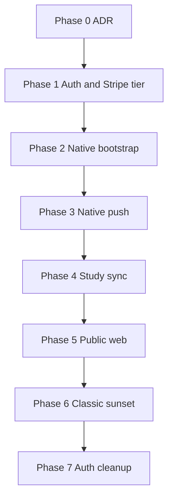

# Native 2.0 platform strategy (draft for review)

**Status:** Draft — options for discussion, not approved architecture  
**Captured:** May 2026 (native-prototype branch)  
**Audience:** Founders and engineers planning migration away from Harvous Classic

This document consolidates strategy threads for moving to **native-first** Harvous with **`/prototype` as the non-Apple web client**, retiring the full authenticated Classic SPA while preserving Postgres data and public link contracts. It points to existing docs and code; it does not replace ADRs or implementation tickets.

**Disclaimer:** Checkboxes and “proposed” rules below are decision prompts. Nothing here is binding until you mark decisions and open matching work.

---

## Table of contents

1. [Context and product direction](#1-context-and-product-direction)
2. [Three thread concepts](#2-three-thread-concepts-do-not-conflate)
3. [Existing Supabase data: preserve vs export](#3-existing-supabase-data-preserve-vs-export)
4. [Auth strategy options](#4-auth-strategy-options)
5. [Billing](#5-billing)
6. [Phased roadmap](#6-phased-roadmap-options-not-mandates)
7. [Open decisions checklist](#7-open-decisions-checklist)
8. [Related docs and code index](#8-related-docs-and-code-index)

---

## 1. Context and product direction

### What exists today

| Surface | Location | Role |
|--------|----------|------|
| **Harvous Classic (1.0)** | SPA routes `/`, `/note/*`, `/thread/*`, `/space/*`, dashboard | Full hierarchy: spaces, **threads in UI**, thread-centric navigation |
| **Prototype (2.0 web)** | `/prototype/*` in [spa/src/router.tsx](../../spa/src/router.tsx) | Native-like shell: toolbar, sidebar, inspector; **no thread UI**; same Clerk session and API as Classic |
| **Native apps** | [native/Harvous/](../../native/Harvous/) | macOS + iOS; SwiftData local store; design parity with prototype; **not yet cloud-synced** |
| **API** | Hono on Netlify ([server/](../../server/)) | All clients call `/api/*`; Drizzle → Supabase Postgres |
| **Database** | [server/db/schema.ts](../../server/db/schema.ts) | Single source of truth for signed-in users |

See [PROTOTYPE_2_0_ARCHITECTURE.md](../PROTOTYPE_2_0_ARCHITECTURE.md) for routing, prototype endpoints, and code map.

### Target direction (stated product intent)

- **Native (macOS + iOS)** is the **primary** client for day-to-day Bible study.
- **`/prototype`** is the **complementary** client for non-Apple devices (and web testing), on the **same API and database**.
- **Classic SPA** authenticated shell is **sunset** over time; a **slim public web** remains for share links, space join, invitations, sign-in return URLs, and optionally billing/checkout ([SPA_RETIREMENT_AND_PUBLIC_WEB.md](./SPA_RETIREMENT_AND_PUBLIC_WEB.md)).
- **Billing** is likely **Stripe** (not Clerk Billing), with tier stored in your database.

### System diagram (today → target)

**Native today:** Local SwiftData + [HarvousLocalIdentity](../../native/Harvous/Models/HarvousLocalIdentity.swift) (device UUID). Settings copy notes Clerk is not embedded yet ([ProfileAndSettingsViews.swift](../../native/Harvous/Views/ProfileAndSettingsViews.swift)). Ancillary API calls (scripture, Easton’s, VOTD) already use [HarvousAPI](../../native/Harvous/Services/ScriptureVerseFetch.swift).

---

## 2. Three “thread” concepts (do not conflate)

The word **thread** appears in three unrelated places. Mixing them breaks sync design and user communication.

### 2.1 Classic Threads (organizational — UI hidden in 2.0)

| Aspect | Detail |
|--------|--------|
| **Tables** | `Threads`, `Notes.threadId` (required), `NoteThreads` (many-to-many) |
| **Classic UX** | Colored piles, “My Pile”, thread pages, `?thread=` on notes |
| **2.0 UX** | **Not shown.** Users organize with **folders** instead |
| **Server plumbing** | Every note still needs a `threadId`. Prototype creates notes with `thread_unorganized` (“My Pile”) via [ensureUnorganizedThread](../../server/utils/unorganized-thread.ts) |

**Proposed sync rule:** On create/push from native or prototype, set `threadId = thread_unorganized` (or space default) unless you later add explicit thread management. Users never pick a Classic thread in 2.0.

### 2.2 Folders (collections — primary organization in 2.0)

| Aspect | Detail |
|--------|--------|
| **Server fields** | `Notes.primaryCollection`, `Notes.secondaryCollections` |
| **Native fields** | `Note.primaryFolder`, secondaries (see [Note.swift](../../native/Harvous/Models/Note.swift)) |
| **Migration aid** | [backfill-collections-from-threads.ts](../../server/scripts/backfill-collections-from-threads.ts) copies Classic thread **titles** into collection labels |
| **2.0 UX** | Sidebar “collections” mode on web; folder chips in toolbar/inspector |

**Proposed sync rule:** Treat folder fields as the **user-visible** organization. Sync them on every note upsert.

### 2.3 StudyThreads (per-note study — not Classic Threads)

| Aspect | Detail |
|--------|--------|
| **Server** | `StudyThreadEntries` ([schema](../../server/db/schema.ts)) |
| **Native** | `StudyThread` SwiftData model on a parent note ([StudyThread.swift](../../native/Harvous/Models/StudyThread.swift)) |
| **Purpose** | Highlights, scripture workspace, reflection questions, anchored study branches **on one note** |
| **Gap** | Native uses device UUIDs; server uses string IDs. Until native reads/writes the API, web and native study rows **do not merge** |

**Proposed sync rule:** After note sync, sync `StudyThreadEntries` using **server-issued ids** only. Do not merge local UUID study rows with server rows without a migration mapping table.

### Relationship diagram

### Schema cleanup (later, optional)

Making `threadId` nullable or dropping `Threads` from product logic is a **follow-on** migration after backfill + audit. It is **not** required to ship native cloud library if sentinel `threadId` + folders stay consistent.

---

## 3. Existing Supabase data: preserve vs export

### Default path: sign in and sync (not export files)

For users who already have libraries in **Classic** or **`/prototype`**, data **already lives in Postgres**. The right migration is:

1. Authenticate (same person, same account).
2. **Hydrate** local store from the server.
3. Ongoing **push/pull** via existing sync routes.

| Endpoint | Role |
|----------|------|
| `GET /api/sync/bootstrap` | Full pull: spaces, threads, notes, tags, study entries, metadata |
| `POST /api/sync/push` | Idempotent mutations |
| `GET /api/sync/changes` | Delta pull |

Implementation: [server/routes/sync.ts](../../server/routes/sync.ts). Web reference client: [src/utils/sync-manager.ts](../../src/utils/sync-manager.ts).

**Do not** tell Classic users to export and re-import as the primary funnel. Export loses stable ids, share tokens, space membership, and study linkage unless you build a rich round-trip format.

### When export/import *is* appropriate

| Scenario | Mechanism |
|----------|-----------|
| **GDPR / portability / leaving Harvous** | `GET /api/user/export` — markdown, csv-threads, text ([user.ts](../../server/routes/user.ts), [export-user-data.ts](../../server/utils/export-user-data.ts)) |
| **Obsidian / Evernote / Apple Notes** | Native vault import ([HarvousVaultImporter.swift](../../native/Harvous/Services/HarvousVaultImporter.swift)) |
| **Native-only library before first account** | After sign-in: **upload** via `sync/push` (or dedicated first-push), not file import from Classic |
| **Auth provider migration** | User-id mapping + SQL backfill, not CSV export |

### Format gaps to decide (blocks fidelity)

Documented in [NATIVE_WEB_DATA_MODEL_GAP.md](../../native/docs/future/NATIVE_WEB_DATA_MODEL_GAP.md):

| Gap | Web | Native | Decision needed |
|-----|-----|--------|-----------------|
| **Body** | `Notes.content` TipTap HTML | `Note.body` plain text + scripture pills | Canonical HTML in DB with strip on ingest, or plain canonical with HTML on push, or lossy subset |
| **Thread placement** | Required `threadId` | No `threadId`; space only | Sentinel `thread_unorganized` + folders (proposed v1) |
| **Study rows** | `StudyThreadEntries` string ids | `StudyThread` UUID | Server ids after link; no blind merge |
| **simpleNoteId** | `UserMetadata.highestSimpleNoteId` | Local assignment | Reconcile on sync |
| **Extra native fields** | Partial or missing columns | tags, accents, snapshots, vault filename | Sync subset vs extend schema |

---

## 4. Auth strategy options

Native priority and Stripe billing change the calculus: **Clerk Billing is not a reason to stay**. The question is whether **Clerk auth-only** or **Supabase Auth** (or **deferred auth**) fits the next 12 months.

**Note on “no JWT”:** Supabase Auth still uses JWTs internally. The win is **SDK-managed sessions** (refresh, Keychain), not eliminating tokens.

### 4a. Keep Clerk (authentication only)

**What stays:** [server/middleware/auth.ts](../../server/middleware/auth.ts) verifies `__session` cookie or `Authorization: Bearer` Clerk JWT; `userId` on all rows remains Clerk id (`user_…`).

| Pros | Cons |
|------|------|
| Already integrated across SPA, API, e2e | Second vendor alongside Supabase DB |
| [ClerkKit](https://clerk.com/docs/ios) path for native | Native auth not shipped yet, but plan assumes Clerk |
| Mature sign-in UX, passkeys, testing helpers | `ClerkUserMapping`, merge scripts, live/test history |
| Bearer already works for future native sync | Tier today tied to Clerk JWT `fea` claims — must move to DB with Stripe |

**When to choose:** Fastest path to **native sync** with lowest migration risk for **existing** `userId` rows.

### 4b. Migrate to Supabase Auth

**What changes:** Sign-in via Supabase; Hono verifies Supabase JWT; optional later RLS from clients (not required day one if Hono remains BFF).

| Pros | Cons |
|------|------|
| One vendor with database | Must migrate or map every `userId` FK |
| Supabase Swift SDK session handling | Dual-auth period during transition |
| Aligns with “Stripe + Supabase stack” narrative | Rewrite e2e ([e2e/fixtures/auth.ts](../../e2e/fixtures/auth.ts)), SPA provider, webhooks |
| No Clerk bill for auth | Join/invite return URLs must be re-tested ([AGENTS.md](../../AGENTS.md)) |

**Canonical `userId` strategies:**

| Strategy | Description | Tradeoff |
|----------|-------------|----------|
| **A. Keep Clerk id as `userId`** | `UserMetadata` maps `supabase_user_id` → existing Clerk id; all Drizzle queries unchanged | Least row churn; permanent legacy id in DB |
| **B. Supabase UUID as `userId`** | One-time `UPDATE` per table; link old accounts by email on first Supabase login | Clean 2.0; migration effort scales with user count |

**When to choose:** You are re-platforming clients anyway (native sync, Classic sunset, Stripe) and want **one dashboard** long term. **Now** is a reasonable window because native has not shipped cloud auth yet — but existing production users still require a **link-by-email** migration, not a flip of a switch.

**Phased cutover (recommended if B):**

1. Hono accepts **Clerk OR Supabase** JWT; resolves to canonical `userId`.
2. `/prototype` + new signups on Supabase; “Link existing Harvous account” by email OTP.
3. Native ships with Supabase only (or dual during beta).
4. Drain Clerk sign-ins; remove Clerk env and packages.
5. Replace [webhooks/clerk](../../server/routes/webhooks.ts) (Audienceful) with Supabase Auth hooks or app-level events.

### 4c. Deferred / minimal auth (“no full auth” at launch)

These are **UX and scope** strategies. Something durable is still required for cloud library, shared spaces, and Stripe.

#### Option 1: Local-first; “Connect Harvous account” later

- Ship native as **complete offline** SwiftData (current near-state).
- Auth appears only for: cloud backup, second device, shared space, upgrade, or “open my web library.”
- **Pros:** Zero friction for new users; matches native-first.
- **Cons:** Classic users expect sign-in; sync blocked until connect.

#### Option 2: Sign in with Apple only (native v1); magic link on web

- One button on Apple platforms; map `sub` to `userId` (or link to Supabase user).
- **`/prototype` on non-Apple:** email magic link when needed.
- **Pros:** Minimal native UX; Apple-friendly.
- **Cons:** Android/desktop web need a second method; recovery is Apple-shaped.

#### Option 3: Anonymous session → upgrade

- Supabase anonymous user or long-lived device token in Keychain until user links email/Apple.
- **Pros:** No sign-up wall; smooth “try then connect.”
- **Cons:** Abuse limits; lost device without link = lost anonymous cloud.

#### Option 4: Vault / iCloud as personal sync; account for social/cloud

- Personal notes: [HarvousVaultExporter](../../native/Harvous/Services/HarvousVaultExporter.swift) + iCloud Drive folder.
- Harvous account only for shared spaces, server study index, Classic library import.
- **Pros:** Simple mental model for solo study.
- **Cons:** Does not replace Postgres for collaborators; file conflict model.

#### Option 5: Recovery key (passwordless)

- User holds a generated key; server stores hash only.
- **Pros:** No OAuth vendor.
- **Cons:** High support burden; poor fit for broad Bible-study audience unless paired with optional email backup.

#### Option 6: Token-only web; full auth only for library link

- Public flows use share/join tokens ([shared.ts](../../server/routes/shared.ts), [spaces.ts](../../server/routes/spaces.ts)).
- **Pros:** Minimal web surface.
- **Cons:** No unified cross-device library without eventual full auth.

### What you cannot skip long-term

| Need | Why |
|------|-----|
| Multi-device library | Stable `userId` on rows |
| Classic user continuity | Prove device user = existing Postgres user |
| Shared spaces / invites | `Members.userId` |
| Stripe | Customer + webhook identity |
| API abuse control | Authenticated or rate-limited anonymous |

### Suggested “simplest coherent” 2.0 auth story

If optimizing for **native priority + Stripe + less ceremony**:

1. Native **local-only** (or iCloud vault) at first launch.
2. **“Connect Harvous account”** → Sign in with Apple (native) + email magic link (`/prototype`).
3. Backend identity (Supabase Auth **or** Clerk) only after connect; hydrate via **`/api/sync/bootstrap`**.
4. Stripe only after connect (or at paywall); tier in DB, not JWT features.
5. Classic users: **same email** links account — no export.

This is simpler **UX** than migrating auth providers; provider choice (Clerk vs Supabase) is orthogonal to deferred sign-in.

### Auth journey diagram

---

## 5. Billing

### Direction

- **Stripe** as payment system of record.
- **Tier** (`free` | `unlimited` or your product names) stored in **Postgres**, updated by Stripe webhooks.
- Remove dependence on **Clerk Billing** ([billing.ts](../../server/routes/billing.ts), [tier-limits.ts](../../server/utils/tier-limits.ts) `getTierForUserId` Clerk API calls).

### Code impact (when implemented)

| Area | Today | Target |
|------|-------|--------|
| Entitlements in routes | `auth.has({ feature: 'unlimited_notes' })` from Clerk JWT | DB lookup by `userId` |
| Owner tier for shared spaces | Clerk API in `getTierForUserId` | DB subscription row |
| Upgrade UI | Clerk checkout components in SPA | Stripe Checkout or Customer Portal (web or WebView in native) |
| Webhooks | [POST /api/webhooks/clerk](../../server/routes/webhooks.ts) → Audienceful | Stripe webhooks → tier; keep or replace Audienceful triggers |

Billing can proceed **in parallel** with auth migration: decouple tier from Clerk JWT before removing Clerk entirely.

---

## 6. Phased roadmap (options, not mandates)

Phases are ordered dependencies. Timelines are yours to set.

| Phase | Focus | Outcomes |
|-------|--------|----------|
| **0** | ADR | Canonical `userId`; note body format; sentinel `threadId` + folders; study id rules |
| **1** | Auth | Clerk-only **or** dual Clerk+Supabase **or** deferred connect + Apple; Stripe tier in DB started |
| **2** | Native cloud read | Clerk or Supabase session → `GET /api/sync/bootstrap` → SwiftData; HTML→plain on ingest |
| **3** | Native cloud write | Autosave → `POST /api/sync/push`; conflict policy (`updatedAt` LWW v1) |
| **4** | Study parity | `StudyThreadEntries` sync; server ids; prototype + native share behavior |
| **5** | Slim public web | Share/join/invite/OG; Universal Links to native ([SPA_RETIREMENT](./SPA_RETIREMENT_AND_PUBLIC_WEB.md)) |
| **6** | Classic sunset | Redirect authenticated Classic routes to native store / `/prototype` |
| **7** | Auth cleanup | Remove Clerk (if migrated); drop dual-auth; update e2e |

### Native implementation note

[native/docs/future/ARCHITECTURE_ROADMAP.md](../../native/docs/future/ARCHITECTURE_ROADMAP.md) describes a `SupabaseSyncActor` talking to Postgres directly. **Alternative aligned with this doc:** implement sync against existing **`/api/sync/*`** first (same contract as web sync-manager), with Hono as the single place for business rules. Direct Supabase client from native can be a later optimization if RLS and policies are ready.

### Client roles at end state

| Client | Role |
|--------|------|
| **Native** | Primary; local-first cache; optional iCloud vault for personal mirror |
| **`/prototype`** | Non-Apple 2.0 shell; same sync API |
| **Slim public web** | Token URLs, join, invite, checkout if needed |
| **Classic** | Off |

---

## 7. Open decisions checklist

Copy into your issue tracker or mark inline when decided.

### Product

- [ ] **Primary client:** Native first (assumed) — confirm Android future (prototype-only vs eventual native).
- [ ] **Classic sunset:** Hard date or “feature parity” gate?
- [ ] **Native v1 without account:** Allowed for how long?

### Data model

- [x] **Classic thread piles → 2.0:** Folders/collections only (Option 1); connected Threads sidebar is manual graph links — see [CLASSIC_TO_2_0_MIGRATION.md](../CLASSIC_TO_2_0_MIGRATION.md)
- [x] **Canonical note body:** **HTML in Postgres** (native projects to plain text + round-trips `serverContentHTML`) — see [PHASE_0_DATA_MODEL_ADR.md](./PHASE_0_DATA_MODEL_ADR.md) D1
- [x] **Classic `threadId`:** **Sentinel only** (`thread_unorganized`) — ADR D2 (already live in sync push)
- [x] **StudyThread merge:** **Server ids only**, after parent-note link — ADR D4

### Identity and auth

- [ ] **Auth provider:** Clerk (auth only) | Supabase Auth | deferred connect + Apple v1 *(Phase 1 — not decided here)*
- [x] **Canonical `userId`:** **Clerk id (strategy A)** — ADR D3b (map by email if provider changes; never rewrite FKs)
- [ ] **New signups:** Which provider after cutover?
- [ ] **Native first ship:** ClerkKit | Supabase Swift | local-only then connect

### Billing

- [ ] **Stripe** as sole billing (assumed) — plan SKUs and free tier limits unchanged?
- [ ] **Checkout surface:** Web only | WebView in native | both

### Migration and ops

- [x] **Existing users:** Same Clerk login + Postgres; per-user `POST /api/user/migrate-to-prototype` on first prototype visit; batch script optional — see [CLASSIC_TO_2_0_MIGRATION.md](../CLASSIC_TO_2_0_MIGRATION.md)
- [ ] **E2E:** Clerk testing token until phase 7 | rewrite for Supabase
- [ ] **Audienceful:** Trigger from Supabase auth events vs keep interim Clerk webhook

---

## 8. Related docs and code index

### Architecture and parity

| Doc | Topic |
|-----|--------|
| [PROTOTYPE_2_0_ARCHITECTURE.md](../PROTOTYPE_2_0_ARCHITECTURE.md) | Classic vs prototype vs native; API map |
| [SIMPLIFIED_WEB_PROTOTYPE.md](../SIMPLIFIED_WEB_PROTOTYPE.md) | Quick prototype entry |
| [design-parity/PROTOTYPE_NATIVE_MENU_CONTENT_PARITY.md](../design-parity/PROTOTYPE_NATIVE_MENU_CONTENT_PARITY.md) | UI parity checklist |
| [SPA_RETIREMENT_AND_PUBLIC_WEB.md](./SPA_RETIREMENT_AND_PUBLIC_WEB.md) | Retiring full SPA; public URLs |
| [MAC_APP_DISTRIBUTION_AND_PRIVATE_UPDATES.md](./MAC_APP_DISTRIBUTION_AND_PRIVATE_UPDATES.md) | Mac distribution |
| [native/SWIFTUI_APP_ARCHITECTURE.md](../native/SWIFTUI_APP_ARCHITECTURE.md) | Native app structure |

### Native future work

| Doc | Topic |
|-----|--------|
| [native/docs/future/NATIVE_WEB_DATA_MODEL_GAP.md](../../native/docs/future/NATIVE_WEB_DATA_MODEL_GAP.md) | Schema decisions before sync |
| [native/docs/future/ARCHITECTURE_ROADMAP.md](../../native/docs/future/ARCHITECTURE_ROADMAP.md) | Tiers 2–5 (sync, collab, iOS parity) |
| [native/Harvous/NATIVE_PRE_RELEASE_CHECKLIST.md](../../native/Harvous/NATIVE_PRE_RELEASE_CHECKLIST.md) | TestFlight gates |

### Auth and migration troubleshooting

| Doc | Topic |
|-----|--------|
| [troubleshooting/CLERK_DUPLICATE_USER_MIGRATION.md](../troubleshooting/CLERK_DUPLICATE_USER_MIGRATION.md) | Live/test user mapping |
| [AGENTS.md](../../AGENTS.md) | Clerk redirect rules for join/invite |

### Key code paths

| Path | Topic |
|------|--------|
| [server/routes/sync.ts](../../server/routes/sync.ts) | bootstrap, push, changes |
| [server/middleware/auth.ts](../../server/middleware/auth.ts) | Clerk verify |
| [server/db/schema.ts](../../server/db/schema.ts) | Drizzle schema |
| [server/scripts/backfill-collections-from-threads.ts](../../server/scripts/backfill-collections-from-threads.ts) | Thread title → folders |
| [server/utils/prototype-user-migration.ts](../../server/utils/prototype-user-migration.ts) | Per-user Classic → 2.0 backfill |
| [docs/CLASSIC_TO_2_0_MIGRATION.md](../CLASSIC_TO_2_0_MIGRATION.md) | Migration runbook |
| [src/utils/sync-manager.ts](../../src/utils/sync-manager.ts) | Web sync client |
| [native/Harvous/Models/HarvousLocalIdentity.swift](../../native/Harvous/Models/HarvousLocalIdentity.swift) | Device-local user id |

---

## Document history

| Date | Change |
|------|--------|
| 2026-05 | Initial draft on native-prototype branch for founder review |
