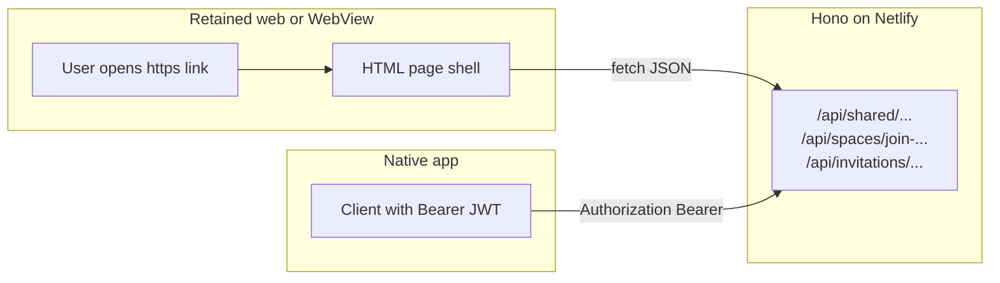

# SPA retirement and retained public web (native-prototype)

This document describes how to migrate away from the full authenticated **SPA** while keeping a **small HTTPS surface** for share links, space joins, invitations, and future public content (for example, challenges or curated featured items). It was written for the **`native-prototype`** branch and aligns with the current **Hono API** and **Netlify** hosting model.

For packaging the existing web app in native shells (Capacitor) or JWT dual-mode auth, see [CAPACITOR_IMPLEMENTATION_GUIDE.md](../CAPACITOR_IMPLEMENTATION_GUIDE.md) and [future/CAPACITOR_STRATEGIC_ANALYSIS.md](../future/CAPACITOR_STRATEGIC_ANALYSIS.md). This guide focuses on **retiring the SPA as the main product** while **preserving URLs and API contracts** that users and systems already depend on.

---

## 1. Definitions and target architecture

### Full SPA retirement (primary surface)

The production client today is the Vite SPA under `spa/`, routed with TanStack Router in [spa/src/router.tsx](../../spa/src/router.tsx). The authenticated experience uses [spa/src/layouts/AppLayout.tsx](../../spa/src/layouts/AppLayout.tsx) and pages for dashboard, space, thread, and note routes, plus sign-in and sign-up under Clerk.

**Retiring the SPA** means that shell and those routes are no longer the main way people use Harvous. The **native** app (or another non-browser primary client) owns day-to-day study workflows.

### Retained "web" surface (secondary)

Some flows **must** remain available over **HTTPS** in a browser or in-app browser:

- **Share links** so recipients can open content without the native app.
- **Anonymous or signed-out preview** of public notes and threads.
- **Return URLs after sign-in** for join and invitation flows, so the user lands back on the same link they started from (Clerk and redirect behavior: see [AGENTS.md](../../AGENTS.md) — do not set a force redirect to `/` that would break these flows).
- **Social or SEO previews** (optional but often desired) for shared links.
- **Billing or checkout** where Clerk or Stripe expect a web or WebView context (see [Section 5](#5-non-obvious-systems-to-revisit-or-replace)).

### API vs page layer

**Public and semi-public data** is already served by the **Hono** API, not by the SPA’s router alone:

- [server/routes/shared.ts](../../server/routes/shared.ts): `GET /api/shared/note/:shareToken`, `GET /api/shared/thread/:shareToken`, invitation `GET/POST` under `/api/invitations/...`, and authenticated "add to Harvous" actions.
- [server/routes/spaces.ts](../../server/routes/spaces.ts): `GET /api/spaces/join-preview/:token`, `POST /api/spaces/join/:token` (join completes with auth).
- The SPA pages (for example [spa/src/pages/SharedNotePage.tsx](../../spa/src/pages/SharedNotePage.tsx)) are largely **UI + `fetch` to those endpoints**.

**Important:** the API and DB already compute **canonical `shareUrl` values** using the site `origin` (for example `${origin}/shared/note/${token}`) in routes such as [server/routes/notes.ts](../../server/routes/notes.ts), [server/routes/threads.ts](../../server/routes/threads.ts), and [server/routes/spaces.ts](../../server/routes/spaces.ts). If you remove the full SPA, **something** must still respond at those **pathnames** with **HTML** (or redirect policy must be updated everywhere `shareUrl` is produced).

### High-level data flow

- **Retained web:** browser loads HTML, then calls the same JSON APIs the SPA uses today.
- **Native:** uses **Bearer** session tokens; [server/middleware/auth.ts](../../server/middleware/auth.ts) already accepts a Bearer value alongside the `__session` cookie for authenticated routes.

---

## 2. URL and route inventory (do not break without a migration plan)

These paths are **user-facing** and/or embedded in `shareUrl` **strings returned by the API**. Treat them as a compatibility contract.

| Web path | Role today | Primary API backing |
|----------|------------|----------------------|
| `/shared/note/:shareToken` | Public note view; "Add to Harvous" when signed in | [server/routes/shared.ts](../../server/routes/shared.ts) |
| `/shared/thread/:shareToken` | Public thread view; add flow | same |
| `/spaces/join/:token` | Join a space (preview, then sign-in; join uses auth) | [server/routes/spaces.ts](../../server/routes/spaces.ts) |
| `/invitations/:token` | Space invitation flow | [server/routes/shared.ts](../../server/routes/shared.ts) |
| `/sign-in`, `/sign-up` | Clerk; needed if any web-based auth remains | Clerk; must preserve return flow for join/invite |
| `/upgrade` | Billing / upgrade UI ([spa/src/router.tsx](../../spa/src/router.tsx), shared components under `src/components/react/`) | Often Clerk checkout; may need a **web or WebView** even when native is primary |

**TanStack route definitions** (for cross-reference when extracting UI): [spa/src/router.tsx](../../spa/src/router.tsx) (`joinSpaceRoute`, `sharedNoteRoute`, `sharedThreadRoute`, `invitationRoute`, auth and upgrade routes).

### Public challenges and featured content (product pattern)

**"Public challenges"** is not a separate backend stack in the current tree. It can be approached as:

- The **same pattern** as public threads or notes: `isPublic`, `shareToken`, and a **dedicated path** and API shape if you add one; or
- **Admin / featured** flows ([server/routes/featured.ts](../../server/routes/featured.ts)), which already tie share tokens to curated items.

**Considerations:** caching, rate limits, abuse, and moderation (who can publish to a "challenge" surface).

---

## 3. Implementation options for the retained web shell

Pick one of these (or a combination); the API can stay as-is for most paths.

| Option | Idea | Tradeoffs |
|--------|------|-----------|
| **A. Minimal second frontend** | A small Vite (or static) app containing **only** public routes, sign-in redirects, and upgrade if needed. | Two frontends in repo until the old SPA is deleted; clear separation. **Netlify:** keep [public/_redirects](../../public/_redirects) so `/api/*` is **not** served as `index.html` (see [AGENTS.md](../../AGENTS.md): never add a catch-all that breaks `/api/*`). |
| **B. Server-rendered HTML in Hono** | New routes that return **HTML** (not JSON) for `/shared/...`, etc. | Single deployable; you own templates, inline assets, and CSP. |
| **C. Hybrid** | Static HTML shell with **client-side fetch** to existing JSON endpoints. | Closest to current [SharedNotePage](../../spa/src/pages/SharedNotePage.tsx) behavior; minimal API change. |

**Netlify / `_redirects`:** Today, `/*` → `/index.html` serves the SPA. If you split builds, you must still ensure **static assets** resolve and **API** proxy rules remain correct ([public/_redirects](../../public/_redirects)).

---

## 4. Native-specific considerations

### Universal Links (iOS) and App Links (Android)

Use the **same canonical HTTPS URLs** as the web. When the app is installed, open the native client; when not, open the retained web experience.

- Configure **Associated Domains** and Android intent filters for your production host.
- If you use **Clerk** on native ([Clerk iOS quickstart](https://clerk.com/docs/ios/getting-started/quickstart) or Expo), follow their **native auth** and **associated domain** requirements (for example, passkeys / web credentials).

### Auth transport

- **Native:** send `Authorization: Bearer <Clerk session JWT>`; verify with [server/middleware/auth.ts](../../server/middleware/auth.ts) (and `CLERK_SECRET_KEY`).
- **Retained web:** `__session` cookie and/or Clerk-hosted components may still be appropriate for the slim web bundle.

**Capacitor / hybrid:** see [CAPACITOR_IMPLEMENTATION_GUIDE.md](../CAPACITOR_IMPLEMENTATION_GUIDE.md) and [future/CAPACITOR_STRATEGIC_ANALYSIS.md](../future/CAPACITOR_STRATEGIC_ANALYSIS.md) for JWT and cookie nuances.

---

## 5. Non-obvious systems to revisit or replace

| Area | Why it matters |
|------|----------------|
| **Clerk redirect policy** | Join and invite flows rely on post-sign-in return to the **original URL**. See [AGENTS.md](../../AGENTS.md) (Clerk: do not override with force redirect to `/`). |
| **Open Graph and crawlers** | Shared content in the SPA is largely **client-rendered**; link unfurling in iMessage, Slack, or X may be weak until the server returns **og:** meta or a dedicated image route. [server/routes/og.ts](../../server/routes/og.ts) is currently a minimal stub. |
| **E2E tests** | `e2e/` flows assume a browser SPA and Clerk. Moving primary UX to native implies **separate** native UI tests or **API-level** tests for preserved URLs and join/invite behavior. |
| **Billing** | Clerk Checkout and subscription UIs are often used from **web** components. Plan for a **dedicated upgrade web** or in-app **WebView** if native cannot host checkout. |
| **PWA and service worker** | If the SPA build is removed or slimmed, decide what happens to [public/sw.js](../../public/sw.js) and PWA install (drop for native-only, or keep only for the retained public site). |
| **Featured / admin** | [server/routes/featured.ts](../../server/routes/featured.ts) and admin tooling may assume links into the current web app; update any "open in app" or preview URLs in admin UI when routes move. |

---

## 6. Suggested migration phases (checklist)

Documentation-only sequence you can turn into tickets:

1. **Inventory** every `shareUrl` / join / invite URL builder in API routes and any client string concatenation; list required pathnames and query params.
2. **Extract** public pages from the SPA into a **minimal web bundle** or **SSR** (per option A/B/C above), keeping JSON API contracts stable.
3. **Add** Universal / App Links and test "link opens app" vs "fallback to web."
4. **Move** authenticated primary UX to the native app; use Bearer auth end-to-end for native.
5. **Deprecate** full SPA routes and **trim** Netlify `_redirects` / publish layout so the large authenticated bundle is not shipped for primary users.
6. **Verify** join and invitation redirects, upgrade/checkout, and any email templates that still point at old paths.
7. **Optional:** improve **OG** and static meta for high-traffic share routes.

---

## 7. Related code references (quick index)

- Router (public and auth web routes): [spa/src/router.tsx](../../spa/src/router.tsx)
- Shared + invitations API: [server/routes/shared.ts](../../server/routes/shared.ts)
- Spaces join preview and join: [server/routes/spaces.ts](../../server/routes/spaces.ts)
- Note/thread share actions and `shareUrl`: [server/routes/notes.ts](../../server/routes/notes.ts), [server/routes/threads.ts](../../server/routes/threads.ts)
- Auth middleware (cookie and Bearer): [server/middleware/auth.ts](../../server/middleware/auth.ts)
- Netlify routing: [public/_redirects](../../public/_redirects)
- App-level guardrails: [AGENTS.md](../../AGENTS.md)

---

## Document history

- Introduced on branch **`native-prototype`** to capture SPA retirement and retained public web strategy without requiring immediate code changes.
