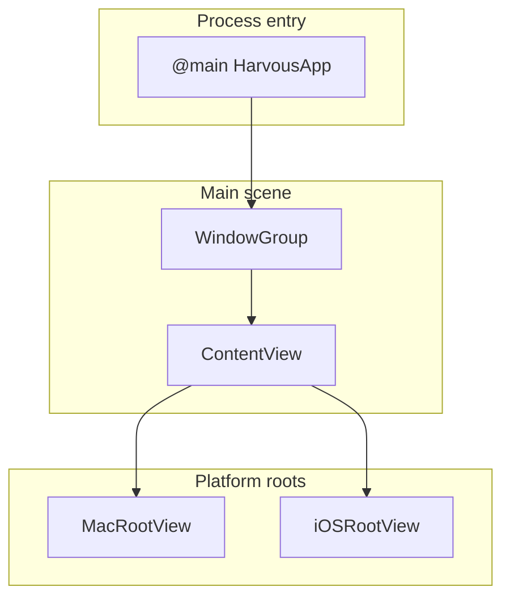

# Harvous Swift and SwiftUI: a learning guide

This guide teaches **Swift** and **SwiftUI** by reading **real Harvous native code** in [`native/Harvous/`](../../native/Harvous/). It is written for you if you already think in **HTML, CSS, JavaScript, and React**, and you want enough depth to **open Xcode, navigate the project, and make small edits** without guessing what every keyword does.

**How this fits next to the other docs**

- **[SWIFTUI_APP_ARCHITECTURE.md](SWIFTUI_APP_ARCHITECTURE.md)** — a compact map of the multiplatform app: which SwiftUI types appear where, macOS vs iOS.
- **[MACOS_SWIFTUI_NATIVE_APP_GUIDE.md](MACOS_SWIFTUI_NATIVE_APP_GUIDE.md)** — macOS-focused architecture, the note editor as a SwiftUI shell around AppKit `NSTextView`, glossary with web parallels.

This document goes **deeper on the language and framework mechanics** (“why does this compile?” “why did my change do nothing?”) and gives **reading paths** plus an **editing playbook**. Section **[6. Harvous-only building blocks](#6-harvous-only-building-blocks)** catalogs **custom Harvous types and patterns** (editor proxy, scripture attachments, router, dock preferences, vault, menus) that you will not see in generic SwiftUI samples. When a topic is already covered in detail elsewhere (for example the `NSViewRepresentable` bridge), this guide **points you there** instead of duplicating it.

**Preview builds and Gatekeeper:** [help/mac-native-app.md](../../help/mac-native-app.md).

---

## Table of contents

1. [Read the app like a story](#1-read-the-app-like-a-story)
2. [Swift language through Harvous](#2-swift-language-through-harvous)
3. [SwiftUI mechanics through Harvous](#3-swiftui-mechanics-through-harvous)
4. [Data: SwiftData in Harvous](#4-data-swiftdata-in-harvous)
5. [Bridge code: when SwiftUI is not enough](#5-bridge-code-when-swiftui-is-not-enough)
6. [Harvous-only building blocks](#6-harvous-only-building-blocks)
7. [Editing playbook](#7-editing-playbook)
8. [How to debug and verify](#8-how-to-debug-and-verify)
9. [Appendix: glossary and reading sessions](#9-appendix-glossary-and-reading-sessions)

---

## 1. Read the app like a story

Every native app has a **process entry point**. In Swift, the executable marks exactly one type with `@main`. Harvous uses that on the app struct:

```19:35:native/Harvous/HarvousApp.swift
@main
struct HarvousApp: App {
    /// Wake Netlify function + Postgres before the user taps a scripture pill (non-blocking).
    init() {
        ScriptureVerseFetch.warmBackendForVerseFetch()
    }

    @StateObject private var appRouter = HarvousAppRouter()
    @StateObject private var spaceStore = SpaceStore()
    #if os(macOS)
    @StateObject private var macNoteListSelectionCoordinator = MacNoteListSelectionCoordinator()
    #endif

    /// Built once, explicitly, so we can log migration failures instead of silently
    /// falling back to an in-memory store (which is what `.modelContainer(for:)` does
    /// when auto-migration can't reconcile a schema change).
    private let modelContainer: ModelContainer = HarvousApp.makeModelContainer()
```

**Teaching moment — `@main` and `App`:** `@main` tells the compiler to generate a `main()` that boots this type. `HarvousApp` conforms to `App`, which means it defines **scenes** (windows or window groups) in `var body: some Scene { … }`. That is not the same `body` as a `View`; scenes describe **window-level** structure.

**Teaching moment — `init()` on the app:** The struct’s `init()` runs early. Harvous uses it for a **non-blocking** warm-up (`ScriptureVerseFetch.warmBackendForVerseFetch()`). Compare to React: there is no single `index.tsx` render; the system owns lifecycle, and `init` is one of the first hooks you get for process-level setup.

From there, the main `WindowGroup` hosts `ContentView()`, injects **environment objects** (router, space store, macOS selection coordinator), attaches **SwiftData** via `.modelContainer(modelContainer)`, and on macOS registers **menu commands** and **toolbar style**. See the same file from `var body: some Scene` through the end of `HarvousApp`.

**`ContentView`** is the root **view** inside that window group. It chooses the platform shell and applies global modifiers:

```11:53:native/Harvous/ContentView.swift
struct ContentView: View {
    @EnvironmentObject private var appRouter: HarvousAppRouter
    @EnvironmentObject private var spaceStore: SpaceStore
    @Environment(\.modelContext) private var modelContext
    @Environment(\.scenePhase) private var scenePhase
    #if os(macOS)
    @Environment(\.openWindow) private var openWindow
    #endif

    var body: some View {
        Group {
            #if os(macOS)
            MacRootView()
            #else
            iOSRootView()
            #endif
        }
        .environment(\.harvousScriptureTheme, spaceStore.scriptureTheme)
        .task {
            spaceStore.bootstrapIfNeeded(modelContext: modelContext)
            _ = spaceStore.consumePendingJoinToken(modelContext: modelContext)
            NoteSimpleIDAssigner.backfillAllIfNeeded(in: modelContext)
        }
        .onChange(of: scenePhase) { _, phase in
            guard phase == .inactive || phase == .background else { return }
            HarvousVaultExportCoordinator.shared.flush(modelContext: modelContext)
            HarvousVaultInboxScanner.scanIfNeeded(modelContext: modelContext, activeSpaceId: spaceStore.activeSpaceUUID())
        }
        .onOpenURL { url in
            SpaceStore.queueJoinTokenFromURL(url)
            HarvousPendingRoute.applyURL(url)
            spaceStore.bootstrapIfNeeded(modelContext: modelContext)
            _ = spaceStore.consumePendingJoinToken(modelContext: modelContext)
            #if os(iOS)
            appRouter.applyPendingDeepLink()
            #endif
        }
        #if os(macOS)
        .onReceive(NotificationCenter.default.publisher(for: .harvousOpenMacPreferences)) { _ in
            openWindow(id: HarvousMacPreferencesWindow.sceneID)
        }
        #endif
    }
}
```

So the story is: **`HarvousApp`** creates long-lived objects and the database container, then **`ContentView`** wires **lifecycle** (`.task`, `.onChange`, URLs, notifications) and branches to **`MacRootView`** or **`iOSRootView`**.



For **macOS layout** (sidebar, split, inspector, navigation stack inside the detail column), continue in `ContentView.swift` inside `MacRootView`. For **tabs, sheets, and navigation paths** on iPhone, read `iOSRootView` in the same file. The architecture doc lists the SwiftUI controls by name; your job in this guide is to recognize **why** those controls exist (state ownership, platform conventions).

---

## 2. Swift language through Harvous

This section is **not** a complete Swift course. It ties common language features to **places you will actually see them** in Harvous.

### Structs versus classes (and `final`)

**Views are almost always `struct`s** that conform to `View`. The struct is a **lightweight description** of UI. SwiftUI creates and discards values often. That is why you do not put “do this once at mount” logic in an initializer for a child view unless you understand the lifetime rules; you use `.onAppear`, `.task`, or a dedicated object.

**Models and stores are reference types (`class`).** `Note` is a persisted SwiftData model:

```4:6:native/Harvous/Models/Note.swift
@Model
final class Note {
```

`final` means “no subclasses,” which matches data models you do not intend to extend through inheritance.

**Teaching moment:** If you think “React function component,” map the **`struct` view** to the **render result** and map the **`class` model** to **mutable app state living outside the render**. Swift does not let you confuse them as easily as JavaScript objects in closures.

### Optionals, `guard`, and `if let`

Swift uses **optionals** (`UUID?`, `URL?`) for values that may be absent. Harvous uses `guard` and `if let` when opening the SwiftData store URL:

```51:69:native/Harvous/HarvousApp.swift
        let storeURL: URL? = {
            let fm = FileManager.default
            guard let dir = try? fm.url(
                for: .applicationSupportDirectory,
                in: .userDomainMask,
                appropriateFor: nil,
                create: true
            ) else { return nil }
            let appDir = dir.appendingPathComponent("Harvous", isDirectory: true)
            try? fm.createDirectory(at: appDir, withIntermediateDirectories: true)
            return appDir.appendingPathComponent("Harvous.store")
        }()

        let config: ModelConfiguration
        if let storeURL {
            config = ModelConfiguration(schema: schema, url: storeURL)
        } else {
            config = ModelConfiguration(schema: schema)
        }
```

**Teaching moment:** `if let storeURL {` is shorthand for `if let storeURL = storeURL`. Inside the block, `storeURL` is a non-optional `URL`.

### Access control (`private`, `fileprivate`)

`private` limits visibility to the enclosing type or extension. Harvous groups small helpers next to the type that uses them. The `Logger` extension at the top of `HarvousApp.swift` keeps **subsystem strings** in one place:

```9:17:native/Harvous/HarvousApp.swift
extension Logger {
    private static let subsystem = Bundle.main.bundleIdentifier ?? "com.harvous.app"

    static let app       = Logger(subsystem: subsystem, category: "app")
    static let editor    = Logger(subsystem: subsystem, category: "editor")
    static let highlight = Logger(subsystem: subsystem, category: "highlight")
    static let vault     = Logger(subsystem: subsystem, category: "vault")
    static let settings  = Logger(subsystem: subsystem, category: "settings")
}
```

**Teaching moment:** `extension` adds methods or nested types to an existing type without subclassing. Here it configures Apple’s unified logging `Logger`.

### Conditional compilation (`#if os(macOS)`)

One source tree builds **macOS and iOS**. The compiler **strips** branches that do not match the current platform. You will see this everywhere: imports (`AppKit` vs `UIKit`), whole `struct` bodies, and `init` overloads (for example `NoteListColumn` has different initializers per platform in `NoteListColumn.swift`).

**Teaching moment:** This is **not** a runtime `if (isMac)`. Wrong-platform code never compiles into the binary, so APIs can differ completely between targets.

### Property wrappers at the language level (`@Published` + `didSet`)

SwiftUI and Combine use **property wrappers** (the `@Something` on stored properties). They rewrite your property into storage plus accessor logic.

`SpaceStore` illustrates both **`@Published`** and persistence on change:

```7:27:native/Harvous/Services/SpaceStore.swift
@MainActor
final class SpaceStore: ObservableObject {
    private let selectedSpaceKey = "selectedSpaceId"

    @Published var selectedSpaceId: String {
        didSet {
            UserDefaults.standard.set(selectedSpaceId, forKey: selectedSpaceKey)
        }
    }

    @Published var showCreateSpaceSheet = false
    @Published var createSpaceInitialVisibility: SpaceVisibility = .privateShared
    @Published var showManageSpaceSheet = false
    @Published var showJoinSpaceSheet = false
    /// Accent for scripture pills and related UI for the active space (see `Space.scriptureThemeRaw`).
    @Published var scriptureTheme: HarvousColors.ThemeVariant = .blue

    init() {
        let initial = UserDefaults.standard.string(forKey: "selectedSpaceId") ?? ""
        _selectedSpaceId = Published(initialValue: initial)
    }
```

**Teaching moment — why `_selectedSpaceId = Published(initialValue:)` in `init`?** When you customize accessors (`didSet`) for a wrapped property, Swift still needs an initial value for the underlying wrapper storage. The underscored form `_selectedSpaceId` is how you talk to the **projected storage** of `@Published` inside `init`. If you only wrote `selectedSpaceId = initial` without that line, you would fight compiler errors around initialization order.

**Teaching moment — `ObservableObject`:** Types that conform to `ObservableObject` can publish changes. `@Published` marks properties whose writes should **invalidate** SwiftUI views that depend on this object (when injected as `@StateObject` / `@ObservedObject` / `@EnvironmentObject`).

### Concurrency: `@MainActor`

`@MainActor` on `SpaceStore` means **user-facing methods run on the main actor** (the UI thread). UI updates and most SwiftUI touchpoints belong there.

**Teaching moment:** If you spawn `Task.detached` and mutate `@Published` state without hopping back to the main actor, you can get runtime warnings or subtle bugs. Harvous keeps store entry points on `@MainActor` to align with SwiftUI.

### Foundation types you will keep meeting

- **`UUID`** — primary identifiers for notes and spaces.
- **`Date`** — `createdAt`, `updatedAt`, snapshot times.
- **`UserDefaults`** — lightweight per-device preferences (selected space id, iOS surface persistence in `HarvousAppRouter`).
- **`URL` + `FileManager`** — SwiftData store location, vault paths, relocation of a corrupt store bundle in `HarvousApp`.

---

## 3. SwiftUI mechanics through Harvous

### Declarative `body` and identity

SwiftUI evaluates `var body: some View { … }` whenever **inputs** change: `@State`, `@Binding`, `@Environment`, models, and so on. It then **diffs** the new description against the old and updates the render tree.

**Identity matters** for animation and state preservation. Lists and stacks try to **match** rows across updates using stable identifiers (`Identifiable` or explicit `.id(...)`). If you ever see “state jumped to the wrong row,” suspect **unstable identity**.

### State matrix (where things live in Harvous)

| Mechanism | What it is | Harvous example | If you misuse it |
|-----------|------------|-----------------|------------------|
| `@State` | Value owned by this view; SwiftUI stores it outside the struct value | `selectedNote` in `MacRootView` ([`ContentView.swift`](../../native/Harvous/ContentView.swift)) | Recreating state on every parent refresh because you placed it in the wrong view level |
| `Binding` | Read/write handle to someone else’s state | `$selectedNote` passed into `SidebarPanelView` / `NoteEditorView` | Writing to a binding when the parent did not pass a real two-way connection |
| `@StateObject` | Create **once**, own lifetime; object is `ObservableObject` | `appRouter`, `spaceStore` in `HarvousApp` | Using `@StateObject` in a child that gets recreated and accidentally resetting global store state |
| `@EnvironmentObject` | Lookup an `ObservableObject` injected upstream | `ContentView` reads `appRouter`, `spaceStore` | Forgetting `.environmentObject(...)` on a parent → **runtime crash** when accessed |
| `@Environment(\.)` | System or custom values propagated down the tree | `@Environment(\.modelContext)`, `\.harvousScriptureTheme` | Assuming an environment value exists when it was never set (custom keys should always have a default) |

**Custom environment keys** — scripture theme defaults and accessor live in `HarvousColors.swift`:

```220:231:native/Harvous/DesignSystem/HarvousColors.swift
// MARK: - Space scripture theme (SwiftUI environment)

private struct HarvousScriptureThemeKey: EnvironmentKey {
    static let defaultValue: HarvousColors.ThemeVariant = .blue
}

extension EnvironmentValues {
    var harvousScriptureTheme: HarvousColors.ThemeVariant {
        get { self[HarvousScriptureThemeKey.self] }
        set { self[HarvousScriptureThemeKey.self] = newValue }
    }
}
```

`ContentView` sets it once for the subtree:

```28:28:native/Harvous/ContentView.swift
        .environment(\.harvousScriptureTheme, spaceStore.scriptureTheme)
```

Downstream views read `@Environment(\.harvousScriptureTheme)` (for example `NoteEditorView`, `NoteToolbar`, tag chips).

### Lifecycle modifiers (global behavior)

Still in `ContentView`, notice:

- **`.task { }`** — async-friendly work when the view appears; cancelled when the view goes away. Used for bootstrap and token consumption.
- **`.onChange(of:scenePhase)`** — reacts when the app moves to background; Harvous flushes vault export and scans inbox.
- **`.onOpenURL`** — deep links (`harvous://`).
- **`.onReceive`** — macOS listens for a notification to open Preferences.

That pattern is “**attach side effects to the stable root**” instead of scattering them in leaf views.

### Bindings beyond `$foo`

Not every binding is the default projection. `MacRootView` wraps split visibility to **disable animations** on a specific transition:

```77:93:native/Harvous/ContentView.swift
    /// Suppresses the slide animation when expanding the sidebar (.detailOnly → anything else).
    ///
    /// With `.windowToolbarStyle(.unified)`, AppKit re-checks overflow on every animation tick; during expand interpolation it can flash the "more" chevron even when final widths fit. Committing the expand in one transaction gives a single layout pass at final widths. Collapse (→ .detailOnly) keeps default animation.
    private var animatedSplitVisibility: Binding<NavigationSplitViewVisibility> {
        Binding(
            get: { splitColumnVisibility },
            set: { newValue in
                if splitColumnVisibility == .detailOnly && newValue != .detailOnly {
                    var tx = Transaction()
                    tx.disablesAnimations = true
                    withTransaction(tx) { splitColumnVisibility = newValue }
                } else {
                    splitColumnVisibility = newValue
                }
            }
        )
    }
```

**Teaching moment:** `Binding(get:set:)` is a **manual** two-way connection, same concept as React’s controlled component with `value` and `onChange`, but written as one value.

Toolbar overflow background: [MACOS_UNIFIED_TOOLBAR_OVERFLOW.md](../MACOS_UNIFIED_TOOLBAR_OVERFLOW.md).

---

## 4. Data: SwiftData in Harvous

### Models (`@Model`) and relationships

`Note` uses `@Model` and `@Relationship` for study threads and snapshots (see full file). SwiftData generates persistence metadata from these annotations.

### Queries from views (`@Query`)

`@Query` declares **what to fetch** from the SwiftData store as part of the view. The list column sorts notes with a compound sort:

```71:77:native/Harvous/Views/NoteListColumn.swift
    @Query(sort: [
        SortDescriptor(\Note.updatedAt, order: .reverse),
        SortDescriptor(\Note.createdAt, order: .reverse),
    ]) private var notes: [Note]
    @Environment(\.modelContext) private var context
    @Environment(\.colorScheme) private var colorScheme
    @EnvironmentObject private var spaceStore: SpaceStore
```

Other `@Query` sites you can compare:

- [`SidebarPanelView.swift`](../../native/Harvous/Views/SidebarPanelView.swift) — notes for sidebar.
- [`LibraryView.swift`](../../native/Harvous/Views/LibraryView.swift) — library listing.
- [`SpaceSwitcherView.swift`](../../native/Harvous/Views/SpaceSwitcherView.swift) — spaces sorted by name.
- [`SpotlightSearchView.swift`](../../native/Harvous/Views/SpotlightSearchView.swift) — search scope.
- [`NoteHistorySection.swift`](../../native/Harvous/Views/NoteHistorySection.swift) — snapshots.
- [`NoteEditorById.swift`](../../native/Harvous/Views/NoteEditorById.swift) — resolve a note by id.

**Teaching moment:** `@Query` results still need **app filtering** (for example `notesInActiveSpace` in `NoteListColumn`) because the predicate for “active space” may be dynamic or repaired in code.

### Imperative fetches (`ModelContext` + `#Predicate`)

`SpaceStore` uses `FetchDescriptor` and `#Predicate` when it needs a **one-off** read (theme refresh, selection repair):

```39:46:native/Harvous/Services/SpaceStore.swift
    func refreshScriptureTheme(modelContext: ModelContext) {
        let id = activeSpaceUUID()
        let fd = FetchDescriptor<Space>(predicate: #Predicate { $0.id == id && !$0.isArchived })
        if let space = try? modelContext.fetch(fd).first {
            scriptureTheme = space.scriptureTheme
        } else {
            scriptureTheme = .blue
        }
    }
```

**Teaching moment — `#Predicate`:** This is a **macro** that builds a database query representation at compile time. You cannot put arbitrary Swift functions inside the closure; stick to supported expressions.

### Why `makeModelContainer()` is strict

Harvous **refuses** to silently fall back to an empty in-memory database if the on-disk store cannot open (for example after a schema mismatch). Read the comments in `HarvousApp.makeModelContainer()` and the `fatalError` path. **Changing `Note`’s stored properties** without a migration strategy is a serious change. When in doubt, ask someone who has shipped a SwiftData migration before you merge.

---

## 5. Bridge code: when SwiftUI is not enough

The rich note surface is **TextKit** (`NSTextView` on macOS, `UITextView` on iOS), not a column of SwiftUI `Text` views. Scripture **pills** are **attachments** in the text storage, not child SwiftUI views in the layout tree.

**Where to read next**

- Full walkthrough: [MACOS_SWIFTUI_NATIVE_APP_GUIDE.md](MACOS_SWIFTUI_NATIVE_APP_GUIDE.md) — `NSViewRepresentable`, coordinator, `updateNSView`.
- Implementation: [`HarvousEditor.swift`](../../native/Harvous/Editor/HarvousEditor.swift) — large file mixing **free functions** (for example `harvousExpandedPlainText(in:)`), platform branches, and `@MainActor` helpers.

**Teaching moment:** When you open `HarvousEditor.swift`, expect **Cocoa string ranges (`NSRange`)**, **attributes on `NSTextStorage`**, and **attachment subclasses**. That is normal for a serious text editor; SwiftUI is only the chrome around it.

---

## 6. Harvous-only building blocks

This section lists **custom layers and types** you will not find in Apple’s tutorials. They are the “Harvous dialect” on top of SwiftUI: how scripture, chrome, navigation, and file mirroring are wired.

### `EditorProxy` — SwiftUI talks to the text view through a published façade

[`EditorProxy.swift`](../../native/Harvous/Editor/EditorProxy.swift) is an `@MainActor` `ObservableObject` that holds a **weak** reference to the real `NSTextView` / `UITextView` (`HVTextView` typealias) and exposes dozens of `@Published` fields: selection geometry, format toolbar state, sheet booleans (`showAddLinkSheet`), scripture pill UI flags, and so on.

**Teaching moment:** The editor **view** is representable AppKit/UIKit; the **toolbar and sheets** around it are SwiftUI. `EditorProxy` is the **bridge object** so SwiftUI can `ObservedObject` or bind to `proxy.showAddLinkSheet` while the coordinator mutates the same object from TextKit callbacks. If you add a new piece of SwiftUI chrome that depends on caret position or typing attributes, you will likely **thread it through `EditorProxy`** first, not invent a new global.

On iOS, `HarvousAppRouter` optionally subscribes to `proxy.objectWillChange` so tab-level chrome can refresh when the proxy updates (`iosRegisterNoteEditorChrome` in [`HarvousAppRouter.swift`](../../native/Harvous/App/HarvousAppRouter.swift)).

### Scripture stack — pills live in the text engine, not the view tree

Harvous treats scripture references as **TextKit attachments** (`ScripturePillAttachment` and related types under [`Editor/`](../../native/Harvous/Editor/)), parsed and maintained by coordinators such as [`ScriptureDetectionCoordinator.swift`](../../native/Harvous/Editor/ScriptureDetectionCoordinator.swift) and [`ScriptureDetector.swift`](../../native/Harvous/Editor/ScriptureDetector.swift). That is fundamentally different from rendering a row of React components for each reference.

Plain `NSTextStorage.string` uses the **object replacement character** for attachments, so Harvous centralizes expansion into plain text for persistence and snippets in **`harvousExpandedPlainText(in:)`** at the top of [`HarvousEditor.swift`](../../native/Harvous/Editor/HarvousEditor.swift). When you debug “the list preview does not match what I see in the editor,” start there.

Verse text over the network is handled separately (for example [`ScriptureVerseFetch.swift`](../../native/Harvous/Services/ScriptureVerseFetch.swift)); the app warms that path from `HarvousApp.init()`.

### `HarvousAppRouter`, `HarvousPendingRoute`, and `NotificationCenter`

**Router** ([`HarvousAppRouter.swift`](../../native/Harvous/App/HarvousAppRouter.swift)) holds cross-cutting UI state: iOS list surface, “You” sheet + `youNavigationStack`, filter sheet presentation, macOS settings deep link, and editor-chrome registration described above. It is the closest thing to a small **client-side event bus** for UI that is not pure parent/child props.

**`HarvousPendingRoute`** in the same file normalizes `harvous://` URLs into a persisted string so cold launch and web-to-app handoff can apply one route later.

Some actions still use **`NotificationCenter`** (for example compose requests and macOS preferences — see `ContentView` / `iOSRootView` `focusedSceneValue` and `.onReceive`). That is intentional **decoupling** where SwiftUI’s focus chain or scene boundaries make direct bindings awkward.

### `MacNoteListSelectionCoordinator` (macOS)

Injected from `HarvousApp` as an `@EnvironmentObject`, [`MacNoteListSelectionCoordinator.swift`](../../native/Harvous/App/MacNoteListSelectionCoordinator.swift) coordinates **list selection** with editor and command behavior so menu actions and the sidebar stay consistent. If you change how notes are selected or deleted on Mac, read this type before editing list handlers in isolation.

### Dock layout: `PreferenceKey` + custom `EnvironmentKey`

[`DockExpandedContentEnvironment.swift`](../../native/Harvous/Views/DockExpandedContentEnvironment.swift) combines two SwiftUI patterns Apple documents separately:

- **`PreferenceKey`** (`DockScrollContentHeightKey`, `PassageFrameInBodyKey`) — children **report measurements upward** so ancestors (scripture / highlight docks) can size or position overlays without imperative layout code.
- **`EnvironmentKey`** (`harvousDockExpandedContentMaxHeight`) — once the viewport-derived cap is known, ancestors **push it down** the tree so scroll regions inside docks share one clamped max height.

**Teaching moment:** Environment flows **down**; preferences bubble **up** then you often **write back** via environment after computing in a parent. Harvous uses both so dock chrome can match scroll content and escape `ScrollView` clipping for passage selection.

### Markdown vault mirror and inbox

On lifecycle boundaries, `ContentView` calls **`HarvousVaultExportCoordinator`** flush and **`HarvousVaultInboxScanner`** ([`Services/`](../../native/Harvous/Services/)). These mirror or scan files under Application Support / space folders — **product-specific** persistence alongside SwiftData, not a framework feature. If you add “write this whenever the note changes,” check whether vault or inbox already covers it.

### `HarvousCommands` and the focus chain

[`HarvousCommands.swift`](../../native/Harvous/HarvousCommands.swift) registers the menu bar. Commands read **`@FocusedValue`** entries that editor hosts set with `.focusedSceneValue` (see `ContentView` / `NoteEditorView`). **Teaching moment:** This replaces ad-hoc “if the editor is focused” singletons: the system walks the **first responder chain** and supplies values to matching command handlers.

### Study threads and `ThreadStore`

Linked-note / study-thread **persistence** is SwiftData (`StudyThread` on `Note`). Imperative helpers live on **`ThreadStore`** ([`ThreadStore.swift`](../../native/Harvous/Services/ThreadStore.swift)) — mostly `static` methods for CRUD, trail snapshots, and canonical scripture display strings. **Teaching moment:** Harvous often splits **“what rows `@Query` returns”** from **“how we mutate or derive snippets”** into a small service `enum` or namespace to keep views thinner.

### iOS chrome: `MorphingChromeBar`

[`MorphingChromeBar.swift`](../../native/Harvous/Views/MorphingChromeBar.swift) (used from `iOSRootView` via `safeAreaInset`) is custom **bottom chrome** that morphs between list and editor contexts. It is not a system `TabView` accessory; expect Harvous-specific state from `HarvousAppRouter` and the active note editor proxy.

### Another custom environment: iOS toolbar embedding

[`NoteToolbar.swift`](../../native/Harvous/Views/NoteToolbar.swift) declares `HarvousIOSNoteToolbarUnifiedShellEmbeddingKey` — a private `EnvironmentKey` so unified toolbar embedding can be toggled per hierarchy. Pattern matches `harvousScriptureTheme`: default in `EnvironmentKey`, read with `@Environment(\.…)`.

When you discover a new `EnvironmentKey` in the project, ask: **who sets it?** (search for `.environment(\.keyName,`) and **who reads it?** — that pair is your data flow.

---

## 7. Editing playbook

Each recipe lists a **goal**, **where to look**, **pattern to copy**, and a **pitfall**.

### Change a macOS toolbar button or label

- **Where:** [`ContentView.swift`](../../native/Harvous/ContentView.swift) (`MacRootView` toolbar), [`NoteToolbar.swift`](../../native/Harvous/Views/NoteToolbar.swift), and editor chrome in [`NoteEditorView.swift`](../../native/Harvous/Views/NoteEditorView.swift) depending on the control.
- **Pattern:** `ToolbarItem(placement: …) { Button(…) { … } }`, optionally `.help("…")` for tooltips.
- **Pitfall:** Placements differ between macOS and iOS. If you need parity on iPhone, read [`.cursor/rules/native-cross-platform-style-parity.mdc`](../../.cursor/rules/native-cross-platform-style-parity.mdc).

### Add a persisted field on `Note`

- **Where:** Model in [`Note.swift`](../../native/Harvous/Models/Note.swift); UI wherever the field should display or edit.
- **Pattern:** Add the property with a sensible default; extend `init` if the model has a memberwise initializer used by callers.
- **Pitfall:** SwiftData **migration**. Test upgrade from an older build. Prefer additive changes (optional fields) until you understand versioning. Align with web app rules where the product shares semantics (see workspace docs on note IDs and sync).

### Present a sheet from global router state (iOS)

- **Where:** [`HarvousAppRouter.swift`](../../native/Harvous/App/HarvousAppRouter.swift) (`@Published` flags and navigation stacks), presentation in [`ContentView.swift`](../../native/Harvous/ContentView.swift) `iOSRootView`.
- **Pattern:** `.sheet(isPresented: $appRouter.iosShowMore) { … }` with inner `NavigationStack(path: $appRouter.youNavigationStack)` — see the “You” sheet in `iOSRootView`.
- **Pitfall:** Clearing `NavigationStack` paths synchronously during other transitions can clash with animations; Harvous sometimes uses `Task { @MainActor in … }` to defer path resets (see comment near `onChange(of: appRouter.iosListSurface)` in `ContentView.swift`).

### Present a sheet from local view state

- **Where:** [`SpaceSwitcherView.swift`](../../native/Harvous/Views/SpaceSwitcherView.swift) (`spaceStore.showCreateSpaceSheet`), [`NoteEditorView.swift`](../../native/Harvous/Views/NoteEditorView.swift) (many `.sheet` modifiers bound to local or proxy state).
- **Pattern:** `.sheet(isPresented:)` for Bool, `.sheet(item:)` for optional `Identifiable` payloads.
- **Pitfall:** For `item:` sheets, the item’s **identity** must change when you want the sheet to represent a new object.

### Add a menu command that depends on the focused editor

- **Where:** [`HarvousCommands.swift`](../../native/Harvous/HarvousCommands.swift) and focused values wired from editor hosts (search `focusedSceneValue` / `@FocusedValue` in the project).
- **Pitfall:** Do not reach for global singletons; follow existing focused value patterns so commands disable when not applicable.

---

## 8. How to debug and verify

### Breakpoints

- Put a breakpoint in an **action closure** (`Button { … }`) to confirm user interaction wiring.
- Putting a breakpoint directly in `body` fires **often**; that is normal. Prefer breakpoints in **mutating methods** on stores or in **callbacks** from the editor coordinator when chasing logic bugs.

### Logging

Use the `Logger` categories defined in `HarvousApp.swift` (`Logger.app`, `Logger.editor`, …). Filter the Xcode console by subsystem or category.

### Building the native target

Use whatever workflow your team documents for opening `native/` in Xcode and selecting the **Harvous** scheme for macOS or iOS. Release preview context lives in [help/mac-native-app.md](../../help/mac-native-app.md).

---

## 9. Appendix: glossary and reading sessions

### Mini glossary (Swift term → Harvous hook)

| Term | One-line meaning | Harvous hook |
|------|------------------|--------------|
| `@main` | Process entry type | `HarvousApp` |
| `App` / `Scene` | Window-level structure | `HarvousApp.body` |
| `View` | Declarative UI description | Every `struct …: View` |
| `@State` | Local view state | `selectedNote` in `MacRootView` |
| `Binding` | Two-way handle | `$selectedNote`, custom `Binding` for split visibility |
| `@StateObject` | Owns observable object for lifetime | Router and stores in `HarvousApp` |
| `@EnvironmentObject` | Injected observable object | `ContentView`, editor chrome |
| `@Environment` | Injected context values | `modelContext`, `harvousScriptureTheme` |
| `@Query` | Declarative SwiftData fetch in a view | `NoteListColumn`, sidebar, library |
| `@Model` | Persisted class schema | `Note`, `Space`, … |
| `#Predicate` | Compile-time query macro | `SpaceStore` fetches |
| `@MainActor` | UI-isolated concurrency domain | `SpaceStore`, editor helpers |
| `#if os` | Conditional compilation | macOS vs iOS branches |
| `NSViewRepresentable` | Embed AppKit in SwiftUI | Editor bridge (see macOS guide) |
| `EditorProxy` | Published bridge from TextKit to SwiftUI | [`EditorProxy.swift`](../../native/Harvous/Editor/EditorProxy.swift) |
| `PreferenceKey` | Child-to-parent layout data | [`DockExpandedContentEnvironment.swift`](../../native/Harvous/Views/DockExpandedContentEnvironment.swift) |

### Suggested reading sessions (60–90 minutes each, plus one shorter Harvous-specific pass)

**Session A — Boot and root state**

1. [`HarvousApp.swift`](../../native/Harvous/HarvousApp.swift) — `@main`, model container, `WindowGroup`, macOS `Window` for settings.
2. [`ContentView.swift`](../../native/Harvous/ContentView.swift) — lifecycle modifiers, platform switch.
3. [`SpaceStore.swift`](../../native/Harvous/Services/SpaceStore.swift) — `@Published`, persistence, bootstrap.
4. [`HarvousAppRouter.swift`](../../native/Harvous/App/HarvousAppRouter.swift) — cross-surface UI state.

**Session B — Lists, queries, and navigation**

1. [`NoteListColumn.swift`](../../native/Harvous/Views/NoteListColumn.swift) — `@Query`, filtering, selection binding.
2. [`SidebarPanelView.swift`](../../native/Harvous/Views/SidebarPanelView.swift) — macOS sidebar composition.
3. [`ContentView.swift`](../../native/Harvous/ContentView.swift) — `MacRootView` / `iOSRootView` navigation containers.

**Session C — Editor and design tokens**

1. [MACOS_SWIFTUI_NATIVE_APP_GUIDE.md](MACOS_SWIFTUI_NATIVE_APP_GUIDE.md) — editor bridge overview.
2. [`HarvousEditor.swift`](../../native/Harvous/Editor/HarvousEditor.swift) — skim `NSViewRepresentable` / `UIViewRepresentable` types and coordinators (do not read every line on first pass).
3. [`HarvousColors.swift`](../../native/Harvous/DesignSystem/HarvousColors.swift) — environment key for scripture theme.
4. [`HarvousTypography.swift`](../../native/Harvous/DesignSystem/HarvousTypography.swift) — font tokens (prefer these over ad-hoc `.font(.system(…))` when a token exists).

**Session D — Harvous-only wiring (45–60 minutes)**

1. Re-read [section 6](#6-harvous-only-building-blocks) above.
2. [`EditorProxy.swift`](../../native/Harvous/Editor/EditorProxy.swift) — skim `@Published` surface; find `weak var textView`.
3. [`ScripturePillAttachment.swift`](../../native/Harvous/Editor/ScripturePillAttachment.swift) — attachment model for a pill.
4. [`DockExpandedContentEnvironment.swift`](../../native/Harvous/Views/DockExpandedContentEnvironment.swift) — `PreferenceKey` + `EnvironmentKey`.
5. [`HarvousCommands.swift`](../../native/Harvous/HarvousCommands.swift) — menu commands at the top define `FocusedValueKey` types; compare with `.focusedSceneValue` wiring in [`ContentView.swift`](../../native/Harvous/ContentView.swift) and [`NoteEditorView.swift`](../../native/Harvous/Views/NoteEditorView.swift).

---

## Official Apple references (supplement)

- [Swift language documentation](https://docs.swift.org/swift-book/)
- [SwiftUI essentials](https://developer.apple.com/documentation/swiftui)
- [SwiftData](https://developer.apple.com/documentation/swiftdata)

When Apple's docs and Harvous code disagree, **trust the compiler and the shipped patterns in this repo**, then reconcile with Apple's guidance for the OS version you target.
