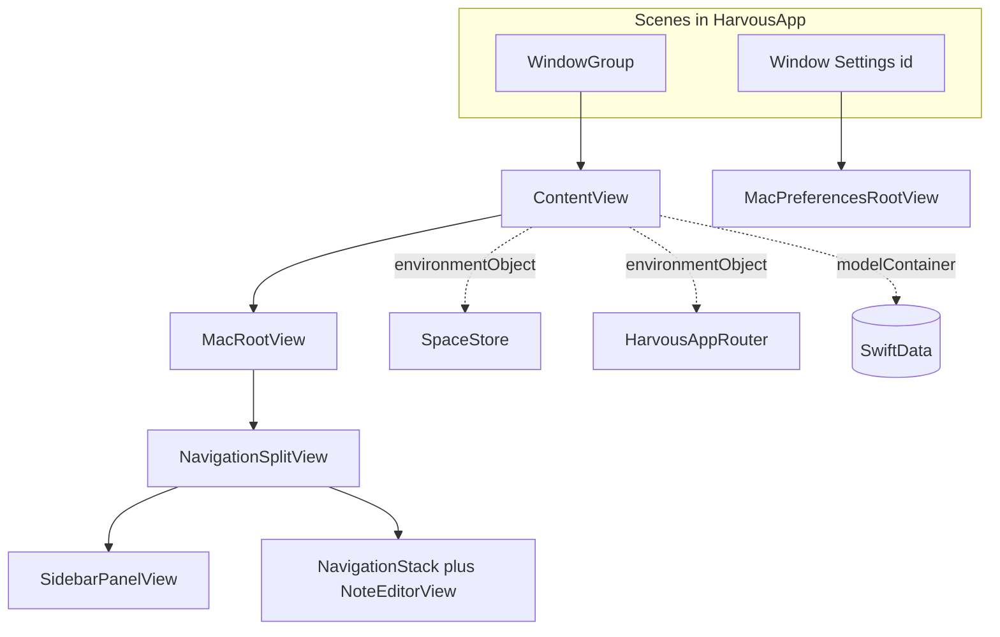

# Harvous macOS: SwiftUI and native app architecture

This guide explains how the **Harvous macOS** app is built with **SwiftUI**, where **AppKit** (via `NSTextView`) fits in, and how the pieces work together so the app feels like a real Mac app—not a wrapped website. It is written for developers who know **HTML/CSS**, **JavaScript**, and **React**, and who are learning Apple platform APIs.

**Related docs**

- Swift language and SwiftUI taught through Harvous (reading paths, editing playbook): [HARVOUS_SWIFT_AND_SWIFTUI_LEARNING_GUIDE.md](HARVOUS_SWIFT_AND_SWIFTUI_LEARNING_GUIDE.md)
- Cross-platform SwiftUI map (macOS + iOS): [SWIFTUI_APP_ARCHITECTURE.md](SWIFTUI_APP_ARCHITECTURE.md)
- Preferences window chrome (why `Window` vs `Settings`, title bar, toolbars): [MACOS_PREFERENCES_WINDOW_AND_TITLEBAR.md](MACOS_PREFERENCES_WINDOW_AND_TITLEBAR.md)
- Settings information architecture: [PROFILE_PREFERENCES_IA.md](PROFILE_PREFERENCES_IA.md)

**Primary source tree:** `[native/Harvous/](../native/Harvous/)`

---

## If you know React / the web…

SwiftUI is **declarative** like React: you describe UI as a function of state, and the framework updates what is on screen when state changes. The mental shift is that **views are value types** (`struct`) and `body` is re-evaluated often—you put **long-lived objects** (stores, debouncers, the database context) in wrappers like `@StateObject` or the environment, not inside `body` as if every run were `mount`.

### Web / React ↔ SwiftUI (quick map)

| Web / React                               | SwiftUI / Harvous                                                | In one sentence                                                                                  |
| ----------------------------------------- | ---------------------------------------------------------------- | ------------------------------------------------------------------------------------------------ |
| Function component + JSX return           | `struct MyView: View { var body: some View { … } }`              | You return a **description** of UI; SwiftUI diffs it against the previous frame.                 |
| `useState`                                | `@State`                                                         | Local state owned by this view hierarchy; changes invalidate dependent `body` work.              |
| Controlled input: `value` + `onChange`    | `Binding` (`$note`)                                              | Parent owns truth; child reads/writes through a two-way handle.                                  |
| `createContext` + Provider + `useContext` | `ObservableObject` + `.environmentObject` + `@EnvironmentObject` | Reference-type store broadcast down the tree (e.g. `SpaceStore`, `HarvousAppRouter`).            |
| Theme on context                          | Custom `EnvironmentValues` (e.g. `\.harvousScriptureTheme`)      | Typed, inherited values without threading props through every layer.                             |
| `useEffect(() => { … }, [deps])`          | `.onChange(of:)`, `.onAppear`, `.task { }`                       | React to lifecycle or when specific values change; `task` is async-friendly.                     |
| `window.dispatchEvent` + listeners        | `NotificationCenter.default.post` + `.onReceive(…)`              | Cross-cutting events between views that are not parent/child (import finished, open note by id). |
| React Router stack                        | `NavigationStack` + `NavigationPath`                             | Push/pop inside the detail column (e.g. linked notes).                                           |
| App shell: sidebar + main (`flex` layout) | `NavigationSplitView`                                            | System-standard **sidebar + detail** on Mac.                                                     |
| Embedding Mapbox / CodeMirror via ref     | `NSViewRepresentable`                                            | Host a real **AppKit** `NSTextView` inside SwiftUI (`HarvousEditor`).                            |
| Shortcuts scoped to “focused editor”      | `FocusedValues` + `.focusedSceneValue` / `.focusedObject`        | Menu commands read optional closures or `EditorProxy` from focus chain instead of globals.       |

### What does *not* map cleanly to the browser

- `**WindowGroup` / `Window`:** The **OS** creates, layers, and closes windows. There is no single “document” like one browser tab unless you think of each window as its own top-level route.
- `**ModelContainer` / SwiftData:** On-disk **SQLite** with migrations and a type-safe query layer—not “fetch JSON and put it in state.” Opening the store can **fail**; Harvous prefers to **fatalError** after logging rather than silently use an empty in-memory store (see `HarvousApp.makeModelContainer()`).
- `**#Predicate`:** Compile-time expression for queries (different from a runtime filter function in JS).
- `**scenePhase`:** App/window **foreground and background**—like `visibilitychange` / mobile lifecycle, but first-class for saving and background work.

**One paragraph:** A **native Mac app** participates in **menus, multiple windows, focus, services, and file locations** the OS expects. SwiftUI gives you the layout and state wiring; **AppKit** still powers the heavy rich text surface (`NSTextView`). Harvous combines them on purpose: scripture **pills** and study highlights are **text attachments** in TextKit, not DOM nodes.

---

## How the app boots (entry → first frame)

**File:** `[native/Harvous/HarvousApp.swift](../native/Harvous/HarvousApp.swift)`

| Name                                                           | What it does                                                                                                     | Why Harvous uses it                                                                                                               |
| -------------------------------------------------------------- | ---------------------------------------------------------------------------------------------------------------- | --------------------------------------------------------------------------------------------------------------------------------- |
| `@main`                                                        | Marks the executable entry type.                                                                                 | Starts `HarvousApp` as the process entry point (like `main()`).                                                                   |
| `struct HarvousApp: App`                                       | Declares **scenes** (windows) and shared modifiers.                                                              | One place for `WindowGroup`, Settings `Window`, SwiftData, and commands.                                                          |
| `HarvousApp.makeModelContainer()`                              | Builds `ModelContainer` with a fixed **Schema**, URL under **Application Support**, and explicit error handling. | Avoids SwiftUI’s silent fallback to an **in-memory** store when migration fails—user data must not vanish without a loud failure. |
| `ScriptureVerseFetch.warmBackendForVerseFetch()` (in `init()`) | Non-blocking warm-up toward your backend.                                                                        | First scripture pill fetch feels responsive after cold launch.                                                                    |
| `@StateObject` for `HarvousAppRouter`, `SpaceStore`            | Creates **one** instance for the app lifetime and publishes changes.                                             | Same idea as a module-level store, but lifecycle-correct for SwiftUI.                                                             |
| `.environmentObject(…)` on `ContentView`                       | Injects those objects into the environment.                                                                      | Any descendant can `@EnvironmentObject` without prop drilling.                                                                    |
| `.modelContainer(modelContainer)`                              | Attaches SwiftData to the scene.                                                                                 | Injects `@Environment(\.modelContext)` for inserts/fetches/saves.                                                                 |
| `.commands { HarvousCommands() }`                              | Registers menu bar commands.                                                                                     | Native **File / Note / Format** menus wired to focused actions.                                                                   |

**macOS-only on the main scene**

- `**.windowToolbarStyle(.unified(showsTitle: false))`** — One glass strip for traffic lights + toolbar (note title stays in the editor, not the window chrome).
- `**.defaultSize` / `.windowResizability**` — Sensible initial geometry and minimum size.

**Second scene:** `Window("Settings", id: HarvousMacPreferencesWindow.sceneID)` — Preferences as a normal window so chrome matches the document window. Details: [MACOS_PREFERENCES_WINDOW_AND_TITLEBAR.md](MACOS_PREFERENCES_WINDOW_AND_TITLEBAR.md).

---

## Root view: platform switch and global side effects

**File:** `[native/Harvous/ContentView.swift](../native/Harvous/ContentView.swift)`

`ContentView` is the **single root** inside the main `WindowGroup`. It:

- Switches `**#if os(macOS)`** → `MacRootView`, else `iOSRootView`.
- Injects `**.environment(\.harvousScriptureTheme, spaceStore.scriptureTheme)**` so scripture-tinted UI follows the active space (defined in `[HarvousColors.swift](../native/Harvous/DesignSystem/HarvousColors.swift)` as an `EnvironmentKey`).
- Runs `**.task { … }**` once on appear: `spaceStore.bootstrapIfNeeded`, join token consumption, ID backfill.
- `**.onChange(of: scenePhase)**` when going inactive/background: flush vault export, scan inbox—like flushing IndexedDB or sending a `beforeunload`-style save, but OS-driven.
- `**.onOpenURL**` for `harvous://` deep links: queues join token, applies pending route, bootstraps space.
- On macOS: `**.onReceive**` for `harvousOpenMacPreferences` → `openWindow(id:)` so ⌘, can open prefs.

| Name                                                | What it does                                                      | Why Harvous uses it                                                     |
| --------------------------------------------------- | ----------------------------------------------------------------- | ----------------------------------------------------------------------- |
| `spaceStore.bootstrapIfNeeded(modelContext:)`       | Ensures default space exists, repairs selection, refreshes theme. | First launch and recovery must never leave the app with no valid space. |
| `SpaceStore.consumePendingJoinToken(modelContext:)` | Applies a queued space join after URL open.                       | Join links can arrive before SwiftData is ready.                        |
| `NoteSimpleIDAssigner.backfillAllIfNeeded`          | One-time data repair for note IDs.                                | Keeps local ID semantics consistent with web app rules.                 |

---

## Mac shell: split view, selection, toolbar, focus

**Type:** `MacRootView` in `[ContentView.swift](../native/Harvous/ContentView.swift)`

Think of this as your **top-level layout component**: sidebar state, selected note, inspector visibility, navigation stack for linked notes, and overlays.

| SwiftUI piece                                 | Role (web-ish)                                     | In Harvous                                                                                       |
| --------------------------------------------- | -------------------------------------------------- | ------------------------------------------------------------------------------------------------ |
| `NavigationSplitView`                         | Sidebar + detail layout                            | Left: `[SidebarPanelView](../native/Harvous/Views/SidebarPanelView.swift)`; right: editor stack. |
| `$selectedNote`                               | Lifted state / “selected row id”                   | `Binding<Note?>` into `NoteEditorView`; list and editor stay in sync.                            |
| `NavigationStack(path:)`                      | Stack navigator                                    | Pushes `LinkedNotesView` for a thread UUID via `.navigationDestination(for: UUID.self)`.         |
| `.toolbar { ToolbarItem(…) }`                 | Top chrome actions                                 | New note, collection chip, share/delete, inspector toggle, account menu.                         |
| `.focusedSceneValue(\.newNoteAction, …)` etc. | **Register keyboard/menu targets** for this window | `HarvousCommands` reads these with `@FocusedValue`; if `nil`, menu items disable.                |
| `.overlay { SpotlightSearchView }`            | Full-screen portal / modal layer                   | Command-search over notes when `showSearch` is true.                                             |
| `.onDrop`                                     | Drag-and-drop                                      | Vault import from files onto the window.                                                         |
| `.alert`                                      | Blocking confirmation UI                           | Import summary after drop/import pipeline.                                                       |

### MacRootView API spotlight

| Name                             | What it does                                                                       | Why Harvous uses it                                                                |
| -------------------------------- | ---------------------------------------------------------------------------------- | ---------------------------------------------------------------------------------- |
| `createNewNote()`                | Inserts `Note`, assigns ID, saves, indexes, schedules vault write, sets selection. | Single code path for toolbar **New Note** and menu ⌘N (via focused value).         |
| `openDailyNote()`                | Finds or creates a note titled `yyyy-MM-dd` for today in the active space.         | Daily study workflow from menu.                                                    |
| `openRandomNote()`               | Picks a random note in the active space.                                           | “Revisit” menu behavior.                                                           |
| `applyMacDeepLink()`             | Reads `HarvousPendingRoute.take()`, opens settings / compose / search.             | `harvous://` URLs normalize to a pending string; applied when the window is ready. |
| `macImportSummaryMessage(_:)`    | Formats alert copy for import report + log path.                                   | User-visible feedback after bulk import.                                           |
| `onChange(of: selectedNote?.id)` | Resets linked-note path; optionally deletes empty abandoned note.                  | Avoids stale navigation; cleans up empty notes left when switching away.           |

---

## Commands, focus, and menus (no global singleton for ⌘N)

**File:** `[native/Harvous/HarvousCommands.swift](../native/Harvous/HarvousCommands.swift)`

Harvous registers **FocusedValueKey** types (e.g. `NewNoteActionKey`) and extends `**FocusedValues`** with properties like `newNoteAction`. `MacRootView` assigns **closures** with `.focusedSceneValue(\.newNoteAction, createNewNote)`.

**React analogy:** Like providing a **keyboard shortcut context** whose value depends on which route or subtree is active—except the system **menu bar** reads it via `@FocusedValue`.

| Name                                                           | What it does                                          | Why Harvous uses it                                                                   |
| -------------------------------------------------------------- | ----------------------------------------------------- | ------------------------------------------------------------------------------------- |
| `HarvousCommands` (`Commands`)                                 | Builds menu bar entries.                              | Native **File / Note / Format** behavior.                                             |
| `@FocusedValue(\.newNoteAction)` etc.                          | Reads optional closure from focus chain.              | Buttons disable when no handler (e.g. no window).                                     |
| `CommandGroup(replacing: .newItem)` (macOS)                    | Replaces default **New Window** ⌘N with **New Note**. | Document app metaphor is “notes,” not multiple empty windows.                         |
| `CommandGroup(replacing: .appSettings)`                        | Prefs open via notification + `openWindow`.           | `Settings` scene would not match document chrome; see prefs doc.                      |
| `@FocusedObject private var editorProxy: EditorProxy?` (macOS) | Reads the focused `**EditorProxy`**.                  | **Format** menu calls `editorProxy?.heading(2)` etc. on the live `NSTextView` bridge. |

`NoteEditorView` on macOS uses `**.focusedObject(proxy)`** so when the editor has focus, the Format menu’s `editorProxy` is non-`nil`.

---

## Space store and scripture theme

**File:** `[native/Harvous/Services/SpaceStore.swift](../native/Harvous/Services/SpaceStore.swift)`

| Name                                                       | What it does                                                                    | Why Harvous uses it                                  |
| ---------------------------------------------------------- | ------------------------------------------------------------------------------- | ---------------------------------------------------- |
| `selectedSpaceId` (`@Published`, backed by `UserDefaults`) | Persists active space between launches.                                         | Like `localStorage` for “current workspace id.”      |
| `activeSpaceUUID()`                                        | Returns valid UUID for the active space (fallback to bootstrap personal space). | New notes and queries always have a stable space id. |
| `bootstrapIfNeeded(modelContext:)`                         | Ensures schema bootstrap + repairs selection + theme.                           | Safe entry from any deep link or cold start.         |
| `refreshScriptureTheme(modelContext:)`                     | Loads `Space` from SwiftData, sets `scriptureTheme`.                            | Pills and chips pick up space accent.                |
| `setActiveSpace(id:modelContext:)`                         | Updates selection + theme.                                                      | Space switcher in sidebar.                           |

**Environment injection:** `ContentView` applies `.environment(\.harvousScriptureTheme, spaceStore.scriptureTheme)`. Child views read `@Environment(\.harvousScriptureTheme)`—like **React context** for “current theme variant.”

---

## Note editor: SwiftUI shell around AppKit text

**File:** `[native/Harvous/Views/NoteEditorView.swift](../native/Harvous/Views/NoteEditorView.swift)`

The editor screen is a **large SwiftUI view** (title field, chrome, docks, inspector) wrapping one **AppKit** text surface.

### EditorAutosaveDebouncer (why not save every keystroke in `body`?)

`EditorAutosaveDebouncer` is a `**class` held in `@State`**. It is **not** recreated on every `body` evaluation. It debounces writes to SwiftData so typing does not hammer the persistence stack or rebuild the entire editor tree on each character.

| Name                                                           | What it does                                                                                           | Why Harvous uses it                                                  |
| -------------------------------------------------------------- | ------------------------------------------------------------------------------------------------------ | -------------------------------------------------------------------- |
| `EditorAutosaveDebouncer.schedule(…)`                          | After a delay, copies snapshot into `Note`, saves, runs tag suggester, indexes, schedules vault write. | Batches work like a debounced `PATCH` in the browser.                |
| `persistEditorIntoNote` / `flushPendingEdits` / `syncFromNote` | Flush path when switching notes or backgrounding.                                                      | Avoids losing the last characters when `note` changes or app sleeps. |
| `BibleStudyTagSuggester.applyToNote`                           | Updates suggested/collection metadata from body text.                                                  | Keeps library surfaces in sync with editor content.                  |
| `HarvousNoteSpotlightIndexer.reindex(note:)`                   | Updates macOS Spotlight index entry for the note.                                                      | System search finds note content.                                    |
| `HarvousVaultExporter.scheduleWrite`                           | Writes mirror files for vault / export workflows.                                                      | Local markdown mirror of notes.                                      |

### EditorProxy and HarvousEditor

**File:** `[native/Harvous/Editor/EditorProxy.swift](../native/Harvous/Editor/EditorProxy.swift)`

`EditorProxy` is an `**ObservableObject`** with a **weak** reference to `NSTextView`. It exposes `@Published` selection/format state and imperative methods (`heading`, `strikethrough`, `addOrEditLink`, …) that **mutate the text view**. **React analogy:** a ref handle + callback bundle to an imperative widget.

**File:** `[native/Harvous/Editor/HarvousEditor.swift](../native/Harvous/Editor/HarvousEditor.swift)` (macOS: `struct HarvousEditor: NSViewRepresentable`)

| Name                            | What it does                                                                   | Why Harvous uses it                                                                                                           |
| ------------------------------- | ------------------------------------------------------------------------------ | ----------------------------------------------------------------------------------------------------------------------------- |
| `makeNSView(context:)`          | Builds `NSScrollView` + custom `HarvousNoteTextView`.                          | One-time AppKit construction.                                                                                                 |
| `updateNSView(_:context:)`      | Syncs SwiftUI state into the text view when props change.                      | Like updating props on a mounted CodeMirror instance.                                                                         |
| `Coordinator`                   | Holds bindings and delegates TextKit callbacks.                                | Bridges selection/pill taps back into SwiftUI state.                                                                          |
| `harvousExpandedPlainText(in:)` | Walks `NSTextStorage` and expands attachments to plain string for `Note.body`. | `NSTextAttachment` becomes object replacement character in storage; persistence needs human-readable text plus pill metadata. |
| `ScripturePillAttachment`       | Custom attachment for a scripture pill chip.                                   | Renders and hits like a single glyph; not a separate SwiftUI subview per pill.                                                |

### Inspector

On macOS, `NoteEditorView` uses `**.inspector(isPresented:)`** with `[NoteInspectorView](../native/Harvous/Views/NoteInspectorView.swift)` and `**inspectorColumnWidth**`—Apple’s standard **trailing inspector** column, not a floating web-style drawer (unless you treat it similarly).

---

## Docks and custom layout environment

**Files:** `[ActiveScripturePillDock.swift](../native/Harvous/Views/ActiveScripturePillDock.swift)`, `[ActiveHighlightDock.swift](../native/Harvous/Views/ActiveHighlightDock.swift)`, `[DockExpandedContentEnvironment.swift](../native/Harvous/Views/DockExpandedContentEnvironment.swift)`

When a user taps a scripture pill or focuses a study highlight, Harvous shows **inline dock chrome** (passage, translation, controls) with shared visual language between pill and highlight docks.

| Name                                                                        | What it does                                                   | Why Harvous uses it                                                                               |
| --------------------------------------------------------------------------- | -------------------------------------------------------------- | ------------------------------------------------------------------------------------------------- |
| `HarvousDockExpandedContentLayout.expandedScrollMaxHeight(viewportHeight:)` | Computes max height for scrollable passage area from viewport. | Keeps dock readable on small windows without magic constants everywhere.                          |
| `harvousDockExpandedContentMaxHeight` (`EnvironmentValues`)                 | Injected max height for `ScrollView` in docks.                 | Parent can pass geometry once; docks read via `@Environment`—like context for layout constraints. |

---

## Design system

**Directory:** `[native/Harvous/DesignSystem/](../native/Harvous/DesignSystem/)`

Shared tokens (`HarvousColors`, `HarvousTypography`, `HarvousFonts`, `HarvousShape`) keep macOS and iOS visually aligned where the product intends parity. Harvous treats **macOS as the default spec** for shared surfaces when in doubt (see repo rule `native-cross-platform-style-parity`).

---

## Deep links, vault, Spotlight

| Name                                          | What it does                                                                                  | Why Harvous uses it                                                 |
| --------------------------------------------- | --------------------------------------------------------------------------------------------- | ------------------------------------------------------------------- |
| `HarvousPendingRoute.applyURL` / `take()`     | Normalizes `harvous://` into a pending route string in `UserDefaults`, then consumes it once. | URL handler may run before UI is ready; staging avoids races.       |
| `HarvousVaultDropImport.handle`               | Imports dropped files into SwiftData for the active space.                                    | Native drag-and-drop from Finder.                                   |
| `Notification.Name.harvousVaultImportSummary` | Posted when import completes with payload.                                                    | `MacRootView` listens and sets `importSummaryPayload` for `.alert`. |

---

## Glossary (SwiftUI / SwiftData + web tie-in)

| Term                                | Meaning                                                     | Web / React tie-in (short)                                             |
| ----------------------------------- | ----------------------------------------------------------- | ---------------------------------------------------------------------- |
| `View`                              | Protocol for UI description; `body` returns a tree.         | Like a component function returning elements.                          |
| `Scene`                             | Window or group of windows the app offers.                  | Roughly “top-level mount targets” the OS manages.                      |
| `App`                               | Conforms to `App`; declares `body: some Scene`.             | App shell / root layout for windows, not the DOM root.                 |
| `@main`                             | Process entry.                                              | `main()` / bootstrap script.                                           |
| `WindowGroup`                       | Scene for one or more document-style windows.               | Multiple instances of the same “app page” in separate windows.         |
| `Window`                            | Single identified window scene (e.g. Settings).             | A second top-level window with a stable `id` for `openWindow`.         |
| `@State`                            | Value stored by SwiftUI for this view.                      | `useState`.                                                            |
| `Binding`                           | Read/write reference to another view’s state.               | Controlled component props.                                            |
| `@StateObject`                      | Owns an `ObservableObject` for the view’s lifetime.         | Correct `useMemo` + store creation at mount (create once).             |
| `@ObservedObject`                   | Observes an object owned elsewhere.                         | Store passed in from parent without owning lifecycle.                  |
| `ObservableObject` / `@Published`   | Reference type that emits changes.                          | Mini store with subscriptions (`objectWillChange`).                    |
| `@Environment`                      | Reads system or custom environment values.                  | Context or implicit props (theme, locale).                             |
| `@EnvironmentObject`                | Reads injected `ObservableObject`.                          | React Context consumer.                                                |
| `ModelContainer`                    | SwiftData persistence stack for schema.                     | Database connection + migrations bundle.                               |
| `ModelContext`                      | Unit of work: insert, delete, save, fetch.                  | ORM session / transaction-ish API.                                     |
| `@Model`                            | Macro on class to persist with SwiftData.                   | Schema class with stored properties.                                   |
| `FetchDescriptor` / `#Predicate`    | Typed query for models.                                     | SQL-ish filter compiled for the store.                                 |
| `#if os(macOS)`                     | Compile-time platform branch.                               | Separate files or `*.native.tsx` style branching, but at compile time. |
| `NavigationSplitView`               | Sidebar + inspector + detail columns.                       | Responsive shell with persistent sidebar.                              |
| `NavigationStack`                   | Stack of pushed destinations.                               | Client-side stack router.                                              |
| `NavigationPath`                    | Type-erased stack path storage.                             | History array for programmatic push/pop.                               |
| `.toolbar` / `ToolbarItem`          | Window / navigation bar items.                              | Top bar actions (platform-styled).                                     |
| `.inspector`                        | Trailing inspector column.                                  | Collapsible side panel (system integration).                           |
| `.sheet` / `.alert` / `.overlay`    | Modal and layered presentation.                             | Dialog / portal / fixed overlay patterns.                              |
| `.task`                             | Async work tied to view lifetime.                           | `useEffect` with async teardown on disappear.                          |
| `.onChange(of:)`                    | Runs when a value changes.                                  | `useEffect` on specific deps.                                          |
| `.onReceive`                        | Publisher subscription in the view.                         | `addEventListener` for Combine / NotificationCenter.                   |
| `NotificationCenter`                | App-wide broadcast hub.                                     | Custom events on `window`.                                             |
| `NSViewRepresentable`               | Embeds AppKit `NSView` in SwiftUI.                          | Imperative widget mount + prop sync.                                   |
| `makeNSView` / `updateNSView`       | Create once / update on SwiftUI changes.                    | `ref` + `useLayoutEffect` pattern.                                     |
| `FocusState`                        | SwiftUI focus for fields.                                   | Which input is focused in declarative form.                            |
| `FocusedValues` / `FocusedValueKey` | Keyed optional values read by menus from focus.             | Shortcut scope by focused subtree.                                     |
| `.focusedSceneValue`                | Publishes a value for the active **scene** (window).        | Window-scoped handler registration.                                    |
| `.focusedObject`                    | Publishes a reference type into focus (e.g. `EditorProxy`). | Attach “editor ref” for menu targets.                                  |
| `openWindow(id:)`                   | Opens a `Window` scene by string id.                        | `window.open` for a named secondary window, but system-managed.        |
| `@AppStorage`                       | UserDefaults-backed property wrapper.                       | `localStorage` with reactive updates.                                  |

---

## Reading map

| Doc                                                                                  | Use when…                                                                     |
| ------------------------------------------------------------------------------------ | ----------------------------------------------------------------------------- |
| This guide                                                                           | Learning **macOS** Harvous with **React/web** intuition + named entry points. |
| [SWIFTUI_APP_ARCHITECTURE.md](SWIFTUI_APP_ARCHITECTURE.md)                           | You need **both platforms** or a quick directory map.                         |
| [MACOS_PREFERENCES_WINDOW_AND_TITLEBAR.md](MACOS_PREFERENCES_WINDOW_AND_TITLEBAR.md) | You touch **Settings** window chrome, ⌘,, or toolbar/title alignment.         |
| [PROFILE_PREFERENCES_IA.md](PROFILE_PREFERENCES_IA.md)                               | You need **which settings panes exist** (product IA).                         |

**Key folders under** `[native/Harvous/](../native/Harvous/)`

| Folder          | Responsibility                                                           |
| --------------- | ------------------------------------------------------------------------ |
| `App/`          | Router, settings routes, macOS preferences roots                         |
| `Views/`        | SwiftUI screens: sidebar, editor shell, lists, sheets                    |
| `Editor/`       | TextKit, `HarvousEditor`, `EditorProxy`, scripture/highlight attachments |
| `Models/`       | SwiftData `@Model` types                                                 |
| `Services/`     | Space store, vault, Spotlight, verse fetch, notifications                |
| `DesignSystem/` | Colors, typography, fonts, shapes                                        |

---

## Official references

- [SwiftUI essentials](https://developer.apple.com/documentation/swiftui)
- [App organization](https://developer.apple.com/documentation/swiftui/app-organization)
- [SwiftData](https://developer.apple.com/documentation/swiftdata)

