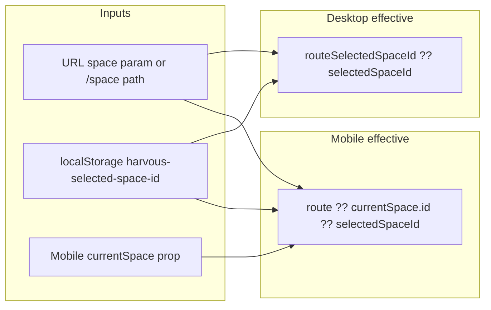

# Active space changes without using the space switcher

**Status:** Investigation notes (not yet fixed). Use this when reproducing or narrowing the cause.

## Problem

Sometimes the “active space” shown in the shell (space switcher / top space label) appears to change without the user explicitly picking a different space in the switcher.

## How “active space” is implemented

There is no single global React store. Behavior comes from:

1. **Persisted selection** — `localStorage` / session fallback key `harvous-selected-space-id`, helpers in [`src/components/react/navigation/selectedSpace.ts`](../../src/components/react/navigation/selectedSpace.ts), plus the `harvousSelectedSpaceUpdated` custom event.

2. **Route context** — `?space=space_*` on thread/note routes and `/space/$spaceId`. Parsed in [`spa/src/layouts/AppLayout.tsx`](../../spa/src/layouts/AppLayout.tsx) (e.g. `spaceFromSearch`) and passed to nav as `currentSpace` when the URL carries space context.

3. **Desktop vs mobile** — Logic differs slightly; see below.

### Desktop (`NavigationColumn`)

`effectiveSelectedSpaceId` prefers the URL over storage:

```ts
// routeSelectedSpaceId from ?space= or /space/...
effectiveSelectedSpaceId = routeSelectedSpaceId ?? selectedSpaceId;
```

Source: [`src/components/react/navigation/NavigationColumn.tsx`](../../src/components/react/navigation/NavigationColumn.tsx).

### Mobile (`MobileNavigation`)

`effectiveSelectedSpaceId` inserts URL-derived `currentSpace?.id` between route and storage on thread/note routes:

```ts
routeSelectedSpaceId ??
  (isThreadOrNoteRoute && currentSpace?.id ? currentSpace.id : null) ??
  selectedSpaceId;
```

There is also a `useEffect` that calls `setSelectedSpaceId(currentSpace.id)` when `currentSpace?.id` changes on thread/note routes (same file). That can persist storage when URL-derived space context updates, not only when the user opens the switcher.

## Likely causes (often “by design,” but surprising)

### 1. URL-driven sync

[`NavigationColumn.tsx`](../../src/components/react/navigation/NavigationColumn.tsx) and [`MobileNavigation.tsx`](../../src/components/react/navigation/MobileNavigation.tsx) run location sync on mount and when `pathname` / `search` change. If the URL has `?space=...`, they call `setSelectedSpaceId` so storage matches the URL. Same idea for `/space/...` routes.

**Why it feels like a bug:** Opening a thread/note from a **space** often uses links that append `?space=` (e.g. [`SpaceContentList`](../../src/components/react/SpaceContentList.tsx) builds `?space=` for thread/note hrefs). That updates the stored “last selected space” even though the user did not use the space dropdown. Links from other surfaces (dashboard, search) may omit `?space=`, so behavior differs by entry point.

### 2. Mobile-only: extra fallback + writes to storage

Desktop comments (near the sync effects in `NavigationColumn`) caution against auto-selecting space from thread content alone. Mobile is more aggressive: it uses `currentSpace` in the effective ID chain and has an effect that writes `currentSpace.id` to storage when it changes on thread/note routes.

### 3. Stale or transitional `?space=` during SPA navigations

Thread page code notes that TanStack Router may omit or lag `location.search` and falls back to `window.location.search` ([`spa/src/pages/ThreadPage.tsx`](../../spa/src/pages/ThreadPage.tsx)). If layout/router `search` briefly disagrees with the real URL during a transition, `spaceFromSearch` in `AppLayout` could momentarily reflect the **previous** route’s `?space=` — enough to flash the wrong label or write storage once before settling.

### 4. Other legitimate updaters

- **Another tab** — `useSelectedSpaceId` listens for the `storage` event; selection can sync from another tab.
- **Space deleted** — [`NavigationContext.tsx`](../../src/components/react/navigation/NavigationContext.tsx) clears selection if the deleted space was the selected one.

## Investigation checklist (when reproducing)

1. **Context** — Desktop vs mobile width; does it happen right after a **navigation** (especially to thread/note) or while **idle** on the same route?
2. **URL** — When it happens, does `?space=` appear or change in the address bar? If yes, the shell may be following the URL (current policy: URL wins over storage when present).
3. **Trace** — Temporarily add a dev-only log or `console.trace` inside `setSelectedSpaceId` in [`selectedSpace.ts`](../../src/components/react/navigation/selectedSpace.ts) to see the stack when the issue fires (URL sync vs mobile effect vs `storage` event).

## Possible fix directions (choose after root cause)

- **Product / UX** — If URL sync is the main issue: decide whether “URL wins” always, or whether `harvous-selected-space-id` should update only on explicit switcher actions (storage can diverge from URL; document the tradeoff).
- **Mobile** — Align mobile with desktop: remove or narrow the effect that writes `currentSpace.id` to storage; optionally use `currentSpace` for **display** only, not persistence.
- **Stale search** — Single source of truth for `spaceFromSearch` during transitions (e.g. prefer `window.location.search` consistently, or tie reads to a stable serialized location from the router) so `AppLayout` does not derive space from stale router state.

## Related files

| Area | File |
|------|------|
| Storage API | `src/components/react/navigation/selectedSpace.ts` |
| Desktop nav | `src/components/react/navigation/NavigationColumn.tsx` |
| Mobile nav | `src/components/react/navigation/MobileNavigation.tsx` |
| Route + `spaceFromSearch` | `spa/src/layouts/AppLayout.tsx` |
| Space list links with `?space=` | `src/components/react/SpaceContentList.tsx` |
| Thread route + search fallback | `spa/src/pages/ThreadPage.tsx` |
| Space delete → clear selection | `src/components/react/navigation/NavigationContext.tsx` |

## Diagram (high level)


