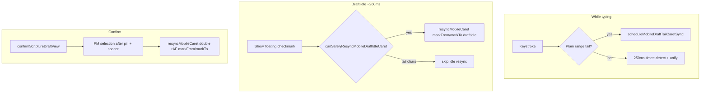

# Mobile Scripture Pill — Troubleshooting & Known Limitations

Scope: the inline scripture-draft flow in the **prototypeNative** editor on **iOS Safari**
(`editorChromeMode === 'prototypeNative'`). Desktop uses a different (simpler) path and is mostly
unaffected by these issues.

This doc records the bugs we hit, the fixes we shipped, and the iOS limitations that remain, so
future work doesn't re-derive the same ground. Pairs with the `ios-scripture-draft-lessons` agent
memory and `docs/SCRIPTURE_PILL_IMPLEMENTATION.md` / `docs/SCRIPTURE_FLOW.md`.

**Status (device-verified, June 2026):** The core mobile draft flow is **working on iPhone** after
Round 14 (v1.217.188): range entry (`Numbers 5:5-10`), draft idle caret beside the ✓, post-commit
caret after the pill + spacer, and no far-right / before-pill / baseline drift regressions. See
[Current working architecture](#current-working-architecture-round-14) before changing caret or draft
code.

---

## How the draft flow works (mental model)

Typing a reference goes through a transient **draft** before becoming a committed pill:

1. **Detect** — on mobile, a debounced (`250ms`) `onUpdate` timer in `TiptapEditor.tsx` runs
   `runScriptureDraftDetectionAtCursor`, which wraps a detected reference in the **`scriptureDraft`**
   mark (dashed pill). The mark is `inclusive: false` so typed chars at the right edge stay plain.
2. **Grow** — as the user extends a range (`-17`), the tail lands as plain text and is folded into
   the draft. **Desktop**: `makeScriptureDraftGrowPlugin` (an `appendTransaction`) does this live,
   per keystroke. **Mobile**: that plugin is disabled (see Round 3 #1); the same logic runs on the
   debounced idle timer via `unifyScriptureDraftAtCursor` instead.
3. **Confirm** — `confirmScriptureDraftView` replaces the draft text with a committed `scripturePill`
   mark + a trailing spacer, applies the translation, and places the caret after the pill. On mobile,
   `resyncMobileCaret` then forces the **native** selection to match (PM selection alone is not enough
   on iOS). Triggered by the floating ✓ button, Enter, or (desktop) a non-continuation keystroke.
   Mobile does **not** auto-confirm on blur while a draft is active.

Key files:
- `src/components/react/TiptapScriptureDraft.ts` — the draft mark, grow plugin,
  `computeScriptureDraftGrowth`, `unifyScriptureDraftAtCursor`, `confirmScriptureDraftView`,
  `editScripturePillAsDraft`, **`resyncMobileCaret`**, **`canSafelyResyncMobileDraftIdleCaret`**,
  **`scheduleMobileDraftTailCaretSync`**, **`findScripturePillElementAtMark`** (internal),
  **`trailingOffsetForPmCaret`**.
- `src/components/react/TiptapEditor.tsx` — mobile `onUpdate` detection/idle timer, the floating ✓
  positioning effect (`updatePos`), `resolveDetachedDraft`/`resolveOnBlur`, pill tap handlers, the
  delete-confirm floater (`ScripturePillDeleteConfirm`).
- `src/utils/scripture-pill-position.ts`, `src/utils/scripture-pill-spacing.ts` — detection +
  spacing helpers.
- `src/utils/pwa-prompt.ts` — `isMobileDevice()` (the mobile/desktop branch gate).
- `src/styles/study-dock-carousel.css`, `spa/src/styles/prototype-shell.css` — study-dock layout.

Tests: `src/utils/__tests__/scripture-draft.test.ts` (desktop mark path),
`src/utils/__tests__/scripture-draft-mobile.test.ts` (mobile mark path; mocks `isMobileDevice()`).

---

## Current working architecture (Round 14)

The shipped mobile path is the **`scriptureDraft` mark** + debounced unify — not the Round 6
decoration draft (reverted in Round 8). Caret painting is the hard part; document mutation is
debounced to avoid iOS desync.

**Caret resync rules (do not regress):**

| When | Call | Must NOT |
|------|------|----------|
| User pauses at draft end (✓ visible) | `resyncMobileCaret({ pos: anchor, draftIdle: true, markFrom, markTo })` | Resync during plain tail (`-10`); resync on enter or unify |
| Range tail keystrokes | `scheduleMobileDraftTailCaretSync` → plain `domAtPos` | After-span placement inside draft mark |
| Confirm (✓ / Enter) | `resyncMobileCaret({ focus: true, pos: caretPos, markFrom, markTo: pillEnd })` | `querySelector` for pill lookup; `textContent.length` for offset |
| Placement | `findScripturePillElementAtMark` + `setNativeSelectionAfterInlinePill` + `posAtDOM >= markTo` | Last text node inside `.scripture-pill-draft` during tail entry |

**Guards still required:** `hasActiveDraft` timer gate, mobile blur refocus (no confirm), `midRangeEntry`
confirm rejection, `isCaretAttached` detached logic, bold `setStoredMarks([])` + draft mark
`excludes: 'bold italic'`.

---

## The root iOS problem (read this first)

**iOS Safari does not keep a `contenteditable` in sync when you mutate the document
programmatically mid-typing.** ProseMirror's model stays correct, but the *rendered* caret and the
*rendered* text drift: a just-typed character can paint detached, the caret can stick at the line
end, and an inclusive mark can split into two pill fragments. Almost every bug below is a flavor of
this. The two defensive strategies that work:

- **Don't mutate the doc on every keystroke on mobile** — debounce to an idle pass instead.
- **After an unavoidable programmatic mutation, force the native caret back on the next frame.**
  Critically, **re-dispatching a ProseMirror selection is a no-op here**: PM recorded that it already
  synced the DOM selection (iOS moved the *painted* caret without firing a `selectionchange` PM
  acted on), so its desired-vs-current comparison matches and it skips the DOM update. You must set
  the browser `Selection` directly — see **`resyncMobileCaret`** in `TiptapScriptureDraft.ts`.
  Bare `domAtPos` inside `inline-flex` pill spans often mis-paints; the working fix places the
  caret **after** the pill span using PM `markFrom`/`markTo` and validates with `posAtDOM`.

---

## Issues & fixes by round

### Round 1–2

| # | Symptom | Root cause | Fix |
|---|---------|-----------|-----|
| 1 | Floating ✓ rendered ~a line too high | `position: fixed` button positioned from `getBoundingClientRect()` (visual viewport) while the keyboard is up (`visualViewport.offsetTop > 0`) | Add `visualViewport.offsetTop/offsetLeft` in `updatePos` |
| 2 | Range dash committed early (`John 3:16-17` → only `John 3:16`) | iOS split the draft into two fragments; `findDetachedScriptureDraft` saw the earlier one as detached and committed it | Single-draft invariant in `computeScriptureDraftGrowth` (merge fragments, anchor at FIRST fragment); gate `resolveOnBlur` behind a deferred focus re-check |
| 3 | Bold stuck on after a pill committed | `ensureScripturePillSpacing` inserted the trailing space before stored marks were cleared, so the space inherited the active bold mark | `tr.setStoredMarks([])` BEFORE `ensureScripturePillSpacing(tr)` |
| 4 | Editing a committed pill | Intended model: **tap a committed pill → opens the scripture dock**, edit the reference there via `ScriptureReferencePickerStrip` → `onApply`. Do NOT hijack the tap for inline draft editing. |

### Round 3

| # | Symptom | Root cause | Fix |
|---|---------|-----------|-----|
| 1 | Typing the 2nd digit of a range hid it under the ✓ / pill looked split; caret jumped far right | The grow plugin mutated the draft mark on **every keystroke** → iOS contenteditable desync | **Debounce grow on mobile**: `makeScriptureDraftGrowPlugin` early-returns when `isMobileDevice()`; new `unifyScriptureDraftAtCursor` runs on the existing 250ms idle timer. Dropped per-keystroke `removeMark` (now `addMark`-only over the merged span). |
| 2 | (same as above — caret) | (same) | Covered by debounce + ✓-hide |
| 3 | Floating ✓ overlapped the char being typed | ✓ sits at the draft's right edge = where the next char lands | Hide ✓ on editor `update`; re-show ~260ms after the last input (`selectionUpdate` only shows immediately when NOT within 260ms of a keystroke). Relies on TipTap emitting `update` before `selectionUpdate`. |
| 4 | Docks pushed right / squeezed with no sidebar | Sidebar-clearance offset is `padding-left: var(--proto-sidebar-w-clamped)` on `.study-dock-carousel__track`, but the reset rules targeted the `__slot` (already 0) and the only track reset was gated to `@media (min-width: 900px)` | Add track `padding-left: 0` resets under `.proto-shell--no-sidebar`, `.proto-shell--sidebar-collapsed`, and `@media (max-width: 899px)` (drawer offset stays on the slot). Add `min-width: min(100%, 320px)` floor to the single-dock card. **The offset is on the TRACK, not the slot.** |

### Round 4

| # | Symptom | Root cause | Fix |
|---|---------|-----------|-----|
| 1 | After committing a pill, the caret still jumps to the far right instead of right after the pill | iOS leaves the *visible* caret painted at the line end after the commit mutation (the ProseMirror selection is correct — desktop renders fine) | First attempt: `tr.scrollIntoView()` + a rAF re-dispatch of the same PM selection. **This did not fully work** — re-dispatching the same selection is a no-op (see Round 5). |
| 2 | The "Edit" (pencil) in the pill's floating delete menu tried to edit inline, which doesn't work on mobile | Inline `editScripturePillAsDraft` is unreliable on iOS | The delete-confirm `onEdit` (prototypeNative) now opens the **scripture dock** for the pill (builds a `ScripturePillDockSession` from the pill mark at the boundaries) instead of converting to an inline draft. |

### Round 5

The caret desync wasn't just a commit problem — it happens on **every** programmatic draft mutation
(draft creation, range-grow/unify, and commit), and the Round-4 rAF re-dispatch didn't fix it
because **re-dispatching the same ProseMirror selection is a no-op** (PM thinks the DOM is already
synced; see "The root iOS problem"). The user could see it: caret stuck far right while still in
edit mode; typing a space fixed it; pressing Return made the caret *vanish* (the Enter→confirm path
didn't pass `focus: true`, so the field was left unfocused).

| # | Symptom | Root cause | Fix |
|---|---------|-----------|-----|
| 1 | Caret stuck far right while still in draft/edit mode (and "-N" range tail sometimes rendered as a second dashed fragment) | The draft mark's `addMark` (creation + grow) restructures the contenteditable; iOS strands the painted caret. Round-4's re-dispatch of the same PM selection was a no-op. | New `resyncMobileCaret(view)` sets the native `Selection` directly via `view.domAtPos` on the next frame (mobile only). Called from `enterScriptureDraftView`, `unifyScriptureDraftAtCursor`, and `confirmScriptureDraftView`. |
| 2 | Pressing Return/Enter made the caret disappear | The Enter→confirm handler called `confirmScriptureDraftView(view)` without `{ focus: true }`, so after the commit the field was left blurred and the caret vanished | Pass `{ focus: true }`; `resyncMobileCaret` re-focuses + re-places the caret. |

**Round 5 was insufficient on device** — single-rAF + bare `domAtPos` still left the painted caret at the line end.

### Round 6

Two-pronged fix: harden caret resync for the mark path (post-commit and any legacy mark mutations), and **switch the mobile in-progress draft to ProseMirror inline `Decoration`s** so create/grow/unify no longer restructure the document while typing.

| # | Symptom | Root cause | Fix |
|---|---------|-----------|-----|
| 1 | Caret still at line end after Round 5 | Single rAF ran before PM's DOM patch finished; `domAtPos` inside `inline-flex` pill spans mispaints on iOS | **`applyNativeCaret`**: double-rAF + 16ms retry; DOM-first placement via last text node inside `.scripture-pill-draft` / committed pill (same anchor as ✓); focus on first rAF, selection on second |
| 2 | Caret drifts after debounced unify pauses | ✓ re-show did not re-assert native selection | Call `resyncMobileCaret` when the floating ✓ reappears (~260ms idle) in the `updatePos` effect |
| 3 | Caret drifts during draft create/grow on mobile | Any `addMark` mid-type restructures contenteditable (root iOS problem) | **Mobile decoration draft**: `makeScriptureDraftDecorationPlugin()` tracks `{ from, to, attrs }` in plugin state and renders `Decoration.inline` with `scripture-pill-draft` styling — **no mark mutation** on enter/unify. Confirm still `replaceWith` a committed pill. Desktop keeps the mark + grow plugin. |
| 4 | Enter-confirm focus fight | Sync `view.focus()` before rAF resync reset selection | Focus moved into first rAF inside `resyncMobileCaret`; removed sync focus from `confirmScriptureDraftView` |

Key additions:
- `makeScriptureDraftDecorationPlugin`, `scriptureDraftDecorationKey` in `TiptapScriptureDraft.ts`
- Mobile branches in `enterScriptureDraftView`, `unifyScriptureDraftAtCursor`, `findDraftRange`, `getScriptureDraftAnchorPos`, `findDetachedScriptureDraft`, `confirmScriptureDraftView`, `cancelScriptureDraftView`
- Tests: `src/utils/__tests__/scripture-draft-mobile.test.ts` (mocks `isMobileDevice()` → true)

### Round 7

Cannot finish verse ranges like `Number 5:5-10` — draft stuck or commits at `Number 5:5` only.

| # | Symptom | Root cause | Fix |
|---|---------|-----------|-----|
| 1 | `-10` never folds into draft; unify never runs mid-range | `detectScriptureReferenceEndingAtCursor` returns null when tail after match is `-` (not empty/whitespace), so `shouldScheduleDraftDetection` is false and the mobile 250ms timer is **cancelled** | **`hasActiveDraft` gate** on `needsScripturePass` — keep the debounced timer armed while any draft exists so `unifyScriptureDraftAtCursor` runs during range entry |
| 2 | Draft commits at `Number 5:5` when reaching `-` on iOS keyboard | `resolveOnBlur` confirms after 120ms even with no continuation tail typed; keyboard-layer switch blurs the field | **`hasDraftContinuationTailInDoc`** + two-phase blur defer (120ms focus check, then +350ms if no tail yet on mobile) |
| 3 | Decoration end swallowed `-` on insert | Plugin mapped `to` with default bias, expanding decoration on every char at boundary | Non-inclusive `to` mapping with bias `-1` (Round 6 follow-up) |

Helpers: `hasActiveScriptureDraft`, `hasDraftContinuationTailInDoc` in `TiptapScriptureDraft.ts`.

### Round 8

Round 6's **mobile decoration draft** regressed range typing on device — the mark-based path (debounced unify) had been working; only caret painting was wrong.

| # | Change | Why |
|---|--------|-----|
| 1 | **Reverted decoration draft** — mobile uses `scriptureDraft` mark again (same as pre-Round-6) | Decoration layer broke `Number 5:5-10` style entry despite passing jsdom tests |
| 2 | **Kept Round 5–6 caret hardening** — `applyNativeCaret`, double-rAF + 16ms retry, resync on ✓ re-show | Fixes painted caret at line end after mark mutations (later reverted in Round 10) |
| 3 | **`applyNativeCaret` respects range tail** | Prevents ✓ re-show resync from stealing the caret mid-range (later simplified in Round 10) |
| 4 | **Kept Round 7 timer + blur defer** | Still needed on the mark path |

### Round 9

Range dash still broken on device after Round 8 revert.

| # | Symptom | Root cause | Fix |
|---|---------|-----------|-----|
| 1 | Draft commits or vanishes when reaching `-` | iOS keyboard-layer switch fires `blur`; deferred blur-confirm commits `Numbers 5:5` before the tail is typed | **Disable blur-confirm on mobile while any draft is active** — confirm via ✓ / Enter / selection-leave only |
| 2 | Draft styling stripped after typing `-` alone | `confirmScriptureDraftView` on invalid ref (`Numbers 5:5-`) called `removeMark` | **Keep draft open** when continuation tail chars exist but `draftTextToReference` is not yet valid |
| 3 | Caret jumps while typing tail | ✓ re-show called `resyncMobileCaret` even when caret is past the draft mark | Skip resync when `hasDraftContinuationTailInDoc` and caret is past draft end (later removed entirely in Round 10) |

### Round 10

Session caret hardening regressed range dash typing; bold stuck after incomplete drafts.

| # | Change | Why |
|---|--------|-----|
| 1 | **Reverted `applyNativeCaret`** — `resyncMobileCaret` back to single-rAF `domAtPos` only | DOM-first placement inside `.scripture-pill-draft` stole the caret at the non-inclusive mark boundary where `-` must land |
| 2 | **Removed `resyncMobileCaret` from unify and ✓ re-show** | Idle resync fought mid-range typing and caused toolbar flicker |
| 3 | **Resync only on user confirm** (`{ focus: true }`) | Matches pre-session behavior that typed correctly; enter resync removed in Round 11 |
| 4 | **Bold fix** — `setStoredMarks([])` on enter/grow; `excludes: 'bold italic'` on draft mark; strip bold on cancel/failed confirm; `BoldCustom` guards draft + pill | Bold stuck/flickered after incomplete drafts |
| 5 | **Kept Round 7–9 guards** — `hasActiveDraft` timer, mobile blur skip, `midRangeEntry` confirm, `isCaretAttached` detached logic | Still needed on mark path |

### Round 11

Dash appears but caret vanishes before typing `-10` digits.

| # | Symptom | Root cause | Fix |
|---|---------|-----------|-----|
| 1 | Caret gone right after `-` | `resyncMobileCaret` on draft enter repositioned native selection at the mark boundary; iOS keyboard-layer blur for `-` dropped focus without refocus | **Remove enter resync**; **`scheduleMobileDraftTailCaretSync`** after tail chars; **blur refocus** while draft active (no confirm) |
| 2 | Caret lost after idle unify | `addMark` over tail without focus/selection restore | **unify**: re-set selection to tail end + `view.focus()` on mobile |

### Round 12

Range typing works (Round 11); caret still paints at line end beside the ✓ and after confirm.

| # | Change | Why |
|---|--------|-----|
| 1 | **`canSafelyResyncMobileDraftIdleCaret`** — guard: no plain continuation tail, caret at anchor | Prevents ✓ re-show resync from stealing the caret mid-range (same lesson as Round 9–10) |
| 2 | **Idle resync beside ✓** — 260ms idle timer in `TiptapEditor.tsx` calls `resyncMobileCaret({ pos: anchor, draftIdle: true })` after `updatePos` | Aligns painted caret with pill right edge when user pauses (not while typing `-10`) |
| 3 | **Post-commit resync** — `confirmScriptureDraftView` passes `committedPillFrom` + `caretPos`; DOM fallback finds trailing spacer after `.scripture-pill:not(.scripture-pill-draft)` | `domAtPos` alone often mis-paints after pill commit on iOS |
| 4 | **Still avoided** — enter resync, unify resync, resync during plain tail (`scheduleMobileDraftTailCaretSync` owns that), last-text-node-inside-draft during tail, double-rAF globally | These regressed range dash typing in Rounds 5–10 |

### Round 13

Round 12 did not move the caret horizontally; idle resync could lift it off the prose baseline.

| # | Symptom | Root cause | Fix |
|---|---------|-----------|-----|
| 1 | Caret unchanged horizontally; slightly above baseline | `domAtPos` ran first inside `inline-flex` pill; inner-text fallback also inside the span | **After-span placement**: `setNativeSelectionAfterInlinePill` uses `setStartAfter(pill)` or offset in the next text sibling — never inside the pill box |
| 2 | Draft-idle path never reached after-span fallback | `domAtPos` returned "success" first, skipping fallback | **Reorder**: draft-idle and post-commit paths run before generic `domAtPos` |
| 3 | Post-commit still mis-timed | Single rAF before PM DOM patch | **Double rAF on confirm only** (`focus: true`) |

### Round 14

Round 13 moved the caret off the line end but it painted **before** the pill.

| # | Symptom | Root cause | Fix |
|---|---------|-----------|-----|
| 1 | Caret before pill (not after) | Pill DOM resolved at `markFrom` (left edge outside mark) + `querySelector` first pill + `textContent.length` for trailing offset | **`findScripturePillElementAtMark`**: probe `domAtPos` inside marked text; **`trailingOffsetForPmCaret(markTo, pos)`**; parent child-index placement + **`posAtDOM >= markTo`** validation |
| 2 | Draft idle used wrong pill element | Shared `getScriptureDraftAnchorElement` querySelector fallback | Draft idle passes **`markFrom` / `markTo`** from `getScriptureDraftRange`; caret path never uses querySelector |

**Device-verified resolved (June 2026):** iPhone Safari confirms range typing, draft-idle caret beside ✓,
post-commit caret after pill + spacer, correct baseline — no far-right, before-pill, or dash-entry
regressions. This is the baseline; treat any caret change as high-risk.

### Round 15 (August 2026) — NEEDS DEVICE VERIFICATION

The far-right caret was re-reported despite Round 14, alongside unusable range entry, spurious
"Could not load this passage.", lowercase pills, and no way to fix a reference from the keyboard.
Two root causes were found that Rounds 5–14 had worked *around* rather than fixed.

| # | Symptom | Root cause | Fix |
|---|---------|-----------|-----|
| 1 | Caret paints at line end during draft | The draft span carries `.scripture-pill` too, so it inherited `display: inline-flex` + `user-select: none`. **That is not a valid caret host** — iOS has nowhere to paint, which is why all of `resyncMobileCaret` / `setNativeSelectionAfterInlinePill` / `findScripturePillElementAtMark` had to exist. | Draft is now `display: inline` + `user-select: text` + `box-decoration-break: clone`. Set in **three** places, all required: the inline `DRAFT_STYLE` constant (`TiptapScriptureDraft.ts`), `.scripture-pill-draft` in `prototype-editor.css` (which has `display: inline-flex !important` on `.scripture-pill` above it), and `global.css`. **The committed pill is unchanged** — still `inline-flex` + `user-select: none`. |
| 2 | Caret after commit lands one short (list items, mid-sentence) | `pillEnd = range.from + reference.length` was computed **before** `ensureScripturePillSpacing`, which can insert a **leading** space at `range.from`. Every downstream use (`charAfter`, `caretPos`, and critically `markTo`) was then off by one, so Round 14's `posAtDOM >= markTo` validation failed and fell through to the mis-painting generic `domAtPos` path. | Map the boundaries through the spacing steps: `tr.mapping.slice(stepsBeforeSpacing).map(rawPillEnd, 1)`. Regression test: "lands the caret after the pill when a leading space is inserted" in `scripture-draft.test.ts` (verified to fail without the fix). |
| 3 | Pill reads `exodus 16:13` | The detector returns the raw matched text (`extracted.reference = fullMatch`); nothing canonicalized it. | New **shape-preserving** `canonicalizeScriptureReferenceDisplay` in `scripture-detector.ts`, applied in `draftTextToReference`. Not `normalizeScriptureReference` — that one *expands* chapter-only refs (`Psalms 23` → `Psalms 23:1-6`). Note canonical names are `Psalms`/`Song of Songs`, so `Psalm 27:1` now displays as `Psalms 27:1`. |
| 4 | `Exodus 16:1315` commits an unloadable pill | Detection uses unbounded `\d+` and `validateAndWarn` only `console.warn`s, so a dropped `-` became verse 1315 → server 404 → error card. | New `checkScriptureReferenceValidity` gate in `confirmScriptureDraftView`: the draft **stays open** and the ✓ shows `--invalid` with the reason ("Exodus 16 has 36 verses."). The detector regex was deliberately **not** tightened to `\d{1,3}` — that makes the verse alternative fail entirely and silently degrades to a chapter-only `Exodus 16` pill, which is worse than a blocked one. |
| 5 | "Could not load this passage." flashes | `setLoadingPassage(true)` ran *inside* the async IIFE, so frame 1 was "not loading, no html" — which the pane rendered as failure. | `PassageLoadState` union (`passage-load-state.ts`); loading is set **synchronously**. `unavailable` (the server's "not included in the {T} translation", which arrives as a *success*) is now distinct from `error`, and only `error` offers Retry. |
| 6 | End verse clipped off-screen | The strip always rendered an end-**chapter** picker + second colon, ~50px that pushed the end verse past the right edge of a hidden-scrollbar scroller. | End-chapter pill only renders when `endChapter !== chapter`; cross-chapter is reached via an "Into chapter N →" option appended to the end-verse list. Range toggle moved outside the scroller; edge fade added on coarse pointers. |
| 7 | Picker sheet behind the keyboard | `position: fixed` bottom = **layout** viewport bottom (behind the keyboard) and `60vh` = large viewport. The blur that was supposed to dismiss the keyboard ran in a post-open effect, outside a user gesture, so iOS ignored it. | Sheet backdrop is pinned to `visualViewport` (`visual-viewport-box.ts`); `max-height: min(60%, 420px)`; blur moved into the trigger's `onPointerDown`. Placement no longer *depends* on the keyboard dismissing. |
| 8 | Backspace destroyed a pill; no keyboard editing | `tryHandleScripturePillDeleteKey` armed a delete on the first Backspace, and inline edit was judged unreliable in Round 4 #2 (before fix #1 above). | New `tryEditScripturePillOnBackspace` runs *before* the delete handler: Backspace converts the pill to an edit-draft. Forward **Delete** keeps the confirm-then-delete path. |

**This supersedes the Round 4 #2 / "editing happens in the dock" lesson for the keyboard only.**
Tap-the-pill → dock is still the route for changing book/chapter/translation/accent. Backspace is
the route for fixing a typo'd reference.

**Edit-drafts must never silently destroy a pill.** The `scriptureDraft` mark now carries
`originalReference` + `noteId`. `restoreScripturePillFromDraft` puts the pill back on Escape or on
a confirm that no longer parses. Two guards matter: it is a no-op for drafts typed from scratch
(those still degrade to prose), and a no-op once the text is empty (erasing the reference
character-by-character must still delete the pill — that is the intended friction model).
`confirmScriptureDraftView` also now carries `noteId` forward instead of hardcoding `'pending'`.

**Still device-unverified:** every caret-related claim above. Fixes #1 and #2 are separately
revertable and should be tested independently — #1 is the CSS/`DRAFT_STYLE` change, #2 is the
position mapping. Re-run the full Round-14 checklist plus: a draft **inside an ordered list item
with a committed pill earlier in the paragraph** (the reported repro), and a reference long enough
to wrap (the ✓ anchors to the last client rect now, since an inline box's `getBoundingClientRect`
is the union of its fragments).

### Round 16 (August 2026) — NEEDS DEVICE VERIFICATION

Reported: the ✓ beside the **first** pill in a note is misaligned while every later one is fine, and
committing with **space or Return** strands the caret at the far right instead of honouring the key.

| # | Symptom | Root cause | Fix |
|---|---------|-----------|-----|
| 1 | First ✓ of a note misaligned, later ones fine | The mobile shell frame is resized **programmatically** — `apply()` in `SimplifiedPrototypeLayout` writes inline `height`/`margin-top` onto `.proto-shell-frame` and re-runs at rAF + 150ms + 450ms after `focusin` to ride out the keyboard animation and the Safari bottom-bar collapse. Those writes move every line of the editor and fire **no `scroll` and no `resize`**, which are the only signals `updatePos` listened to. The ✓ is positioned 260ms after the last keystroke — between two settle passes. On the first pill the keyboard is still settling; by the second, `apply()` is a no-op. | New `src/utils/proto-viewport-settle.ts`: `apply()` emits `harvous:proto-viewport-settle` when the committed frame geometry actually changes. The ✓ effect subscribes, plus a next-frame re-measure after the idle show. Every other fixed overlay subscribes too (selection bar, pill delete/edit floater, dock accent popover, dock `…` menu, menu-pill dropdown + sheet box). |
| 2 | Space-commit leaves the caret at the far right | `resolveDetachedDraft` — the mobile space route, since space is never intercepted on mobile — called `confirmScriptureDraftView` **without `focus`**, so the `resyncMobileCaret` at the end of confirm was skipped. Enter and the ✓ both passed it; this was the only commit path that didn't, and the one users hit. | Pass `focus: editor.isFocused`. The `isFocused` guard keeps Round 9 intact: a caret that left because focus went to a dock is not stolen back. |
| 3 | Return does nothing / caret lands wrong | Enter `preventDefault()`ed and committed, but never inserted the newline — and when the commit was refused (`midRangeEntry`, or a reference outside the canon) the key did nothing at all. | Enter now commits **without** `focus` (the resync would target a caret the split is about to invalidate), then `splitBlock`s, then resyncs against the new position. When the commit is refused it `cancelScriptureDraftView`s (so no orphan dashed span survives into saved HTML) and returns `false`, letting ProseMirror insert the newline on fresh state. Applies to desktop too — one mental model. |
| 4 | Post-commit caret one position behind PM at a block end | `ensureScripturePillSpacing` is gated on `end < blockEnd`, so a pill ending its block got no trailing space from it; `snapCursorOutsideScripturePill` inserted one a beat later from `selectionUpdate` — after `caretPos` had been captured and the resync scheduled. | `confirmScriptureDraftView` inserts that spacer in its **own** transaction when the mapped `pillEnd` is at the block end. The gate inside `ensureScripturePillSpacing` is deliberately unchanged — it also runs on hydrate, where appending a space to every paragraph-final pill would rewrite saved HTML broadly. Test: "inserts the spacer in the confirm transaction and puts the caret past it". |

**Verified in-browser (Chrome, mobile preset):** space-commit leaves the PM caret just past the pill
+ spacer; the draft ✓ anchors correctly beside the pill. **Not verifiable in-browser:** everything
about *painted* caret position (Chrome is not iOS), and the Enter path at all — see the testing note
below. Rounds 15 and 16 both need the same device pass; do them together.

**You cannot test Enter-in-draft under the mobile preset.** ProseMirror's keydown edit handler
early-returns for `keyCode === 13` when `browser.android && browser.chrome`, deferring to
`beforeinput` — and the mobile preset emulates an Android Chrome UA, so `handleKeyDown` never sees
Enter. iOS Safari is not Android, so the real path differs from what the emulator shows. Two more
harness traps: `computer{action:"type"}` inserts text via `insertText` and fires **no keydowns** at
all (so desktop draft detection never triggers), and React Fast Refresh does **not** re-register
TipTap's `editorProps` — a change to `handleKeyDown` needs a full page reload, not HMR.

---

## iOS limitations & gotchas (durable)

- **A `position: fixed` overlay must listen for the chrome-settle event, not just scroll/resize.**
  On mobile note routes the shell frame resizes itself around the keyboard with no DOM event that
  a viewport-anchored overlay can observe. Subscribe via `onProtoViewportSettle`
  (`src/utils/proto-viewport-settle.ts`) alongside the usual listeners.

- **No per-keystroke doc mutation on mobile.** The grow plugin is desktop-only. On mobile the draft uses the **`scriptureDraft` mark** with debounced `unifyScriptureDraftAtCursor` (~250ms idle) to fold range tails in one `addMark`.
- **The ✓ confirm must be a portal OUTSIDE the editor.** iOS refuses to type next to an inline
  `contentEditable=false` widget. It's `position: fixed` and needs the `visualViewport` offset
  correction whenever the keyboard is up.
- **`position: fixed` ≠ `getBoundingClientRect()` coords when the keyboard is up.** Always add
  `visualViewport.offsetTop/offsetLeft`.
- **Programmatic `view.focus()` / selection after a mutation can leave the caret mispainted.**
  Re-assert native selection on the next frame via `resyncMobileCaret`; use double rAF on confirm only.
- **Caret placement must use PM mark ranges, not DOM heuristics alone.** Resolve the pill element from
  inside the mark (`findScripturePillElementAtMark`), place after the span (`setNativeSelectionAfterInlinePill`),
  validate `posAtDOM >= markTo`. Never `querySelector` on the caret path; never last-text-node-inside-draft
  during range tail entry.
- **Editing a committed pill: Backspace for the keyboard, dock for the pickers** (revised in Round
  15 — inline edit is viable now that the draft span is a real caret host). Backspace on a pill
  converts it to an edit-draft; tap the pill or the floating Edit pencil for the dock.
- **The draft span must stay `display: inline` + `user-select: text`.** An `inline-flex` +
  `user-select: none` box is not a valid caret host on iOS and strands the painted caret at the
  line end. It is set in three places (`DRAFT_STYLE`, `prototype-editor.css`, `global.css`) because
  `.proto-editor-surface .scripture-pill` uses `display: inline-flex !important`.
- **Never compute a position across `ensureScripturePillSpacing`** — it can insert a *leading*
  space. Map through `tr.mapping.slice(stepsBefore)` instead.
- **Anything positioned against a `position: fixed` overlay needs the `visualViewport` box**, not
  `inset: 0` / `vh` — see `src/utils/visual-viewport-box.ts`.
- **The study-dock sidebar offset lives on `.study-dock-carousel__track`** — when changing dock
  layout, reset/inherit padding on the *track*, and re-check `--no-sidebar` / `--sidebar-collapsed` /
  `@media (max-width: 899px)` / `--drawer-open` states.
- **`isMobileDevice()`** (`src/utils/pwa-prompt.ts`) returns false in jsdom, so the default unit tests exercise the desktop (mark) path. Mobile draft behavior is covered by `src/utils/__tests__/scripture-draft-mobile.test.ts` (mocked mobile). **Caret paint cannot be tested in jsdom** — always re-check on iPhone after caret changes.

## Open issues / needs device verification

- **Dock sizing (Round 3 #4)** — verify the dock fills the column and animates correctly at the
  430px / 620px breakpoints and with the sidebar collapsed (desktop ⌘\) vs absent (mobile).

## Resolved (device-verified June 2026)

- Range entry (`Numbers 5:5-10`, `John 3:16-18`) with debounced unify
- Draft idle caret beside ✓ (not line end, not before pill, on baseline)
- Post-commit caret after pill + trailing spacer
- Bold not stuck after abandoning incomplete draft (Round 10)
- Mobile blur does not commit partial refs during keyboard-layer switch (Round 9)

## How to verify

- Unit: `npx vitest run src/utils/__tests__/scripture-draft.test.ts src/utils/__tests__/scripture-draft-mobile.test.ts` (+ the pill/format suites).
- Types: `npx tsc -p tsconfig.json --noEmit` (pre-existing errors elsewhere are unrelated).
- Device (required after any caret/draft change): in `prototypeNative` on iPhone, type
  `John 3:16-18` then `Numbers 5:5-10`, confirm each (✓ / Enter), and check:
  - Range stays one pill; dash and tail digits visible while typing
  - Caret beside ✓ when paused in draft (after pill, on baseline)
  - Caret after committed pill + spacer (not before, not line end)
  - Bold not stuck on subsequent plain typing after abandoning a draft
  - Edit pencil opens the scripture dock (not inline draft edit)
- Round 16 adds to that checklist:
  - The ✓ is aligned beside the **first** pill in a fresh note, not only the second
  - Commit with **space** — caret sits after the pill + spacer, not at the far right
  - Commit with **Return** — the pill commits *and* the line breaks; caret starts the new line
  - `Exodus 16:1315` + Return — the newline happens and the text drops to plain prose
  - A draft inside an ordered list item with a committed pill earlier in the paragraph
